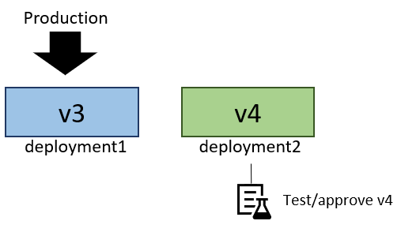
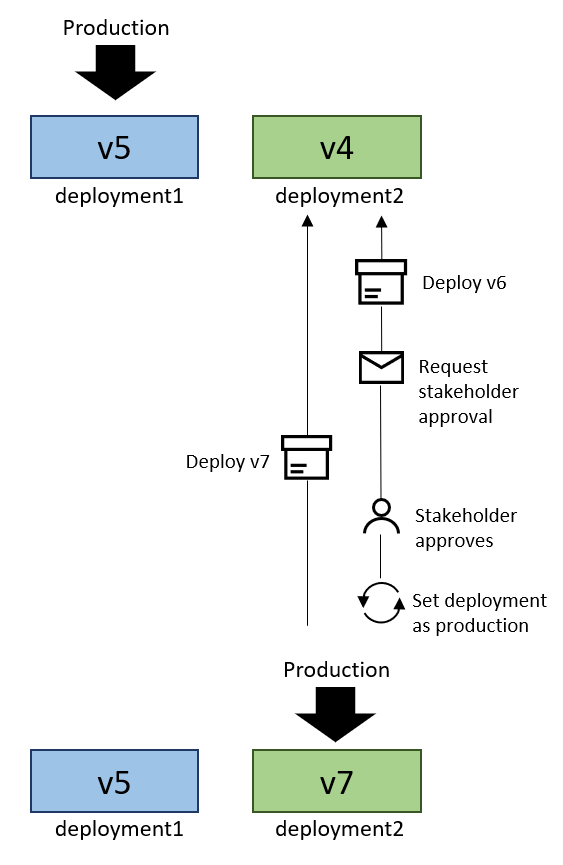
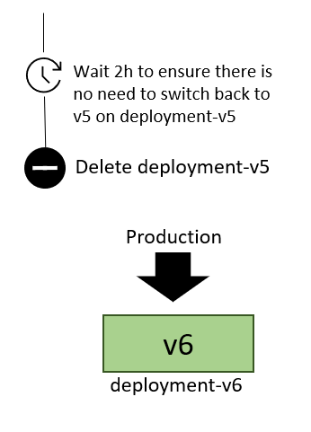

# Blue-green deployment strategies in Azure Spring Apps

> [!NOTE]
> Azure Spring Apps is the new name for the Azure Spring Cloud service. Although the service has a new name, you'll see the old name in some places for a while as we work to update assets such as screenshots, videos, and diagrams.

**This article applies to:** ✔️ Basic/Standard ✔️ Enterprise

This article describes the blue-green deployment support in Azure Spring Apps.

Azure Spring Apps (Standard plan and higher) permits two deployments for every app, only one of which receives production traffic. This pattern is commonly known as blue-green deployment. Azure Spring Apps's support for blue-green deployment, together with a [Continuous Delivery (CD)](/devops/deliver/what-is-continuous-delivery) pipeline and rigorous automated testing, allows agile application deployments with high confidence.

## Alternating deployments

The simplest way to implement blue-green deployment with Azure Spring Apps is to create two fixed deployments and always deploy to the deployment that isn't receiving production traffic. With the [Azure Spring Apps task for Azure Pipelines](/azure/devops/pipelines/tasks/deploy/azure-spring-cloud), you can deploy this way just by setting the `UseStagingDeployment` flag to `true`.

Here's how the alternating deployments approach works in practice:

Suppose your application has two deployments: `deployment1` and `deployment2`. Currently, `deployment1` is set as the production deployment, and is running version `v3` of the application.

This makes `deployment2` the staging deployment. Thus, when the Continuous Delivery (CD) pipeline is ready to run, it deploys the next version of the app, version `v4`, onto the staging deployment `deployment2`.

After `v4` has started up on `deployment2`, you can run automated and manual tests against it through a private test endpoint to ensure `v4` meets all expectations.

When you have confidence in `v4`, you can set `deployment2` as the production deployment so that it receives all production traffic. `v3` will remain running on `deployment1` in case you discover a critical issue that requires rolling back.

Now, `deployment1` is the staging deployment. So the next run of the deployment pipeline deploys onto `deployment1`.

You can now test `V5` on `deployment1`'s private test endpoint.

Finally, after `v5` meets all your expectations, you set `deployment1` as the production deployment once again, so that `v5` receives all production traffic.

### Tradeoffs of the alternating deployments approach

The alternating deployments approach is simple and fast, as it doesn't require the creation of new deployments. However, it does present several disadvantages, as described in the following sections.

#### Persistent staging deployment

The staging deployment always remains running, and thus consuming resources of the Azure Spring Apps instance. This effectively doubles the resource requirements of each application on Azure Spring Apps.

#### The approval race condition

Suppose in the above application, the release pipeline requires manual approval before each new version of the application can receive production traffic. This creates the risk that while one version (`v6`) awaits manual approval on the staging deployment, the deployment pipeline will run again and overwrite it with a newer version (`v7`). Then, when the approval for `v6` is granted, the pipeline that deployed `v6` will set the staging deployment as production. But now it will be the unapproved `v7`, not the approved `v6`, that is deployed on that deployment and receives traffic.

You may be able to prevent the race condition by ensuring that the deployment flow for one version can't begin until the deployment flow for all previous versions is complete or aborted. Another way to prevent the approval race condition is to use the Named Deployments approach described below.

## Named deployments

In the named deployments approach, a new deployment is created for each new version of the application being deployed. After the application is tested on its bespoke deployment, that deployment is set as the production deployment. The deployment containing the previous version can be allowed to persist just long enough to be confident that a rollback won't be needed.

In the illustration below, version `v5` is running on the deployment `deployment-v5`. The deployment name now contains the version because the deployment was created specifically for this version. There's no other deployment at the outset. Now, to deploy version `v6`, the deployment pipeline creates a new deployment `deployment-v6` and deploys app version `v6` there.

There's no risk of another version being deployed in parallel. First, Azure Spring Apps doesn't allow the creation of a third deployment while two deployments already exist. Second, even if it was possible to have more than two deployments, each deployment is identified by the version of the application it contains. Thus, the pipeline orchestrating the deployment of `v6` would only attempt to set `deployment-v6` as the production deployment.

After the deployment created for the new version receives production traffic, you'll need to remove the deployment containing the previous version to make room for future deployments. You may wish to postpone by some number of minutes or hours so you can roll back to the previous version if you discover a critical issue in the new version.

### Tradeoffs of the named deployments approach

The named deployments approach has the following benefits:

* It prevents the approval race condition.
* It reduces resource consumption by deleting the staging deployment when it's not in use.

However, there are drawbacks as well, as described in the following section.

#### Deployment pipeline failures

Between the time a deployment starts and the time the staging deployment is deleted, any additional attempts to run the deployment pipeline will fail. The pipeline will attempt to create a new deployment, which will result in an error because only two deployments are permitted per application in Azure Spring Apps.

Therefore, the deployment orchestration must either have the means to retry a failed deployment process at a later time, or the means to ensure that the deployment flows for each version will remain queued until the flow is completed for all previous versions.

## Next steps

* [Automate application deployments to Azure Spring Apps](./how-to-cicd.md)
