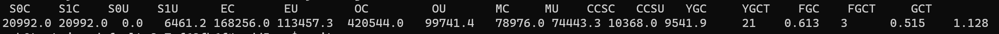

# How to Connect to App Instance for troubleshooting

## Prerequisites
* Azure CLI and Spring Apps extension are installed.
* App already deployed.
* If Custom Container is deployed, please ensure a shell program is included. Default to `/bin/sh`.

## Assign an Azure role

Before connecting to the app instances, you must be granted the role "Azure Spring Apps Connect Role" because it requires a new Data Action permission `Microsoft.AppPlatform/Spring/apps/deployments/connect/action`. It can be achieved by the following command:

```azurecli
az role assignment create --role 'Azure Spring Apps Connect Role' --scope '<Resource id of your service instance>' --assignee '<your identity>'
```

## Connect with CLI subcommand `spring app connect`

If your app contains only one instance, simply run:
```
az spring app connect -s <Your_Service_instance> -g <Resource_group> -n <App_name> 
```

Otherwise must specify the instance with `-i`:
```
az spring app connect -s <Your_Service_instance> -g <Resource_group> -n <App_name> --i <Instance_name>
```

To specify another deployment of the app:
```
az spring app connect -s <Your_Service_instance> -g <Resource_group> -n <App_name> -d green
```

Occasionally, you may want switch to some other shell:
```
az spring app connect -s <Your_Service_instance> -g <Resource_group> -n <App_name> --shell-cmd /bin/bash
```

## Troubleshooting Example
After connecting, you can start to perform the troubleshooting. For example, check the status of the heap memory and GC:

Find the pid of the java process, which is usually `1`:
```
jps
```


And then run the jdk tool to check the result:
```
jstat -gc 1
```


## Pre-installed tools
All the JDK-bundled tools such as: `jps`, `jcmd`, `jstat` and etc.

* lsof - list open files
* top - display system summary information and current utilization
* ps - get a snapshot of the running process
* netstat - print network connections, interface statistics
* nslookup - query Internet name servers interactively
* ping - the ping
* nc - arbitrary TCP and UDP connections and listens
* wget - The non-interactive network downloader
* df - free of disk space


## Limitations
The app is running as a non-root user, so you can't execute some actions requiring root permission, including install new tools by the system package manager `apt / yum`.
Also, some of the linux capabilities are prohibited, so those tools that need some special privileges don't work (e.g. `tcpdump`).
