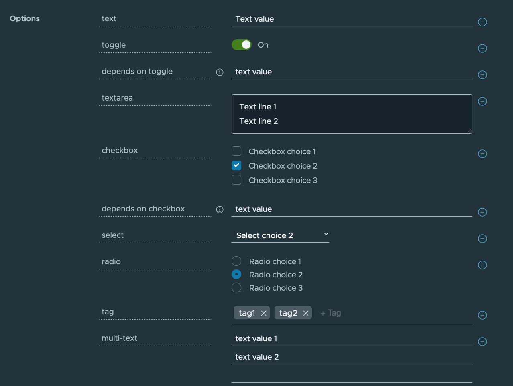

This topic describes how to create an accelerator.yaml file. By including an `accelerator.yaml` file in your Accelerator repository, you can declare input options that users fill in using a form in the UI. Those option values control processing by the template engine before it returns the zipped output files. For more information, see the [Sample accelerator](GUID-creating-accelerators-accelerator-yaml-sample.html).

When there is no `accelerator.yaml`, the repository still works as an accelerator but the files are passed unmodified to users.

`accelerator.yaml` has two top-level sections: `accelerator` and `engine`.

Accelerator
-----------

This section documents how an accelerator is presented to users in the web UI. For example:

    accelerator:
      displayName: Hello Fun
      description: A simple Spring Cloud Function serverless app
      iconUrl: https://raw.githubusercontent.com/simple-starters/icons/master/icon-cloud.png
      tags:
      - java
      - spring
    
      options:
      - name: deploymentType
        inputType: select
        choices:
        - value: none
          text: Skip Kubernetes deployment
        - value: k8s-simple
          text: Kubernetes deployment and service
        - value: knative
          text: Knative service
        defaultValue: k8s-simple
        required: true

### Accelerator metadata

These properties are in accelerator listings such as the web UI:

*   **displayName**: A human-readable name.
    
*   **description**: A more detailed description.
    
*   **iconUrl**: A URL pointing to an icon image.
    
*   **tags**: A list of tags used to filter accelerators.
    

### Accelerator options

The list of options is passed to the UI to create input fields for each option.

The following option properties are used by both the UI and the engine.

*   **name**:  
    Each option must have a unique, camelCase name. The option value entered by a user is made available as a [SPeL](https://docs.vmware.com/en/Application-Accelerator-for-VMware-Tanzu/1.1/acc-docs/GUID-creating-accelerators-spel-samples.html) variable name. For example, `#deploymentType`.
    
*   **dataType**:  
    Data types that work with the UI are `string`, `boolean`, `number`, and arrays of those, as in `[string]`, `[number]`, and so on. Most input types return a string, which is the default. Use Boolean values with `checkbox`.
    
*   **defaultValue**:  
    This literal value pre-populates the option. Ensure its type matches the dataType. For example, use `["text 1", "text 2"]` for the dataType `[string]`. Options without a `defaultValue` can trigger a processing error if the user doesn’t provide a value for that option.
    
*   **validationRegex**: When present, a regex validates the string representation of the option value _when set_. It doesn’t apply when the value is blank. As a consequence, don’t use the regex to enforce a requirement. See **required** for that purpose.
    
    This regex can be used by several layers in Application Accelerator, built using several technologies, for example, JavaScript and Java. So refrain from using “exotic” regex features. Also, the regex applies to portions of the value by default. That is, `[a-z ]+` matches `Hello world` despite the capital `H`. To apply it to the whole value (or just start/end), anchor it using `^` and `$`.
    
    Finally, backslashes in a YAML string using double quotes must be escaped, so to match a number, write `validationRegex: "\\d+"` or use another string style.
    

The following option properties are for UI purposes only.

*   **label**: A human-readable version of the `name` identifying the option.
    
*   **description**: A tooltip to accompany the input.
    
*   **inputType**:
    
    *   `text`: The default input type.
    *   `textarea`: Single text value with larger input that allows line breaks.
    *   `checkbox`: Ideal for Boolean values or multivalue selection from choices.
    *   `select`: Single-value selection from choices using a drop-down menu.
    *   `radio`: Alternative single-value selection from choices using buttons.
*   **choices**:  
    This is a list of predefined choices. Users can select from the list in the UI. Choices are supported by `checkbox`, `select`, and `radio`. Each choice must have a `text` property for the displayed text, and a `value` property for the value that the form returns for that choice. The list is presented in the UI in the same order as it is declared in `accelerator.yaml`.
    
*   **required**: `true` forces users to enter a value in the UI.
    
*   **dependsOn**:  
    This is a way to control visibility by specifying the `name` and optional `value` of another input option. When the other option has a matching value, or any value if no `value` is specified, then the option with `dependsOn` is visible. Otherwise, it is hidden. Ensure the value matches the dataType of the `dependsOn` option. For example, a multivalue option such as a `checkbox` uses `[matched-value]`.
    

### Examples

The screenshot and `accelerator.yaml` file snippet that follows demonstrates each `inputType`. You can also see the sample [demo-input-types](https://github.com/sample-accelerators/demo-input-types) on GitHub.

    accelerator:
      displayName: Demo Input Types
      description: "Accelerator with options for each inputType"
      iconUrl: https://raw.githubusercontent.com/sample-accelerators/icons/master/icon-tanzu-light.png
      tags: ["demo", "options"]
    
      options:
    
      - name: text
        display: true
        defaultValue: Text value
    
      - name: toggle
        display: true
        dataType: boolean
        defaultValue: true
    
      - name: dependsOnToggle
        label: 'depends on toggle'
        description: Visibility depends on the value of the toggle option being true.
        dependsOn:
          name: toggle
        defaultValue: text value
    
      - name: textarea
        inputType: textarea
        display: true
        defaultValue: |
          Text line 1
          Text line 2
    
      - name: checkbox
        inputType: checkbox
        display: true
        dataType: [string]
        defaultValue:
          - value-2
        choices:
          - text: Checkbox choice 1
            value: value-1
          - text: Checkbox choice 2
            value: value-2
          - text: Checkbox choice 3
            value: value-3
    
      - name: dependsOnCheckbox
        label: 'depends on checkbox'
        description: Visibility depends on the checkbox option containing a checked value value-2.
        dependsOn:
          name: checkbox
          value: [value-2]
        defaultValue: text value
    
      - name: select
        inputType: select
        display: true
        defaultValue: value-2
        choices:
          - text: Select choice 1
            value: value-1
          - text: Select choice 2
            value: value-2
          - text: Select choice 3
            value: value-3
    
      - name: radio
        inputType: radio
        display: true
        defaultValue: value-2
        choices:
          - text: Radio choice 1
            value: value-1
          - text: Radio choice 2
            value: value-2
          - text: Radio choice 3
            value: value-3
    
    engine:
      type: YTT

Engine
------

The engine section describes how to take the files from the accelerator root directory and transform them into the contents of a generated project file.

The YAML notation here defines what is called a transform. A transform is a function on a set of files. It uses a set of files as input. It produces a modified set of files as output derived from this input.

Different types of transforms do different tasks:

*   Filtering the set of files: that is, removing or keeping files that match certain criteria.
*   Changing the contents of files. For example, replacing some strings in the files.
*   Renaming or moving files: that is, changing the paths of the files.

The notation also provides the composition operators `merge` and `chain`, which enable you to create more complex transforms by composing simpler transforms together.

The following is an example of what is possible. To learn the notation, see [Introduction to transforms](https://docs.vmware.com/en/Application-Accelerator-for-VMware-Tanzu/1.1/acc-docs/GUID-creating-accelerators-transform-intro.html).

### Engine example

    engine:
      include:
        ["**/*.md", "**/*.xml", "**/*.gradle", "**/*.java"]
      exclude:
        ["**/secret/**"]
      let:
        - name: includePoms
          expression:
            "#buildType == 'Maven'"
        - name: includeGradle
          expression: "#buildType == 'Gradle'"
      merge:
        - condition:
            "#includeGradle"
          include: ["*.gradle"]
        - condition: "#includePoms"
          include: ["pom.xml"]
        - include: ["**/*.java", "README.md"]
          chain:
            - type: ReplaceText
              substitutions:
                - text: "Hello World!"
                  with: "#greeting"
      chain:
        - type: RewritePath
          regex: (.*)simpleboot(.*)
          rewriteTo: "#g1 + #packageName + #g2"
        - type: ReplaceText
          substitutions:
            - text: simpleboot
              with: "#packageName"
      onConflict:
        Fail

### Engine notation descriptions

This section describes the notations in the preceding example.

`engine` is the global transformation node. It produces the final set of files to be zipped and returned from the accelerator. As input, it receives all the files from the accelerator repository root. The properties in this node dictate how this set of files is transformed into a final set of files zipped as the accelerator result.

`engine.include` filters the set of files, retaining only those matching a list of path patterns. This ensures that that the accelerator only detects files in the repository that match the list of patterns.

`engine.exclude` further restricts which files are detected. The example ensures files in any directory called `secret` are never detected.

`engine.let` defines additional variables and assigns them values. These derived symbols function such as options, but instead of being supplied from a UI widget, they are computed by the accelerator itself.

`engine.merge` executes each of its children in parallel. Each child receives a copy of the current set of input files. These are files remaining after applying the `include` and `exclude` filters. Each of the children therefore produces a set of files. All the files from all the children are then combined, as if overlaid on top of each other in the same directory. If more than one child produces a file with the same path, the transform resolves the conflict by dropping the file contents from the earlier child and keeping the contents from the later child.

`engine.merge.chain` specifies additional transformations to apply to the set of files produced by this child. In the example, `ReplaceText` is only applied to Java files and `README.md`.

`engine.chain` applies transformation to all files globally. The chain has a list of child transformations. These transformations are applied after everything else in the same node. This is the global node. The children in a chain are applied sequentially.

`engine.onConflict` specifies how conflict is handled when an operation, such as merging, produces multiple files at the same path: - `Fail` raises an error when there is a conflict. - `UseFirst` keeps the contents of the first file. - `UseLast` keeps the contents of the last file. - `Append` keeps both by using `cat <first-file> <second-file>`.
