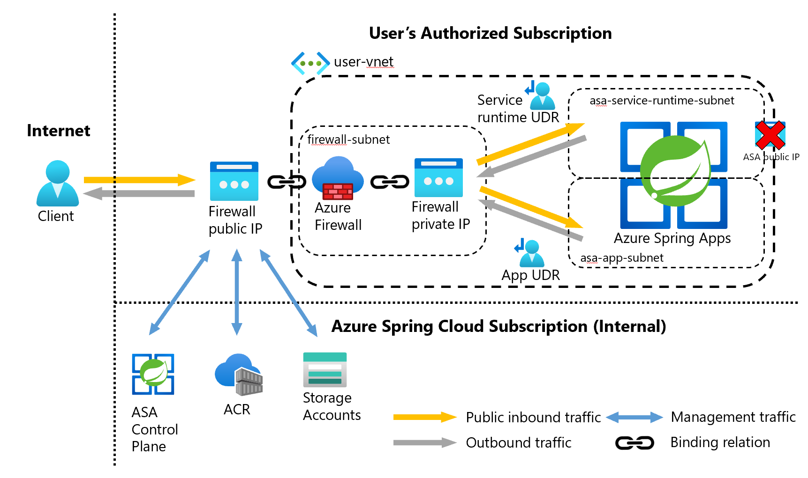

# Control egress traffic for an Azure Spring Apps (ASA) instance

**This article applies to:** ✔️ Java ✔️ C#

**This article applies to:** ✔️ Basic/Standard tier ✔️ Enterprise tier

This article provides a way that allow you to secure outbound traffic from your Azure Spring Apps (ASA). The following two articles are highly recommended to read before you start this article. It provides a simple example of a UDR instance. UDR is an advanced feature which enable our customers to fully control the egress traffic. It may be used in scenarios like disallowing ASA auto-generated public IP.

- [Introduction to Azure Spring Apps VNet](how-to-deploy-in-azure-virtual-network.md)
- [Customer Responsibilities for Running Azure Spring Apps in VNET](vnet-customer-responsibilities.md)
- [Introduction to outbound type of ASA](concept-outbound-type.md)

## Prerequisites

- All prerequisites of [Azure Spring Apps VNet instance](how-to-deploy-in-azure-virtual-network.md)
- API version of `2022-09-01 preview` or greater
- CLI version extension of 1.1.7 or greater

## An Example of Azure Spring Apps UDR Instance

In this article, we will provide an example(as the following image) of Azure Spring Apps VNet instance using user-defined-routing


### Set configuration via environment variables

Define a set of environment variables to be used in resource creations.

```bash
PREFIX="asa-egress"
RG="${PREFIX}-rg"
LOC="eastus"
ASANAME="${PREFIX}"
VNET_NAME="${PREFIX}-vnet"
ASA_APP_SUBNET_NAME="asa-app-subnet"
ASA_SERVICE_RUNTIME_SUBNET_NAME="asa-service-runtime-subnet"
# DO NOT CHANGE FWSUBNET_NAME - This is currently a requirement for Azure Firewall.
FWSUBNET_NAME="AzureFirewallSubnet"
FWNAME="${PREFIX}-fw"
FWPUBLICIP_NAME="${PREFIX}-fwpublicip"
FWIPCONFIG_NAME="${PREFIX}-fwconfig"
APP_ROUTE_TABLE_NAME="${PREFIX}-app-rt"
SERVICE_RUNTIME_ROUTE_TABLE_NAME="${PREFIX}-service-runtime-rt"
FWROUTE_NAME="${PREFIX}-fwrn"
ASA_NAME="${PREFIX}-instance"
```

### Create a virtual network with multiple subnets

Provision a virtual network with three separate subnets, one for the user apps, one for service runtime and one for the firewall.

```azurecli
# Create Resource Group

az group create --name $RG --location $LOC
```

Create a virtual network with three subnets to host the ASA instance and the Azure Firewall. Each will have their own subnet. Let's start with the ASA network.

```azurecli
# Dedicated virtual network with ASA app subnet

az network vnet create \
    --resource-group $RG \
    --name $VNET_NAME \
    --location $LOC \
    --address-prefixes 10.42.0.0/16 \
    --subnet-name $ASA_APP_SUBNET_NAME \
    --subnet-prefix 10.42.1.0/24

# Dedicated subnet for ASA service runtime subnet

az network vnet subnet create \
    --resource-group $RG \
    --vnet-name $VNET_NAME \
    --name $ASA_SERVICE_RUNTIME_SUBNET_NAME\
    --address-prefix 10.42.2.0/24

# Dedicated subnet for Azure Firewall (Firewall name cannot be changed)

az network vnet subnet create \
    --resource-group $RG \
    --vnet-name $VNET_NAME \
    --name $FWSUBNET_NAME \
    --address-prefix 10.42.3.0/24
```

### Create and set up an Azure Firewall with a UDR

Azure Firewall outbound rules must be configured. The main purpose of the firewall is to enable organizations to configure granular egress traffic rules out of the ASA instance.

> [!IMPORTANT]
> If your cluster or application creates a large number of outbound connections directed to the same or small subset of destinations, you might require more firewall frontend IPs to avoid maxing out the ports per frontend IP.
> For more information on how to create an Azure firewall with multiple IPs, see [**here**](../firewall/quick-create-multiple-ip-template.md)
Create a standard SKU public IP resource that will be used as the Azure Firewall frontend address.

```azurecli
az network public-ip create -g $RG -n $FWPUBLICIP_NAME -l $LOC --sku "Standard"
```

Add cli-extension to create an Azure Firewall.

```azurecli
# Install Azure Firewall preview CLI extension

az extension add --name azure-firewall

# Deploy Azure Firewall

az network firewall create -g $RG -n $FWNAME -l $LOC --enable-dns-proxy true
```

The IP address created earlier can now be assigned to the firewall frontend.

> [!NOTE]
> Set up of the public IP address to the Azure Firewall may take a few minutes.
> To leverage FQDN on network rules we need DNS proxy enabled, when enabled the firewall will listen on port 53 and will forward DNS requests to the DNS server specified above. This will allow the firewall to translate that FQDN automatically.

```azurecli
# Configure Firewall IP Config

az network firewall ip-config create -g $RG -f $FWNAME -n $FWIPCONFIG_NAME --public-ip-address $FWPUBLICIP_NAME --vnet-name $VNET_NAME
```

When the previous command has succeeded, save the firewall frontend IP address for configuration later.

```azurecli
# Capture Firewall IP Address for Later Use

FWPUBLIC_IP=$(az network public-ip show -g $RG -n $FWPUBLICIP_NAME --query "ipAddress" -o tsv)
FWPRIVATE_IP=$(az network firewall show -g $RG -n $FWNAME --query "ipConfigurations[0].privateIpAddress" -o tsv  | tr -d '[:space:]')
```

### Create a UDR with a hop to Azure Firewall

Azure automatically routes traffic between Azure subnets, virtual networks, and on-premises networks. If you want to change any of Azure's default routing, you do so by creating a route table.

Create an empty route table to be associated with a given subnet. The route table will define the next hop as the Azure Firewall created above. Each subnet can have zero or one route table associated to it.

```azurecli
# Create UDR and add a route for Azure Firewall

az network route-table create -g $RG -l $LOC --name $APP_ROUTE_TABLE_NAME
az network route-table route create -g $RG --name $FWROUTE_NAME --route-table-name $APP_ROUTE_TABLE_NAME --address-prefix 0.0.0.0/0 --next-hop-type VirtualAppliance --next-hop-ip-address $FWPRIVATE_IP
az network route-table create -g $RG -l $LOC --name $SERVICE_RUNTIME_ROUTE_TABLE_NAME
az network route-table route create -g $RG --name $FWROUTE_NAME --route-table-name $SERVICE_RUNTIME_ROUTE_TABLE_NAME --address-prefix 0.0.0.0/0 --next-hop-type VirtualAppliance --next-hop-ip-address $FWPRIVATE_IP
```

### Adding firewall rules

Add [necessary rules](vnet-customer-responsibilities.md) for ASA

```azurecli
# Add FW Network Rules

az network firewall network-rule create -g $RG -f $FWNAME --collection-name 'asafwnr' -n 'apiudp' --protocols 'UDP' --source-addresses '*' --destination-addresses "AzureCloud" --destination-ports 1194 --action allow --priority 100
az network firewall network-rule create -g $RG -f $FWNAME --collection-name 'asafwnr' -n 'springcloudtcp' --protocols 'TCP' --source-addresses '*' --destination-addresses "AzureCloud" --destination-ports 443 445
az network firewall network-rule create -g $RG -f $FWNAME --collection-name 'asafwnr' -n 'time' --protocols 'UDP' --source-addresses '*' --destination-fqdns 'ntp.ubuntu.com' --destination-ports 123

# Add FW Application Rules

az network firewall application-rule create -g $RG -f $FWNAME --collection-name 'aksfwar' -n 'fqdn' --source-addresses '*' --protocols 'http=80' 'https=443' --fqdn-tags "AzureKubernetesService" --action allow --priority 100
```

### Associate the route tables to Subnets

To associate the cluster with the firewall, the dedicated subnet for the cluster's subnet must reference the route table created above. App and service runtime subnets need to be associated with corresponding route tables.

```azurecli
# Associate route table with next hop to Firewall to the ASA subnet

az network vnet subnet update -g $RG --vnet-name $VNET_NAME --name $ASA_APP_SUBNET_NAME --route-table $APP_ROUTE_TABLE_NAME

az network vnet subnet update -g $RG --vnet-name $VNET_NAME --name $ASA_SERVICE_RUNTIME_SUBNET_NAME --route-table $SERVICE_RUNTIME_ROUTE_TABLE_NAME

```

### Follow the following doc to add role for ASA RP

```azurecli
VIRTUAL_NETWORK_RESOURCE_ID=`az network vnet show \
    --name $VNET_NAME \
    --resource-group $RG \
    --query "id" \
    --output tsv`

az role assignment create \
    --role "Owner" \
    --scope ${VIRTUAL_NETWORK_RESOURCE_ID} \
    --assignee e8de9221-a19c-4c81-b814-fd37c6caf9d2
```

### Create a UDR ASA instance

```azurecli
az spring create -n $ASA_NAME -g $RG --vnet $VNET_NAME --app-subnet $ASA_APP_SUBNET_NAME --service-runtime-subnet $ASA_SERVICE_RUNTIME_SUBNET_NAME --outbound-type userDefinedRouting
```

Now you can access the public IP of the firewall from the internet, and the firewall will route the traffic into the ASA subnets according to your routing rules.

## Next steps

- [Troubleshooting Azure Spring Apps in VNET](troubleshooting-vnet.md)
- [Customer Responsibilities Azure Spring Apps in VNET](vnet-customer-responsibilities.md)
