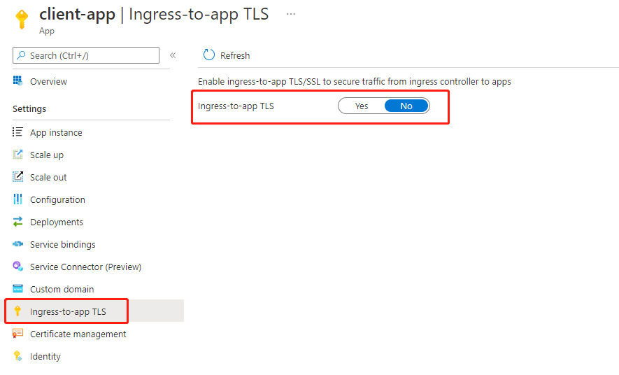

# Enable ingress-to-app TLS for an application

> [!NOTE]
> Azure Spring Apps is the new name for the Azure Spring Cloud service. Although the service has a new name, you'll see the old name in some places for a while as we work to update assets such as screenshots, videos, and diagrams.

**This article applies to:** ❌ Basic ✔️ Standard ✔️ Enterprise

> [!NOTE]
> This feature is not available in the Basic plan.

This article describes secure communications in Azure Spring Apps. The article also explains how to enable ingress-to-app SSL/TLS to secure traffic from an ingress controller to applications that support HTTPS.

The following picture shows the overall secure communication support in Azure Spring Apps.

:::image type="content" source="media/enable-end-to-end-tls/secured-tls.png" alt-text="Screenshot of secured T L S flow in Azure Spring Apps.":::

## Secure communication model within Azure Spring Apps

This section explains the secure communication model shown in the overview diagram above.

1. The client request from the client to the application in Azure Spring Apps comes into the ingress controller. The request can be either HTTP or HTTPS. The TLS certificate returned by the ingress controller is issued by the Microsoft Azure TLS issuing CA.
   
   If the app has been mapped to an existing custom domain and is configured as HTTPS only, the request to the ingress controller can only be HTTPS. The TLS certificate returned by the ingress controller is the SSL binding certificate for that custom domain. The server side SSL/TLS verification for the custom domain is done in the ingress controller.

2.  The secure communication between the ingress controller and the applications in Azure Spring Apps are controlled by the ingress-to-app TLS. You can also control the communication through the portal or CLI, which will be explained later in this article. If ingress-to-app TLS is disabled, the communication between the ingress controller and the apps in Azure Spring Apps is HTTP. If ingress-to-app TLS is enabled, the communication will be HTTPS and has no relation to the communication between the clients and the ingress controller. The ingress controller won't verify the certificate returned from the apps because the ingress-to-app TLS encrypts the communication.

3. Communication between the apps and the Azure Spring Apps services is always HTTPS and handled by Azure Spring Apps. Such services include config server, service registry, and Eureka server.

4. You manage the communication between the applications. You can also take advantage of Azure Spring Apps features to load certificates into the application's trust store. For more information, see [Use TLS/SSL certificates in an application](./how-to-use-tls-certificate.md).

5. You manage the communication between applications and external services. To reduce your development effort, Azure Spring Apps helps you manage your public certificates and loads them into your application's trust store. For more information, see [Use TLS/SSL certificates in an application](./how-to-use-tls-certificate.md).

## Enable ingress-to-app TLS for an application

The following section shows you how to enable ingress-to-app SSL/TLS to secure traffic from an ingress controller to applications that support HTTPS.

### Prerequisites

- A deployed Azure Spring Apps instance. Follow our [quickstart on deploying via the Azure CLI](./quickstart.md) to get started.
- If you're unfamiliar with ingress-to-app TLS, see the [end-to-end TLS sample](https://github.com/Azure-Samples/spring-boot-secure-communications-using-end-to-end-tls-ssl).
- To securely load the required certificates into Spring Boot apps, you can use [spring-cloud-azure-starter-keyvault-certificates](https://github.com/Azure/azure-sdk-for-java/tree/main/sdk/spring/spring-cloud-azure-starter-keyvault-certificates).

### Enable ingress-to-app TLS on an existing app

Use the command `az spring app update --enable-ingress-to-app-tls` to enable or disable ingress-to-app TLS for an app.

```azurecli
az spring app update --enable-ingress-to-app-tls -n app_name -s service_name -g resource_group_name
az spring app update --enable-ingress-to-app-tls false -n app_name -s service_name -g resource_group_name
```

### Enable ingress-to-app TLS when you bind a custom domain

Use the command `az spring app custom-domain update --enable-ingress-to-app-tls` or `az spring app custom-domain bind --enable-ingress-to-app-tls` to enable or disable ingress-to-app TLS for an app.

```azurecli
az spring app custom-domain update --enable-ingress-to-app-tls -n app_name -s service_name -g resource_group_name
az spring app custom-domain bind --enable-ingress-to-app-tls -n app_name -s service_name -g resource_group_name
```

### Enable ingress-to-app TLS using the Azure portal

To enable ingress-to-app TLS in the [Azure portal](https://portal.azure.com/), first create an app, and then enable the feature.

1. Create an app in the portal as you normally would. Navigate to it in the portal.
2. Scroll down to the **Settings** group in the left navigation pane.
3. Select **Ingress-to-app TLS**.
4. Switch **Ingress-to-app TLS** to *Yes*.



### Verify ingress-to-app TLS status

Use the command `az spring app show` to check the value of `enableEndToEndTls`.

```azurecli
az spring app show -n app_name -s service_name -g resource_group_name
```

## Next steps

* [Access Config Server and Service Registry](how-to-access-data-plane-azure-ad-rbac.md)
