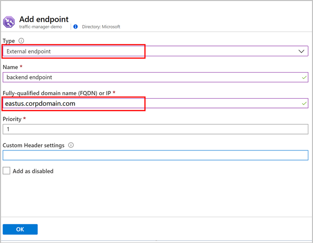
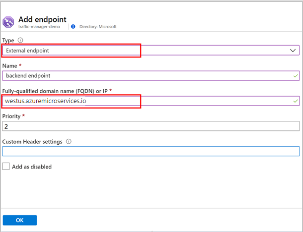
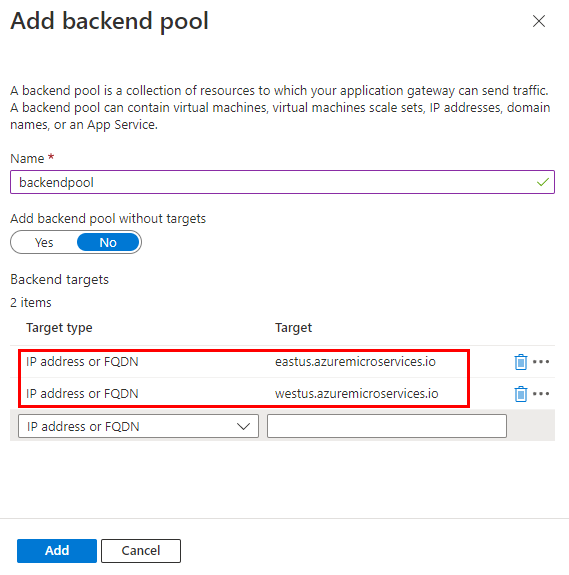
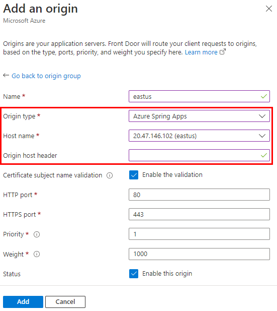

# Integrate Azure Spring Apps with Azure Load Balance Solutions

> [!NOTE]
> Azure Spring Apps is the new name for the Azure Spring Cloud service. Although the service has a new name, you'll see the old name in some places for a while as we work to update assets such as screenshots, videos, and diagrams.

**This article applies to:** ✔️ Java ✔️ C#

**This article applies to:** ✔️ Basic/Standard ✔️ Enterprise

Azure Spring Apps supports Spring applications on Azure. Increasing business can require multiple data centers with management of multiple instances of Azure Spring Apps.

Azure already provides [different load-balance solutions](/azure/architecture/guide/technology-choices/load-balancing-overview). There are three common options to integrate Azure Spring Apps with Azure load-balance solutions:

1. Integrate Azure Spring Apps with Azure Traffic Manager
1. Integrate Azure Spring Apps with Azure App Gateway
1. Integrate Azure Spring Apps with Azure Front Door

In the examples below, we will load balance requests for a custom domain of `www.contoso.com` towards two deployments of Azure Spring Apps in two different regions: `eastus.azuremicroservices.io` and `westus.azuremicroservices.io`.

We recommend that the domain name, as seen by the browser, is the same as the host name which the load balancer uses to direct traffic to the Azure Spring Apps back end. This recommendation provides the best experience when using a load balancer to expose applications hosted in Azure Spring Apps. If the domain exposed by the load balancer is different from the domain accepted by Azure Spring Apps, cookies and generated redirect URLs (for example) can be broken. For more information, see [Host name preservation](/azure/architecture/best-practices/host-name-preservation).

## Prerequisites

* A custom domain to be used to access the application: [Tutorial: Map an existing custom domain to Azure Spring Apps](./how-to-custom-domain.md)
* Azure Spring Apps: [How to create an Azure Spring Apps service](./quickstart.md)
* Azure Traffic Manager: [How to create a traffic manager](../traffic-manager/quickstart-create-traffic-manager-profile.md)
* Azure App Gateway: [How to create an application gateway](../application-gateway/quick-create-portal.md)
* Azure Front Door: [How to create a front door](../frontdoor/quickstart-create-front-door.md)

## Integrate Azure Spring Apps with Azure Traffic Manager

To integrate Azure Spring Apps with Traffic Manager, add its public endpoints as traffic manager’s endpoints and then configure custom domain for both traffic manager and Azure Spring Apps.

### Add Endpoint in Traffic Manager

Add endpoints in traffic manager:

1. Specify **Type** to be *External endpoint*.
1. Input fully qualified domain name (FQDN) of each Azure Spring Apps public endpoint.
1. Select **OK**.

    
    

### Configure Custom Domain

To finish the configuration:

1. Sign in to the website of your domain provider, and create a CNAME record mapping from your custom domain to traffic manager’s Azure default domain name.

## Integrate Azure Spring Apps with Azure App Gateway

To integrate with Azure Spring Apps service, complete the following configurations:

### Configure Backend Pool

1. Specify **Target type** as *IP address* or *FQDN*.
1. Enter your Azure Spring Apps public endpoints.

    

### Add Custom Probe

1. Select **Health Probes** then **Add** to open custom **Probe** dialog.
1. The key point is to select *No* for **Pick host name from backend HTTP settings** option and explicitly specify the host name. For more information, see [Application Gateway configuration for host name preservation](/azure/architecture/best-practices/host-name-preservation#application-gateway).

    

### Configure Backend Setting

1. Select **Backend settings** then **Add** to add a backend setting.
1. **Override with new host name:** select *No*.
1. **Use custom probe**: select *Yes* and pick the custom probe created above.

    

## Integrate Azure Spring Apps with Azure Front Door

To integrate with Azure Spring Apps service and configure an origin group, use the following steps:

1. **Add origin group**.
1. Specify the backend endpoints by adding origins for the different Azure Spring Apps instances.

    

1. Specify **origin type** as *Azure Spring Apps*.
1. Select your Azure Spring Apps instance for the **host name**.
1. Keep the **origin host header** empty, so that the incoming host header will be used towards the backend. For more information, see [Azure Front Door configuration for host name preservation](/azure/architecture/best-practices/host-name-preservation#azure-front-door).

    

## Next steps

* [How to create a traffic manager](../traffic-manager/quickstart-create-traffic-manager-profile.md)
* [How to create an application gateway](../application-gateway/quick-create-portal.md)
* [How to create a front door](../frontdoor/quickstart-create-front-door.md)
