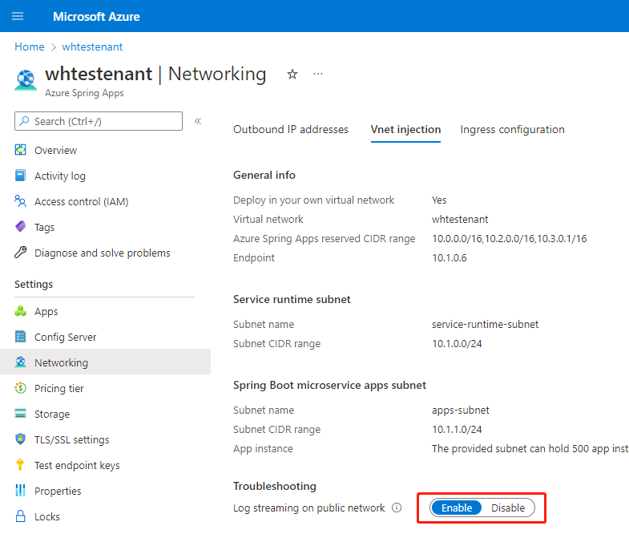

# Stream Azure Spring Apps app logs in real-time

> [!NOTE]
> Azure Spring Apps is the new name for the Azure Spring Cloud service. Although the service has a new name, you'll see the old name in some places for a while as we work to update assets such as screenshots, videos, and diagrams.

**This article applies to:** ✔️ Java ✔️ C#

**This article applies to:** ✔️ Basic/Standard tier ✔️ Enterprise tier

Azure Spring Apps enables log streaming in Azure CLI to get real-time application console logs for troubleshooting. You can also [Analyze logs and metrics with diagnostics settings](./diagnostic-services.md).

## Prerequisites

* [Azure CLI](/cli/azure/install-azure-cli) with the Azure Spring Apps extension, minimum version 1.0.0. You can install the extension by using the following command: `az extension add --name spring`
* An instance of **Azure Spring Apps** with a running application. For more information, see [Quickstart: Deploy your first application to Azure Spring Apps](./quickstart.md).

## Use CLI to tail logs

To avoid repeatedly specifying your resource group and service instance name, set your default resource group name and cluster name.

```azurecli
az config set defaults.group=<service group name>
az config set defaults.spring-cloud=<service instance name>
```

In following examples, the resource group and service name will be omitted in the commands.

### Tail log for app with single instance

If an app named auth-service has only one instance, you can view the log of the app instance with the following command:

```azurecli
az spring app logs --name <application name>
```

This will return logs similar to the following examples, where `auth-service` is the application name.

```output
...
2020-01-15 01:54:40.481  INFO [auth-service,,,] 1 --- [main] o.apache.catalina.core.StandardService  : Starting service [Tomcat]
2020-01-15 01:54:40.482  INFO [auth-service,,,] 1 --- [main] org.apache.catalina.core.StandardEngine  : Starting Servlet engine: [Apache Tomcat/9.0.22]
2020-01-15 01:54:40.760  INFO [auth-service,,,] 1 --- [main] o.a.c.c.C.[Tomcat].[localhost].[/uaa]  : Initializing Spring embedded WebApplicationContext
2020-01-15 01:54:40.760  INFO [auth-service,,,] 1 --- [main] o.s.web.context.ContextLoader  : Root WebApplicationContext: initialization completed in 7203 ms

...
```

### Tail log for app with multiple instances

If multiple instances exist for the app named `auth-service`, you can view the instance log by using the `-i/--instance` option.

First, you can get the app instance names with following command.

```azurecli
az spring app show --name auth-service --query properties.activeDeployment.properties.instances --output table
```

This command produces results similar to the following output:

```output
Name                                         Status    DiscoveryStatus
-------------------------------------------  --------  -----------------
auth-service-default-12-75cc4577fc-pw7hb  Running   UP
auth-service-default-12-75cc4577fc-8nt4m  Running   UP
auth-service-default-12-75cc4577fc-n25mh  Running   UP
```

Then, you can stream logs of an app instance with the option `-i/--instance` option:

```azurecli
az spring app logs --name auth-service --instance auth-service-default-12-75cc4577fc-pw7hb
```

You can also get details of app instances from the Azure portal.  After selecting **Apps** in the left navigation pane of your Azure Spring Apps service, select **App Instances**.

### Continuously stream new logs

By default, `az spring app logs` prints only existing logs streamed to the app console and then exits. If you want to stream new logs, add `-f/--follow`:

```azurecli
az spring app logs --name auth-service --follow
```

When you use `--follow` to tail instant logs, the Azure Spring Apps log streaming service will send heartbeat logs to the client every minute unless your application is writing logs constantly. These heartbeat log messages look like `2020-01-15 04:27:13.473: No log from server`.

To check all the logging options supported:

```azurecli
az spring app logs --help
```

### Format JSON structured logs

> [!NOTE]
> Requires spring extension version 2.4.0 or later.

When the [Structured application log](./structured-app-log.md) is enabled for the app, the logs are printed in JSON format. This makes it difficult to read. The `--format-json` argument can be used to format the JSON logs into human readable format.

```azurecli
# Raw JSON log
$ az spring app logs --name auth-service
{"timestamp":"2021-05-26T03:35:27.533Z","logger":"com.netflix.discovery.DiscoveryClient","level":"INFO","thread":"main","mdc":{},"message":"Disable delta property : false"}
{"timestamp":"2021-05-26T03:35:27.533Z","logger":"com.netflix.discovery.DiscoveryClient","level":"INFO","thread":"main","mdc":{},"message":"Single vip registry refresh property : null"}

# Formatted JSON log
$ az spring app logs --name auth-service --format-json
2021-05-26T03:35:27.533Z  INFO [           main] com.netflix.discovery.DiscoveryClient   : Disable delta property : false
2021-05-26T03:35:27.533Z  INFO [           main] com.netflix.discovery.DiscoveryClient   : Single vip registry refresh property : null
```

The `--format-json` argument also takes optional customized format, using the keyword argument [format string syntax](https://docs.python.org/3/library/string.html#format-string-syntax).

```azurecli
# Custom format
$ az spring app logs --name auth-service --format-json="{message}{n}"
Disable delta property : false
Single vip registry refresh property : null
```

> The default format being used is:
>
> ```format
> {timestamp} {level:>5} [{thread:>15.15}] {logger{39}:<40.40}: {message}{n}{stackTrace}
> ```

## Stream Azure Spring Apps app log in vnet injection instance

For Azure Spring Apps instance [deployed in custom virtual network](./how-to-deploy-in-azure-virtual-network.md), the log streaming could by default be accessed from private network. Azure Spring Apps also enables you to access real-time app logs from public network through ways explained follows:

#### [Portal](#tab/azure-portal)

1. Select the Azure Spring Apps service instance deployed in your virtual network, and open the **Networking** tab in the menu on the left.

2. Select the **Vnet injection** page.

3. Switch the status of **Log streaming on public network** to **enable** to enable log streaming endpoint on public network. The log streaming on public network will take a few minutes to take effect.

    

#### [CLI](#tab/azure-CLI)

Update your instance to enable log stream public endpoint.

```azurecli
az spring update \
    --resource-group $RESOURCE_GROUP \
    --service $SPRING_CLOUD_NAME \
    --enable-log-stream-public-endpoint true
```

After the log stream public endpoint has enabled, you could access the app log from public network just like a normal instance.

## Secure the traffic to log streaming public endpoint

Log streaming use the same key as the *Test Endpoint* described in [View apps and deployments](./how-to-staging-environment.md#view-apps-and-deployments) to authenticate the connections to your deployments. As a result, only those who have read access to these test keys could access the log streaming.

But we still strongly recommend you to sufficiently secure that by filtering network traffic to your service with network security group, review [Tutorial: Filter network traffic with a network security group using the Azure portal](../virtual-network/tutorial-filter-network-traffic.md#create-a-network-security-group). A network security group contains security rules that allow or deny inbound network traffic to, or outbound network traffic from, several types of Azure resources. For each rule, you can specify source and destination, port, and protocol.

## Next steps

* [Quickstart: Monitoring Azure Spring Apps apps with logs, metrics, and tracing](./quickstart-logs-metrics-tracing.md)
* [Analyze logs and metrics with diagnostics settings](./diagnostic-services.md)
