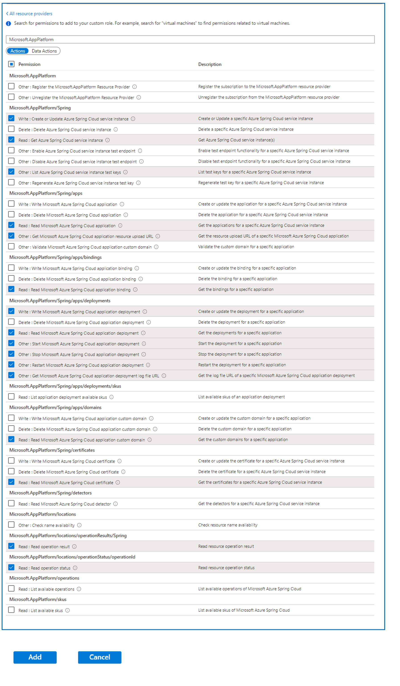
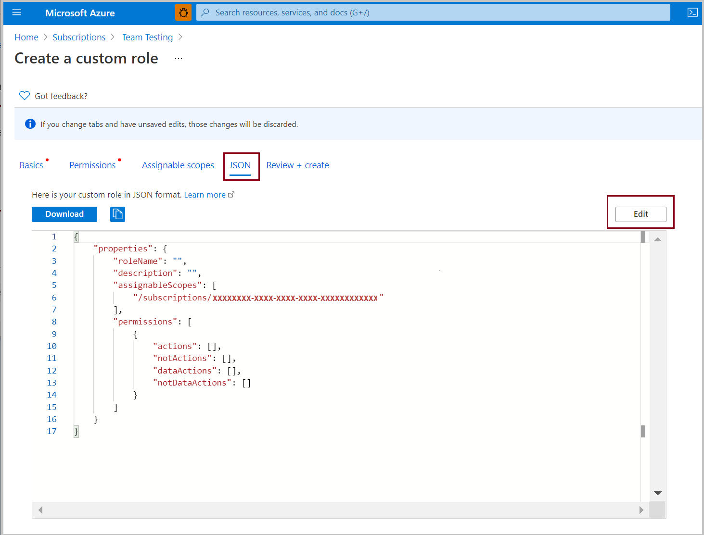
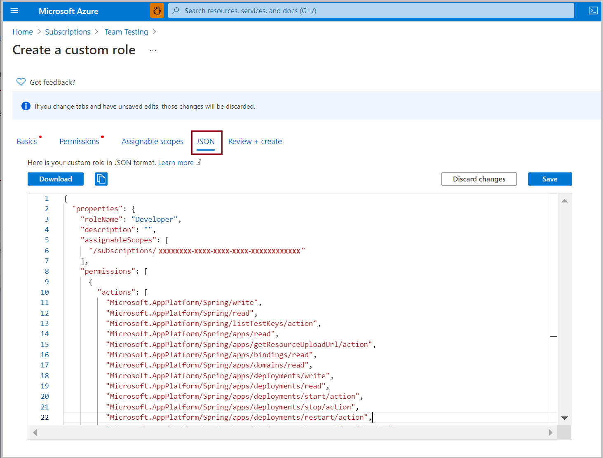
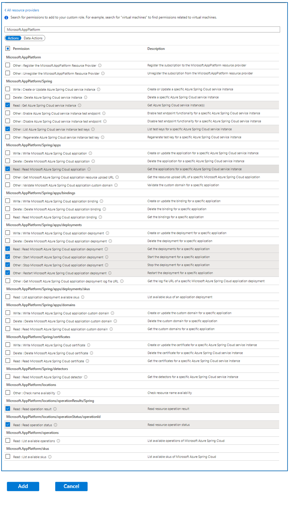

# How to use permissions in Azure Spring Apps

> [!NOTE]
> Azure Spring Apps is the new name for the Azure Spring Cloud service. Although the service has a new name, you'll see the old name in some places for a while as we work to update assets such as screenshots, videos, and diagrams.

**This article applies to:** ✔️ Basic/Standard ✔️ Enterprise

This article shows you how to create custom roles that delegate permissions to Azure Spring Apps resources. Custom roles extend [Azure built-in roles](../role-based-access-control/built-in-roles.md) with various stock permissions.

We'll implement the following custom roles.

* **Developer role**:

  * Deploy
  * Test
  * Restart apps
  * Apply and make changes to app configurations in the Git repository
  * Get log streams

* **DevOps Engineer role**:

  * Create, read, update, and delete everything in Azure Spring Apps

* **Ops - Site Reliability Engineering role**:

  * Restart apps
  * Get log streams
  * Can't make changes to apps or configurations

* **Azure Pipelines / Jenkins / GitHub Actions role**:

  * Perform create, read, update, and delete operations
  * Use Terraform or ARM templates to create and configure everything in Azure Spring Apps and apps within a service instance: Azure Pipelines, Jenkins, and GitHub Actions

## Define the Developer role

The Developer role includes permissions to restart apps and see their log streams. This role can't make changes to apps or configurations.

### [Portal](#tab/Azure-portal)

1. In the Azure portal, open the subscription where you want to assign the custom role.
2. Open **Access control (IAM)**.
3. Select **Add**.
4. Select **Add custom role**.
5. Select **Next**:

   

6. Select **Add permissions**:

   

7. In the search box, search for **Microsoft.app**. Select **Microsoft Azure Spring Apps**:

   

8. Select the permissions for the Developer role.

   Under **Microsoft.AppPlatform/Spring**, select:

   * **Write : Create or Update Azure Spring Apps service instance**
   * **Read : Get Azure Spring Apps service instance**
   * **Other : List Azure Spring Apps service instance test keys**

   (For Enterprise plan only) Under **Microsoft.AppPlatform/Spring/buildServices**, select:

   * **Read : Read Microsoft Azure Spring Apps Build Services**
   * **Other : Get an Upload URL in Azure Spring Apps**

   (For Enterprise plan only) Under **Microsoft.AppPlatform/Spring/buildServices/builds**, select:

   * **Read : Read Microsoft Azure Spring Apps Builds**
   * **Write : Write Microsoft Azure Spring Apps Builds**

   (For Enterprise plan only) Under **Microsoft.AppPlatform/Spring/buildServices/builds/results**, select:

   * **Read : Read Microsoft Azure Spring Apps Build Results**
   * **Other : Get an Log File URL in Azure Spring Apps**

   (For Enterprise plan only) Under **Microsoft.AppPlatform/Spring/buildServices/builders**, select:

   * **Read : Read Microsoft Azure Spring Apps Builders**
   * **Write : Write Microsoft Azure Spring Apps Builders**
   * **Delete : Delete Microsoft Azure Spring Apps Builders**

   (For Enterprise plan only) Under **Microsoft.AppPlatform/Spring/buildServices/builders/buildpackBindings**, select:

   * **Read : Read Microsoft Azure Spring Apps Builder BuildpackBinding**
   * **Write : Write Microsoft Azure Spring Apps Builder BuildpackBinding**
   * **Delete : Delete Microsoft Azure Spring Apps Builder BuildpackBinding**

   (For Enterprise plan only) Under **Microsoft.AppPlatform/Spring/buildServices/supportedBuildpacks**, select:

   * **Read : Read Microsoft Azure Spring Apps Supported Buildpacks**

   (For Enterprise plan only) Under **Microsoft.AppPlatform/Spring/buildServices/supportedStacks**, select:

   * **Read : Read Microsoft Azure Spring Apps Supported Stacks**

   Under **Microsoft.AppPlatform/Spring/apps**, select:

   * **Read : Read Microsoft Azure Spring Apps application**
   * **Other : Get Microsoft Azure Spring Apps application resource upload URL**

   Under **Microsoft.AppPlatform/Spring/apps/bindings**, select:

   * **Read : Read Microsoft Azure Spring Apps application binding**

   Under **Microsoft.AppPlatform/Spring/apps/deployments**, select:

   * **Write : Write Microsoft Azure Spring Apps application deployment**
   * **Read : Read Microsoft Azure Spring Apps application deployment**
   * **Other : Start Microsoft Azure Spring Apps application deployment**
   * **Other : Stop Microsoft Azure Spring Apps application deployment**
   * **Other : Restart Microsoft Azure Spring Apps application deployment**
   * **Other : Get Microsoft Azure Spring Apps application deployment log file URL**

   Under **Microsoft.AppPlatform/Spring/apps/domains**, select:

   * **Read : Read Microsoft Azure Spring Apps application custom domain**

   Under **Microsoft.AppPlatform/Spring/certificates**, select:

   * **Read : Read Microsoft Azure Spring Apps certificate**

   Under **Microsoft.AppPlatform/locations/operationResults/Spring**, select:

   * **Read : Read operation result**

   Under **Microsoft.AppPlatform/locations/operationStatus/operationId**, select:

   * **Read : Read operation status**

   [](media/spring-cloud-permissions/developer-permissions-box.png#lightbox)

9. Select **Add**.

10. Review the permissions.

11. Select **Review and create**.

### [JSON](#tab/JSON)

1. In the Azure portal, open the subscription where you want to assign the custom role.
2. Open **Access control (IAM)**.
3. Select **Add**.
4. Select **Add custom role**.
5. Select **Next**.

6. Select the **JSON** tab.

7. Select **Edit**, and then delete the default text:

   

8. Paste in the following JSON to define the Developer role:

   * Basic/Standard plan

      ```json
      {
        "properties": {
          "roleName": "Developer",
          "description": "",
          "assignableScopes": [
            "/subscriptions/xxxxxxxx-xxxx-xxxx-xxxx-xxxxxxxxxxxx"
          ],
          "permissions": [
            {
              "actions": [
                "Microsoft.AppPlatform/Spring/write",
                "Microsoft.AppPlatform/Spring/read",
                "Microsoft.AppPlatform/Spring/listTestKeys/action",
                "Microsoft.AppPlatform/Spring/apps/read",
                "Microsoft.AppPlatform/Spring/apps/getResourceUploadUrl/action",
                "Microsoft.AppPlatform/Spring/apps/bindings/read",
                "Microsoft.AppPlatform/Spring/apps/domains/read",
                "Microsoft.AppPlatform/Spring/apps/deployments/write",
                "Microsoft.AppPlatform/Spring/apps/deployments/read",
                "Microsoft.AppPlatform/Spring/apps/deployments/start/action",
                "Microsoft.AppPlatform/Spring/apps/deployments/stop/action",
                "Microsoft.AppPlatform/Spring/apps/deployments/restart/action",
                "Microsoft.AppPlatform/Spring/apps/deployments/getLogFileUrl/action",
                "Microsoft.AppPlatform/Spring/certificates/read",
                "Microsoft.AppPlatform/locations/operationResults/Spring/read",
                "Microsoft.AppPlatform/locations/operationStatus/operationId/read"
              ],
              "notActions": [],
              "dataActions": [],
              "notDataActions": []
            }
          ]
        }
      }
      ```

   * Enterprise plan

      ```json
      {
        "properties": {
          "roleName": "Developer",
          "description": "",
          "assignableScopes": [
            "/subscriptions/xxxxxxxx-xxxx-xxxx-xxxx-xxxxxxxxxxxx"
          ],
          "permissions": [
            {
              "actions": [
                "Microsoft.AppPlatform/Spring/write",
                "Microsoft.AppPlatform/Spring/read",
                "Microsoft.AppPlatform/Spring/listTestKeys/action",
                "Microsoft.AppPlatform/Spring/buildServices/read",
                "Microsoft.AppPlatform/Spring/buildServices/getResourceUploadUrl/action",
                "Microsoft.AppPlatform/Spring/buildServices/builds/read",
                "Microsoft.AppPlatform/Spring/buildServices/builds/write",
                "Microsoft.AppPlatform/Spring/buildServices/builds/results/read",
                "Microsoft.AppPlatform/Spring/buildServices/builds/results/getLogFileUrl/action",
                "Microsoft.AppPlatform/Spring/buildServices/builders/read",
                "Microsoft.AppPlatform/Spring/buildServices/builders/write",
                "Microsoft.AppPlatform/Spring/buildServices/builders/delete",
                "Microsoft.AppPlatform/Spring/buildServices/builders/buildpackBindings/read",
                "Microsoft.AppPlatform/Spring/buildServices/builders/buildpackBindings/write",
                "Microsoft.AppPlatform/Spring/buildServices/builders/buildpackBindings/delete",
                "Microsoft.AppPlatform/Spring/buildServices/supportedBuildpacks/read",
                "Microsoft.AppPlatform/Spring/buildServices/supportedStacks/read",
                "Microsoft.AppPlatform/Spring/apps/read",
                "Microsoft.AppPlatform/Spring/apps/getResourceUploadUrl/action",
                "Microsoft.AppPlatform/Spring/apps/bindings/read",
                "Microsoft.AppPlatform/Spring/apps/domains/read",
                "Microsoft.AppPlatform/Spring/apps/deployments/write",
                "Microsoft.AppPlatform/Spring/apps/deployments/read",
                "Microsoft.AppPlatform/Spring/apps/deployments/start/action",
                "Microsoft.AppPlatform/Spring/apps/deployments/stop/action",
                "Microsoft.AppPlatform/Spring/apps/deployments/restart/action",
                "Microsoft.AppPlatform/Spring/apps/deployments/getLogFileUrl/action",
                "Microsoft.AppPlatform/Spring/certificates/read",
                "Microsoft.AppPlatform/locations/operationResults/Spring/read",
                "Microsoft.AppPlatform/locations/operationStatus/operationId/read"
              ],
              "notActions": [],
              "dataActions": [],
              "notDataActions": []
            }
          ]
        }
      }
      ```

   

9. Select **Save**.

10. Review the permissions.

11. Select **Review and create**.

---

## Define the DevOps Engineer role

This procedure defines a role that has permissions to deploy, test, and restart Azure Spring Apps apps.

### [Portal](#tab/Azure-portal)

1. Repeat steps 1 through 4 in the procedure for adding the Developer role.

2. Select the permissions for the DevOps Engineer role:

   Under **Microsoft.AppPlatform/Spring**, select:

   * **Write : Create or Update Azure Spring Apps service instance**
   * **Delete : Delete Azure Spring Apps service instance**
   * **Read : Get Azure Spring Apps service instance**
   * **Other : Enable Azure Spring Apps service instance test endpoint**
   * **Other : Disable Azure Spring Apps service instance test endpoint**
   * **Other : List Azure Spring Apps service instance test keys**
   * **Other : Regenerate Azure Spring Apps service instance test key**

   (For Enterprise plan only) Under **Microsoft.AppPlatform/Spring/buildServices**, select:

   * **Read : Read Microsoft Azure Spring Apps Build Services**
   * **Other : Get an Upload URL in Azure Spring Apps**
  
   (For Enterprise plan only) Under **Microsoft.AppPlatform/Spring/buildServices/agentPools**, select:

   * **Read : Read Microsoft Azure Spring Apps Agent Pools**
   * **Write : Write Microsoft Azure Spring Apps Agent Pools**

   (For Enterprise plan only) Under **Microsoft.AppPlatform/Spring/buildServices/builds**, select:

   * **Read : Read Microsoft Azure Spring Apps Builds**
   * **Write : Write Microsoft Azure Spring Apps Builds**

   (For Enterprise plan only) Under **Microsoft.AppPlatform/Spring/buildServices/builds/results**, select:

   * **Read : Read Microsoft Azure Spring Apps Build Results**
   * **Other : Get an Log File URL in Azure Spring Apps**

   (For Enterprise plan only) Under **Microsoft.AppPlatform/Spring/buildServices/builders**, select:

   * **Read : Read Microsoft Azure Spring Apps Builders**
   * **Write : Write Microsoft Azure Spring Apps Builders**
   * **Delete : Delete Microsoft Azure Spring Apps Builders**

   (For Enterprise plan only) Under **Microsoft.AppPlatform/Spring/buildServices/builders/buildpackBindings**, select:

   * **Read : Read Microsoft Azure Spring Apps Builder BuildpackBinding**
   * **Write : Write Microsoft Azure Spring Apps Builder BuildpackBinding**
   * **Delete : Delete Microsoft Azure Spring Apps Builder BuildpackBinding**

   (For Enterprise plan only) Under **Microsoft.AppPlatform/Spring/buildServices/supportedBuildpacks**, select:

   * **Read : Read Microsoft Azure Spring Apps Supported Buildpacks**

   (For Enterprise plan only) Under **Microsoft.AppPlatform/Spring/buildServices/supportedStacks**, select:

   * **Read : Read Microsoft Azure Spring Apps Supported Stacks**

   Under **Microsoft.AppPlatform/Spring/apps**, select:

   * **Write : Write Microsoft Azure Spring Apps application**
   * **Delete : Delete Microsoft Azure Spring Apps application**
   * **Read : Read Microsoft Azure Spring Apps application**
   * **Other : Get Microsoft Azure Spring Apps application resource upload URL**
   * **Other : Validate Microsoft Azure Spring Apps application custom domain**

   Under **Microsoft.AppPlatform/Spring/apps/bindings**, select:

   * **Write : Write Microsoft Azure Spring Apps application binding**
   * **Delete : Delete Microsoft Azure Spring Apps application binding**
   * **Read : Read Microsoft Azure Spring Apps application binding**

   Under **Microsoft.AppPlatform/Spring/apps/deployments**, select:

   * **Write : Write Microsoft Azure Spring Apps application deployment**
   * **Delete : Delete Azure Spring Apps application deployment**
   * **Read : Read Microsoft Azure Spring Apps application deployment**
   * **Other : Start Microsoft Azure Spring Apps application deployment**
   * **Other : Stop Microsoft Azure Spring Apps application deployment**
   * **Other : Restart Microsoft Azure Spring Apps application deployment**
   * **Other : Get Microsoft Azure Spring Apps application deployment log file URL**

   Under **Microsoft.AppPlatform/Spring/apps/deployments/skus**, select:

   * **Read : List application deployment available skus**

   Under **Microsoft.AppPlatform/locations**, select:

   * **Other : Check name availability**

   Under **Microsoft.AppPlatform/locations/operationResults/Spring** select:

   * **Read : Read operation result**

   Under **Microsoft.AppPlatform/locations/operationStatus/operationId**, select:

   * **Read : Read operation status**

   Under **Microsoft.AppPlatform/skus**, select:

   * **Read : List available skus**

   [](media/spring-cloud-permissions/dev-ops-permissions.png#lightbox)

3. Select **Add**.

4. Review the permissions.

5. Select **Review and create**.

### [JSON](#tab/JSON)

1. Repeat steps 1 through 4 from the procedure for adding the Developer role.
2. Select **Next**.

3. Select the **JSON** tab.

4. Select **Edit**, and then delete the default text:

   

5. Paste in the following JSON to define the DevOps Engineer role:

   * Basic/Standard plan

      ```json
      {
        "properties": {
          "roleName": "DevOps engineer",
          "description": "",
          "assignableScopes": [
            "/subscriptions/xxxxxxxx-xxxx-xxxx-xxxx-xxxxxxxxxxxx"
          ],
          "permissions": [
            {
              "actions": [
                "Microsoft.AppPlatform/Spring/write",
                "Microsoft.AppPlatform/Spring/delete",
                "Microsoft.AppPlatform/Spring/read",
                "Microsoft.AppPlatform/Spring/enableTestEndpoint/action",
                "Microsoft.AppPlatform/Spring/disableTestEndpoint/action",
                "Microsoft.AppPlatform/Spring/listTestKeys/action",
                "Microsoft.AppPlatform/Spring/regenerateTestKey/action",
                "Microsoft.AppPlatform/Spring/apps/write",
                "Microsoft.AppPlatform/Spring/apps/delete",
                "Microsoft.AppPlatform/Spring/apps/read",
                "Microsoft.AppPlatform/Spring/apps/getResourceUploadUrl/action",
                "Microsoft.AppPlatform/Spring/apps/validateDomain/action",
                "Microsoft.AppPlatform/Spring/apps/bindings/write",
                "Microsoft.AppPlatform/Spring/apps/bindings/delete",
                "Microsoft.AppPlatform/Spring/apps/bindings/read",
                "Microsoft.AppPlatform/Spring/apps/deployments/write",
                "Microsoft.AppPlatform/Spring/apps/deployments/delete",
                "Microsoft.AppPlatform/Spring/apps/deployments/read",
                "Microsoft.AppPlatform/Spring/apps/deployments/start/action",
                "Microsoft.AppPlatform/Spring/apps/deployments/stop/action",
                "Microsoft.AppPlatform/Spring/apps/deployments/restart/action",
                "Microsoft.AppPlatform/Spring/apps/deployments/getLogFileUrl/action",
                "Microsoft.AppPlatform/Spring/apps/deployments/skus/read",
                "Microsoft.AppPlatform/locations/checkNameAvailability/action",
                "Microsoft.AppPlatform/locations/operationResults/Spring/read",
                "Microsoft.AppPlatform/locations/operationStatus/operationId/read",
                "Microsoft.AppPlatform/skus/read"
              ],
              "notActions": [],
              "dataActions": [],
              "notDataActions": []
            }
          ]
        }
      }
      ```

   * Enterprise plan

      ```json
      {
        "properties": {
          "roleName": "DevOps engineer",
          "description": "",
          "assignableScopes": [
            "/subscriptions/xxxxxxxx-xxxx-xxxx-xxxx-xxxxxxxxxxxx"
          ],
          "permissions": [
            {
              "actions": [
                "Microsoft.AppPlatform/Spring/write",
                "Microsoft.AppPlatform/Spring/delete",
                "Microsoft.AppPlatform/Spring/read",
                "Microsoft.AppPlatform/Spring/enableTestEndpoint/action",
                "Microsoft.AppPlatform/Spring/disableTestEndpoint/action",
                "Microsoft.AppPlatform/Spring/listTestKeys/action",
                "Microsoft.AppPlatform/Spring/regenerateTestKey/action",
                "Microsoft.AppPlatform/Spring/buildServices/read",
                "Microsoft.AppPlatform/Spring/buildServices/getResourceUploadUrl/action",
                "Microsoft.AppPlatform/Spring/buildServices/agentPools/read",
                "Microsoft.AppPlatform/Spring/buildServices/agentPools/write",
                "Microsoft.AppPlatform/Spring/buildServices/builds/read",
                "Microsoft.AppPlatform/Spring/buildServices/builds/write",
                "Microsoft.AppPlatform/Spring/buildServices/builds/results/read",
                "Microsoft.AppPlatform/Spring/buildServices/builds/results/getLogFileUrl/action",
                "Microsoft.AppPlatform/Spring/buildServices/builders/read",
                "Microsoft.AppPlatform/Spring/buildServices/builders/write",
                "Microsoft.AppPlatform/Spring/buildServices/builders/delete",
                "Microsoft.AppPlatform/Spring/buildServices/builders/buildpackBindings/read",
                "Microsoft.AppPlatform/Spring/buildServices/builders/buildpackBindings/write",
                "Microsoft.AppPlatform/Spring/buildServices/builders/buildpackBindings/delete",
                "Microsoft.AppPlatform/Spring/buildServices/supportedBuildpacks/read",
                "Microsoft.AppPlatform/Spring/buildServices/supportedStacks/read",
                "Microsoft.AppPlatform/Spring/apps/write",
                "Microsoft.AppPlatform/Spring/apps/delete",
                "Microsoft.AppPlatform/Spring/apps/read",
                "Microsoft.AppPlatform/Spring/apps/getResourceUploadUrl/action",
                "Microsoft.AppPlatform/Spring/apps/validateDomain/action",
                "Microsoft.AppPlatform/Spring/apps/bindings/write",
                "Microsoft.AppPlatform/Spring/apps/bindings/delete",
                "Microsoft.AppPlatform/Spring/apps/bindings/read",
                "Microsoft.AppPlatform/Spring/apps/deployments/write",
                "Microsoft.AppPlatform/Spring/apps/deployments/delete",
                "Microsoft.AppPlatform/Spring/apps/deployments/read",
                "Microsoft.AppPlatform/Spring/apps/deployments/start/action",
                "Microsoft.AppPlatform/Spring/apps/deployments/stop/action",
                "Microsoft.AppPlatform/Spring/apps/deployments/restart/action",
                "Microsoft.AppPlatform/Spring/apps/deployments/getLogFileUrl/action",
                "Microsoft.AppPlatform/Spring/apps/deployments/skus/read",
                "Microsoft.AppPlatform/locations/checkNameAvailability/action",
                "Microsoft.AppPlatform/locations/operationResults/Spring/read",
                "Microsoft.AppPlatform/locations/operationStatus/operationId/read",
                "Microsoft.AppPlatform/skus/read"
              ],
              "notActions": [],
              "dataActions": [],
              "notDataActions": []
            }
          ]
        }
      }
      ```

6. Review the permissions.

7. Select **Review and create**.

---

## Define the Ops - Site Reliability Engineering role

This procedure defines a role that has permissions to deploy, test, and restart Azure Spring Apps apps.

### [Portal](#tab/Azure-portal)

1. Repeat steps 1 through 4 from the procedure for adding the Developer role.
2. Select the permissions for the Ops - Site Reliability Engineering role:

   Under **Microsoft.AppPlatform/Spring**, select:

   * **Read : Get Azure Spring Apps service instance**
   * **Other : List Azure Spring Apps service instance test keys**

   Under **Microsoft.AppPlatform/Spring/apps**, select:

   * **Read : Read Microsoft Azure Spring Apps application**

   Under **Microsoft.AppPlatform/apps/deployments**, select:

   * **Read : Read Microsoft Azure Spring Apps application deployment**
   * **Other : Start Microsoft Azure Spring Apps application deployment**
   * **Other : Stop Microsoft Azure Spring Apps application deployment**
   * **Other : Restart Microsoft Azure Spring Apps application deployment**

   Under **Microsoft.AppPlatform/locations/operationResults/Spring**, select:

   * **Read : Read operation result**

   Under **Microsoft.AppPlatform/locations/operationStatus/operationId**, select:

   * **Read : Read operation status**

   [](media/spring-cloud-permissions/ops-sre-permissions.png#lightbox)

3. Select **Add**.

4. Review the permissions.

5. Select **Review and create**.

### [JSON](#tab/JSON)

1. Repeat steps 1 through 4 from the procedure for adding the Developer role.
2. Select **Next**.

3. Select the **JSON** tab.

4. Select **Edit**, and then delete the default text:

   

5. Paste in the following JSON to define the Ops - Site Reliability Engineering role:

   * Enterprise/Basic/Standard plan

      ```json
      {
        "properties": {
          "roleName": "Ops - Site Reliability Engineering",
          "description": "",
          "assignableScopes": [
            "/subscriptions/xxxxxxxx-xxxx-xxxx-xxxx-xxxxxxxxxxxx"
          ],
          "permissions": [
            {
              "actions": [
                "Microsoft.AppPlatform/Spring/read",
                "Microsoft.AppPlatform/Spring/listTestKeys/action",
                "Microsoft.AppPlatform/Spring/apps/read",
                "Microsoft.AppPlatform/Spring/apps/deployments/read",
                "Microsoft.AppPlatform/Spring/apps/deployments/start/action",
                "Microsoft.AppPlatform/Spring/apps/deployments/stop/action",
                "Microsoft.AppPlatform/Spring/apps/deployments/restart/action",
                "Microsoft.AppPlatform/Spring/apps/deployments/getLogFileUrl/action",
                "Microsoft.AppPlatform/locations/operationResults/Spring/read",
                "Microsoft.AppPlatform/locations/operationStatus/operationId/read"
              ],
              "notActions": [],
              "dataActions": [],
              "notDataActions": []
            }
          ]
        }
      }
      ```

6. Review the permissions.

7. Select **Review and create**.

---

## Define the Azure Pipelines / Jenkins / GitHub Actions role

This role can create and configure everything in Azure Spring Apps and apps with a service instance. This role is for releasing or deploying code.

### [Portal](#tab/Azure-portal)

1. Repeat steps 1 through 4 from the procedure for adding the Developer role.
2. Open the **Permissions** options.

3. Select the permissions for the Azure Pipelines / Jenkins / GitHub Actions role:

   Under **Microsoft.AppPlatform/Spring**, select:

   * **Write : Create or Update Azure Spring Apps service instance**
   * **Delete : Delete Azure Spring Apps service instance**
   * **Read : Get Azure Spring Apps service instance**
   * **Other : Enable Azure Spring Apps service instance test endpoint**
   * **Other : Disable Azure Spring Apps service instance test endpoint**
   * **Other : List Azure Spring Apps service instance test keys**
   * **Other : Regenerate Azure Spring Apps service instance test key**
  
   (For Enterprise plan only) Under **Microsoft.AppPlatform/Spring/buildServices**, select:

   * **Read : Read Microsoft Azure Spring Apps Build Services**
   * **Other : Get an Upload URL in Azure Spring Apps**

   (For Enterprise plan only) Under **Microsoft.AppPlatform/Spring/buildServices/builds**, select:

   * **Read : Read Microsoft Azure Spring Apps Builds**
   * **Write : Write Microsoft Azure Spring Apps Builds**

   (For Enterprise plan only) Under **Microsoft.AppPlatform/Spring/buildServices/builds/results**, select:

   * **Read : Read Microsoft Azure Spring Apps Build Results**
   * **Other : Get an Log File URL in Azure Spring Apps**

   (For Enterprise plan only) Under **Microsoft.AppPlatform/Spring/buildServices/builders**, select:

   * **Read : Read Microsoft Azure Spring Apps Builders**
   * **Write : Write Microsoft Azure Spring Apps Builders**
   * **Delete : Delete Microsoft Azure Spring Apps Builders**

   (For Enterprise plan only) Under **Microsoft.AppPlatform/Spring/buildServices/builders/buildpackBindings**, select:

   * **Read : Read Microsoft Azure Spring Apps Builder BuildpackBinding**
   * **Write : Write Microsoft Azure Spring Apps Builder BuildpackBinding**
   * **Delete : Delete Microsoft Azure Spring Apps Builder BuildpackBinding**

   (For Enterprise plan only) Under **Microsoft.AppPlatform/Spring/buildServices/supportedBuildpacks**, select:

   * **Read : Read Microsoft Azure Spring Apps Supported Buildpacks**

   (For Enterprise plan only) Under **Microsoft.AppPlatform/Spring/buildServices/supportedStacks**, select:

   * **Read : Read Microsoft Azure Spring Apps Supported Stacks**

   Under **Microsoft.AppPlatform/Spring/apps**, select:

   * **Write : Write Microsoft Azure Spring Apps application**
   * **Delete : Delete Microsoft Azure Spring Apps application**
   * **Read : Read Microsoft Azure Spring Apps application**
   * **Other : Get Microsoft Azure Spring Apps application resource upload URL**
   * **Other : Validate Microsoft Azure Spring Apps application custom domain**

   Under **Microsoft.AppPlatform/Spring/apps/bindings**, select:

   * **Write : Write Microsoft Azure Spring Apps application binding**
   * **Delete : Delete Microsoft Azure Spring Apps application binding**
   * **Read : Read Microsoft Azure Spring Apps application binding**

   Under **Microsoft.AppPlatform/Spring/apps/deployments**, select:

   * **Write : Write Microsoft Azure Spring Apps application deployment**
   * **Delete : Delete Azure Spring Apps application deployment**
   * **Read : Read Microsoft Azure Spring Apps application deployment**
   * **Other : Start Microsoft Azure Spring Apps application deployment**
   * **Other : Stop Microsoft Azure Spring Apps application deployment**
   * **Other : Restart Microsoft Azure Spring Apps application deployment**
   * **Other : Get Microsoft Azure Spring Apps application deployment log file URL**

   Under **Microsoft.AppPlatform/Spring/apps/deployments/skus**, select:

   * **Read : List application deployment available skus**

   Under **Microsoft.AppPlatform/locations**, select:

   * **Other : Check name availability**

   Under **Microsoft.AppPlatform/locations/operationResults/Spring**, select:

   * **Read : Read operation result**

   Under **Microsoft.AppPlatform/locations/operationStatus/operationId**, select:

   * **Read : Read operation status**

   Under **Microsoft.AppPlatform/skus**, select:

   * **Read : List available skus**

   [](media/spring-cloud-permissions/pipelines-permissions-box.png#lightbox)

4. Select **Add**.

5. Review the permissions.

6. Select **Review and create**.

### [JSON](#tab/JSON)

1. Repeat steps 1 through 4 from the procedure for adding the Developer role.

2. Select **Next**.

3. Select the **JSON** tab.

4. Select **Edit**, and then delete the default text:

   

5. Paste in the following JSON to define the Azure Pipelines / Jenkins / GitHub Actions role:

   * Basic/Standard plan

      ```json
      {
        "properties": {
          "roleName": "Azure Pipelines/Provisioning",
          "description": "",
          "assignableScopes": [
            "/subscriptions/xxxxxxxx-xxxx-xxxx-xxxx-xxxxxxxxxxxx"
          ],
          "permissions": [
            {
              "actions": [
                "Microsoft.AppPlatform/Spring/write",
                "Microsoft.AppPlatform/Spring/delete",
                "Microsoft.AppPlatform/Spring/read",
                "Microsoft.AppPlatform/Spring/enableTestEndpoint/action",
                "Microsoft.AppPlatform/Spring/disableTestEndpoint/action",
                "Microsoft.AppPlatform/Spring/listTestKeys/action",
                "Microsoft.AppPlatform/Spring/regenerateTestKey/action",
                "Microsoft.AppPlatform/Spring/apps/write",
                "Microsoft.AppPlatform/Spring/apps/delete",
                "Microsoft.AppPlatform/Spring/apps/read",
                "Microsoft.AppPlatform/Spring/apps/getResourceUploadUrl/action",
                "Microsoft.AppPlatform/Spring/apps/validateDomain/action",
                "Microsoft.AppPlatform/Spring/apps/bindings/write",
                "Microsoft.AppPlatform/Spring/apps/bindings/delete",
                "Microsoft.AppPlatform/Spring/apps/bindings/read",
                "Microsoft.AppPlatform/Spring/apps/deployments/write",
                "Microsoft.AppPlatform/Spring/apps/deployments/delete",
                "Microsoft.AppPlatform/Spring/apps/deployments/read",
                "Microsoft.AppPlatform/Spring/apps/deployments/start/action",
                "Microsoft.AppPlatform/Spring/apps/deployments/stop/action",
                "Microsoft.AppPlatform/Spring/apps/deployments/restart/action",
                "Microsoft.AppPlatform/Spring/apps/deployments/getLogFileUrl/action",
                "Microsoft.AppPlatform/skus/read",
                "Microsoft.AppPlatform/locations/checkNameAvailability/action",
                "Microsoft.AppPlatform/locations/operationResults/Spring/read",
                "Microsoft.AppPlatform/locations/operationStatus/operationId/read"
              ],
              "notActions": [],
              "dataActions": [],
              "notDataActions": []
            }
          ]
        }
      }
      ```

   * Enterprise plan

      ```json
      {
        "properties": {
          "roleName": "Azure Pipelines/Provisioning",
          "description": "",
          "assignableScopes": [
            "/subscriptions/xxxxxxxx-xxxx-xxxx-xxxx-xxxxxxxxxxxx"
          ],
          "permissions": [
            {
              "actions": [
                "Microsoft.AppPlatform/Spring/write",
                "Microsoft.AppPlatform/Spring/delete",
                "Microsoft.AppPlatform/Spring/read",
                "Microsoft.AppPlatform/Spring/enableTestEndpoint/action",
                "Microsoft.AppPlatform/Spring/disableTestEndpoint/action",
                "Microsoft.AppPlatform/Spring/listTestKeys/action",
                "Microsoft.AppPlatform/Spring/regenerateTestKey/action",
                "Microsoft.AppPlatform/Spring/buildServices/read",
                "Microsoft.AppPlatform/Spring/buildServices/getResourceUploadUrl/action",
                "Microsoft.AppPlatform/Spring/buildServices/builds/read",
                "Microsoft.AppPlatform/Spring/buildServices/builds/write",
                "Microsoft.AppPlatform/Spring/buildServices/builds/results/read",
                "Microsoft.AppPlatform/Spring/buildServices/builds/results/getLogFileUrl/action",
                "Microsoft.AppPlatform/Spring/buildServices/builders/read",
                "Microsoft.AppPlatform/Spring/buildServices/builders/write",
                "Microsoft.AppPlatform/Spring/buildServices/builders/delete",
                "Microsoft.AppPlatform/Spring/buildServices/builders/buildpackBindings/read",
                "Microsoft.AppPlatform/Spring/buildServices/builders/buildpackBindings/write",
                "Microsoft.AppPlatform/Spring/buildServices/builders/buildpackBindings/delete",
                "Microsoft.AppPlatform/Spring/buildServices/supportedBuildpacks/read",
                "Microsoft.AppPlatform/Spring/buildServices/supportedStacks/read",
                "Microsoft.AppPlatform/Spring/apps/write",
                "Microsoft.AppPlatform/Spring/apps/delete",
                "Microsoft.AppPlatform/Spring/apps/read",
                "Microsoft.AppPlatform/Spring/apps/getResourceUploadUrl/action",
                "Microsoft.AppPlatform/Spring/apps/validateDomain/action",
                "Microsoft.AppPlatform/Spring/apps/bindings/write",
                "Microsoft.AppPlatform/Spring/apps/bindings/delete",
                "Microsoft.AppPlatform/Spring/apps/bindings/read",
                "Microsoft.AppPlatform/Spring/apps/deployments/write",
                "Microsoft.AppPlatform/Spring/apps/deployments/delete",
                "Microsoft.AppPlatform/Spring/apps/deployments/read",
                "Microsoft.AppPlatform/Spring/apps/deployments/start/action",
                "Microsoft.AppPlatform/Spring/apps/deployments/stop/action",
                "Microsoft.AppPlatform/Spring/apps/deployments/restart/action",
                "Microsoft.AppPlatform/Spring/apps/deployments/getLogFileUrl/action",
                "Microsoft.AppPlatform/skus/read",
                "Microsoft.AppPlatform/locations/checkNameAvailability/action",
                "Microsoft.AppPlatform/locations/operationResults/Spring/read",
                "Microsoft.AppPlatform/locations/operationStatus/operationId/read"
              ],
              "notActions": [],
              "dataActions": [],
              "notDataActions": []
            }
          ]
        }
      }
      ```

6. Select **Add**.

7. Review the permissions.

---

## Next steps

* [Create or update Azure custom roles using the Azure portal](../role-based-access-control/custom-roles-portal.md)

For more information about three methods that define custom permissions, see:

* [Clone a role](../role-based-access-control/custom-roles-portal.md#clone-a-role)
* [Start from scratch](../role-based-access-control/custom-roles-portal.md#start-from-scratch)
* [Start from JSON](../role-based-access-control/custom-roles-portal.md#start-from-json)
