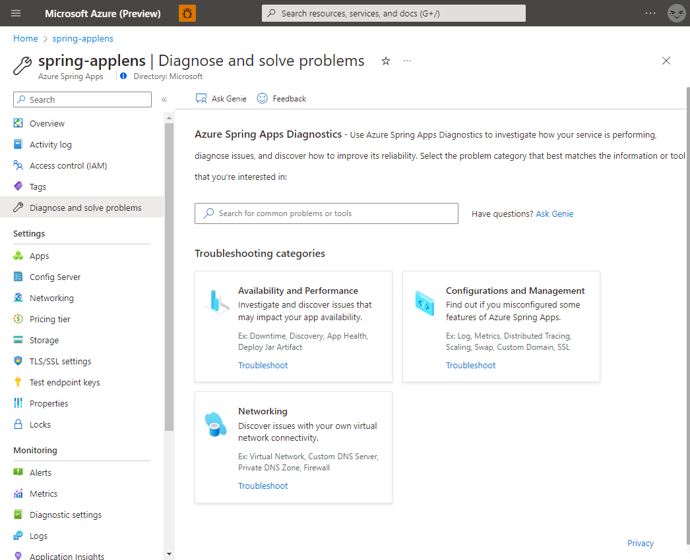
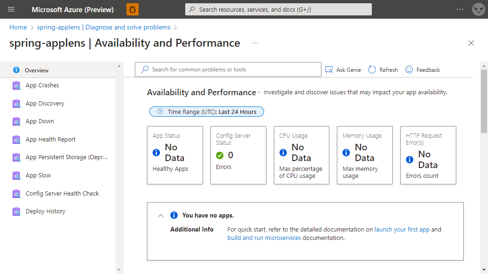
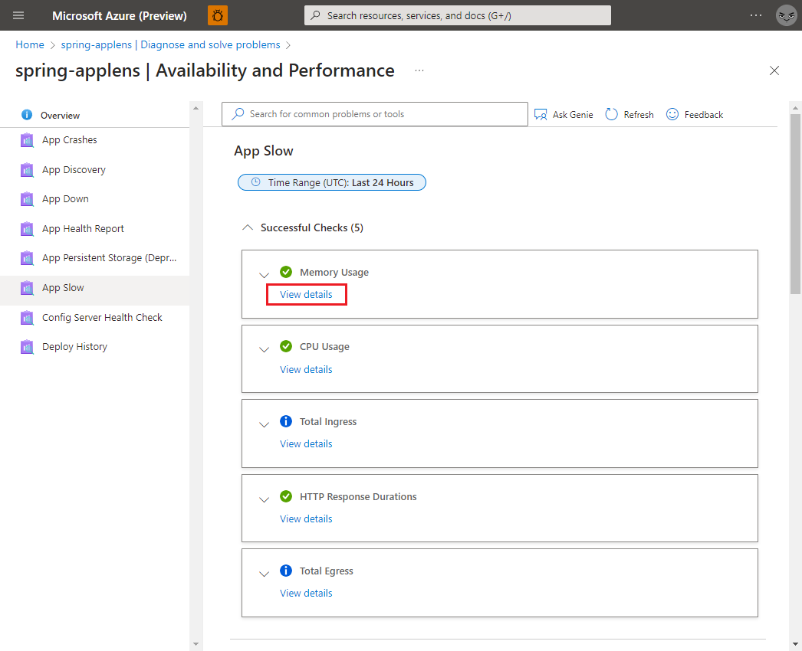
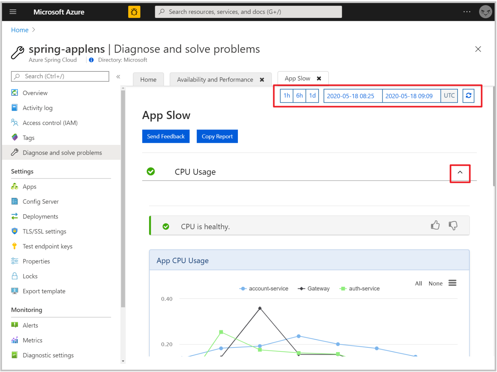
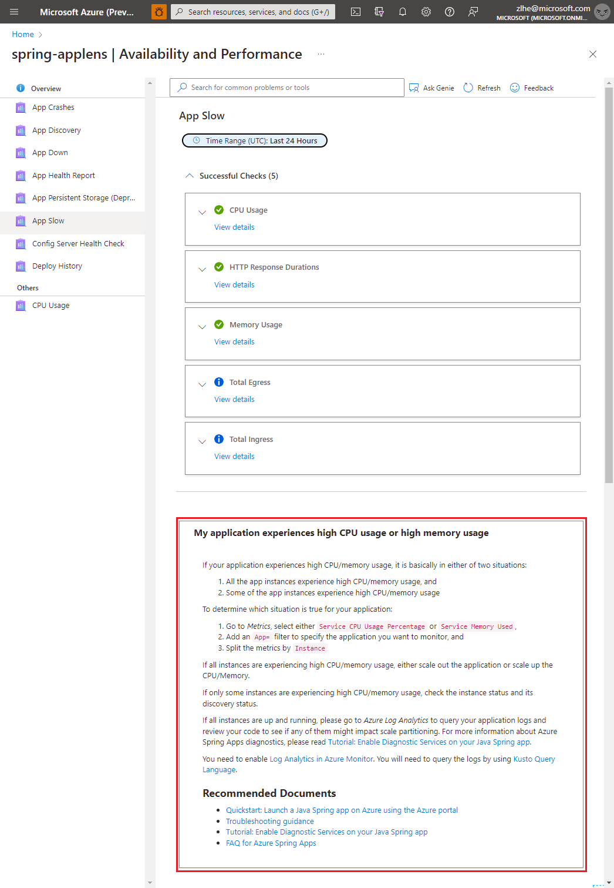

# Self-diagnose and solve problems in Azure Spring Apps

> [!NOTE]
> Azure Spring Apps is the new name for the Azure Spring Cloud service. Although the service has a new name, you'll see the old name in some places for a while as we work to update assets such as screenshots, videos, and diagrams.

**This article applies to:** ✔️ Java ✔️ C#

**This article applies to:** ✔️ Basic/Standard tier ✔️ Enterprise tier

This article shows you how to use Azure Spring Apps diagnostics.

Azure Spring Apps diagnostics is an interactive experience to troubleshoot your app without configuration. Azure Spring Apps diagnostics identifies problems and guides you to information that helps troubleshoot and resolve issues.

## Prerequisites

To complete this exercise, you need:

* An Azure subscription. If you don't have an Azure subscription, create a [free account](https://azure.microsoft.com/free/?WT.mc_id=A261C142F) before you begin.
* A deployed Azure Spring Apps service instance. Follow our [quickstart on deploying an app via the Azure CLI](./quickstart.md) to get started.
* At least one application already created in your service instance.

## Navigate to the diagnostics page

1. Sign in to the Azure portal.
2. Go to your Azure Spring Apps **Overview** page.
3. Select **Diagnose and solve problems** in the left navigation pane.

## Search logged issues

To find an issue, you can either search by typing a keyword or select the solution group to explore all in that category.

Selection of **Config Server Health Check**, **Config Server Health Status**, or **Config Server Update History** will display various results.

> [!NOTE]
> Spring Cloud Config Server is not applicable to enterprise tier.

Find your target detector, and select it to execute. A summary of diagnostics will be shown after you execute the detector. You can select **View Full Report** to check diagnostic details or select **Show Tile Menu** button to go back to detector list.

In diagnostic details page, you can change the diagnostic time range with the controller at top-right corner. To see more metrics or logs, toggle each diagnostic. There can be a 15-minute delay for metrics and logs.

Some results contain related documentation.

## Next steps

* [Monitor Spring app resources using alerts and action groups](./tutorial-alerts-action-groups.md)
* [Security controls for Azure Spring Apps Service](./concept-security-controls.md)
