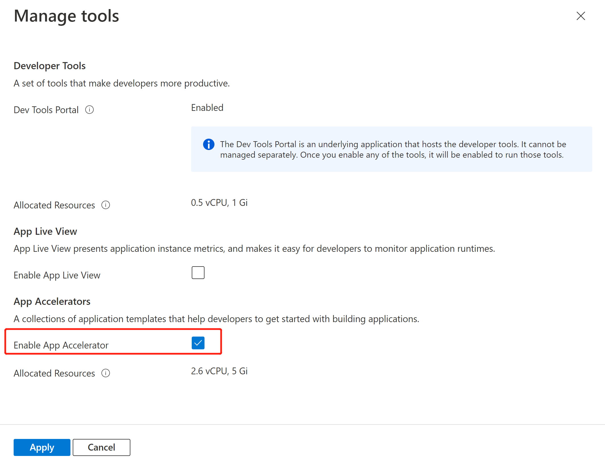
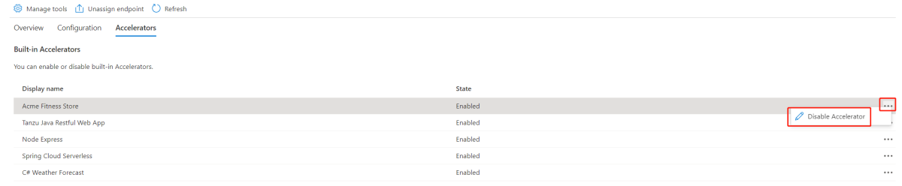
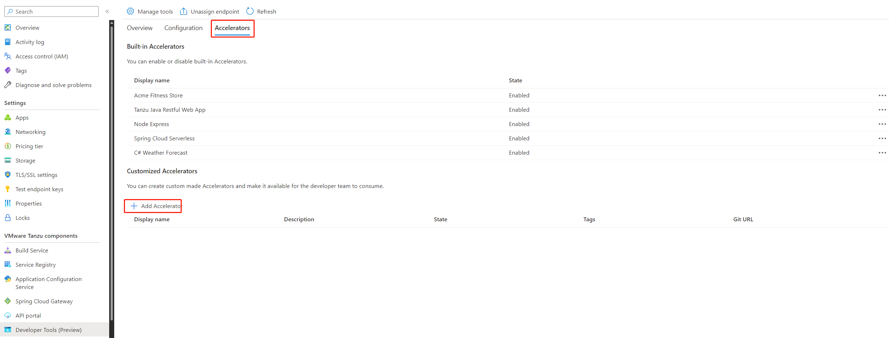
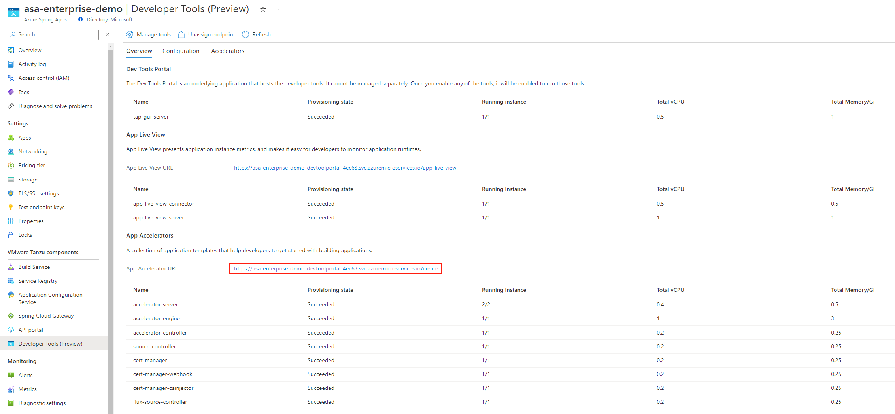
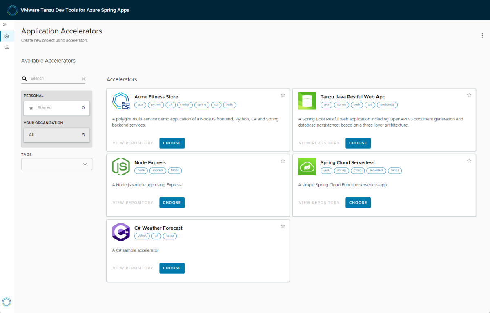

# Use App Accelerator
> [!NOTE]
> Azure Spring Apps is the new name for the Azure Spring Cloud service. Although the service has a new name, you'll see the old name in some places for a while as we work to update assets such as screenshots, videos, and diagrams.
**This article applies to:** ❌ Basic/Standard tier ✔️ Enterprise tier

This article shows you how to use [Application Accelerator](https://docs.vmware.com/en/Application-Accelerator-for-VMware-Tanzu/1.1/acc-docs/GUID-index.html) for VMware Tanzu® with Azure Spring Apps Enterprise tier to bootstrap developing your applications in a discoverable and repeatable way.

## Prerequisites
- An already provisioned Azure Spring Apps Enterprise tier service instance with App Accelerator enabled.
> [!NOTE]
> To use App Accelerator, you can either enable it when you provision your Azure Spring Apps service instance or enable it after provisioning. For more information, see [Enable or Disable App Accelerator](#enable-or-disable-app-accelerator).

- [Azure CLI version 2.0.67 or later](/cli/azure/install-azure-cli).

## Enable or disable App accelerator
- Enable App Accelerator when provisioning Azure Spring Apps service instance
#### [Portal](#tab/Portal)
1. Navigate to [Azure Portal](https://portal.azure.com/#create/vmware-inc.azure-spring-cloud-vmware-tanzu-2).
1. In the "Basic" tab, select "Enterprise tier" in pricing and fulfill other input fields. Click "next".
1. In the "VMware Tanzu settings" tab, check "App Accelerator" checkbox.
   
3. Fulfill other settings and click "Review and Create".
4. You can obtain "Enable Application Accelerator" and "Enable Dev Tools Portal" are "Yes" in the "Review and Create" tab. Click "create" to create the Enterprise tier instance.

#### [CLI](#tab/Azure-CLI)
Use the following command to create an Azure Spring Apps service instance with App Accelerator enabled:
```azurecli
az spring create \
    --resource-group <resource-group-name> \
    --name <Azure-Spring-Apps-service-instance-name> \
    --sku enterprise \
    --enable-application-accelerator
```

- Enable App Accelerator after provisioning Azure Spring Apps service instance
#### [Portal](#tab/Portal)
In **Developer Tools**, go to **Manage tools**. Check or uncheck **Enable App Accelerator** and then click **Apply** to enable or disable App Accelerator.


#### [CLI](#tab/Azure-CLI)
Use the following command to enable App Accelerator for an Azure Spring Apps service instance:
```azurecli
az spring application-accelerator create \
    --service <Azure-Spring-Apps-service-instance-name> \
    --resource-group <resource-group-name>
```

Use the following command to disable App Accelerator for an Azure Spring Apps service instance:
```azurecli
az spring application-accelerator delete \
    --service <Azure-Spring-Apps-service-instance-name> \
    --resource-group <resource-group-name>
```

## How does App Accelerator work
Application Accelerator allows you to generate new projects from files in Git repositories.

Application accelerator has 8 components, following are resource usages of each component:

| Component name          | Instance count | vCPU per instance | Memory per instance |
| :---------------------- | :------------- | :---------------- | :------------------ |
| accelerator-server      | 2              | 0.4 core          | 0.5Gi               |
| accelerator-engine      | 1              | 1 core            | 3Gi                 |
| accelerator-controller  | 1              | 0.2 core          | 0.25                |
| source-controller       | 1              | 0.2 core          | 0.25                |
| cert-manager            | 1              | 0.2 core          | 0.25                |
| cert-manager-webhook    | 1              | 0.2 core          | 0.25                |
| cert-manager-cainjector | 1              | 0.2 core          | 0.25                |
| flux-source-controller  | 1              | 0.2 core          | 0.25                |

You can see the running instances and resource usage of all the components.
#### [Portal](#tab/Portal)
In **Developer Tools**, go to **Manage tools**. Check or uncheck **Enable App Accelerator** and then click **Apply** to enable or disable App Accelerator.


#### [CLI](#tab/Azure-CLI)
```azurecli
az spring application-accelerator show \
    --service <Azure-Spring-Apps-service-instance-name> \
    --resource-group <resource-group-name>
```
This command produces output similar to the following example:
<!--TODO add output example -->

## Configure Dev Tools to access Application Accelerator


## Use App Accelerator to bootstrap your new projects
There are several built-in accelerators which you can start with to bootstrap your new projects. You can disable or enable the built-in accelerators according to you own preference.

### Manage predefined accelerators

There are several predefined accelerators which you can start with to bootstrap your new projects. You can disable or enable the built-in accelerators according to you own preference.

#### [Portal](#tab/Portal)



#### [CLI](#tab/Azure-CLI)

  Use the following command to get the list of built-in accelerators:

  ```azurecli
  az spring application-accelerator predefined-accelerator list
  	--service <service instance name>
  	--resource-group <resource group name>
  ```

  Use the following command to disable a built-in accelerator:

  ```azurecli
  az spring application-accelerator predefined-accelerator disable --name <predefined accelerator name>
  	--service <service instance name>
  	--resource-group <resource group name>
  ```

  Use the following command to enable a built-in predefined-accelerator:

  ```azurecli
  az spring application-accelerator predefined-accelerator enable --name <predefined accelerator name>
  	--service <service instance name>
  	--resource-group <resource group name>
  ```

  

#### Manage your own accelerators

Application Accelerator allows you to generate new projects from files in Git repositories. An `accelerator.yaml` file in the repository declares input options for the accelerator. This file also contains instructions for processing the files when you generate a new project.

1. You can use any Git repository to create an accelerator. (Currently we support Git repository in GitHub, GitLab and BitBucket.) 

   Create a file named `accelerator.yaml` in the root directory of this Git repository. By including an `accelerator.yaml` file in your Accelerator repository, you can declare input options that users fill in using a form in the UI. Those option values control processing by the template engine before it returns the zipped output files. 

   When there is no `accelerator.yaml`, the repository still works as an accelerator but the files are passed unmodified to users. For more information about how to write an accelerator.yaml file, see [Creating an accelerator.yaml file] 

1. Publish accelerator

    #### [Portal](#tab/Portal)

    To create your own accelerator, open the **Accelerators** section and click **Add Accelerator** under the Customized Accelerators section.

    

    #### [CLI](#tab/Azure-CLI)

      Use the following command to create your own accelerator:

      ```azurecli
      az spring application-accelerator customized-accelerator add --name <customized accelerator name>
      --service <service instance name>
      --resource-group <resource group name>
      --display-name <display name>
      --git-url <git repo url>
      [--description <description>]
      [--icon-url <icon url>]
      [--accelerator-tags <tags on accelerator>]
      [--git-interval-in-seconds <interval in seconds>]
      [--git-branch <branch name>]
      [--git-commit <commit id>]
      [--git-tag <tag in git>]
      [--username]
      [--password]
      [--private-key]
      [--host-key]
      [--host-key-algorithm]
      ```


1. Click App Accelerator URL to access Tanzu Application Platform GUI to see all the published accelerators.

	   

    You need to refresh the Tanzu Application Platform GUI to reveal the newly published accelerator.

       

    > [!NOTE]
    > It might take a few seconds for Tanzu Application Platform GUI to refresh the catalog and add an entry for your new accelerator. The refresh interval is configured as git interval when you create the accelerator.


### Use accelerators to bootstrap a new project

- Access accelerator url with SSO
- Configure and download an accelerator
