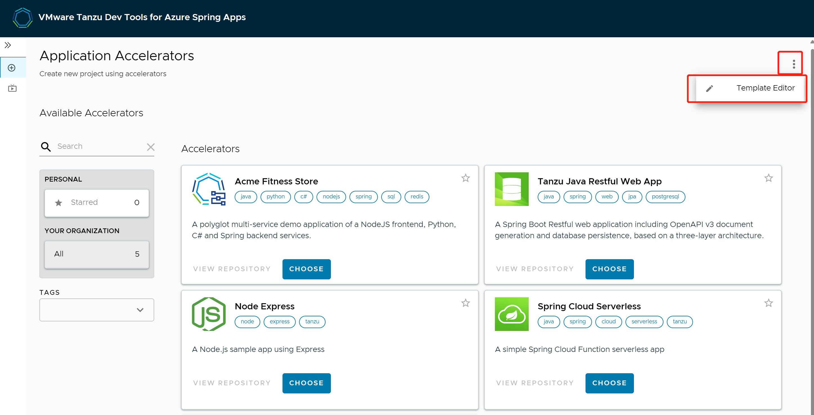
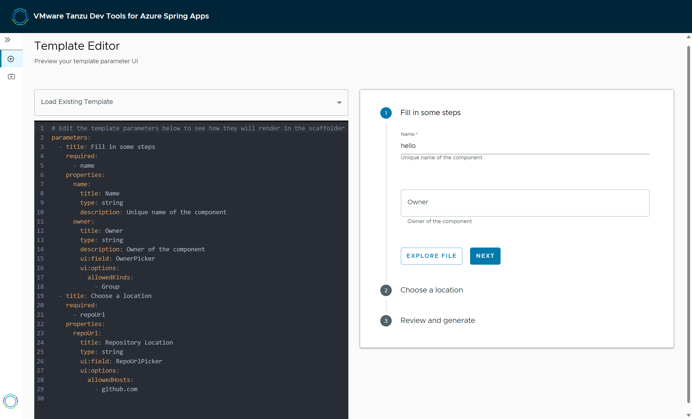
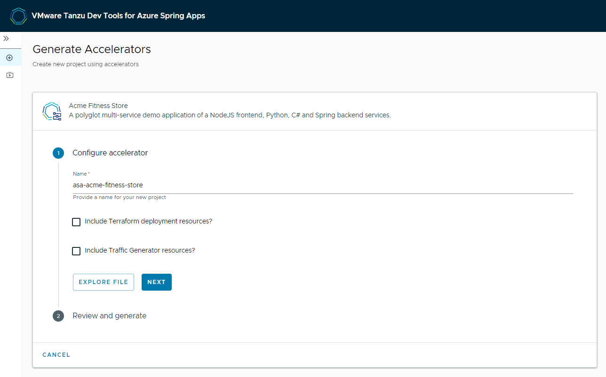
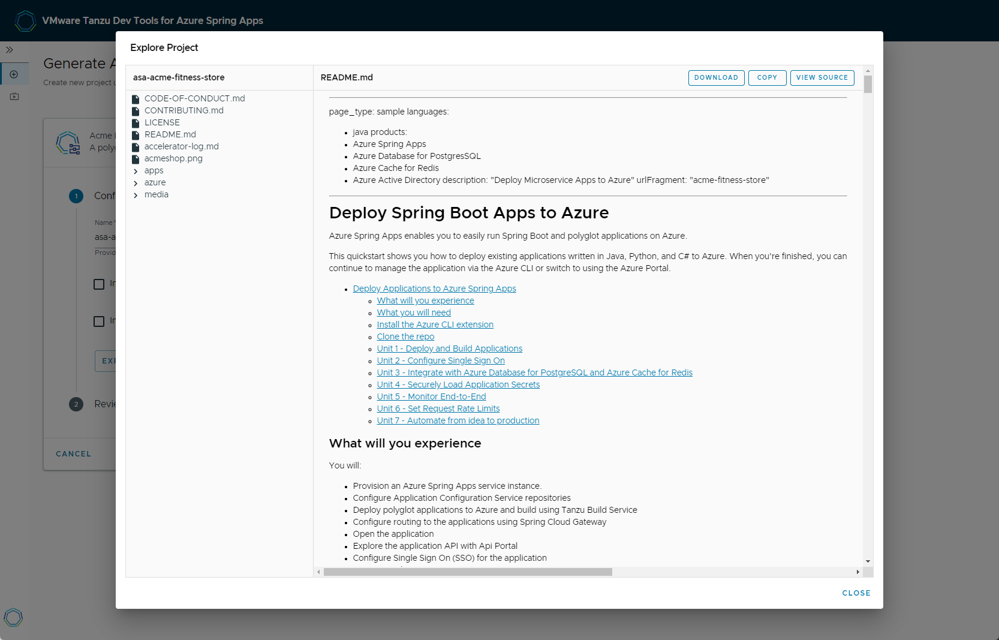
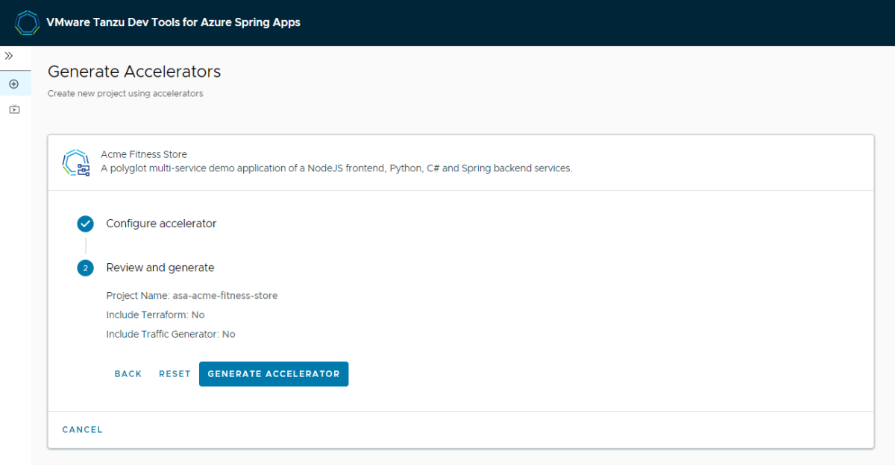
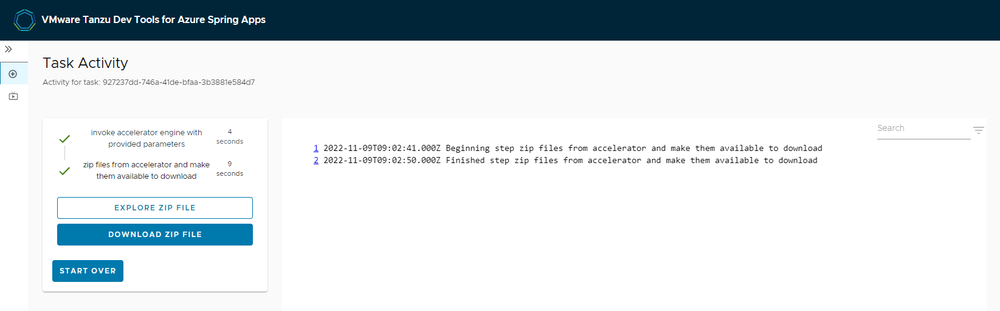

# Use App Accelerator
> [!NOTE]
> Azure Spring Apps is the new name for the Azure Spring Cloud service. Although the service has a new name, you'll see the old name in some places for a while as we work to update assets such as screenshots, videos, and diagrams.
**This article applies to:** ❌ Basic/Standard tier ✔️ Enterprise tier

This article shows you how to use [Application Accelerator](https://docs.vmware.com/en/VMware-Tanzu-Application-Platform/1.3/tap/GUID-application-accelerator-about-application-accelerator.html) for VMware Tanzu® with Azure Spring Apps Enterprise tier to bootstrap developing your applications in a discoverable and repeatable way.

## Prerequisites
- An Azure account with an active subscription. [Create an account for free](https://azure.microsoft.com/free/?WT.mc_id=A261C142F).
- To provision an Azure Marketplace offer purchase, see the [Prerequisites](how-to-enterprise-marketplace-offer.md#prerequisites) section of [View Azure Spring Apps Enterprise tier offering from Azure Marketplace](how-to-enterprise-marketplace-offer.md).
- [The Azure CLI version 2.0.67 or higher](/cli/azure/install-azure-cli).
- [!INCLUDE [install-enterprise-extension](includes/install-enterprise-extension.md)]

## Enable App Accelerator
You can enable App Accelerator when provisioning an Azure Spring Apps Enterprise tier. If you already have a succeeded Azure Spring Apps Enterprise resource, see [Manage App Accelerator in existing Enterprise tier instances](#manage-app-accelerator-in-existing-enterprise-tier-instances) to enable it.

#### [Portal](#tab/Portal)
1. Navigate to [Azure Portal](https://portal.azure.com/#create/vmware-inc.azure-spring-cloud-vmware-tanzu-2).
1. In the "Basic" tab, select "Enterprise tier" in pricing and fulfill other input fields. Click "next".
1. In the "VMware Tanzu settings" tab, check "App Accelerators" checkbox.
   
3. Fulfill other settings and click "Review and Create".
4. You can obtain "Enable Application Accelerator" and "Enable Dev Tools Portal" are "Yes" in the "Review and Create" tab. Click "create" to create the Enterprise tier instance.

#### [CLI](#tab/Azure-CLI)
Use the following steps to provision an Azure Spring Apps service instance.

1. Use the following command to sign in to the Azure CLI and choose your active subscription:

   ```azurecli
   az login
   az account list --output table
   az account set --subscription <subscription-ID>
   ```

1. Use the following command to accept the legal terms and privacy statements for the Enterprise tier. This step is necessary only if your subscription has never been used to create an Enterprise tier instance of Azure Spring Apps.

   ```azurecli
   az provider register --namespace Microsoft.SaaS
   az term accept \
       --publisher vmware-inc \
       --product azure-spring-cloud-vmware-tanzu-2 \
       --plan asa-ent-hr-mtr
   ```

1. Select a location. This location must be a location supporting Azure Spring Apps Enterprise tier. For more information, see the [Azure Spring Apps FAQ](faq.md).

1. Use the following command to create a resource group:

   ```azurecli
   az group create \
       --name <resource-group-name> \
       --location <location>
   ```

   For more information about resource groups, see [What is Azure Resource Manager?](../azure-resource-manager/management/overview.md).

1. Prepare a name for your Azure Spring Apps service instance. The name must be between 4 and 32 characters long and can contain only lowercase letters, numbers, and hyphens. The first character of the service name must be a letter and the last character must be either a letter or a number.

1. Use the following command to create an Azure Spring Apps service instance with App Accelerator enabled:

    ```azurecli
    az spring create \
        --resource-group <resource-group-name> \
        --name <Azure-Spring-Apps-service-instance-name> \
        --sku enterprise \
        --enable-application-accelerator
    ```

## Monitor App Accelerator
Application Accelerator allows you to generate new projects from files in Git repositories.
Application accelerator has 8 components:

| Component name          | Instance count | vCPU per instance | Memory per instance | Responsibility |
| :---------------------- | :------------- | :---------------- | :------------------ | :------------------ |
| accelerator-server      | 2              | 0.4 core          | 0.5Gi               | Serve API used by other components to list available accelerators and options. |
| accelerator-engine      | 1              | 1 core            | 3Gi                 | Process the input values and files(pulled from a snapshot of a git repository) and apply dynamic tranformations to generate projects.|
| accelerator-controller  | 1              | 0.2 core          | 0.25                | Reconcile the accelerator resources to appear in Application Accelerator UI. |
| source-controller       | 1              | 0.2 core          | 0.25                | Support managing git repository sources for application accelerator.|
| cert-manager            | 1              | 0.2 core          | 0.25                | Support managing git repository sources for application accelerator.|
| cert-manager-webhook    | 1              | 0.2 core          | 0.25                | Support managing git repository sources for application accelerator.|
| cert-manager-cainjector | 1              | 0.2 core          | 0.25                | Support managing git repository sources for application accelerator.|
| flux-source-controller  | 1              | 0.2 core          | 0.25                | Support managing git repository sources for application accelerator.|

You can see the running instances and resource usage of all the components through Azure Portal and CLI.
#### [Portal](#tab/Portal)
You can view the state of App Accelerator in the "Developer Tools (Preview)" blade.


#### [CLI](#tab/Azure-CLI)
Use the following command to view App Accelerator.
```azurecli
az spring application-accelerator show \
    --service <Azure-Spring-Apps-service-instance-name> \
    --resource-group <resource-group-name>
```

## Configure Dev Tools to access Application Accelerator
To access app accelerator, you need centrally configure Dev Tools. Please refer to [Use Dev Tools](./how-to-use-dev-tool-portal.md) to understand more there.

## Use App Accelerator to bootstrap your new projects
### Get Permissions to manage accelerators
Before manage your accelerators, you need following permissions:

- Read : Get Azure Spring Apps Predefined Accelerator
- Other: Disable Azure Spring Apps Predefined Accelerator
- Other: Enable Azure Spring Apps Predefined Accelerator
- Write : Create or Update Microsoft Azure Spring Apps Customized Accelerator
- Read : Get Azure Spring Apps Customized Accelerator

For more information, see: [Use permissions in Azure Spring Apps | Microsoft Learn](https://learn.microsoft.com/en-us/azure/spring-apps/how-to-permissions?tabs=Azure-portal)

### Manage predefined accelerators

There are several predefined accelerators which you can start with to bootstrap your new projects. You can disable or enable the built-in accelerators according to you own preference.

#### [Portal](#tab/Portal)


#### [CLI](#tab/Azure-CLI)

  Use the following command to get the list of built-in accelerators:

  ```azurecli
  az spring application-accelerator predefined-accelerator list
  	--service <service instance name>
  	--resource-group <resource group name>
  ```

  Use the following command to disable a built-in accelerator:

  ```azurecli
  az spring application-accelerator predefined-accelerator disable --name <predefined accelerator name>
  	--service <service instance name>
  	--resource-group <resource group name>
  ```

  Use the following command to enable a built-in predefined-accelerator:

  ```azurecli
  az spring application-accelerator predefined-accelerator enable --name <predefined accelerator name>
  	--service <service instance name>
  	--resource-group <resource group name>
  ```

### Manage your own accelerators

Besides using the predefined accelerators, you can also create your own ones. Please follow below steps to create and maintain your own accelerators.

1. You can use any Git repository to create an accelerator. (Currently we support Git repository in GitHub, GitLab and BitBucket.) 

   Create a file named `accelerator.yaml` in the root directory of this Git repository. By including an `accelerator.yaml` file in your Accelerator repository, you can declare input options that users fill in using a form in the UI. Those option values control processing by the template engine before it returns the zipped output files. You can also use **Template Editor** in Dev Tools Portal to edit your accelerator.yaml file for visualization and syntax check.
   
   
   
   When there is no `accelerator.yaml`, the repository still works as an accelerator but the files are passed unmodified to users. For more information about how to write an accelerator.yaml file, see [Creating an accelerator.yaml file](https://docs.vmware.com/en/VMware-Tanzu-Application-Platform/1.3/tap/GUID-application-accelerator-creating-accelerators-accelerator-yaml.html) 

1. Publish the new accelerator

    When you have an Git repository to create an accelerator, you can publish it to be visible on Accelerator portal for developers to consume.

    #### [Portal](#tab/Portal)

    To create your own accelerator, open the **Accelerators** section and click **Add Accelerator** under the Customized Accelerators section.

    

    #### [CLI](#tab/Azure-CLI)

      Use the following command to create your own accelerator:

      ```azurecli
      az spring application-accelerator customized-accelerator add --name <customized accelerator name>
      --service <service instance name>
      --resource-group <resource group name>
      --display-name <display name>
      --git-url <git repo url>
      [--description <description>]
      [--icon-url <icon url>]
      [--accelerator-tags <tags on accelerator>]
      [--git-interval-in-seconds <interval in seconds>]
      [--git-branch <branch name>]
      [--git-commit <commit id>]
      [--git-tag <tag in git>]
      [--username]
      [--password]
      [--private-key]
      [--host-key]
      [--host-key-algorithm]
      ```

1. Click App Accelerator URL to access Dev Tools Portal to see all the published accelerators.

	   

    You need to refresh the Dev Tools Portal to reveal the newly published accelerator.

       

    > [!NOTE]
    > It might take a few seconds for Dev Tools Portal to refresh the catalog and add an entry for your new accelerator. The refresh interval is configured as git interval when you create the accelerator. After changing the accelerator, it will also take time to be reflected in Dev Tools Portal. The best practice can be changing the git interval to speed up for verification after changes applied into git repo.

### Use accelerators to bootstrap a new project
Click **App Accelerator URL** to access Dev Tools Portal.
   
Jump to Dev Tools Portal, you can choose one accelerator to explore file and download as zip file.
In the "Configure accelerator" step, you can input values for your input options.
   
Click **EXPLORE FILE**, you will see the project structure and view source code.
   
Go to the "Review and generate" step, you can review your provided paramenters and generator your project.
   
Click **GENERATE ACCELERATOR**, it will start a task to process provided paramenters and zip files from accelerator. After the task is completed, you're free to download the project as zip file.
   

## Manage App Accelerator in existing Enterprise tier instances
This section instructs you how to enable the App Accelerator under an existing Azure Spring Apps Enterprise tier instance.

If Dev tools public endpoint has already been exposed, then after enabling App Accelerator here, please use Ctrl+F5 to inactivate browser cache in order to see it on the Dev Tools Portal.

#### [Portal](#tab/Portal)
1. Navigate to your Service resource. Click "Developer Tools (Preview)".
1. Click "Manage tools".
1. Check the App Accelerators checkbox and click "Apply"

    

4.After it is saved successfully, you can view the state of App Accelerator in the "Developer Tools (Preview)" blade.

#### [CLI](#tab/Azure-CLI)
Use the following command to enable App Accelerator for an Azure Spring Apps service instance:
```azurecli
az spring application-accelerator create \
    --service <Azure-Spring-Apps-service-instance-name> \
    --resource-group <resource-group-name>
```

Use the following command to disable App Accelerator for an Azure Spring Apps service instance:
```azurecli
az spring application-accelerator delete \
    --service <Azure-Spring-Apps-service-instance-name> \
    --resource-group <resource-group-name>
```

> To access the Dev Tools Portal, please make sure Dev Tool Portal is enabled with public endpoint assigned. Run this command by using Azure CLI if the component is not enabled.
> ```azurecli
> az spring dev-tool create \
>    --resource-group <resource-group-name> \
>    --service <Azure-Spring-Apps-service-instance-name> \
>    --assign-endpoint
> ```
