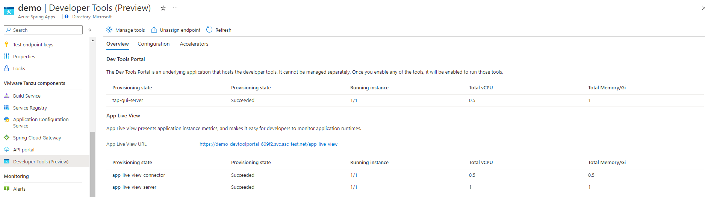
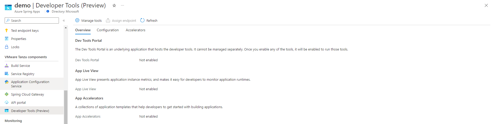
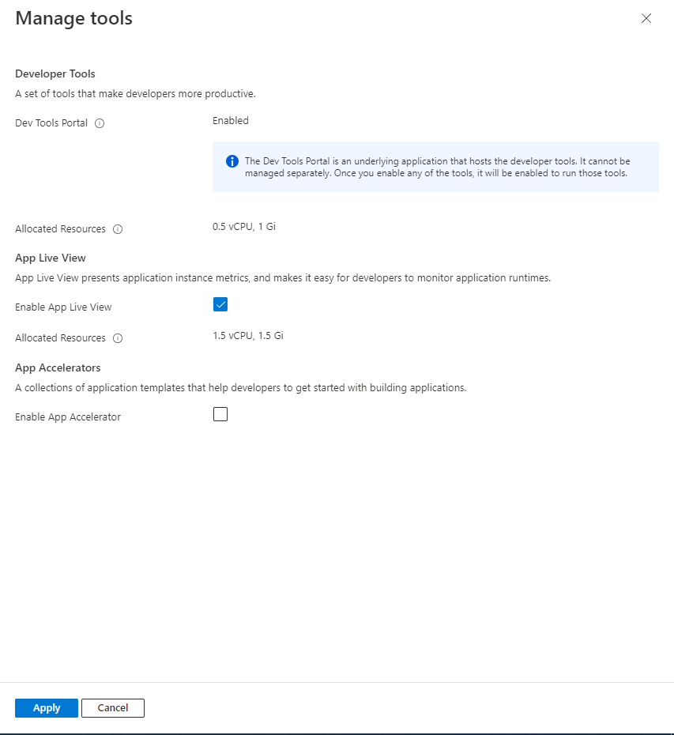

# Use Application Live View
> [!NOTE]
> Azure Spring Apps is the new name for the Azure Spring Cloud service. Although the service has a new name, you'll see the old name in some places for a while as we work to update assets such as screenshots, videos, and diagrams.

**This article applies to:** ❌ Basic/Standard tier ✔️ Enterprise tier

This article shows you how to use Application Live View for VMware Tanzu® with Azure Spring Apps Enterprise Tier.

[Application Live View](https://docs.vmware.com/en/Application-Live-View-for-VMware-Tanzu/1.2/docs/GUID-index.html) is a lightweight insights and troubleshooting tool that helps app developers and app operators to look inside running apps.

> Application Live View now only supports Spring Boot application.

## Prerequities
- An Azure account with an active subscription. [Create an account for free](https://azure.microsoft.com/free/?WT.mc_id=A261C142F).
- To provision an Azure Marketplace offer purchase, see the [Prerequisites](how-to-enterprise-marketplace-offer.md#prerequisites) section of [View Azure Spring Apps Enterprise tier offering from Azure Marketplace](how-to-enterprise-marketplace-offer.md).
- [The Azure CLI version 2.0.67 or higher](/cli/azure/install-azure-cli).
- [!INCLUDE [install-enterprise-extension](includes/install-enterprise-extension.md)]

## Enable Application Live View
You can enable Application Live View when provisioning an Azure Spring Apps Enterprise tier. If you already have a succeeded Azure Spring Apps Enterprise resource, see [Manage Application Live View in existing Enterprise tier instances](#manage-application-live-view-in-existing-enterprise-tier-instances) to enable it.

#### [Portal](#tab/Portal)
1. Navigate to [Azure Portal](https://portal.azure.com/#create/vmware-inc.azure-spring-cloud-vmware-tanzu-2).
1. In the "Basic" tab, select "Enterprise tier" in pricing and fulfill other input fields. Clieck "next".
1. In the "VMware Tanzu settings" tab, check "App Live View" checkbox.
   
3. Fulfill other settings and click "Review and Create".
4. You can obtain "Enable Application Live View" and "Enable Dev Tools Portal" are "Yes" in the "Review and Create" tab. Click "create" to create the Enterprise tier instance.

#### [CLI](#tab/Azure-CLI)

Use the following steps to provision an Azure Spring Apps service instance.

1. Use the following command to sign in to the Azure CLI and choose your active subscription:

   ```azurecli
   az login
   az account list --output table
   az account set --subscription <subscription-ID>
   ```

1. Use the following command to accept the legal terms and privacy statements for the Enterprise tier. This step is necessary only if your subscription has never been used to create an Enterprise tier instance of Azure Spring Apps.

   ```azurecli
   az provider register --namespace Microsoft.SaaS
   az term accept \
       --publisher vmware-inc \
       --product azure-spring-cloud-vmware-tanzu-2 \
       --plan asa-ent-hr-mtr
   ```

1. Select a location. This location must be a location supporting Azure Spring Apps Enterprise tier. For more information, see the [Azure Spring Apps FAQ](faq.md).

1. Use the following command to create a resource group:

   ```azurecli
   az group create \
       --name <resource-group-name> \
       --location <location>
   ```

   For more information about resource groups, see [What is Azure Resource Manager?](../azure-resource-manager/management/overview.md).

1. Prepare a name for your Azure Spring Apps service instance. The name must be between 4 and 32 characters long and can contain only lowercase letters, numbers, and hyphens. The first character of the service name must be a letter and the last character must be either a letter or a number.

1. Use the following command to create an Azure Spring Apps service instance:

   ```azurecli
   az spring create \
       --resource-group <resource-group-name> \
       --name <Azure-Spring-Apps-service-instance-name> \
       --sku enterprise \
       --enable-application-live-view
   ```

## Monitor Application Live View
Azure Spring Apps runs the Application Live View in connector mode. 

| Component Name | Responsibiliy |
|------------------------------|---------------|
| Application Live View Server | The central server component that contains a list of registered apps. It is responsible for proxying the request to fetch the actuator information related to the app. |
| Application Live View Connector | The component responsible for discovering the running app, and registering the instances to the Application Live View Server for it to be observed. The Application Live View Connector is also responsible for proxying the actuator queries to the app. | 

You can obtain the running state, resource consumption or manage Application Live View after provisioning the Azure Spring Apps Enterprise tier. 

#### [Portal](#tab/Portal)
1. You can view the state of Application Live View in the "Developer Tools (Preview)" blade.
  


#### [CLI](#tab/Azure-CLI)
1. Run this command to view Application Live View by using Azure CLI
   ```azurecli
   az spring application-live-view show \
       --resource-group <resource-group-name> \
       --service <Azure-Spring-Apps-service-instance-name>
   ```

## Configure Dev Tools to access Application Live View
To access application live view, you need centrally configure Dev Tools. Please refer to [Use Dev Tools](./how-to-use-dev-tool-portal.md) to understand more there.

>

## Use Application Live View to monitor your apps

Currently, Application Live View supports to view live metrics for Spring Boot application and Spring Native application. The Application Live View is based on concept of Spring Boot Actuators. This section guides how to deploy an App and monitor it in Application Live View.

1. Add the following dependency to your application's `pom.xml` file.
   ```xml
   <dependency>
        <groupId>org.springframework.boot</groupId>
        <artifactId>spring-boot-starter-actuator</artifactId>
    </dependency>
   ```

1. Add the execution goal to maven plugin in the `pom.xml` file to expose Build information when build.
   ```xml
    <plugin>
    <groupId>org.springframework.boot</groupId>
    <artifactId>spring-boot-maven-plugin</artifactId>
    <executions>
        <execution>
        <goals>
            <goal>build-info</goal>
        </goals>
        <configuration>
            <additionalProperties>
            <spring.boot.version>${project.parent.version}</spring.boot.version>
            </additionalProperties>
        </configuration>
        </execution>
    </executions>
    </plugin>
   ```

1. Enable actuator endpoint by adding this configuration in `application.properties`
  ```
  management.endpoints.web.exposure.include=info,health
  ```

1. Build your package locally
   ```bash
   mvn clean package -DskipTests
   ```

1. Use the following command to deploy the binary.

   ```azurecli
   az spring app create \
       --resource-group <resource-group-name> \
       --service <Azure-Spring-Apps-service-instance-name> \
       --name <app-name>
   az spring app deploy \
       --resource-group <resource-group-name> \
       --service <Azure-Spring-Apps-service-instance-name> \
       --name <app-name> \
       --artifact-path <jar-file-in-target-folder>
   ```

1. After the App gets successfully deployed, you can monitor it through Application Live View dashboard exposed through Dev Tools Portal, see [Monitor apps by Application Live View](./monitor-apps-by-application-live-view.md).

   If you have Dev Tools Portal already enabled and public endpoint exposed. Use the following command to get the Dev Tools Portal dashboard url and then add suffix "/app-live-view" to compose the endpoint to access Application Live View.
   
   ```azurecli
   az spring dev-tool show --service <Azure-Spring-Apps-service-instance-name> \
        --resource-group <resource-group-name> \
        --query properties.url \
        --output tsv
   ```

## Manage Application Live View in existing Enterprise tier instances

This section instructs you how to enable the Application Live View under an existing Azure Spring Apps Enterprise tier instance.
> If Dev tools public endpoint has already been exposed, then after enabling Application Live View here, please use Ctrl+F5 to inactivate browser cache in order to see it on the Dev Tools Portal.
#### [Portal](#tab/Portal)
1. Navigate to your Service resource. Click "Developer Tools (Preview)".
1. Click "Manage tools".
   
3. Check the Application Live View checkbox and click "Save"
   
5. After it is saved successfully, you can view the state of Application Live View in the "Developer Tools (Preview)" blade.
  


#### [CLI](#tab/Azure-CLI)
1. Run this command to enable Application Live View by using Azure CLI
   ```azurecli
   az spring application-live-view create \
       --resource-group <resource-group-name> \
       --service <Azure-Spring-Apps-service-instance-name>
   ```

  > To access the Application Live View dashboard, Dev Tools Portal should be enabled with public endpoint assigned. Run this command by using Azure CLI if the component is not enabled
  > ```azurecli
  > az spring dev-tool create \
  >    --resource-group <resource-group-name> \
  >    --service <Azure-Spring-Apps-service-instance-name> \
  >    --assign-endpoint
  > ```
