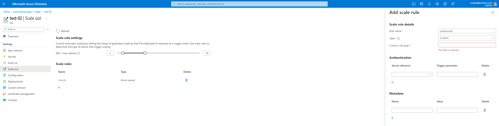

# Set up autoscale for applications
This article describes how to set up Autoscale rules for your applications in Azure Spring Standard Consumption plan.

Azure Spring Standard Consumption plan uses [Container App](https://learn.microsoft.com/en-us/azure/container-apps/) to host your spring applications, we manage automatic horizontal scaling through a set of declarative scaling rules. Therefore, we support all the scaling rules which Azure Container App supports.

# Prerequisites
To follow these procedures, you need:
* An Azure subscription. If you don't have an Azure subscription, create a [free account](https://azure.microsoft.com/en-us/free/?WT.mc_id=A261C142F) before you begin.
* A deployed Azure Spring Apps service instance. 
* At least one application already created in your service instance.

# Scale definition
Scaling is defined by the combination of limits and rules.

* **Limits** are the minimum and maximum number of instances that your spring app will have. 

| Scale limit      | Default value |  Min value | Max value |
| ----------- | ----------- | ----------- | ----------- |
| Minimum number of instance per deployment | 1 | 0 | 30 |
| Maximum number of instance per deployment   | 10 | 1 | 30 |

By default, the minimum instance number of your spring application is set to 1 to ensure that your deployment is always running. If you want to scale in to 0, you can set the minimum instance count to 0.

* **Rules** are the criteria that the autoscaling decide to add or remove instances. The rules include [HTTP, TCP and Custom](https://learn.microsoft.com/en-us/azure/container-apps/scale-app?pivots=azure-cli#scale-rules).

If you define more than one scale rule, the autoscaling begins to scale once the first condition of any rules is met.

* **Polling interval and cooldown period** are two time spans whiling autoscaling works on. Polling interval indicates the time span between each action to polling the realtime data defined by your rules, it's set to 30s by default. Cooldown period only applies when scaling to 0, for example, wait 5 minutes after the last time autoscaling checked the message queue and it was empty.

# Set up autoscale settings for your application in Azure Portal

## Navigate to the autoscale page in Auzre Portal
* Sign in to the Azure portal.
* Go to the Azure Spring Apps Overview page.
* Select the resource group that contains your service.
* Select the Apps tab under Settings in the menu on the left navigation pane.
* Select the application for which you want to set up Autoscale. In this example, select the application named demo. You should then see the application's Overview page.
* Go to the Scale out tab under Settings in the menu on the left navigation pane.
* Select the deployment you want to set up Autoscale. The options for Autoscale are described in the following section.

## Set up autoscale settings for your applications
1. First, set up the instance limits of your deployment. 
2. Then click the add button to add your scale rules. You can refer to [keda scalers](https://keda.sh/docs/2.9/scalers/) to specify your custom rules.




# Set up autoscale settings for your applicaiton in Azure CLI
You can also set up autoscaling using the Azure CLI. The following commands show an example to create an Azure Spring application deployment with an autoscaling rule.

```azurecli-interactive
az spring app deployment create 
--resource-group <resource group> 
--service <service name> 
--app <app name> 
--name <deployment name> 
--secrets "connection-string-secret=<SERVICE_BUS_CONNECTION_STRING>" 
--scale-rule-name azure-servicebus-queue-rule 
--scale-rule-type azure-servicebus 
--scale-rule-metadata "queueName=my-queue" 
                      "namespace=service-bus-namespace" 
                      "messageCount=5" 
--scale-rule-auth "connection=connection-string-secret" 
--min-instance-count 0
--min-instance-count 5 
```