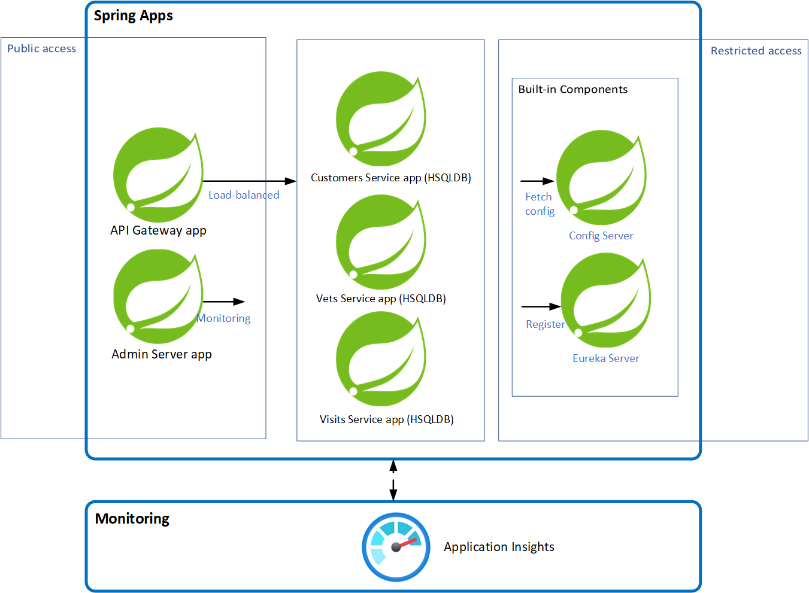

# Quickstart: Deploy microservice applications to Azure Spring Apps

> [!NOTE]
> The first 50 vCPU hours and 100 GB hours of memory are free each month. For more information, see [Price Reduction - Azure Spring Apps does more, costs less!](https://techcommunity.microsoft.com/t5/apps-on-azure-blog/price-reduction-azure-spring-apps-does-more-costs-less/ba-p/3614058) on the [Apps on Azure Blog](https://techcommunity.microsoft.com/t5/apps-on-azure-blog/bg-p/AppsonAzureBlog).

> [!NOTE]
> Azure Spring Apps is the new name for the Azure Spring Cloud service. Although the service has a new name, you'll see the old name in some places for a while as we work to update assets such as screenshots, videos, and diagrams.

This article explains how to deploy microservice applications to Azure Spring Apps using the well-known sample app [PetClinic](https://github.com/spring-petclinic/spring-petclinic-microservices). The **Pet Clinic** sample demonstrates the microservice architecture pattern. The following diagram shows the architecture of the PetClinic application on Azure Spring Apps.

Diagram of Spring Pet Clinic apps architecture:
- Use Azure Spring Apps to manage the Spring Boot apps.
- Use the managed components Spring Cloud Config Server and Eureka Service Discovery on Azure Spring Apps, the Config Server reads Git repository configuration.
- Expose the URL of `api-gateway` to load balance requests to service apps, and expose the URL of the `admin-server` to manage the applications.
- Analyze logs using the Log Analytics workspace.
- Monitor with the Application Insights.

## 1 Prerequisites

- An Azure subscription. [!INCLUDE [quickstarts-free-trial-note](../../includes/quickstarts-free-trial-note.md)]
- [Git](https://git-scm.com/downloads).
- [Java Development Kit (JDK)](/java/azure/jdk/), version 17.

[!INCLUDE [deploy-microservice-apps-with-basic-standard-plan](includes/quickstart-deploy-microservice-apps/deploy-microservice-apps-with-basic-standard-plan.md)]

## 5 Validation

### 5.1 Access application

According to the content echoed by the deployment, open the URL exposed by the app `api-gateway`, for example, `https://<your-Azure-Spring-Apps-instance-name>-api-gateway.azuremicroservices.io`.

:::image type="content" source="media/quickstart-deploy-microservice-apps/application.png" alt-text="Screenshot of PetClinic application running on Azure Spring Apps" lightbox="media/quickstart-deploy-microservice-apps/application.png":::

### 5.2 Query application logs

After browsing each function of the Pet Clinic, the Log Analytics workspace will collect logs of each application, and you can check the logging via your custom queries on it.

:::image type="content" source="media/quickstart-deploy-microservice-apps/spring-apps-log-query.png" alt-text="Screenshot of Log query for PetClinic application running on Azure Spring Apps" lightbox="media/quickstart-deploy-microservice-apps/spring-apps-log-query.png":::

### 5.2 Monitor application

The Application Insights will monitor the application dependencies, and you can view the following application tracing map.

:::image type="content" source="media/quickstart-deploy-microservice-apps/application-insights-map.png" alt-text="Screenshot of Application Insights map for PetClinic application running on Azure Spring Apps" lightbox="media/quickstart-deploy-microservice-apps/application-insights-map.png":::

Open the URL exposed by the app `admin-server`, you can manage the applications through the Spring Boot Admin Server.

:::image type="content" source="media/quickstart-deploy-microservice-apps/admin-server-ui.png" alt-text="Screenshot of Admin Server for PetClinic application running on Azure Spring Apps" lightbox="media/quickstart-deploy-microservice-apps/admin-server-ui.png":::

[!INCLUDE [clean-up-resources](includes/quickstart-deploy-microservice-apps/clean-up-resources.md)]

## 7 Next steps

> [!div class="nextstepaction"]
> [Quickstart: Using Log Analytics with Azure Spring Apps](./quickstart-setup-log-analytics.md)

> [!div class="nextstepaction"]
> [Quickstart: Monitoring with logs, metrics, and tracing](./quickstart-logs-metrics-tracing.md)

> [!div class="nextstepaction"]
> [Quickstart: Integrate with Azure Database for MySQL](./quickstart-integrate-azure-database-mysql.md)

For more information, see the following articles:

- [Azure Pet Clinic](https://github.com/Azure-Samples/spring-petclinic-microservices)
- [Azure Spring Apps Samples](https://github.com/Azure-Samples/Azure-Spring-Cloud-Samples)
- [Spring on Azure](/azure/developer/java/spring/)
- [Spring Cloud Azure](/azure/developer/java/spring-framework/)
