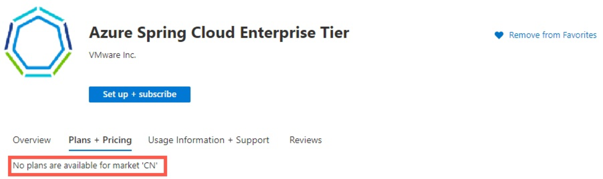

# Troubleshoot common Azure Spring Apps issues

> [!NOTE]
> Azure Spring Apps is the new name for the Azure Spring Cloud service. Although the service has a new name, you'll see the old name in some places for a while as we work to update assets such as screenshots, videos, and diagrams.

**This article applies to:** ✔️ Basic/Standard ✔️ Enterprise

This article provides instructions for troubleshooting Azure Spring Apps development issues. For more information, see [Azure Spring Apps FAQ](./faq.md).

## Availability, performance, and application issues

### My application can't start

When your application can't start, you may find that its endpoint can't be connected or it returns a 502 after a few retries.

For troubleshooting, export the logs to Azure Log Analytics. The table for Spring application logs is named *AppPlatformLogsforSpring*. To learn more, see [Analyze logs and metrics with diagnostics settings](diagnostic-services.md).

The following error message might appear in your logs: `org.springframework.context.ApplicationContextException: Unable to start web server`

The message indicates one of two likely problems:

* One of the beans or one of its dependencies is missing.
* One of the bean properties is missing or invalid. In this case, "java.lang.IllegalArgumentException" is displayed.

Service bindings might also cause application start failures. To query the logs, use keywords that are related to the bound services. For instance, let's assume that your application has a binding to a MySQL instance that's set to local system time. If the application fails to start, the following error message might appear in the log:

> "java.sql.SQLException: The server time zone value 'Coordinated Universal Time' is unrecognized or represents more than one time zone."

To fix this error, go to the `server parameters` of your MySQL instance, and change the `time_zone` value from *SYSTEM* to *+0:00*.

### My application crashes or throws an unexpected error

When you're debugging application crashes, start by checking the running status and discovery status of the application. To do so, go to **Apps** in the Azure portal to ensure that the statuses of all the applications are *Running* and *UP*.

* If the status is *Running* but the discovery status isn't *UP*, go to the ["My application can't be registered"](#my-application-cant-be-registered) section.

* If the discovery status is *UP*, go to Metrics to check the application's health. Inspect the following metrics:

  * `tomcat.global.error`:

    All Spring application exceptions are counted here. If this number is large, go to Azure Log Analytics to inspect your application logs.

  * `jvm.memory.max`:

    The maximum amount of memory available to the application. The amount might be undefined, or it might change over time if it's defined. If it's defined, the amount of used and committed memory is always less than or equal to max. However, a memory allocation might fail with an `OutOfMemoryError` message if the allocation attempts to increase the used memory such that *used > committed*, even if *used <= max* is still true. In such a situation, try to increase the maximum heap size by using the `-Xmx` parameter.

  * `jvm.memory.used`:

    The amount of memory in bytes that's currently used by the application. For a normal load Java application, this metric series forms a *sawtooth* pattern, where the memory usage steadily increases and decreases in small increments and suddenly drops a lot, and then the pattern recurs. This metric series occurs because of garbage collection inside Java virtual machine, where collection actions represent drops on the sawtooth pattern.

    This metric is important to help identify memory issues, such as:

    * A memory explosion at the very beginning.
    * The surge memory allocation for a specific logic path.
    * Gradual memory leaks.

  For more information, see [Metrics](./concept-metrics.md).

  > [!NOTE]
  > These metrics are available only for Spring Boot applications. To enable these metrics, add the `spring-boot-starter-actuator` dependency. For more information, see the [Add actuator dependency](concept-manage-monitor-app-spring-boot-actuator.md#add-actuator-dependency) section of [Manage and monitor app with Spring Boot Actuator](concept-manage-monitor-app-spring-boot-actuator.md).

* If the application fails to start, verify that the application has valid jvm parameters. If jvm memory is set too high, the following error message might appear in your logs:

   > "required memory 2728741K is greater than 2000M available for allocation"

To learn more about Azure Log Analytics, see [Get started with Log Analytics in Azure Monitor](../azure-monitor/logs/log-analytics-tutorial.md).

### My application experiences high CPU usage or high memory usage

If your application experiences high CPU or memory usage, one of two things is true:

* All the app instances experience high CPU or memory usage.
* Some of the app instances experience high CPU or memory usage.

To ascertain which situation applies, use the following steps:

1. Go to **Metrics**, and then select either **Service CPU Usage Percentage** or **Service Memory Used**.
2. Add an **App=** filter to specify which application you want to monitor.
3. Split the metrics by **Instance**.

If *all instances* are experiencing high CPU or memory usage, you need to either scale out the application or scale up the CPU or memory usage. For more information, see [Tutorial: Scale an application in Azure Spring Apps](./how-to-scale-manual.md).

If *some instances* are experiencing high CPU or memory usage, check the instance status and its discovery status.

For more information, see [Metrics for Azure Spring Apps](./concept-metrics.md).

If all instances are up and running, go to Azure Log Analytics to query your application logs and review your code logic. This review helps you see whether any of them might affect scale partitioning. For more information, see [Analyze logs and metrics with diagnostics settings](diagnostic-services.md).

To learn more about Azure Log Analytics, see [Get started with Log Analytics in Azure Monitor](../azure-monitor/logs/log-analytics-tutorial.md). Query the logs by using the [Kusto query language](/azure/kusto/query/).

### Checklist for deploying your Spring application to Azure Spring Apps

Before you onboard your application, ensure that it meets the following criteria:

* The application can run locally with the specified Java runtime version.
* The environment config (CPU/RAM/Instances) meets the minimum requirement set by the application provider.
* The configuration items have their expected values. For more information, see [Set up a Spring Cloud Config Server instance for your service](./how-to-config-server.md). For Enterpriseplan, see [Use Application Configuration Service](./how-to-enterprise-application-configuration-service.md).
* The environment variables have their expected values.
* The JVM parameters have their expected values.
* We recommended that you disable or remove the embedded *Config Server* and *Spring Service Registry* services from the application package.
* If any Azure resources are to be bound via *Service Binding*, make sure the target resources are up and running.

## Configuration and management

### I encountered a problem with creating an Azure Spring Apps service instance

When you set up an Azure Spring Apps service instance by using the Azure portal, Azure Spring Apps performs the validation for you.

But if you try to set up the Azure Spring Apps service instance by using the [Azure CLI](/cli/azure/get-started-with-azure-cli) or the [Azure Resource Manager template](../azure-resource-manager/index.yml), verify that you meet the following conditions:

* The subscription is active.
* Azure Spring Apps is available in the region you're using. For more information, see the [Azure Spring Apps FAQ](./faq.md).
* The resource group for the instance is already created.
* The resource name conforms to the naming rule. The name must contain only lowercase letters, numbers, and hyphens. The first character must be a letter. The last character must be a letter or number. The value must contain from 2 to 32 characters.

If you want to set up the Azure Spring Apps service instance by using the Resource Manager template, first refer to [Understand the structure and syntax of Azure Resource Manager templates](../azure-resource-manager/templates/syntax.md).

The name of the Azure Spring Apps service instance is used for requesting a subdomain name under `azureapps.io`, so the setup fails if the name conflicts with an existing one. You might find more details in the activity logs.

### I can't deploy a .NET Core app

You can't upload a *.zip* file for a .NET Core Steeltoe app by using the Azure portal or the Resource Manager template.

When you deploy your application package by using the [Azure CLI](/cli/azure/get-started-with-azure-cli), the Azure CLI periodically polls the deployment progress and, in the end, it displays the deployment result.

Ensure that your application is packaged in the correct *.zip* file format. If it isn't packaged correctly, the process stops responding or you receive an error message.

### I can't deploy a JAR package

You can't upload Java Archive file (JAR)/source package by using the Azure portal or the Resource Manager template.

When you deploy your application package by using the [Azure CLI](/cli/azure/get-started-with-azure-cli), the Azure CLI periodically polls the deployment progress and, in the end, it displays the deployment result.

If the polling is interrupted, you can still use the following command to fetch the deployment logs:

```azurecli
az spring app show-deploy-log --name <app-name>
```

Ensure that your application is packaged in the correct [executable JAR format](https://docs.spring.io/spring-boot/docs/current/reference/html/executable-jar.html). If it isn't packaged correctly, you receive an error message similar to the following example: `Error: Invalid or corrupt jarfile /jar/38bc8ea1-a6bb-4736-8e93-e8f3b52c8714`

### I can't deploy a source package

You can't upload JAR/source package by using the Azure portal or the Resource Manager template.

When you deploy your application package by using the [Azure CLI](/cli/azure/get-started-with-azure-cli), the Azure CLI periodically polls the deployment progress and, in the end, it displays the deployment result.

If the polling is interrupted, you can still use the following command to fetch the build and deployment logs:

```azurecli
az spring app show-deploy-log --name <app-name>
```

However, one Azure Spring Apps service instance can trigger only one build job for one source package at one time. For more information, see [Deploy an application](./quickstart.md) and [Set up a staging environment in Azure Spring Apps](./how-to-staging-environment.md).

### My application can't be registered

In most cases, this situation occurs when *Required Dependencies* and *Service Discovery* aren't properly configured in your Project Object Model (POM) file. Once it's configured, the built-in Service Registry server endpoint is injected as an environment variable with your application. Applications then register themselves with the Service Registry server and discover other dependent applications.

Wait at least two minutes before a newly registered instance starts receiving traffic.

If you're migrating an existing Spring Cloud-based solution to Azure, be sure to remove or disable your ad-hoc *Service Registry* and *Config Server* instances to avoid conflicting with the managed instances provided by Azure Spring Apps.

You can also check the *Service Registry* client logs in Azure Log Analytics. For more information, see [Analyze logs and metrics with diagnostics settings](diagnostic-services.md)

To learn more about Azure Log Analytics, see [Get started with Log Analytics in Azure Monitor](../azure-monitor/logs/log-analytics-tutorial.md). Query the logs by using the [Kusto query language](/azure/kusto/query/).

### I want to inspect my application's environment variables

Environment variables inform the Azure Spring Apps framework, ensuring that Azure understands where and how to configure the services that make up your application. Ensuring that your environment variables are correct is a necessary first step in troubleshooting potential problems. You can use the Spring Boot Actuator endpoint to review your environment variables.

> [!WARNING]
> This procedure exposes your environment variables by using your test endpoint. Do not proceed if your test endpoint is publicly accessible or if you've assigned a domain name to your application.

1. Go to `https://<your-application-test-endpoint>/actuator/health`. To find the test endpoint, see the [Verify app through test endpoint](concept-manage-monitor-app-spring-boot-actuator.md#verify-app-through-test-endpoint) section of [Manage and monitor app with Spring Boot Actuator](concept-manage-monitor-app-spring-boot-actuator.md).

   A response similar to `{"status":"UP"}` indicates that the endpoint has been enabled. If the response is negative, include the following dependency in your *POM.xml* file:

   ```xml
   <dependency>
       <groupId>org.springframework.boot</groupId>
       <artifactId>spring-boot-starter-actuator</artifactId>
   </dependency>
   ```

1. With the Spring Boot Actuator endpoint enabled, go to the Azure portal and look for the configuration page of your application. Add an environment variable with the name `MANAGEMENT_ENDPOINTS_WEB_EXPOSURE_INCLUDE` and the value `*`.

1. Restart your application.

1. Go to `https://<your-application-test-endpoint>/actuator/env` and inspect the response. It should look like this:

   ```json
   {
       "activeProfiles": [],
       "propertySources": {,
           "name": "server.ports",
           "properties": {
               "local.server.port": {
                   "value": 1025
               }
           }
       }
   }
   ```

Look for the child node named `systemEnvironment`. This node contains your application's environment variables.

> [!IMPORTANT]
> Remember to reverse the exposure of your environment variables before making your application accessible to the public. Go to the Azure portal, look for the configuration page of your application, and delete this environment variable:  `MANAGEMENT_ENDPOINTS_WEB_EXPOSURE_INCLUDE`.

### I can't find metrics or logs for my application

Go to **Apps** to ensure that the application statuses are *Running* and *UP*.

Check to see whether *JMX* is enabled in your application package. This feature can be enabled with the configuration property `spring.jmx.enabled=true`.

Check to see whether the `spring-boot-actuator` dependency is enabled in your application package and that it successfully boots up.

```xml
<dependency>
    <groupId>org.springframework.boot</groupId>
    <artifactId>spring-boot-starter-actuator</artifactId>
</dependency>
```

If your application logs can be archived to a storage account but not sent to Azure Log Analytics, check to see whether you set up your workspace correctly. For more information, see [Create a Log Analytics workspace](../azure-monitor/logs/quick-create-workspace.md). Also, be aware that the Basic plan doesn't provide a service-level agreement (SLA). For more information, see [Service Level Agreements (SLA) for Online Services](https://azure.microsoft.com/support/legal/sla/log-analytics/v1_3/).

## Enterprise plan

### Error 112039: Failed to purchase on Azure Marketplace

Creating an Azure Spring Apps Enterprise plan instance fails with error code "112039". For more information, check the detailed error message in the following list:

* **"Failed to purchase on Azure Marketplace because the Microsoft.SaaS RP is not registered on the Azure subscription."**: Azure Spring Apps Enterprise plan purchase a SaaS offer from VMware.

  You must register the `Microsoft.SaaS` resource provider before creating Azure Spring Apps Enterprise instance. See how to [register a resource provider](../azure-resource-manager/management/resource-providers-and-types.md#register-resource-provider).

* **"Failed to load catalog product vmware-inc.azure-spring-cloud-vmware-tanzu-2 in the Azure subscription market."**: Your Azure subscription's billing account address isn't in the supported location.

  For more information, see the section [No plans are available for market '\<Location>'](#no-plans-are-available-for-market-location).

* **"Failed to purchase on Azure Marketplace due to signature verification on Marketplace legal agreement. Check the Azure subscription has agree terms vmware-inc.azure-spring-cloud-vmware-tanzu-2.asa-ent-hr-mtr"**: Your Azure subscription hasn't signed the terms for the offer and plan to be purchased.

  Go to your Azure subscription and run the following Azure CLI command to agree to the terms:

  ```azurecli
  az term accept \
      --publisher vmware-inc \
      --product azure-spring-cloud-vmware-tanzu-2 \
      --plan asa-ent-hr-mtr
  ```

  If that doesn't help, you can contact the support team with the following info.

  * `AZURE_TENANT_ID`: the Azure tenant ID that hosts the Azure subscription
  * `AZURE_SUBSCRIPTION_ID`: the Azure subscription ID used to create the Azure Spring Apps instance
  * `SPRING_CLOUD_NAME`: the failed instance name
  * `ERROR_MESSAGE`: the observed error message

### No plans are available for market '\<Location>'

When you visit the SaaS offer [Azure Spring Apps Enterprise](https://aka.ms/ascmpoffer) in the Azure Marketplace, it may say "No plans are available for market '\<Location>'" as in the following image.



The Azure Spring Apps Enterprise plan needs customers to pay for a license to Tanzu components through an Azure Marketplace offer. To purchase in the Azure Marketplace, the billing account's country or region for your Azure subscription should be in the SaaS offer's supported geographic locations.

[Azure Spring Apps Enterprise](https://aka.ms/ascmpoffer) now supports all geographic locations that Azure Marketplace supports. See [Marketplace supported geographic location](../marketplace/marketplace-geo-availability-currencies.md#supported-geographic-locations).

You can view the billing account for your subscription if you have admin access. See [view billing accounts](../cost-management-billing/manage/view-all-accounts.md#check-the-type-of-your-account).

### I need VMware Spring Runtime Support (Enterprise plan only)

The Enterprise plan has built-in VMware Spring Runtime Support, so you can open support tickets to [VMware](https://aka.ms/ascevsrsupport) if you think your issue is in the scope of VMware Spring Runtime Support. To better understand VMware Spring Runtime Support itself, see the [VMware Spring Runtime](https://tanzu.vmware.com/spring-runtime). For more information on registering and using this support service, see the Support section in the [Enterprise FAQ from VMware](https://aka.ms/EnterpriseTierFAQ). For any other issues, open a support ticket with Microsoft.

## Next steps

* [How to self-diagnose and solve problems in Azure Spring Apps](./how-to-self-diagnose-solve.md)
* [Troubleshoot common exit code issues in Azure Spring Apps](./troubleshoot-exit-code.md)
