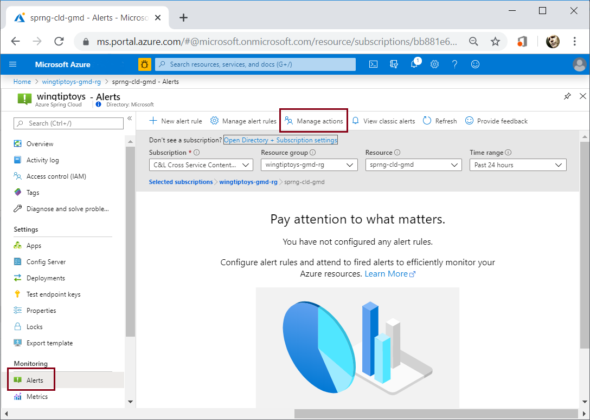
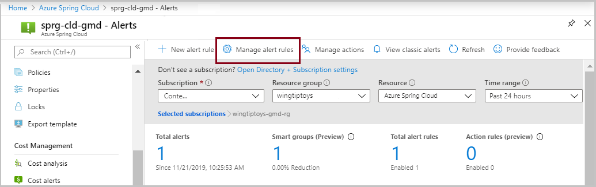
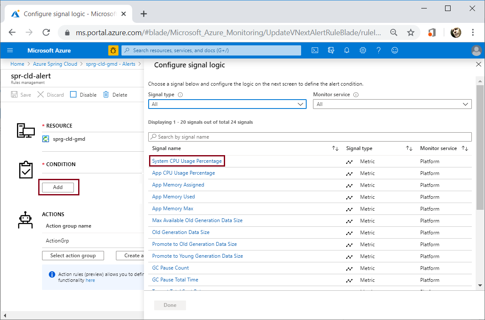
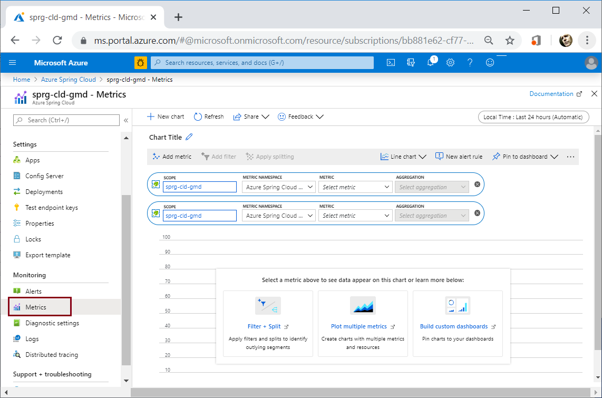

# Tutorial: Monitor Spring app resources using alerts and action groups

> [!NOTE]
> Azure Spring Apps is the new name for the Azure Spring Cloud service. Although the service has a new name, you'll see the old name in some places for a while as we work to update assets such as screenshots, videos, and diagrams.

**This article applies to:** ✔️ Java ✔️ C#

**This article applies to:** ✔️ Basic/Standard tier ✔️ Enterprise tier

Azure Spring Apps alerts support monitoring resources based on conditions such as available storage, rate of requests, or data usage. An alert sends notification when rates or conditions meet the defined specifications.

There are two steps to set up an alert pipeline:

1. Set up an Action Group with the actions to be taken when an alert is triggered, such as email, SMS, Runbook, or Webhook. Action Groups can be re-used among different alerts.
2. Set up Alert rules. The rules bind metric patterns with the action groups based on target resource, metric, condition, time aggregation, etc.

## Prerequisites

In addition to the Azure Spring Apps requirements, the procedures in this tutorial work with a deployed Azure Spring Apps instance. Follow a [quickstart](./quickstart.md) to get started.

The following procedures initialize both **Action Group** and **Alert** starting from the **Alerts** option in the left navigation pane of an Azure Spring Apps instance. (The procedure can also start from the **Monitor Overview** page of the Azure portal.)

Navigate from a resource group to your Azure Spring Apps instance. Select **Alerts** in the left pane, then select **Manage actions**:

## Set up Action Group

To begin the procedure to initialize a new **Action Group**, select **Add action group**.

On the **Add action group** page:

1. Specify an **Action group name** and **Short name**.

1. Specify **Subscription** and **Resource group**.

1. Specify **Action Name**.

1. Select **Action Type**.  This will open another pane on the right to define the action that will be taken on activation.

1. Define the action using the options in the right pane.  This case uses email notification.

1. Select **OK** in the right action pane.

1. Select **OK** in the **Add action group** dialog.

   

## Set up Alert

The previous steps created an **Action Group** that uses email. You could also use phone notification, webhooks, Azure functions, and so forth. The following steps configure an **Alert**.

1. Navigate back to the **Alerts** page and then select **Manage Alert Rules**.

   

1. Select the **Resource** for the alert.

1. Select **New alert rule**.

   

1. On the **Create rule** page, specify the **RESOURCE**.

1. The **CONDITION** setting provides many options for monitoring your **Spring Cloud** resources.  Select **Add** to open the **Configure signal logic** pane.

1. Select a condition. This example uses **System CPU Usage Percentage**.

   

1. Scroll down the **Configure signal logic** pane to set the **Threshold value** to monitor.

   

1. Select **Done**.

   For details of the conditions available to monitor, see [User portal metrics options](./concept-metrics.md#user-metrics-options).

1. Under **ACTIONS**, select **Select action group**. From the **ACTIONS** pane select the previously defined **Action Group**.

   

1. Scroll down, and under **ALERT DETAILS**, name the alert rule.

1. Set the **Severity**.

1. Select **Create alert rule**.

   

1. Verify that the new alert rule is enabled.

   

A rule can also be created using the **Metrics** page:

## Next steps

In this tutorial you learned how to set up alerts and action groups for an application in Azure Spring Apps. To learn more about action groups, see:

> [!div class="nextstepaction"]
> [Create and manage action groups in the Azure portal](../azure-monitor/alerts/action-groups.md)

> [!div class="nextstepaction"]
> [SMS Alert Behavior in Action Groups](../azure-monitor/alerts/alerts-sms-behavior.md)
