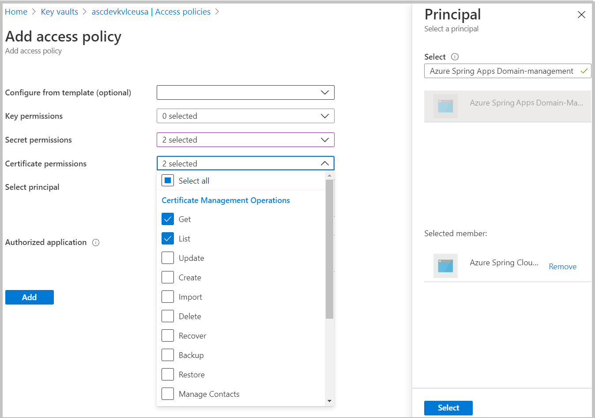
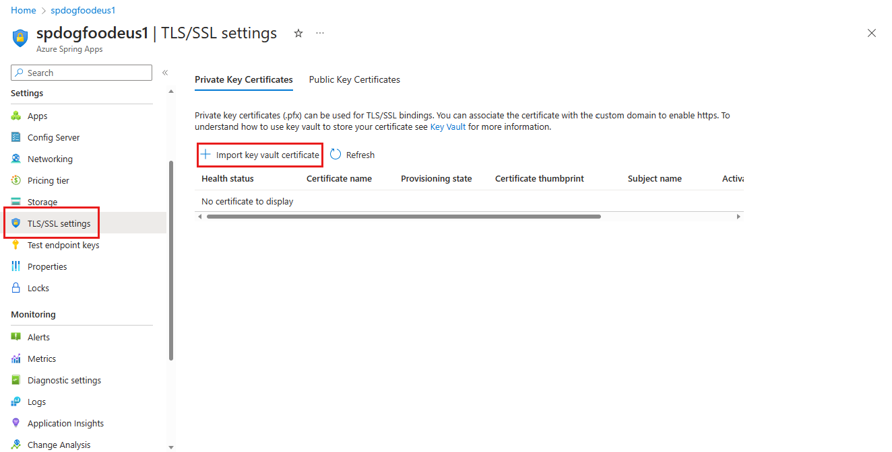
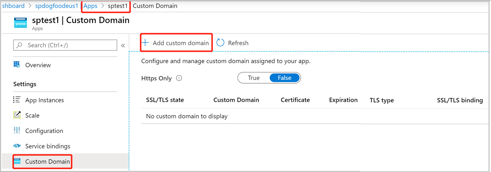
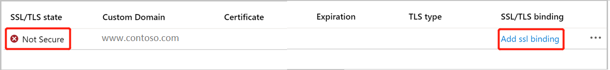
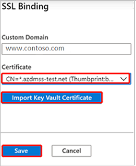
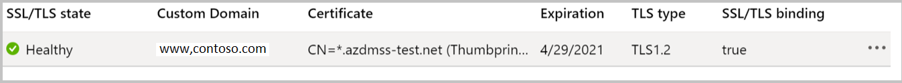

# Tutorial: Map an existing custom domain to Azure Spring Apps

> [!NOTE]
> Azure Spring Apps is the new name for the Azure Spring Cloud service. Although the service has a new name, you'll see the old name in some places for a while as we work to update assets such as screenshots, videos, and diagrams.

**This article applies to:** ✔️ Java ✔️ C#

**This article applies to:** ✔️ Standard tier ✔️ Enterprise tier 

Domain Name Service (DNS) is a technique for storing network node names throughout a network. This tutorial maps a domain, such as www.contoso.com, using a CNAME record. It secures the custom domain with a certificate and shows how to enforce Transport Layer Security (TLS), also known as Secure Sockets Layer (SSL).

Certificates encrypt web traffic. These TLS/SSL certificates can be stored in Azure Key Vault.

## Prerequisites

* An application deployed to Azure Spring Apps (see [Quickstart: Launch an existing application in Azure Spring Apps using the Azure portal](./quickstart.md), or use an existing app).
* A domain name with access to the DNS registry for domain provider such as GoDaddy.
* A private certificate (that is, your self-signed certificate) from a third-party provider. The certificate must match the domain.
* A deployed instance of [Azure Key Vault](../key-vault/general/overview.md)

## Keyvault Private Link Considerations

The Azure Spring Apps management IPs are not yet part of the Azure Trusted Microsoft services. Therefore, to allow Azure Spring Apps to load certificates from a Key Vault protected with Private endpoint connections, you must add the following IPs to Azure Key Vault Firewall: `20.53.123.160 52.143.241.210 40.65.234.114 52.142.20.14 20.54.40.121 40.80.210.49 52.253.84.152 20.49.137.168 40.74.8.134 51.143.48.243`

## Import certificate

### Prepare your certificate file in PFX (optional)

Azure Key Vault support importing private certificate in PEM and PFX format. If the PEM file you obtained from your certificate provider doesn't work in section below: [Save certificate in Key Vault](#save-certificate-in-key-vault), follow the steps here to generate a PFX for Azure Key Vault.

#### Merge intermediate certificates

If your certificate authority gives you multiple certificates in the certificate chain, you need to merge the certificates in order.

To do this, open each certificate you received in a text editor.

Create a file for the merged certificate, called _mergedcertificate.crt_. In a text editor, copy the content of each certificate into this file. The order of your certificates should follow the order in the certificate chain, beginning with your certificate and ending with the root certificate. It looks like the following example:

```crt
-----BEGIN CERTIFICATE-----
<your entire Base64 encoded SSL certificate>
-----END CERTIFICATE-----

-----BEGIN CERTIFICATE-----
<The entire Base64 encoded intermediate certificate 1>
-----END CERTIFICATE-----

-----BEGIN CERTIFICATE-----
<The entire Base64 encoded intermediate certificate 2>
-----END CERTIFICATE-----

-----BEGIN CERTIFICATE-----
<The entire Base64 encoded root certificate>
-----END CERTIFICATE-----
```

#### Export certificate to PFX

Export your merged TLS/SSL certificate with the private key that your certificate request was generated with.

If you generated your certificate request using OpenSSL, then you have created a private key file. To export your certificate to PFX, run the following command. Replace the placeholders _&lt;private-key-file>_ and _&lt;merged-certificate-file>_ with the paths to your private key and your merged certificate file.

```bash
openssl pkcs12 -export -out myserver.pfx -inkey <private-key-file> -in <merged-certificate-file>
```

When prompted, define an export password. You'll use this password when uploading your TLS/SSL certificate to Azure Key Vault later.

If you used IIS or _Certreq.exe_ to generate your certificate request, install the certificate to your local machine, and then [export the certificate to PFX](/previous-versions/windows/it-pro/windows-server-2008-R2-and-2008/cc754329(v=ws.11)).

### Save certificate in Key Vault

The procedure to import a certificate requires the PEM or PFX encoded file to be on disk and you must have the private key.

#### [Portal](#tab/Azure-portal)
To upload your certificate to key vault:
1. Go to your key vault instance.
1. In the left navigation pane, select **Certificates**.
1. On the upper menu, select **Generate/import**.
1. In the **Create a certificate** dialog under **Method of certificate creation**, select `Import`.
1. Under **Upload Certificate File**, navigate to certificate location and select it.
1. Under **Password**, if you are uploading a password protected certificate file, provide that password here. Otherwise, leave it blank. Once the certificate file is successfully imported, key vault will remove that password.
1. Select **Create**.

    

#### [CLI](#tab/Azure-CLI)

```azurecli
az keyvault certificate import --file <path to .pfx file> --name <certificate name> --vault-name <key vault name> --password <export password>
```

---

### Grant Azure Spring Apps access to your key vault

You need to grant Azure Spring Apps access to your key vault before you import certificate:

#### [Portal](#tab/Azure-portal)
1. Go to your key vault instance.
1. In the left navigation pane, select **Access Police**.
1. On the upper menu, select **Add Access Policy**.
1. Fill in the info, and select **Add** button, then **Save** access police.

| Secret permission | Certificate permission | Select principal                     |
|-------------------|------------------------|--------------------------------------|
| Get, List         | Get, List              | Azure Spring Cloud Domain-Management |



#### [CLI](#tab/Azure-CLI)

Grant Azure Spring Apps read access to key vault, replace the *\<key vault resource group>* and *\<key vault name>* in the following command.

```azurecli
az keyvault set-policy -g <key vault resource group> -n <key vault name>  --object-id 938df8e2-2b9d-40b1-940c-c75c33494239 --certificate-permissions get list --secret-permissions get list
```

---

### Import certificate to Azure Spring Apps

#### [Portal](#tab/Azure-portal)
1. Go to your service instance.
1. From the left navigation pane of your app, select **TLS/SSL settings**.
1. Then select **Import Key Vault Certificate**.

    

1. When you have successfully imported your certificate, you'll see it in the list of **Private Key Certificates**.

    

#### [CLI](#tab/Azure-CLI)

```azurecli
az spring certificate add --name <cert name> --vault-uri <key vault uri> --vault-certificate-name <key vault cert name>
```

To show a list of certificates imported:

```azurecli
az spring certificate list --resource-group <resource group name> --service <service name>
```

---

> [!IMPORTANT]
> To secure a custom domain with this certificate, you still need to bind the certificate to a specific domain. Follow the steps in this section: [Add SSL Binding](#add-ssl-binding).

## Add Custom Domain
You can use a CNAME record to map a custom DNS name to Azure Spring Apps.

> [!NOTE]
> The A record is not supported.

### Create the CNAME record

Go to your DNS provider and add a CNAME record to map your domain to the <service_name>.azuremicroservices.io. Here <service_name> is the name of your Azure Spring Apps instance. We support wildcard domain and sub domain.
After you add the CNAME, the DNS records page will resemble the following example:


## Map your custom domain to Azure Spring Apps app
If you don't have an application in Azure Spring Apps, follow the instructions in [Quickstart: Launch an existing application in Azure Spring Apps using the Azure portal](./quickstart.md).

#### [Portal](#tab/Azure-portal)
Go to application page.

1. Select **Custom Domain**.
2. Then **Add Custom Domain**.

    

3. Type the fully qualified domain name for which you added a CNAME record, such as www.contoso.com. Make sure that Hostname record type is set to CNAME (<service_name>.azuremicroservices.io)
4. Select **Validate** to enable the **Add** button.
5. Select **Add**.

    

One app can have multiple domains, but one domain can only map to one app. When you've successfully mapped your custom domain to the app, you'll see it on the custom domain table.



#### [CLI](#tab/Azure-CLI)
```azurecli
az spring app custom-domain bind --domain-name <domain name> --app <app name> --resource-group <resource group name> --service <service name>
```

To show the list of custom domains:

```azurecli
az spring app custom-domain list --app <app name> --resource-group <resource group name> --service <service name>
```

---

> [!NOTE]
> A **Not Secure** label for your custom domain means that it's not yet bound to an SSL certificate. Any HTTPS request from a browser to your custom domain will receive an error or warning.

## Add SSL binding

#### [Portal](#tab/Azure-portal)
In the custom domain table, select **Add ssl binding** as shown in the previous figure.
1. Select your **Certificate** or import it.
1. Select **Save**.

    

#### [CLI](#tab/Azure-CLI)
```azurecli
az spring app custom-domain update --domain-name <domain name> --certificate <cert name> --app <app name> --resource-group <resource group name> --service <service name>
```

---

After you successfully add SSL binding, the domain state will be secure: **Healthy**.



## Enforce HTTPS

By default, anyone can still access your app using HTTP, but you can redirect all HTTP requests to the HTTPS port.
#### [Portal](#tab/Azure-portal)
In your app page, in the left navigation, select **Custom Domain**. Then, set **HTTPS Only**, to *True*.


#### [CLI](#tab/Azure-CLI)
```azurecli
az spring app update -n <app name> --resource-group <resource group name> --service <service name> --https-only
```

---

When the operation is complete, navigate to any of the HTTPS URLs that point to your app. Note that HTTP URLs don't work.

## Next steps

* [What is Azure Key Vault?](../key-vault/general/overview.md)
* [Import a certificate](../key-vault/certificates/certificate-scenarios.md#import-a-certificate)
* [Launch your Spring Cloud App by using the Azure CLI](./quickstart.md)
