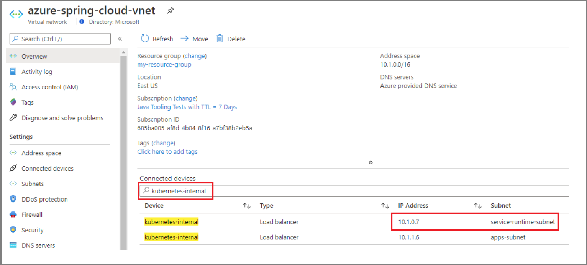
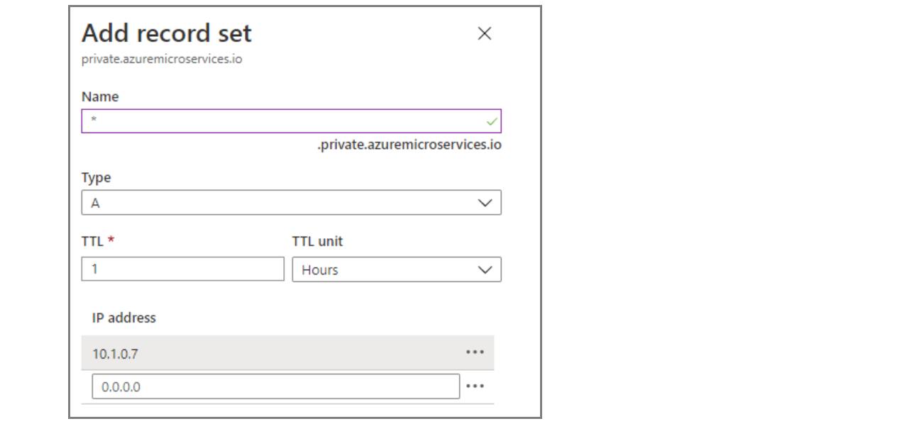
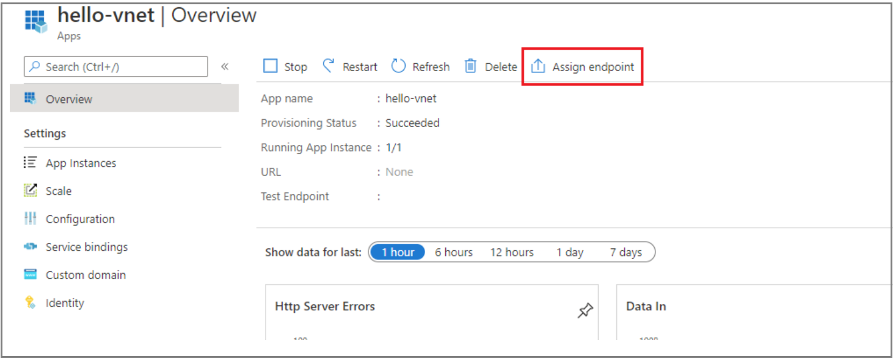
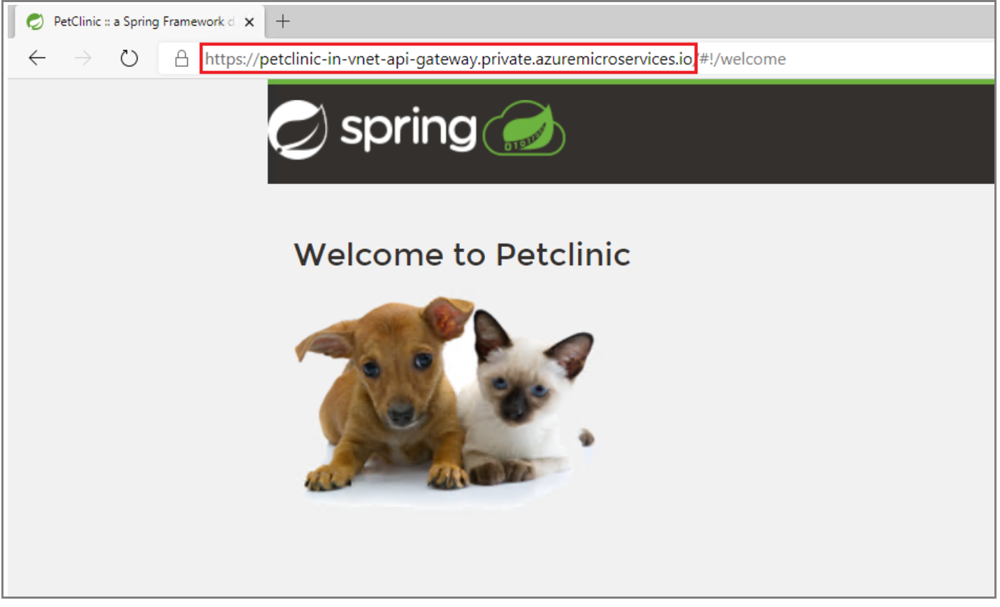

# Access your application in a private network

This document explains how to access an endpoint for your application in a private network.  In order to get access, you need to create an **Azure Private DNS Zone** in your subscription to translate/resolve the private fully qualified domain name (FQDN) to its IP address.

When **Assign Endpoint** for applications in an Azure Spring Cloud service instance is deployed in your virtual network, the endpoint is a private FQDN. The domain is only accessible in the private network. Apps and services use the application endpoint. They include the **Test Endpoint** described in [View apps and deployments](spring-cloud-howto-staging-environment.md#view-apps-and-deployments). **Log streaming**, described in [Stream Azure Spring Cloud app logs in real-time](spring-cloud-howto-log-streaming.md), also works only within the private network.

## Create a private DNS zone

The following procedure creates a private DNS zone for an application in the private network.

1. Open the Azure portal. From the top search box, search for **Private DNS zones**, and select **Private DNS zones** from the result.

2. On the **Private DNS zones** page, select **+ Add**.

3. Fill out the form on the **Create Private DNS zone** page. Enter **<span>private.azuremicroservices.io</span>** as the **Name** of the zone.

4. Select **Review + Create**.

5. Select **Create**.

It may take a few minutes to create the zone.

## Link the virtual network

To link the private DNS zone to the virtual network, you need to create a virtual network link.

1. Select the private DNS zone resource created above: **<span>private.azuremicroservices.io</span>** 

2. On the left pane, select **Virtual network links**.

3. Select **Add**.

4. Enter **azure-spring-cloud-dns-link** for the **Link name**.

5. For **Virtual network**, select the virtual network you created as explained in [Deploy Azure Spring Cloud in your Azure virtual network (VNet injection)](spring-cloud-tutorial-deploy-in-azure-virtual-network.md).

    

6. Click **OK**.

## Create DNS record

To use the private DNS zone to translate/resolve DNS, you must create an "A" type record in the zone.

1. Select the virtual network resource you created as explained in [Deploy Azure Spring Cloud in your Azure virtual network (VNet injection)](spring-cloud-tutorial-deploy-in-azure-virtual-network.md).

2. In the **Connected devices** search box, enter *kubernetes-internal*.

3. In the filtered result, find the **Device** connected to the service runtime **Subnet** of the service instance, and copy its **IP Address**. In this sample, the IP Address is *10.1.0.7*.

    [  ](media/spring-cloud-access-app-vnet/create-dns-record.png)

Or, you can fetch the IP using the following az CLI command:

```azurecli
SPRING_CLOUD_RG= # Resource group name of your Azure Spring Cloud service instance
SPRING_CLOUD= # Name of your Azure Spring Cloud service instance

SERVICE_RUNTIME_RG=`az spring-cloud show -g $SPRING_CLOUD_RG -n $SPRING_CLOUD --query \
"properties.networkProfile.serviceRuntimeNetworkResourceGroup" -o tsv`

IP_ADDRESS=`az network lb frontend-ip list --lb-name kubernetes-internal -g \
$SERVICE_RUNTIME_RG --query "[0].privateIpAddress" -o tsv`
```

4. Select the private DNS zone resource created above: **<span>private.azuremicroservices.io</span>**.

5. Select **+ Record set**.

6. In **Add record set**, enter or select this information:

    |Setting     |Value                                                                      |
    |------------|---------------------------------------------------------------------------|
    |Name        |Enter *\**                                                                 |
    |Type        |Select **A**                                                               |
    |TTL         |Enter *1*                                                                  |
    |TTL unit    |Select **Hours**                                                           |
    |IP address  |Enter the IP address copied in step 3. In the sample, enter *10.1.0.7*.    |

    Then select **OK**.

    

## Assign private FQDN for your application

After following the procedure in [Build and deploy microservice applications](spring-cloud-tutorial-deploy-in-azure-virtual-network.md), you can assign private FQDN for your application.

1. Select the Azure Spring Cloud service instance deployed in your virtual network, and open the **Apps** tab in the menu on the left.

2. Select the application to show the **Overview** page.

3. Select **Assign Endpoint** to assign a private FQDN to your application. This can take a few minutes.

    

4. The assigned private FQDN (labeled **URL**) is now available. It can only be accessed within the private network, but not on Internet.

## Access application private FQDN

After the assignment, you can access the private FQDN of your application in private network. For example, you can create a jumpbox machine in the same virtual network, or a peered virtual network, and on that jumpbox machine the private FQDN is accessible.



## Next steps

- [Expose applications to Internet - using Application Gateway and Azure Firewall](spring-cloud-expose-apps-gateway-azure-firewall.md)

## See also

- [Troubleshooting Azure Spring Cloud in VNET](spring-cloud-troubleshooting-vnet.md)
- [Customer Responsibilities for Running Azure Spring Cloud in VNET](spring-cloud-vnet-customer-responsibilities.md)