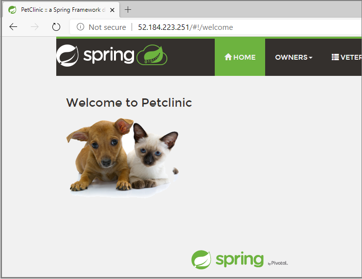

# Expose applications to the Internet using Application Gateway and Azure Firewall

This document explains how to expose applications to the Internet using Application Gateway and Azure Firewall. When an Azure Spring Cloud service instance is deployed in your virtual network, applications on the service instance are only accessible in the private network. To make the applications accessible on the Internet, you need to integrate with **Azure Application Gateway** and, optionally, with **Azure Firewall**.

## Prerequisites

- [Azure CLI version 2.0.4 or later](/cli/azure/install-azure-cli).

## Define variables

Define variables for the resource group and virtual network you created as directed in [Deploy Azure Spring Cloud in Azure virtual network (VNet injection)](spring-cloud-tutorial-deploy-in-azure-virtual-network.md). Customize the values based on your real environment.

```
SUBSCRIPTION='subscription-id'
RESOURCE_GROUP='my-resource-group'
LOCATION='eastus'
SPRING_APP_PRIVATE_FQDN='my-azure-spring-cloud-hello-vnet.private.azuremicroservices.io'
VIRTUAL_NETWORK_NAME='azure-spring-cloud-vnet'
APPLICATION_GATEWAY_SUBNET_NAME='app-gw-subnet'
APPLICATION_GATEWAY_SUBNET_CIDR='10.1.2.0/24'
```

## Login to Azure

Login to the Azure CLI and choose your active subscription.

```
az login
az account set --subscription ${SUBSCRIPTION}
```

## Create network resources

The **Azure Application Gateway** to be created will join the same virtual network as--or peered virtual network to--the Azure Spring Cloud service instance. First create a new subnet for the Application Gateway in the virtual network using `az network vnet subnet create`, and also create a Public IP address as the Frontend of the Application Gateway using `az network public-ip create`.

```
APPLICATION_GATEWAY_PUBLIC_IP_NAME='app-gw-public-ip'
az network vnet subnet create \
    --name ${APPLICATION_GATEWAY_SUBNET_NAME} \
    --resource-group ${RESOURCE_GROUP} \
    --vnet-name ${VIRTUAL_NETWORK_NAME} \
    --address-prefix ${APPLICATION_GATEWAY_SUBNET_CIDR}
az network public-ip create \
    --resource-group ${RESOURCE_GROUP} \
    --location ${LOCATION} \
    --name ${APPLICATION_GATEWAY_PUBLIC_IP_NAME} \
    --allocation-method Static \
    --sku Standard
```

## Create application gateway

Create an application gateway using `az network application-gateway create` and specify your application's private fully qualified domain name (FQDN) as servers in the backend pool. Then update the HTTP setting using `az network application-gateway http-settings update` to use host name from backend pool.

```
APPLICATION_GATEWAY_NAME='my-app-gw'
az network application-gateway create \
    --name ${APPLICATION_GATEWAY_NAME} \
    --resource-group ${RESOURCE_GROUP} \
    --location ${LOCATION} \
    --capacity 2 \
    --sku Standard_v2 \
    --http-settings-cookie-based-affinity Enabled \
    --http-settings-port 443 \
    --http-settings-protocol Https \
    --public-ip-address ${APPLICATION_GATEWAY_PUBLIC_IP_NAME} \
    --vnet-name ${VIRTUAL_NETWORK_NAME} \
    --subnet ${APPLICATION_GATEWAY_SUBNET_NAME} \
    --servers ${SPRING_APP_PRIVATE_FQDN}
az network application-gateway http-settings update \
    --gateway-name ${APPLICATION_GATEWAY_NAME} \
    --resource-group ${RESOURCE_GROUP} \
    --name appGatewayBackendHttpSettings \
    --host-name-from-backend-pool true
```

It can take up to 30 minutes for Azure to create the application gateway. After it's created, check the backend health using `az network application-gateway show-backend-health`.  This examines whether the application gateway reaches your application through its private FQDN.

```
az network application-gateway show-backend-health \
    --name ${APPLICATION_GATEWAY_NAME} \
    --resource-group ${RESOURCE_GROUP}
```

The output indicates the healthy status of backend pool.

```
{
  "backendAddressPools": [
    {
      "backendHttpSettingsCollection": [
        {
          "servers": [
            {
              "address": "my-azure-spring-cloud-hello-vnet.private.azuremicroservices.io",
              "health": "Healthy",
              "healthProbeLog": "Success. Received 200 status code",
              "ipConfiguration": null
            }
          ]
        }
      ]
    }
  ]
}
```

## Access your application using the frontend public IP of the application gateway

Get the public IP address of the application gateway using `az network public-ip show`.

```
az network public-ip show \
    --resource-group ${RESOURCE_GROUP} \
    --name ${APPLICATION_GATEWAY_PUBLIC_IP_NAME} \
    --query [ipAddress] \
    --output tsv
```

Copy and paste the public IP address into the address bar of your browser.

  

## See also

- [Troubleshooting Azure Spring Cloud in VNET](spring-cloud-troubleshooting-vnet.md)
- [Customer Responsibilities for Running Azure Spring Cloud in VNET](spring-cloud-vnet-customer-responsibilities.md)