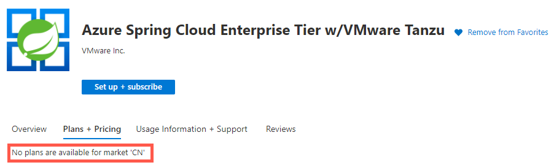

# Azure Spring Cloud FAQ

This article answers frequently asked questions about Azure Spring Cloud.

## General

### Why Azure Spring Cloud?

Azure Spring Cloud provides a platform as a service (PaaS) for Spring Cloud developers. Azure Spring Cloud manages your application infrastructure so that you can focus on application code and business logic. Core features built into Azure Spring Cloud include Eureka, Config Server, Service Registry Server, Pivotal Build Service, Blue-green deployment, and more. This service also enables developers to bind their applications with other Azure services, such as Azure Cosmos DB, Azure Database for MySQL, and Azure Cache for Redis.

Azure Spring Cloud enhances the application diagnostics experience for developers and operators by integrating Azure Monitor, Application Insights, and Log Analytics.

### How secure is Azure Spring Cloud?

Security and privacy are among the top priorities for Azure and Azure Spring Cloud customers. Azure helps ensure that only customers have access to application data, logs, or configurations by securely encrypting all of this data.

* The service instances in Azure Spring Cloud are isolated from each other.
* Azure Spring Cloud provides complete TLS/SSL and certificate management.
* Critical security patches for OpenJDK and Spring Cloud runtimes are applied to Azure Spring Cloud as soon as possible.

### How does Azure Spring Cloud host my applications?

Each service instance in Azure Spring Cloud is backed by a fully dedicated Kubernetes cluster with multiple worker nodes. Azure Spring Cloud manages the underlying Kubernetes cluster for you, including high availability, scalability, Kubernetes version upgrade, and so on.

Azure Spring Cloud intelligently schedules your applications on the underlying Kubernetes worker nodes. To provide high availability, Azure Spring Cloud distributes applications with 2 or more instances on different nodes.

### In which regions is Azure Spring Cloud available?

East US, East US 2, Central US, South Central US, North Central US, West US, West US 2, West Europe, North Europe, UK South, Southeast Asia, Australia East, Canada Central, UAE North, Central India, Korea Central, East Asia, Japan East, South Africa North, Brazil South, France Central, and China East 2(Mooncake). [Learn More](https://azure.microsoft.com/global-infrastructure/services/?products=spring-cloud)

### Is any customer data stored outside of the specified region?

Azure Spring Cloud is a regional service. All customer data in Azure Spring Cloud is stored to a single, specified region. To learn more about geo and region, see [Data residency in Azure](https://azure.microsoft.com/global-infrastructure/data-residency/).

### What are the known limitations of Azure Spring Cloud?

Azure Spring Cloud has the following known limitations:

* `spring.application.name` will be overridden by the application name that's used to create each application.
* `server.port` defaults to port 1025. If any other value is applied, it will be overridden. Please also respect this setting and not specify server port in your code.
* The Azure portal, Azure Resource Manager templates, and Terraform do not support uploading application packages. You can upload application packages by deploying the application using the Azure CLI, Azure DevOps, Maven Plugin for Azure Spring Cloud, Azure Toolkit for IntelliJ, and the Visual Studio Code extension for Azure Spring Cloud.

### What pricing tiers are available?

Which one should I use and what are the limits within each tier?

* Azure Spring Cloud offers two pricing tiers: Basic and Standard. The Basic tier is targeted for Dev/Test and trying out Azure Spring Cloud. The Standard tier is optimized to run general purpose production traffic. See [Azure Spring Cloud pricing details](https://azure.microsoft.com/pricing/details/spring-cloud/) for limits and feature level comparison.

### What's the difference between Service Binding and Service Connector?
We are not actively developing additional capabilities for Service Binding in favor of the new Azure-wise solution named [Service Connector](../service-connector/overview.md). On the one hand, the new solution brings you consistent integration experience across App hosting services on Azure like App Service. On the other hand, it covers your needs better by starting with supporting 10+ most used target Azure services including MySQL, SQL DB, Cosmos DB, Postgres DB, Redis, Storage and more. Service Connector is currently in Public Preview, we invite you to try out the new experience.

### How can I provide feedback and report issues?

If you encounter any issues with Azure Spring Cloud, create an [Azure Support Request](../azure-portal/supportability/how-to-create-azure-support-request.md). To submit a feature request or provide feedback, go to [Azure Feedback](https://feedback.azure.com/d365community/forum/79b1327d-d925-ec11-b6e6-000d3a4f06a4).

## Development

### I am a Spring Cloud developer but new to Azure. What is the quickest way for me to learn how to develop an application in Azure Spring Cloud?

For the quickest way to get started with Azure Spring Cloud, follow the instructions in [Quickstart: Launch an application in Azure Spring Cloud by using the Azure portal](./quickstart.md).

::: zone pivot="programming-language-java"
### What Java runtime does Azure Spring Cloud support?

Azure Spring Cloud supports Java 8 and 11. See [Java runtime and OS versions](#java-runtime-and-os-versions)

### Is Spring Boot 2.4.x supported?
We've identified an issue with Spring Boot 2.4 and are currently working with the Spring community to resolve it. In the meantime, please include these two dependencies to enable TLS authentication between your apps and Eureka.

```xml
<dependency>
    <groupId>com.sun.jersey</groupId>
    <artifactId>jersey-client</artifactId>
    <version>1.19.4</version>
</dependency>
<dependency>
    <groupId>com.sun.jersey.contribs</groupId>
    <artifactId>jersey-apache-client4</artifactId>
    <version>1.19.4</version>
</dependency>
```

::: zone-end

### Where can I view my Spring Cloud application logs and metrics?

Find metrics in the App Overview tab and the [Azure Monitor](../azure-monitor/essentials/data-platform-metrics.md#metrics-explorer) tab.

Azure Spring Cloud supports exporting Spring Cloud application logs and metrics to Azure Storage, Event Hub, and [Log Analytics](../azure-monitor/logs/data-platform-logs.md). The table name in Log Analytics is *AppPlatformLogsforSpring*. To learn how to enable it, see [Diagnostic services](diagnostic-services.md).

### Does Azure Spring Cloud support distributed tracing?

Yes. For more information, see [Tutorial: Use Distributed Tracing with Azure Spring Cloud](./how-to-distributed-tracing.md).

::: zone pivot="programming-language-java"
### What resource types does Service Binding support?

Three services are currently supported:

* Azure Cosmos DB
* Azure Database for MySQL
* Azure Cache for Redis.
::: zone-end

### Can I view, add, or move persistent volumes from inside my applications?

Yes.

### How many outbound public IP addresses does an Azure Spring Cloud instance have?

The number of outbound public IP addresses may vary according to the tiers and other factors.

| Azure Spring Cloud instance type | Default number of outbound public IP addresses |
| -------------------------------- | ---------------------------------------------- |
| Basic Tier instances             | 1                                              |
| Standard Tier instances          | 2                                              |
| VNet injection instances         | 1                                              |

### Can I increase the number of outbound public IP addresses?

Yes, you can open a [support ticket](https://azure.microsoft.com/support/faq/)  to request for more outbound public IP addresses.

### When I delete/move an Azure Spring Cloud service instance, will its extension resources be deleted/moved as well?

It depends on the logic of resource providers that own the extension resources. The extension resources of a `Microsoft.AppPlatform` instance do not belong to the same namespace, so the behavior varies by resource provider. For example, the delete/move operation will not cascade to the **diagnostics settings** resources. If a new Azure Spring Cloud instance is provisioned with the same resource ID as the deleted one, or if the previous Azure Spring Cloud instance is moved back, the previous **diagnostics settings** resources continue extending it.

You can delete Spring Cloud's diagnostic settings by using Azure CLI:

```azurecli
 az monitor diagnostic-settings delete --name $diagnosticSettingName --resource $azureSpringCloudResourceId
```

::: zone pivot="programming-language-java"
## Java runtime and OS versions

### Which versions of Java runtime are supported in Azure Spring Cloud?

Azure Spring Cloud supports Java LTS versions with the most recent builds, currently June 2020, Java 8 and Java 11 are supported. See [Install the JDK for Azure and Azure Stack](/azure/developer/java/fundamentals/java-jdk-install)

### Who built these Java runtimes?

Azul Systems. The Azul Zulu for Azure - Enterprise Edition JDK builds are a no-cost, multi-platform, production-ready distribution of the OpenJDK for Azure and Azure Stack backed by Microsoft and Azul Systems. They contain all the components for building and running Java SE applications.

### How often will Java runtimes get updated?

LTS and MTS JDK releases have quarterly security updates, bug fixes, and critical out-of-band updates and patches as needed. This support includes backports to Java 7 and 8 of security updates and bug fixes reported in newer versions of Java, like Java 11.

### How long will Java 8 and Java 11 LTS versions be supported?

See [Java long-term support for Azure and Azure Stack](/azure/developer/java/fundamentals/java-support-on-azure).

* Java 8 LTS will be supported until December 2030.
* Java 11 LTS will be supported until September 2027.

### How can I download a supported Java runtime for local development?

See [Install the JDK for Azure and Azure Stack](/azure/developer/java/fundamentals/java-jdk-install).

### What is the retire policy for older Java runtimes?

Public notice will be sent out at 12 months before any old runtime version is retired. You will have 12 months to migrate to a later version.

* Subscription admins will get email notification when we will retire a Java version.
* The retire information will be published in the documentation.

### How can I get support for issues at the Java runtime level?

You can open a support ticket with Azure Support.  See [How to create an Azure support request](../azure-portal/supportability/how-to-create-azure-support-request.md).

### What is the operation system to run my apps?

The most recent Ubuntu LTS version is used, currently [Ubuntu 20.04 LTS (Focal Fossa)](https://releases.ubuntu.com/focal/) is the default OS.

### How often are OS security patches applied?

Security patches applicable to Azure Spring Cloud are rolled out to production on a monthly basis.
Critical security patches (CVE score >= 9) applicable to Azure Spring Cloud are rolled out as soon as possible.
::: zone-end

## Deployment

### Does Azure Spring Cloud support blue-green deployment?

Yes. For more information, see [Set up a staging environment](./how-to-staging-environment.md).

### Can I access Kubernetes to manipulate my application containers?

No.  Azure Spring Cloud abstracts the developer from the underlying architecture, allowing you to concentrate on application code and business logic.

### Does Azure Spring Cloud support building containers from source?

Yes. For more information, see [Launch your Spring Cloud application from source code](./quickstart.md).

### Does Azure Spring Cloud support autoscaling in app instances?

Yes. For more information, see [Set up autoscale for microservice applications](./how-to-setup-autoscale.md).

### How does Azure Spring Cloud monitor the health status of my application?

Azure Spring Cloud continuously probes port 1025 for customer's applications. These probes determine whether the application container is ready to start accepting traffic and whether Azure Spring Cloud needs to restart the application container. Internally, Azure Spring Cloud uses Kubernetes liveness and readiness probes to achieve the status monitoring.

>[!NOTE]
> Because of these probes, you currently can't launch applications in Azure Spring Cloud without exposing port 1025.

### Whether and when will my application be restarted?

Yes. For more information, see [Monitor app lifecycle events using Azure Activity log and Azure Service Health](./monitor-app-lifecycle-events.md).

::: zone pivot="programming-language-java"
### What are the best practices for migrating existing Spring Cloud microservices to Azure Spring Cloud?

For more information, see [Migrate Spring Cloud applications to Azure Spring Cloud](/azure/developer/java/migration/migrate-spring-cloud-to-azure-spring-cloud).
::: zone-end

::: zone pivot="programming-language-csharp"
## .NET Core versions

### Which .NET Core versions are supported?

.NET Core 3.1 and later versions.

### How long will .NET Core 3.1 be supported?

Until Dec 3, 2022. See [.NET Core Support Policy](https://dotnet.microsoft.com/platform/support/policy/dotnet-core).
::: zone-end

## Troubleshooting

### What are the impacts of service registry rarely unavailable?

In some rarely happened scenario, you may see some errors like the following one from your application logs:

```output
RetryableEurekaHttpClient: Request execution failure with status code 401; retrying on another server if available
```

This issue is introduced by the Spring framework with very low rate due to network instability or other network issues.

There should be no impacts to user experience, eureka client has both heartbeat and retry policy to take care of this. You could consider it as one transient error and skip it safely.

We will enhance this part and avoid this error from users’ applications in short future.

## Enterprise Tier

### Error 112404: Failed to wait for deplaoyment instance to be ready. Please check the application log (see https://aka.ms/azure-spring-cloud-doc-log) and try again later.

Check for the following error message in the application log.

- For Spring Boot 2.4 and higher versions:

    ```log
    Application failed to start due to an exception
    org.springframework.cloud.commons.ConfigDataMissingEnvironmentPostProcessor$ImportException: No spring.config.import set
    ```

- For Spring Boot 2.3 and earlier versions:

    ```log
    WARN c.c.c.ConfigServicePropertySourceLocator : Could not locate PropertySource: I/O error on GET request for "http://localhost:8888/application/default": Connection refused: connect; nested exception is java.net.ConnectException: Connection refused: connect
    ```

This issue is caused by adding `spring-cloud-starter-config` starter by mistake. To fix the problem, remove the dependency and try again.

### Error 112039: Failed to purchase on Azure Marketplace

Creating an Azure Spring Cloud Enterprise tier instance fails with error code "112039". Check the detailed error message for more information:

- **"Failed to purchase on Azure Marketplace because the Microsoft.SaaS RP is not registered on the Azure subscription."** : Azure Spring Cloud Enterprise tier purchase a SaaS offer from VMWare. 
  
  You must register the Microsoft.SaaS resource provider before creating Azure Spring Cloud Enterprise instance. See how to [register a resource provider](../azure-resource-manager/management/resource-providers-and-types.md#register-resource-provider).

- **"Failed to load catalog product vmware-inc.azure-spring-cloud-vmware-tanzu-2 in the Azure subscription market."**: Your Azure subscription's billing account address is not in the supported location. 

  For more information, see the section [No plans are available for market '\<Location>'](#no-plans-are-available-for-market-location).

- **"Failed to purchase on Azure Marketplace due to signature verification on Marketplace legal agreement. Check the Azure subcription has agree terms vmware-inc.azure-spring-cloud-vmware-tanzu-2.tanzu-asc-ent-mtr"**: Your Azure subscription has not signed the terms for the offer and plan to be purchased. 

  Go to your Azure subscription and run the following Azure CLI command to agree to the terms:
  ```azurecli
  az term accept --publisher vmware-inc --product azure-spring-cloud-vmware-tanzu-2 --plan tanzu-asc-ent-mtr
  ```

  If that doesn't help, you can contact the support team with the following info.

  - `AZURE_TENANT_ID`: the Azure tenant ID that hosts the Azure subscription
  - `AZURE_SUBSCRIPTION_ID`: the Azure subscription ID used to create the Spring Cloud instance
  - `SPRING_CLOUD_NAME`: the failed instance name
  - `ERROR_MESSAGE`: the observed error message

### No plans are available for market '\<Location>'

When you visit the SaaS offer [Azure Spring Cloud Enterprise Tier w/VMware Tanzu](https://aka.ms/ascmpoffer) in the Azure Marketplace, it may say "No plans are available for market '\<Location>'" as in the following image.



Azure Spring Cloud Enterprise tier needs customers to pay for a license to Tanzu components through an Azure Marketplace offer. To purchase in the Azure Marketplace, the billing account's country or region for your Azure subscription should be in the SaaS offer's supported geographic locations.

[Azure Spring Cloud Enterprise Tier w/VMware Tanzu](https://aka.ms/ascmpoffer) now supports all geographic locations that Azure Marketplace supports. See [Marketplace supported geographic location](../marketplace/marketplace-geo-availability-currencies.md#supported-geographic-locations).

You can view the billing account for your subscription if you have admin access. See [view billing accounts](../cost-management-billing/manage/view-all-accounts.md#check-the-type-of-your-account).

Azure Spring Cloud Enterprise tier is free for private preview.

## How can I get Vmware Spring Runtime Support (Enterprise Tier only)?

Enterprise tier has built-in Vmware Spring Runtime Support so you can directly open support tickets to [Vmware](https://via.vmw.com/ascevsrsupport) if you think your issue is in scope of Vmware Spring Runtime Support. For more information, see [https://tanzu.vmware.com/spring-runtime](https://tanzu.vmware.com/spring-runtime) to open tickets to Vmware. For any other issues, directly open support tickets with Microsoft.

## Next steps

If you have further questions, see the [Azure Spring Cloud troubleshooting guide](./troubleshoot.md).