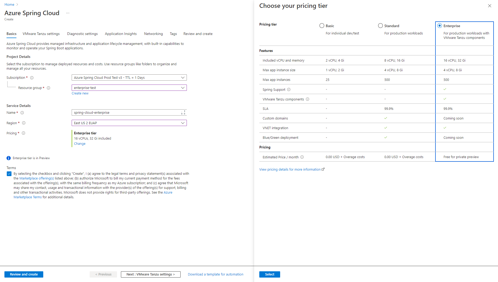
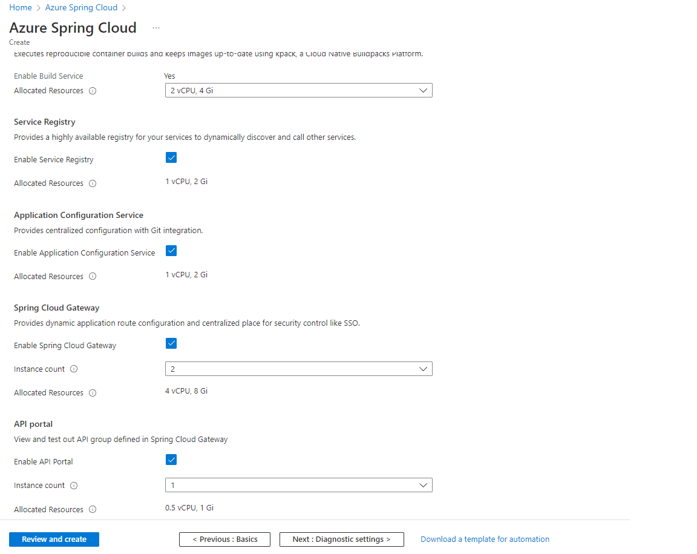
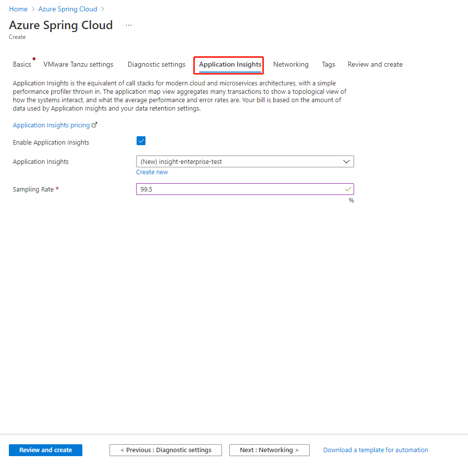
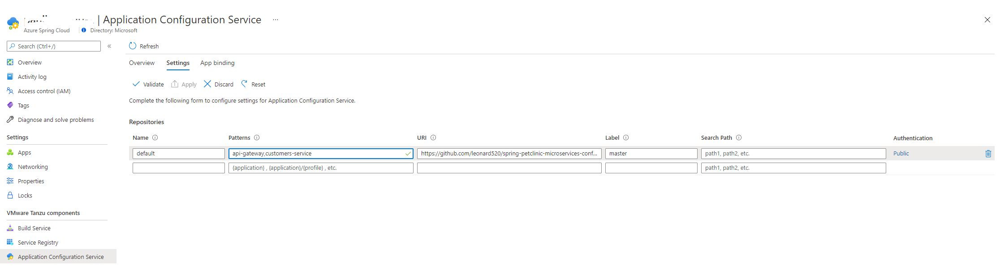
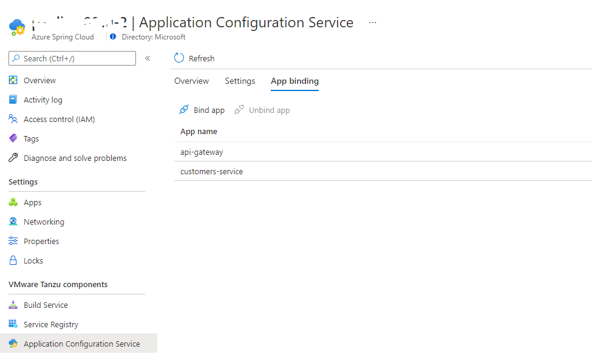
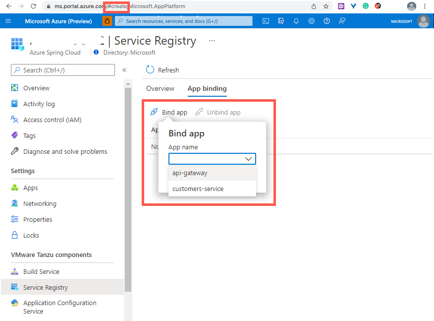
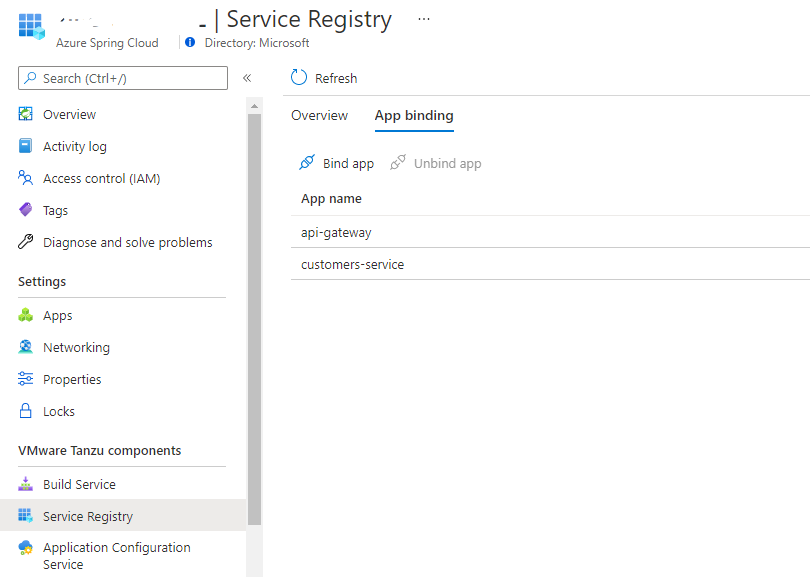
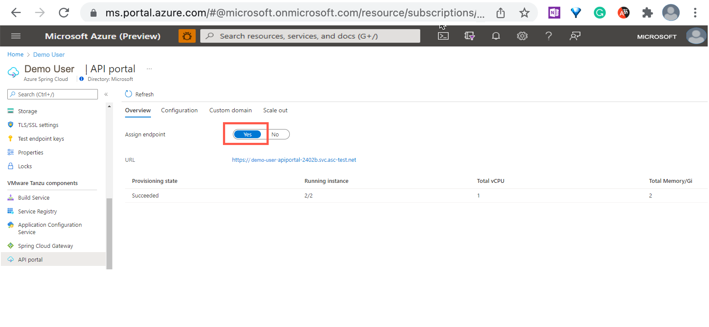
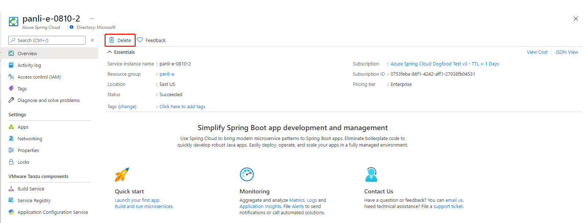

# Get started with Enterprise Tier

This article shows you how to get started with Enterprise Tier in Azure Spring Cloud.

## Prerequisites

- [Sign up for an Azure subscription](https://azure.microsoft.com/)
- Purchase a license for Azure Spring Cloud Enterprise Tier. [View Azure Spring Cloud Enterprise Tier Offer from Azure Marketplace](./how-to-enterprise-marketplace-offer.md)
- [Install the Azure CLI version 2.0.67 or higher](/cli/azure/install-azure-cli)
- Install the preview version of the Azure Spring Cloud extension for Enterprise tier using the steps below.

## Install the preview version of the Azure Spring Cloud Extension for Enterprise Tier

To install the preview version of the Azure Spring Cloud Extension for Enterprise Tier, use the following command:

```azurecli
az extension remove --name spring-cloud
az extension add \
    --source https://ascprivatecli.blob.core.windows.net/enterprise/spring_cloud-2.12.1a1-py3-none-any.whl \
    --yes
```

## Provision a service instance

Use the following steps to provision an Azure Spring Cloud service instance:

1. Open the [Azure portal](https://ms.portal.azure.com/?AppPlatformExtension=entdf#home).

1. In the top search box, search for *Azure Spring Cloud*.

1. Select **Azure Spring Cloud** from the **Services** results.

1. On the **Azure Spring Cloud** page, select **Create**.

1. Go to the Azure Spring Cloud **Create** page. For the **Pricing** option, select **Change** and choose the **Enterprise** tier.

   

   Select the **Terms** checkbox to agree to the legal terms and privacy statements of the Enterprise tier offering in the Azure Marketplace.

1. To configure VMware Tanzu components, select **Next: VMware Tanzu settings** at the bottom right of the page.

   > [!NOTE]
   > All Tanzu components are enabled by default. Please carefully consider which Tanzu components you want to use or enable during the provisioning phase. After provisioning the Azure Spring Cloud instance, you can't enable or disable Tanzu components.

   

1. Select the **Application Insights** section, then select **Enable Application Insights**. You can also enable Application Insights after you provision the Azure Spring Cloud instance.

   - Choose an existing Application Insights instance or create a new Application Insights instance.
   - Give a **Sampling Rate** with in the range of 0-100, or use the default value 10.

   > [!NOTE]
   > You'll pay for the usage of Application Insights when integrated with Azure Spring Cloud. For more information about Application Insights pricing, see [Manage usage and costs for Application Insights](../azure-monitor/app/pricing.md).

   

1. Select **Review and create** at the bottom left of the page. After validation completes successfully, select **Create** to start provisioning the service instance.

It takes about 5 minutes to finish the resource provisioning.

## Create and configure apps

To create apps on Azure Spring Cloud, follow these steps:

1. To set the CLI defaults, use the following commands. Be sure to replace the placeholders with your own values.

   ```azurecli
   az account set --subscription=<subscription_id>
   az configure --defaults group=<resource_group_name> spring-cloud=<service_name>
   ```

1. To create the two core applications for PetClinic, `api-gateway` and `customers-service`, use the following commands:

   ```azurecli
   az spring-cloud app create --name api-gateway --instance-count 1 --memory 2Gi --assign-endpoint
   az spring-cloud app create --name customers-service --instance-count 1 --memory 2Gi
   ```

## Use Application Configuration Service

To use Application Configuration Service, follow these steps.

> [!NOTE]
> To use Application Configuration Service, you must enable it when you provision your Azure Spring Cloud service instance. You cannot enable it after provisioning at this time.

1. Select **Application Configuration Service** to see the **Overview** section. The **Overview** shows the running state and resources allocated to Application Configuration Service.

   

1. Select **Settings** and add a new entry in the **Repositories** section with the following information:

   - Name: `default`
   - Patterns: `api-gateway,customers-service`
   - URI: `https://github.com/Azure-Samples/spring-petclinic-microservices-config`
   - Label: `master`

1. Select **Validate** to validate access to the target URI. After validation completes successfully, select **Apply** to update the configuration settings.

   

1. Select **App binding**, then select **Bind app**. 
1. Choose one app in the dropdown and select **Apply** to bind the application to Application Configuration Service.

   

   A list under **App name** shows the apps bound with Application Configuration Service, as shown in the following screenshot:

   

## Use Service Registry

To use Service Registry, follow these steps.

> [!NOTE]
> To use Service Registry, you must enable it when your Azure Spring Cloud service instance is provisioned. You cannot enable it after provisioning at this time.

1. Select **Service Registry** and view the **Overview** section. **Overview** shows the running state and resources allocated to Service Registry.

1. Select **App binding**, then select select **Bind app**.
1. Choose one app in the dropdown and select **Apply** to bind the application to Service Registry.

   

   A list under **App name** shows the apps bound with Service Registry, as shown in the following screenshot:

   

## Build and deploy applications

The following sections show how to build and deploy applications.

### Build the applications locally

To build locally, use the following steps:

1. Clone the sample app repository to your Azure Cloud account, change the directory, and build the project using the following commands:

   ```bash
   git clone -b enterprise https://github.com/azure-samples/spring-petclinic-microservices
   cd spring-petclinic-microservices
   mvn clean package -DskipTests
   ```

   Compiling the project can take several minutes. Once compilation is complete, you'll have individual JAR files for each service in its respective folder.

1. Deploy the JAR files built in the previous step using the following commands:

   ```azurecli
   az spring-cloud app deploy \
       --name api-gateway \
       --artifact-path spring-petclinic-api-gateway/target/spring-petclinic-api-gateway-2.3.6.jar \
       --config-file-patterns api-gateway
   az spring-cloud app deploy \
       --name customers-service \
       --artifact-path spring-petclinic-customers-service/target/spring-petclinic-customers-service-2.3.6.jar \
       --config-file-patterns customers-service
   ```

1. Query the application status after deployment by using the following command:

   ```azurecli
   az spring-cloud app list --output table
   ```

   This produces output similar to the following example:

   ```output
   Name                  Location    ResourceGroup       Public Url                                                 Production Deployment    Provisioning State    CPU    Memory    Running Instance    Registered Instance    Persistent Storage    Bind Service Registry    Bind Application Configuration Service
   --------------------  ----------  ---------------  ---------------------------------------------------------  -----------------------  --------------------  -----  --------  ------------------  ---------------------  --------------------  -----------------------  ----------------------------------------
   api-gateway           eastus      <resource group>   https://<service_name>-api-gateway.asc-test.net                    default                  Succeeded             1      2Gi       1/1                1/1                    -                     True                     True
   customers-service     eastus      <resource group>                                                                      default                  Succeeded             1      2Gi       1/1                1/1                    -                     True                     True
   ```

### Verify the applications

Access the `application gateway` and `customers service` applications from the browser using the `Public Url` shown above. The Public Url has the format `https://<service_name>-api-gateway.azuremicroservices.io`.


## Use Spring Cloud Gateway

To use Spring Cloud Gateway, follow these steps.

> [!NOTE]
> To use Spring Cloud Gateway, you must enable it when you provision your Azure Spring Cloud service instance. You cannot enable it after provisioning at this time.

### Assign a public endpoint for the gateway

Assign a public endpoint for the gateway to access to it, using the following steps:

1. Open the **Spring Cloud Gateway** section, then select **Overview**. **Overview** shows the running state and resources allocated to Spring Cloud Gateway.

1. Click on **Yes** next to *Assign endpoint* to assign a public endpoint. A URL will be generated for you after a few minutes.


1. Save the URL which will be used later.

### Configure the Spring Cloud Gateway properties

Configure the Spring Cloud Gateway properties using the following command:

```azurecli
az spring-cloud gateway update --api-description "api description" --api-title "api title" --api-version "v0.1" --server-url "<endpoint-in-the-previous-step>" --allowed-origins "*"
```

The Spring Cloud Gateway properties will be used to integrate with the API portal in the [Use the API portal](#use-the-api-portal) section.

### Configure routing rules for the applications

   Create rules to access apps deployed in the above steps through Spring Cloud Gateway.

1. Save the following JSON to the file `customers-service.json`.

  ```json
   [
       {
          "title": "Customers service",
          "description": "Route to customer service",
          "predicates": [
             "Path=/api/customers-service/owners"
          ],
          "filters": [
             "StripPrefix=2"
          ],
          "tags": [
             "pet clinic"
          ]
       }
    ]
```

1. Use the following command to apply the rule to the app `customers-service`

   ```azurecli
   az spring-cloud gateway route-config create -n customers-service-rule --app-name customers-service --routes-file customers-service.json
   ```

1. Access the apps `customers service` and `owners` API through the gateway endpoint.
   ```azurecli
   curl https://<endpoint-url>/api/customers-service/owners
   ```

## Use the API portal

To use API portal, follow these steps to assign a public endpoint to the API portal.

> [!NOTE]
> To use the API portal, you must enable it when you provision your Azure Spring Cloud service instance. You cannot enable the API portal after provisioning, at this time.

1. Select **API portal**, then select **Overview**. **Overview** shows the running state and resources allocated to the API portal.

1. Click on **Yes** next to *Assign endpoint* to assign a public endpoint. A URL will be generated for you after a few minutes.

   

1. Visit the routes information through the API portal.

   > Note: It usually take several minutes to sync between Spring Cloud Gateway and API portal.

   Click on the assigned endpoint URL to go to API portal. You can see all the routes configured in Spring Cloud Gateway.

   

1. Try out APIs through the API portal.

   > Note: Only the `GET` operation is supported in the public preview.

   Select the API you would like to try out, then select `EXECUTE`. The response from the API will be shown.

   

## Real-time app log streaming

Use the following command to get real-time logs from the application.

```azurecli
az spring-cloud app logs \
    --resource-group <resource_group> \
    --service <service_instance_name> \
    --name <app_name> \
    --lines 100 \
    --follow
```

This will return logs similar to the following example:

```output
2021-07-15 01:54:40.481  INFO [auth-service,,,] 1 --- [main] o.apache.catalina.core.StandardService  : Starting service [Tomcat]
2021-07-15 01:54:40.482  INFO [auth-service,,,] 1 --- [main] org.apache.catalina.core.StandardEngine  : Starting Servlet engine: [Apache Tomcat/9.0.22]
2021-07-15 01:54:40.760  INFO [auth-service,,,] 1 --- [main] o.a.c.c.C.[Tomcat].[localhost].[/uaa]  : Initializing Spring embedded WebApplicationContext
2021-07-15 01:54:40.760  INFO [auth-service,,,] 1 --- [main] o.s.web.context.ContextLoader  : Root WebApplicationContext: initialization completed in 7203 ms
```

## Monitor apps with Application Insights

You can configure Application Insights when provisioning Azure Spring Cloud service or after the service is created. For more information, see [How to use Application Insights Java In-Process Agent in Azure Spring Cloud](./how-to-application-insights.md).

## Monitor apps with third-party APMs

For more information on monitoring apps with third-party APMs, see [Buildpack Bindings](./how-to-enterprise-build-service.md#buildpack-bindings)

## Clean up resources

1. Open the [Azure portal](https://ms.portal.azure.com/?AppPlatformExtension=entdf#home), then delete the service instance as in the following screenshot.

   

1. Run the following command to remove the preview version of the Azure CLI extension.

   ```azurecli
   az extension remove --name spring-cloud
   ```

## Next steps

> [!div class="nextstepaction"]
> [Provision Azure Spring Cloud instance](./quickstart-provision-service-instance.md)
