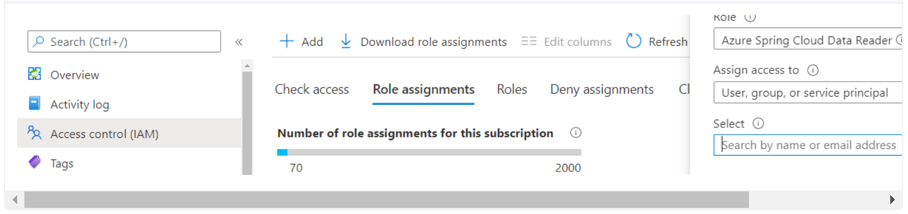

# Access the Config Server and Service Registry Endpoints with Azure Active Directory and Role Based Access Control

This article explains how to access the Spring Cloud Config Server and Spring Cloud Service Registry managed by Azure Spring Cloud using Azure Active Directory (Azure AD) role-based access control (RBAC).

## Assign role to Azure AD user/group, MSI, or service principal

To use Azure AD and RBAC you must assign the *Azure Spring Cloud Data Reader* role to a user, group, or service principal by the following procedure:

1. Go to the service overview page of your service instance.

2. Click **Access Control (IAM)** to open the access control blade.

3. Click the **Add** button and **Add role assignments** (Authorization may be required to add).

4. Find and select *Azure Spring Cloud Data Reader* under **Role**.
5. Assign access to `User, group, or service principal` or `User assigned managed identity` according to the user type. Search for and select user.  
6. Click `Save`

   

## Access Config Server and Service Registry Endpoints

After an Azure AD user is assigned the *Azure Spring Cloud Data Reader* role, customers can log in to Azure CLI with user, service principal, or managed identity.  Use the following procedure:

1. Get an access token. After an Azure AD user is assigned the Azure Spring Cloud Data Reader role, customers can use the following commands to log in to Azure CLI with user, service principal, or managed identity to get an access token. For details, see [Authenticate Azure CLI](https://docs.microsoft.com/cli/azure/authenticate-azure-cli). 

```azurecli
az login
az account get-access-token
```
2. Compose the endpoint. We support default endpoints of the Spring Cloud Config Server and Spring Cloud Service Registry managed by Azure Spring Cloud. For more information, see [Production ready endpoints](https://docs.spring.io/spring-boot/docs/current/reference/htmlsingle/#production-ready-endpoints). Customers can also get a full list of supported endpoints of the Spring Cloud Config Server and Spring Cloud Service Registry managed by Azure Spring Cloud by accessing endpoints:

* *https://SERVICE_NAME.svc.azuremicroservices.io/eureka/actuator/*
* *https://SERVICE_NAME.svc.azuremicroservices.io/config/actuator/* 

3. Access the composed endpoint with the access token. Put the access token in a header to provide authorization.  Only the "GET" method is supported.

For example, access an endpoint like *https://SERVICE_NAME.Root_Endpoint/eureka/actuator/health* to see the health status of eureka.

If the response is *401 Unauthorized*, check to see if the role is successfully assigned.  It will take several minutes for the role take effect or verify that the access token has not expired.

## Next steps
* [Authenticate Azure CLI](https://docs.microsoft.com/cli/azure/authenticate-azure-cli)
* [Production ready endpoints](https://docs.spring.io/spring-boot/docs/current/reference/htmlsingle/#production-ready-endpoints)

## See also
* [Create roles and permissions](howto-permissions.md)