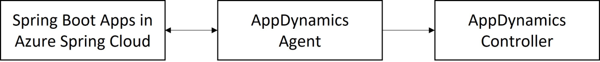

# How to monitor Spring Boot apps with the AppDynamics Java Agent (Preview)

**This article applies to:** ✔️ Basic/Standard tier ✔️ Enterprise tier

This article explains how to use the AppDynamics Java Agent to monitor Spring Boot applications in Azure Spring Cloud.

With the AppDynamics Java Agent, you can:

- Monitor applications
- Configure the AppDynamics Java Agent using environment variables
- Check all monitoring data from the AppDynamics dashboard

The following video introduces the AppDynamics Java in-process agent.

<br>

> [!VIDEO https://www.youtube.com/embed/4dZuRX5bNAs]

## Prerequisites

* [Azure CLI](/cli/azure/install-azure-cli)
* [An AppDynamics account](https://www.appdynamics.com/)

## Activate the AppDynamics Java in-process agent

For the whole workflow, you need to:

* Activate the AppDynamics Java in-process agent in Azure Spring Cloud to generate application metrics data.
* Connect the AppDynamics Agent to the AppDynamics Controller to collect and visualize the data in the controller.



### Activate an application with the AppDynamics Agent using the Azure CLI

To activate an application through the Azure CLI, use the following steps.

1. Create a resource group.
1. Create an instance of Azure Spring Cloud.
1. Create an application using the following command. Replace the placeholders *\<...>* with your own values.

    ```azurecli
    az spring-cloud app create \
        --resource-group "<your-resource-group-name>" \
        --service "<your-Azure-Spring-Cloud-instance-name>" \
        --name "<your-app-name>" \
        --is-public true
    ```

1. Create a deployment with the AppDynamics Agent using environment variables.

    ```azurecli
    az spring-cloud app deploy \
        --resource-group "<your-resource-group-name>" \
        --service "<your-Azure-Spring-Cloud-instance-name>" \
        --name "<your-app-name>" \
        --jar-path app.jar \
        --jvm-options="-javaagent:/opt/agents/appdynamics/java/javaagent.jar" \
        --env APPDYNAMICS_AGENT_APPLICATION_NAME=<your-app-name> \
              APPDYNAMICS_AGENT_ACCOUNT_ACCESS_KEY=<your-agent-access-key> \
              APPDYNAMICS_AGENT_ACCOUNT_NAME=<your-agent-account-name> \
              APPDYNAMICS_JAVA_AGENT_REUSE_NODE_NAME=true \
              APPDYNAMICS_JAVA_AGENT_REUSE_NODE_NAME_PREFIX=<your-agent-node-name> \
              APPDYNAMICS_AGENT_TIER_NAME=<your-agent-tier-name> \
              APPDYNAMICS_CONTROLLER_HOST_NAME=<your-AppDynamics-controller-host-name> \
              APPDYNAMICS_CONTROLLER_SSL_ENABLED=true \
              APPDYNAMICS_CONTROLLER_PORT=443
    ```

Azure Spring Cloud pre-installs the AppDynamics Java agent to the path */opt/agents/appdynamics/java/javaagent.jar*. You can activate the agent from your applications' JVM options, then configure the agent using environment variables. You can find values for these variables at [Monitor Azure Spring Cloud with Java Agent](https://docs.appdynamics.com/21.11/en/application-monitoring/install-app-server-agents/java-agent/monitor-azure-spring-cloud-with-java-agent). For more information about how these variables help to view and organize reports in the AppDynamics UI, see [Tiers and Nodes](https://docs.appdynamics.com/21.9/en/application-monitoring/tiers-and-nodes).

### Activate an application with the AppDynamics Agent using the Azure portal

To activate an application through the Azure portal, use the following steps.

1. Navigate to your Azure Spring Cloud instance in the Azure portal.

1. Select **Apps** from the **Settings** section of the left navigation pane.

   :::image type="content" source="media/how-to-appdynamics-java-agent-monitor/azure-spring-cloud-app-list.png" alt-text="Screenshot of Azure portal showing the Apps section." lightbox="media/how-to-appdynamics-java-agent-monitor/azure-spring-cloud-app-list.png":::

1. Select the application to navigate to the **Overview** page.

   :::image type="content" source="media/how-to-appdynamics-java-agent-monitor/azure-spring-cloud-app-overview.png" alt-text="Screenshot of Azure portal app overview page." lightbox="media/how-to-appdynamics-java-agent-monitor/azure-spring-cloud-app-overview.png":::

1. Select **Configuration** in the left navigation pane to add, update, or delete the environment variables of the application.

   :::image type="content" source="media/how-to-appdynamics-java-agent-monitor/azure-spring-cloud-app-configuration-env.png" alt-text="Screenshot of Azure portal showing the 'Environment variables' section of the app's Configuration page." lightbox="media/how-to-appdynamics-java-agent-monitor/azure-spring-cloud-app-configuration-env.png":::

1. Select **General settings** to add, update, or delete the JVM options of the application.

   :::image type="content" source="media/how-to-appdynamics-java-agent-monitor/azure-spring-cloud-app-configuration-general.png" alt-text="Screenshot of Azure portal showing the 'General settings' section of the app's Configuration page, with 'J V M options' highlighted." lightbox="media/how-to-appdynamics-java-agent-monitor/azure-spring-cloud-app-configuration-general.png":::

## Automate provisioning

You can also run a provisioning automation pipeline using Terraform or an Azure Resource Manager template (ARM template). This pipeline can provide a complete hands-off experience to instrument and monitor any new applications that you create and deploy.

### Automate provisioning using Terraform

To configure the environment variables in a Terraform template, add the following code to the template, replacing the *\<...>* placeholders with your own values. For more information, see [Manages an Active Azure Spring Cloud Deployment](https://registry.terraform.io/providers/hashicorp/azurerm/latest/docs/resources/spring_cloud_active_deployment).

```terraform
resource "azurerm_spring_cloud_java_deployment" "example" {
  ...
  jvm_options = "-javaagent:/opt/agents/appdynamics/java/javaagent.jar"
  ...
    environment_variables = {
      "APPDYNAMICS_AGENT_APPLICATION_NAME" : "<your-app-name>",
      "APPDYNAMICS_AGENT_ACCOUNT_ACCESS_KEY" : "<your-agent-access-key>",
      "APPDYNAMICS_AGENT_ACCOUNT_NAME" : "<your-agent-account-name>",
      "APPDYNAMICS_JAVA_AGENT_REUSE_NODE_NAME" : "true",
      "APPDYNAMICS_JAVA_AGENT_REUSE_NODE_NAME_PREFIX" : "<your-agent-node-name>",
      "APPDYNAMICS_AGENT_TIER_NAME" : "<your-agent-tier-name>",
      "APPDYNAMICS_CONTROLLER_HOST_NAME" : "<your-AppDynamics-controller-host-name>",
      "APPDYNAMICS_CONTROLLER_SSL_ENABLED" : "true",
      "APPDYNAMICS_CONTROLLER_PORT" : "443"
  }
}
```

### Automate provisioning using an ARM template

To configure the environment variables in an ARM template, add the following code to the template, replacing the *\<...>* placeholders with your own values. For more information, see [Microsoft.AppPlatform Spring/apps/deployments](/azure/templates/microsoft.appplatform/spring/apps/deployments?tabs=json).

```ARM template
"deploymentSettings": {
  "environmentVariables": {
    "APPDYNAMICS_AGENT_APPLICATION_NAME" : "<your-app-name>",
    "APPDYNAMICS_AGENT_ACCOUNT_ACCESS_KEY" : "<your-agent-access-key>",
    "APPDYNAMICS_AGENT_ACCOUNT_NAME" : "<your-agent-account-name>",
    "APPDYNAMICS_JAVA_AGENT_REUSE_NODE_NAME" : "true",
    "APPDYNAMICS_JAVA_AGENT_REUSE_NODE_NAME_PREFIX" : "<your-agent-node-name>",
    "APPDYNAMICS_AGENT_TIER_NAME" : "<your-agent-tier-name>",
    "APPDYNAMICS_CONTROLLER_HOST_NAME" : "<your-AppDynamics-controller-host-name>",
    "APPDYNAMICS_CONTROLLER_SSL_ENABLED" : "true",
    "APPDYNAMICS_CONTROLLER_PORT" : "443"
  },
  "jvmOptions": "-javaagent:/opt/agents/appdynamics/java/javaagent.jar",
  ...
}
```

## Review reports in the AppDynamics dashboard

This section shows various reports in AppDynamics.

The following screenshot shows an overview of your apps in the AppDynamics dashboard:

:::image type="content" source="media/how-to-appdynamics-java-agent-monitor/appdynamics-dashboard-birds-eye-view-of-apps.jpg" alt-text="AppDynamics screenshot showing the Applications page." lightbox="media/how-to-appdynamics-java-agent-monitor/appdynamics-dashboard-birds-eye-view-of-apps.jpg":::

The **Application Dashboard** shows the overall information for each of your apps, as shown in the following screenshots using example applications:

- `api-gateway`

   :::image type="content" source="media/how-to-appdynamics-java-agent-monitor/appdynamics-dashboard-api-gateway.jpg" alt-text="AppDynamics screenshot showing the Application Dashboard for the example api-gateway app." lightbox="media/how-to-appdynamics-java-agent-monitor/appdynamics-dashboard-api-gateway.jpg":::

- `customers-service`

   :::image type="content" source="media/how-to-appdynamics-java-agent-monitor/appdynamics-dashboard-customers-service.jpg" alt-text="AppDynamics screenshot showing the Application Dashboard for the example customers-service app." lightbox="media/how-to-appdynamics-java-agent-monitor/appdynamics-dashboard-customers-service.jpg":::

The following screenshot shows how you can get basic information from the **Database Calls** dashboard.

:::image type="content" source="media/how-to-appdynamics-java-agent-monitor/appdynamics-dashboard-customer-service-db-calls.jpg" alt-text="AppDynamics screenshot showing the Database Calls dashboard." lightbox="media/how-to-appdynamics-java-agent-monitor/appdynamics-dashboard-customer-service-db-calls.jpg":::

You can also get information about the slowest database calls, as shown in these screenshots:

:::image type="content" source="media/how-to-appdynamics-java-agent-monitor/appdynamics-dashboard-slowest-db-calls-from-customers-service.jpg" alt-text="AppDynamics screenshot showing the Slowest Database Calls page." lightbox="media/how-to-appdynamics-java-agent-monitor/appdynamics-dashboard-slowest-db-calls-from-customers-service.jpg":::

:::image type="content" source="media/how-to-appdynamics-java-agent-monitor/appdynamics-dashboard-slowest-db-calls-from-customers-service-2.jpg" alt-text="AppDynamics screenshot showing the Correlated Snapshots page accessed from the Slowest Database Calls page." lightbox="media/how-to-appdynamics-java-agent-monitor/appdynamics-dashboard-slowest-db-calls-from-customers-service-2.jpg":::

The following screenshot shows memory usage analysis in the **Heap** section of the **Memory** page:

:::image type="content" source="media/how-to-appdynamics-java-agent-monitor/appdynamics-dashboard-customers-service-memory-usage.jpg" alt-text="AppDynamics screenshot showing the Heap section of the Memory page." lightbox="media/how-to-appdynamics-java-agent-monitor/appdynamics-dashboard-customers-service-memory-usage.jpg":::

You can also see the garbage collection process, as shown in this screenshot:

:::image type="content" source="media/how-to-appdynamics-java-agent-monitor/appdynamics-dashboard-customers-service-garbage-collection.jpg" alt-text="AppDynamics screenshot showing the Garbage Collection section of the Memory page." lightbox="media/how-to-appdynamics-java-agent-monitor/appdynamics-dashboard-customers-service-garbage-collection.jpg":::

The following screenshot shows the **Slow Transactions** page: 

:::image type="content" source="media/how-to-appdynamics-java-agent-monitor/appdynamics-dashboard-customers-service-slowest-transactions.jpg" alt-text="AppDynamics screenshot showing the Slow Transactions page." lightbox="media/how-to-appdynamics-java-agent-monitor/appdynamics-dashboard-customers-service-slowest-transactions.jpg":::

You can define more metrics for the JVM, as shown in this screenshot of the **Metric Browser**:

:::image type="content" source="media/how-to-appdynamics-java-agent-monitor/appdynamics-dashboard-customers-service-jvm-metric-browser.jpg" alt-text="AppDynamics screenshot showing the Metric Browser." lightbox="media/how-to-appdynamics-java-agent-monitor/appdynamics-dashboard-customers-service-jvm-metric-browser.jpg":::

## View AppDynamics Agent logs

By default, Azure Spring Cloud will print the *info* level logs of the AppDynamics Agent to `STDOUT`. The logs will be mixed with the application logs. You can find the explicit agent version from the application logs.

You can also get the logs of the AppDynamics Agent from the following locations:

* Azure Spring Cloud logs
* Azure Spring Cloud Application Insights
* Azure Spring Cloud LogStream

## Learn about AppDynamics Agent upgrade

The AppDynamics Agent will be upgraded regularly with JDK (quarterly). Agent upgrade may affect the following scenarios:

* Existing applications using AppDynamics Agent before upgrade will be unchanged, but will require restart or redeploy to engage the new version of AppDynamics Agent.
* Applications created after upgrade will use the new version of AppDynamics Agent.

## Configure VNet injection instance outbound traffic

For VNet injection instances of Azure Spring Cloud, make sure the outbound traffic is configured correctly for AppDynamics Agent. For details, see [SaaS Domains and IP Ranges](https://docs.appdynamics.com/display/PAA/SaaS+Domains+and+IP+Ranges) and [Customer responsibilities for running Azure Spring Cloud in VNET](vnet-customer-responsibilities.md).

## Understand the limitations

To understand the limitations of the AppDynamics Agent, see [Monitor Azure Spring Cloud with Java Agent](https://docs.appdynamics.com/21.11/en/application-monitoring/install-app-server-agents/java-agent/monitor-azure-spring-cloud-with-java-agent).

## Next steps

* [Use Application Insights Java In-Process Agent in Azure Spring Cloud](./how-to-application-insights.md)
