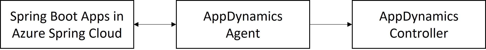

# How to monitor Azure Spring Cloud applications with AppDynamics Java agent (Preview)

This feature enables monitoring of Azure Spring Cloud apps with the AppDynamics Java agent.

With the AppDynamics Java agent, you can:

- Monitor apps with the AppDynamics Java agent.
- Configure the AppDynamics Java agent using Environment Variables.
- Check all monitoring data from the AppDynamics dashboard.

The following video introduces AppDynamics Java In-Process Agent.

<br>

> [!VIDEO https://www.youtube.com/embed/8o-xNoqUFsQ]

## Prerequisites

To monitor your Spring Cloud workloads with AppDynamics, you **must** activate Agent with your Azure Spring Cloud application. You will need the following to use these features:

* AppDynamics account.
* [Install the Azure CLI](/cli/azure/install-azure-cli).

## Activate AppDynamics Java In-Process Agent



For the whole workflow, you need to:

* Activate AppDynamics Java In-Process in Agent Azure Spring Cloud in order to generate application metrics data.
* Connect the AppDynamics Agent to the AppDynamics Controller to collect and visualize the data in controller.

### Prepare variables to connect the AppDynamics Agent to Controller

In order to connect the AppDynamics Java In-Process Agent to AppDynamics Controller, you need following required variables:
`APPDYNAMICS_AGENT_ACCOUNT_ACCESS_KEY`, `APPDYNAMICS_AGENT_ACCOUNT_NAME` and `APPDYNAMICS_CONTROLLER_HOST_NAME`. To get their values, see [Monitor Azure Spring Cloud with Java Agent](https://docs.appdynamics.com/21.9/en/application-monitoring/install-app-server-agents/java-agent/install-the-java-agent/monitor-azure-spring-cloud-with-java-agent).

### Activate application with AppDynamics Agent by Azure CLI

1. Create a resource group.
2. Create an instance of Azure Spring Cloud.
3. Create an application.

    ```azurecli
    az spring-cloud app create \
        --resource-group "<your-resource-group-name>" \
        --service "<your-Azure-Spring-Cloud-instance-name>" \
        --name "<your-app-name>" \
        --is-public true
    ```

4. Create a deployment with the AppDynamics agent and **Environment Variables**.

    ```azurecli
    az spring-cloud app deploy \
        --resource-group "<your-resource-group-name>" \
        --service "<your-Azure-Spring-Cloud-instance-name>" \
        --name "<your-app-name>" \
        --jar-path app.jar \
        --jvm-options="-javaagent:/opt/agents/appdynamics/java/javaagent.jar" \
        --env APPDYNAMICS_AGENT_APPLICATION_NAME=<your-app-name> \
              APPDYNAMICS_AGENT_ACCOUNT_ACCESS_KEY=<your-agent-access-key> \
              APPDYNAMICS_AGENT_ACCOUNT_NAME=<your-agent-account-name> \
              APPDYNAMICS_AGENT_NODE_NAME=<your-agent-node-name> \
              APPDYNAMICS_AGENT_TIER_NAME=<your-agent-tier-name> \
              APPDYNAMICS_CONTROLLER_HOST_NAME=<your-AppDynamics-controller-host-name> \
              APPDYNAMICS_CONTROLLER_SSL_ENABLED=true \
              APPDYNAMICS_CONTROLLER_PORT=443
    ```

Azure Spring Cloud pre-installs the AppDynamics Java agent to the path `/opt/agents/appdynamics/java/javaagent.jar`. Customers can activate the agent from applications' **Jvm Options**, and then configure the agent using the environment variables. Again you can find those variables in [Monitor Azure Spring Cloud with Java Agent](https://docs.appdynamics.com/21.9/en/application-monitoring/install-app-server-agents/java-agent/install-the-java-agent/monitor-azure-spring-cloud-with-java-agent). Refer to [Tiers and Nodes](https://docs.appdynamics.com/21.9/en/application-monitoring/tiers-and-nodes) to find how they help to view and organize reports in AppDynamics UI.

### Activate application with AppDynamics Agent by Azure portal

1. Find the application from **Settings**/**Apps** in the navigation pane.

   :::image type="content" source="media/how-to-appdynamics-java-agent-monitor/azure_spring_cloud-app_list.png" alt-text="Azure portal screenshot showing the Apps section" lightbox="media/how-to-appdynamics-java-agent-monitor/azure_spring_cloud-app_list.png":::

2. Select the application to jump to the **Overview** page.

   :::image type="content" source="media/how-to-appdynamics-java-agent-monitor/azure_spring_cloud-app-overview.png" alt-text="Azure portal screenshot the app's Overview page" lightbox="media/how-to-appdynamics-java-agent-monitor/azure_spring_cloud-app-overview.png":::

3. Select **Configuration** in the left navigation pane to add/update/delete the **Environment Variables** of the application.

   :::image type="content" source="media/how-to-appdynamics-java-agent-monitor/azure_spring_cloud-app-configuration-env.png" alt-text="Azure portal screenshot showing the 'Environment variables' section of the app's Configuration page " lightbox="media/how-to-appdynamics-java-agent-monitor/azure_spring_cloud-app-configuration-env.png":::

4. Select **General settings** to add/update/delete the **JVM Option** of the application.

   :::image type="content" source="media/how-to-appdynamics-java-agent-monitor/azure_spring_cloud-app-configuration-general.png" alt-text="Azure portal screenshot showing the 'General settings' section of the app's Configuration page, with 'JVM options' highlighted" lightbox="media/how-to-appdynamics-java-agent-monitor/azure_spring_cloud-app-configuration-general.png":::

## Automation

Using Terraform or an Azure Resource Manager template (ARM template), you can also run a provisioning automation pipeline. This pipeline can provide a complete hands-off experience to instrument and monitor any new applications that you create and deploy.

### Terraform

To configure the environment variables in a Terraform template, add the following code to the template, replacing the *\<...>* placeholders with your own values. For more information, see [Manages an Active Azure Spring Cloud Deployment](https://registry.terraform.io/providers/hashicorp/azurerm/latest/docs/resources/spring_cloud_active_deployment).

```terraform
resource "azurerm_spring_cloud_java_deployment" "example" {
  ...
  jvm_options = "-javaagent:/opt/agents/appdynamics/java/javaagent.jar"
  ...
    environment_variables = {
      "APPDYNAMICS_AGENT_APPLICATION_NAME" : "<your-app-name>",
      "APPDYNAMICS_AGENT_ACCOUNT_ACCESS_KEY" : "<your-agent-access-key>",
      "APPDYNAMICS_AGENT_ACCOUNT_NAME" : "<your-agent-account-name>",
      "APPDYNAMICS_AGENT_NODE_NAME" : "<your-agent-node-name>",
      "APPDYNAMICS_AGENT_TIER_NAME" : "<your-agent-tier-name>",
      "APPDYNAMICS_CONTROLLER_HOST_NAME" : "<your-AppDynamics-controller-host-name>",
      "APPDYNAMICS_CONTROLLER_SSL_ENABLED" : "true",
      "APPDYNAMICS_CONTROLLER_PORT" : "443"
  }
}
```

### ARM template

To configure the environment variables in an ARM template, add the following code to the template, replacing the *\<...>* placeholders with your own values. For more information, see [Microsoft.AppPlatform Spring/apps/deployments](/azure/templates/microsoft.appplatform/spring/apps/deployments?tabs=json).

```ARM template
"deploymentSettings": {
  "environmentVariables": {
    "APPDYNAMICS_AGENT_APPLICATION_NAME" : "<your-app-name>",
    "APPDYNAMICS_AGENT_ACCOUNT_ACCESS_KEY" : "<your-agent-access-key>",
    "APPDYNAMICS_AGENT_ACCOUNT_NAME" : "<your-agent-account-name>",
    "APPDYNAMICS_AGENT_NODE_NAME" : "<your-agent-node-name>",
    "APPDYNAMICS_AGENT_TIER_NAME" : "<your-agent-tier-name>",
    "APPDYNAMICS_CONTROLLER_HOST_NAME" : "<your-AppDynamics-controller-host-name>",
    "APPDYNAMICS_CONTROLLER_SSL_ENABLED" : "true",
    "APPDYNAMICS_CONTROLLER_PORT" : "443"
  },
  "jvmOptions": "-javaagent:/opt/agents/appdynamics/java/javaagent.jar",
  ...
}
```

## Review reports in AppDynamics Dashboard

1. You can take an overview of your apps in the AppDynamics dashboard

   :::image type="content" source="media/how-to-appdynamics-java-agent-monitor/appdynamics-dashboard-birds-eye-view-of-apps.jpg" alt-text="AppDynamics screenshot showing the Applications page" lightbox="media/how-to-appdynamics-java-agent-monitor/appdynamics-dashboard-birds-eye-view-of-apps.jpg":::

2. You can find the overall information for your apps

   - `api-gateway`

      :::image type="content" source="media/how-to-appdynamics-java-agent-monitor/appdynamics-dashboard-api-gateway.jpg" alt-text="AppDynamics screenshot showing the Application Dashboard for the example api-gateway app" lightbox="media/how-to-appdynamics-java-agent-monitor/appdynamics-dashboard-api-gateway.jpg":::

   - `customers-service`

      :::image type="content" source="media/how-to-appdynamics-java-agent-monitor/appdynamics-dashboard-customers-service.jpg" alt-text="AppDynamics screenshot showing the Application Dashboard for the example customers-service app" lightbox="media/how-to-appdynamics-java-agent-monitor/appdynamics-dashboard-customers-service.jpg":::

3. You can find the basic information for database calls

   :::image type="content" source="media/how-to-appdynamics-java-agent-monitor/appdynamics-dashboard-customer-service-db-calls.jpg" alt-text="AppDynamics screenshot showing the Database Calls dashboard" lightbox="media/how-to-appdynamics-java-agent-monitor/appdynamics-dashboard-customer-service-db-calls.jpg":::

4. You can dig deeper to find slowest database calls

   :::image type="content" source="media/how-to-appdynamics-java-agent-monitor/appdynamics-dashboard-slowest-db-calls-from-customers-service.jpg" alt-text="AppDynamics screenshot showing the Slowest Database Calls page" lightbox="media/how-to-appdynamics-java-agent-monitor/appdynamics-dashboard-slowest-db-calls-from-customers-service.jpg":::

   :::image type="content" source="media/how-to-appdynamics-java-agent-monitor/appdynamics-dashboard-slowest-db-calls-from-customers-service-2.jpg" alt-text="AppDynamics screenshot showing the Correlated Snapshots page accessed from the Slowest Database Calls page" lightbox="media/how-to-appdynamics-java-agent-monitor/appdynamics-dashboard-slowest-db-calls-from-customers-service-2.jpg":::

5. You can find the memory usage analysis

   :::image type="content" source="media/how-to-appdynamics-java-agent-monitor/appdynamics-dashboard-customers-service-memory-usage.jpg" alt-text="AppDynamics screenshot showing the Heap section of the Memory page" lightbox="media/how-to-appdynamics-java-agent-monitor/appdynamics-dashboard-customers-service-memory-usage.jpg":::

6. You can find the garbage collection process

   :::image type="content" source="media/how-to-appdynamics-java-agent-monitor/appdynamics-dashboard-customers-service-garbage-collection.jpg" alt-text="AppDynamics screenshot showing the Garbage Collection section of the Memory page" lightbox="media/how-to-appdynamics-java-agent-monitor/appdynamics-dashboard-customers-service-garbage-collection.jpg":::

7. You can find slowest transactions 

   :::image type="content" source="media/how-to-appdynamics-java-agent-monitor/appdynamics-dashboard-customers-service-slowest-transactions.jpg" alt-text="AppDynamics screenshot showing the Slow Transactions page" lightbox="media/how-to-appdynamics-java-agent-monitor/appdynamics-dashboard-customers-service-slowest-transactions.jpg":::

8. You can define more metrics for JVM

   :::image type="content" source="media/how-to-appdynamics-java-agent-monitor/appdynamics-dashboard-customers-service-jvm-metric-browser.jpg" alt-text="AppDynamics screenshot showing the Metric Browser" lightbox="media/how-to-appdynamics-java-agent-monitor/appdynamics-dashboard-customers-service-jvm-metric-browser.jpg":::

## AppDynamics Agent Logging

By default, Azure Spring Cloud will print the **info** level logs of the AppDynamics Agent to `STDOUT`. The logs will be mixed with the application logs. You can find the explicit agent version from the application logs.

There are several ways to get the logs of AppDynamics Agent:

* Azure Spring Cloud Logs.
* Azure Spring Cloud Application Insights.
* Azure Spring Cloud LogStream.

## AppDynamics Agent upgrade

The AppDynamics Agent will be upgraded regularly with JDK (quarterly). Agent upgrade may affect the following scenarios:

* Existing applications using AppDynamics Agent before upgrade will be unchanged, but will require restart or redeploy to engage the new version of AppDynamics Agent.
* Applications created after upgrade will use the new version of AppDynamics Agent.

## Vnet Injection Instance Outbound Traffic Configuration

For vnet injection instances of Azure Spring Cloud, you need to make sure the outbound traffic is configured correctly for AppDynamics Agent. Refer to [SaaS Domains and IP Ranges](https://docs.appdynamics.com/display/PAA/SaaS+Domains+and+IP+Ranges) and [Customer responsibilities for running Azure Spring Cloud in VNET](vnet-customer-responsibilities.md) for details.

## Limitations

Refer to [Limitations when Monitor Azure Spring Cloud with AppDynamics Java In-Process Agent (**not ready yet**)]()

## Next steps

* [Use distributed tracing with Azure Spring Cloud](how-to-distributed-tracing.md)
