# Application Insights Java In-Process Agent in Azure Spring Cloud

This article explains how to monitor applications by using the Application Insights Java agent in Azure Spring Cloud.

With this feature you can:

* Search tracing data with different filters.
* View a dependency map of microservices.
* Check request performance.
* Monitor real-time live metrics.
* Check request failures.
* Check application metrics.
* Check application logs.

Application Insights can provide many observable perspectives, including:

* Application map
* Performance
* Failures
* Metrics
* Live Metrics
* Availability
* Logs


::: zone pivot="sc-enterprise-tier"

## Using the Application Insights feature

When the **Application Insights** feature is enabled, select the **Overview** page of Application Insights to:

* See an overview of all apps.

   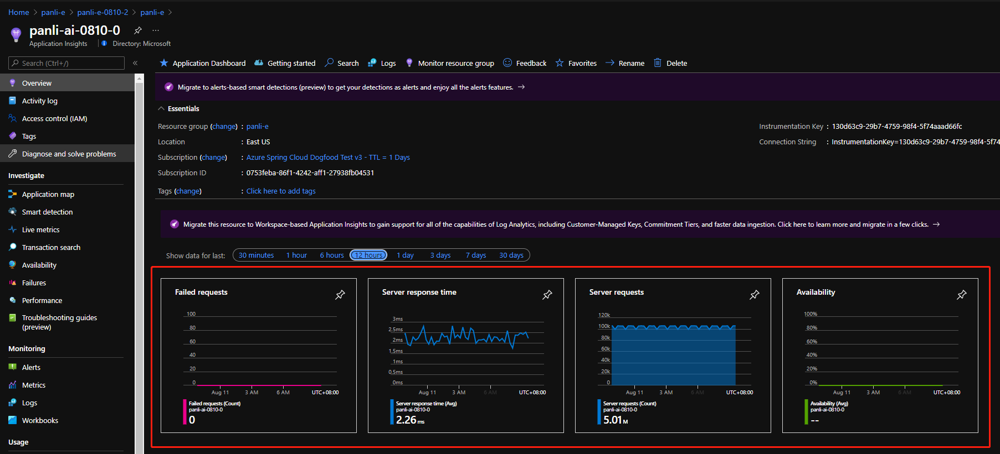

* Select **Application Map** to see the status of calls between apps.

   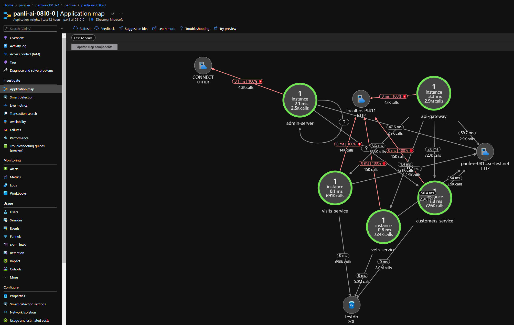

* Select a database to see all the apps connecting to the database.

   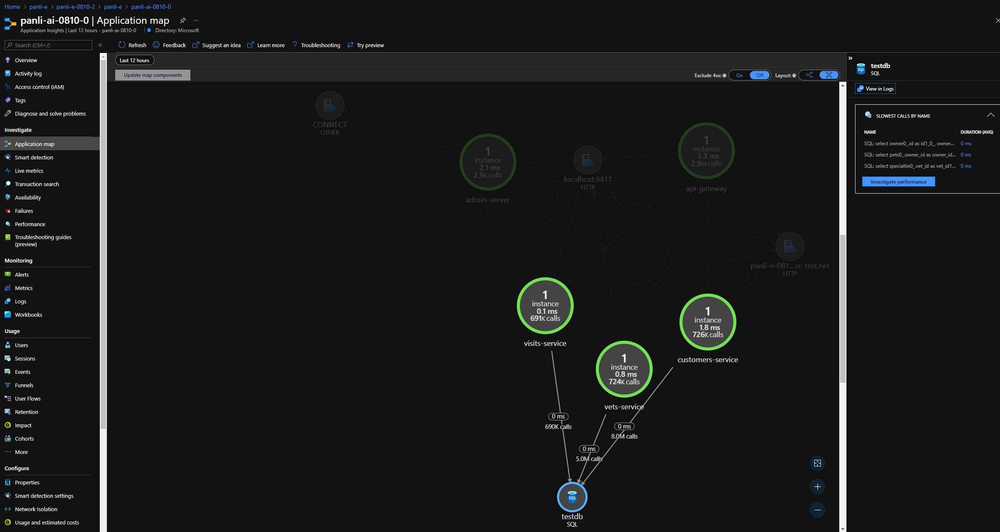

* Select an endpoint to see all the apps requesting to the endpoint.

   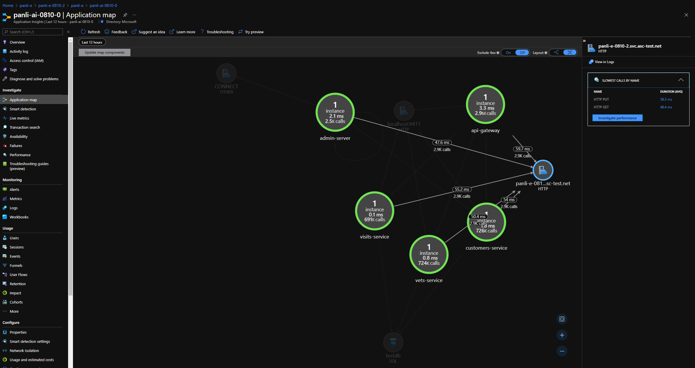

* Select **Live Metrics** to see the real time metrics of all apps in the last 60 seconds.

   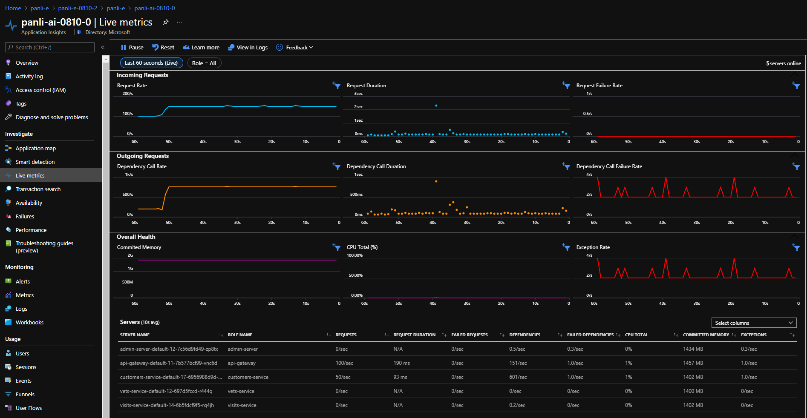

* Select **Failures** to see any unexpected failures of your app dependencies.

   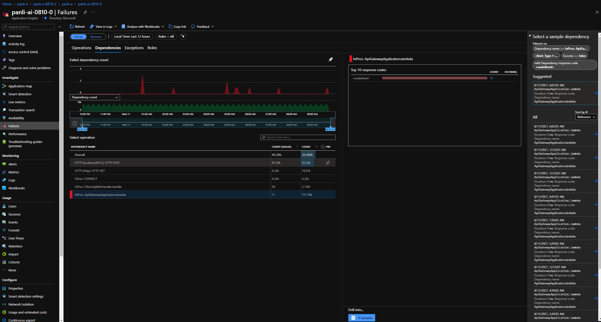

* Select **Failures** to see any unexpected exceptions from your apps.

   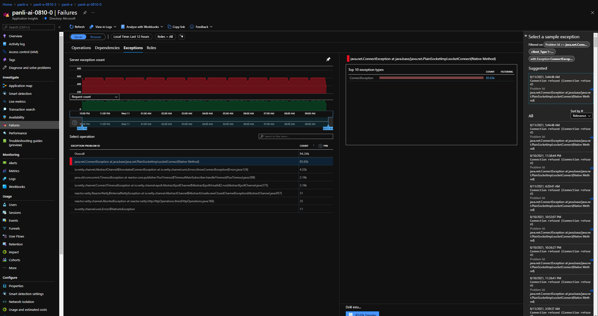

* Select **Performance** to see the performance data of all your apps operations.

   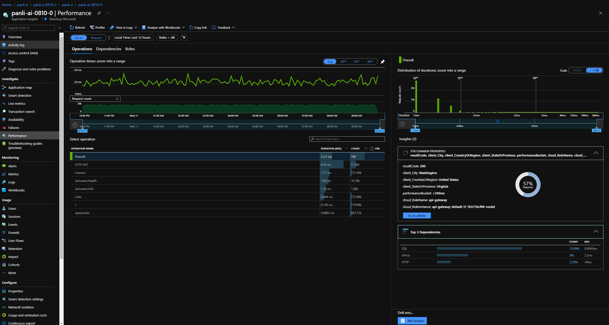

* Select **Performance** to see the performance data of all your apps dependencies.

   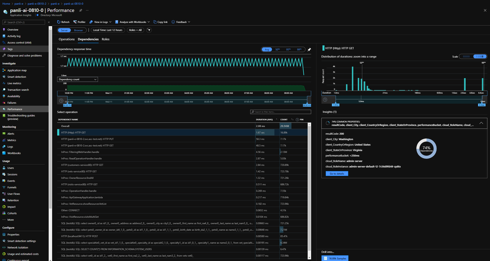

* Select **Metrics**, then select the namespace to see any Spring Boot metrics and custom metrics.

   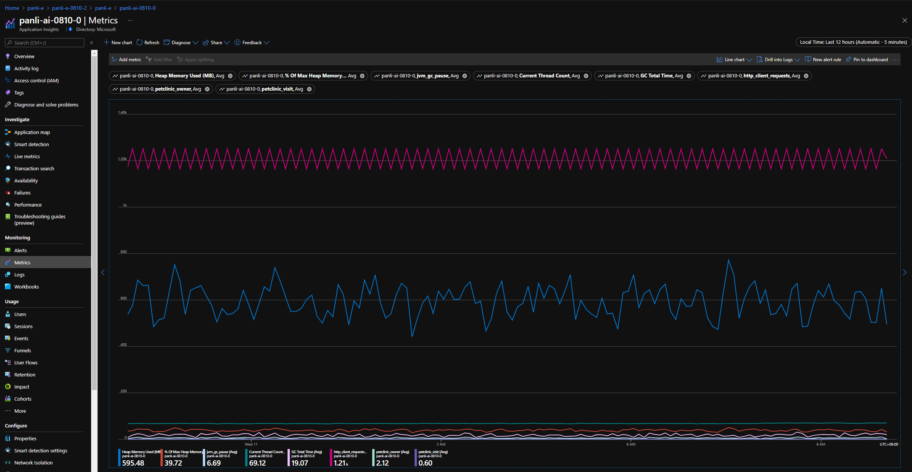

* Select **Log** to check the logs of all apps, or of one app when filtering by `cloud_RoleName`.

   

## Manage settings of Application Insights

You can use the Azure portal or Azure CLI to manage the settings of Application Insights.
# [Portal](#tab/azure-portal)

To check and update the current settings in Application Insights, follow these steps:

1. Select **Application Insights**.
1. Enable Application Insights by selecting **Edit binding**, or the **Unbound** hyperlink.

   

1. Edit **Application Insights** or **Sampling rate**, then select **Save**.

   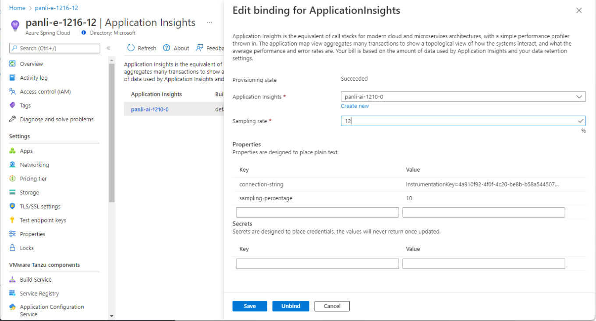

1. Select **Unbind binding** to disable Application Insights.

   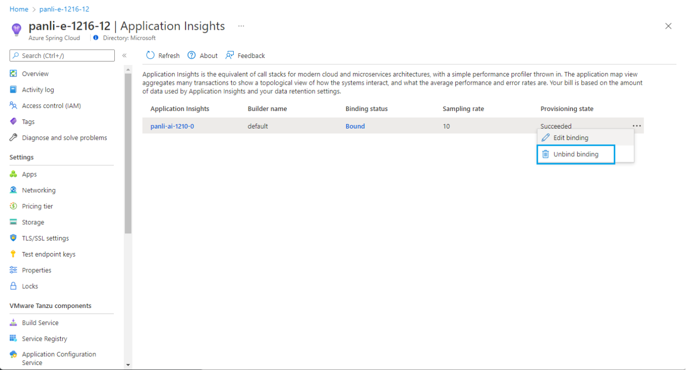

1. Select the name under the *Application Insights* column to open the Application Insights section.
   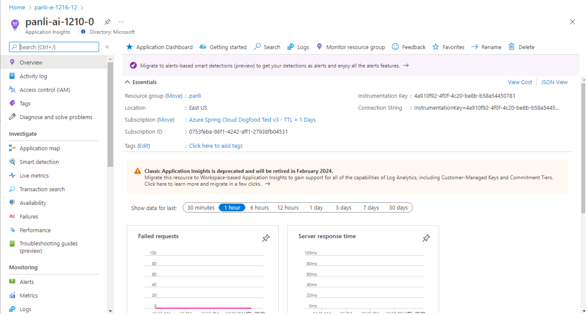

To check and update the current settings for Application Insights in Build Service, follow these steps:
1. Select **Build Service**.
1. Choose your builder.
1. Select **Edit** under the Bindings column.

   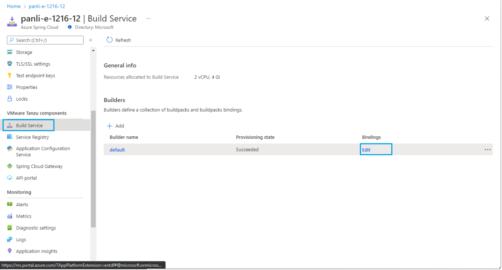

Application Insights settings are one of the bindings listed with the *Binding type* of *ApplicationInsights*.

   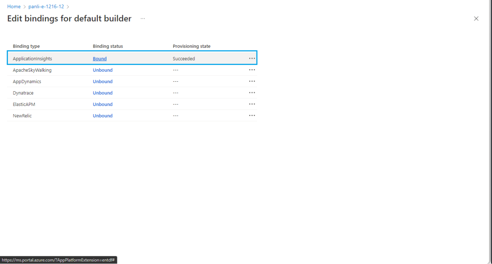

Select the **Bound** hyperlink or **Edit Binding** to edit Application Insights buildpack bindings.

   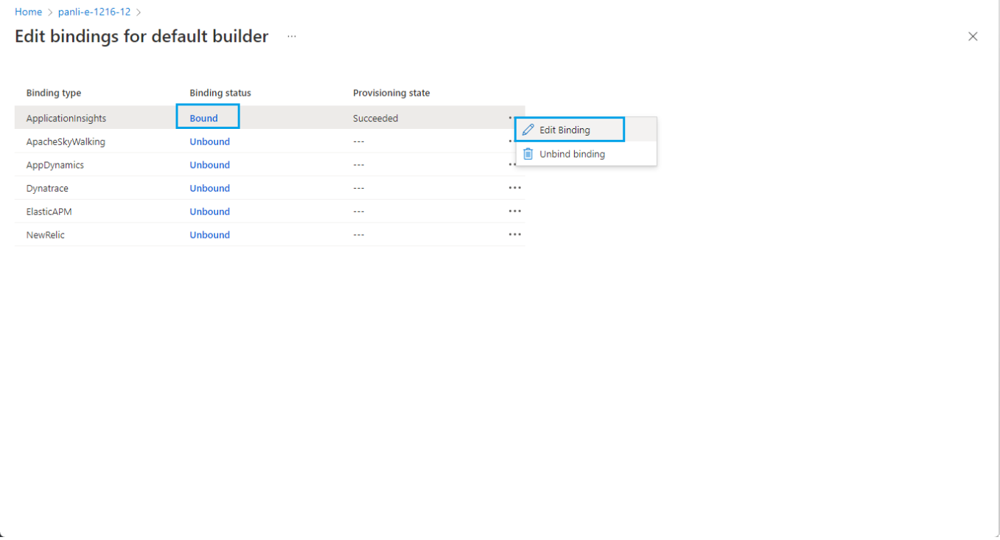
   

# [Azure CLI](#tab/azure-cli)

Azure Enterprise tier uses [Buildpack Bindings](./how-to-enterprise-build-service.md#buildpack-bindings) to integrate [Azure Application Insights](../azure-monitor/app/app-insights-overview.md) with the type `ApplicationInsights`.

To create an Application Insights buildpack binding, use the following command:

   ```azurecli
   az spring-cloud build-service builder buildpack-binding create \
       --resource-group <your-resource-group-name> \
       --service <your-service-name> \
       --name <your-binding-name> \
       --builder-name <your-builder-name> \
       --type ApplicationInsights \
       --properties sampling-percentage=<your-sampling-percentage> \
                    connection-string=<your-connection-string>
   ```

To list all buildpack bindings, and find Application Insights bindings the type `ApplicationInsights`, use the following command:

   ```azurecli
   az spring-cloud build-service builder buildpack-binding list \
       --resource-group <your-resource-group-name> \
       --service <your-service-resource-name> \
       --builder-name <your-builder-name>
   ```

To replace an Application Insights buildpack binding, use the following command:

   ```azurecli
   az spring-cloud build-service builder buildpack-binding set \
       --resource-group <your-resource-group-name> \
       --service <your-service-name> \
       --name <your-binding-name> \
       --builder-name <your-builder-name> \
       --type ApplicationInsights \
       --properties sampling-percentage=<your-sampling-percentage> \
                    connection-string=<your-connection-string>
   ```

To get an Application Insights buildpack binding, use the following command:

   ```azurecli
   az spring-cloud build-service builder buildpack-binding show \
       --resource-group <your-resource-group-name> \
       --service <your-service-name> \
       --name <your-binding-name> \
       --builder-name <your-builder-name> \
   ```

To delete an Application Insights buildpack binding, use the following command:

   ```azurecli
   az spring-cloud build-service builder buildpack-binding delete \
       --resource-group <your-resource-group-name> \
       --service <your-service-name> \
       --name <your-binding-name> \
       --builder-name <your-builder-name> \
   ```

---

### Enable Application Insights when creating Azure Spring Cloud

To configure Application Insights with a name or resource ID, use the following steps:

```azurecli
az spring-cloud create \
       --name <your-service-name> \
       --resource-group <your-resource-group-name> \
       --app-insights <your-app-insights-name or resource-id> \
       --sampling-rate <your-sampling-rate>
```

Enter an existing Application Insights name in the same resource group or the resource ID of an existing Application Insights in a different resource group in the `app-insights` field in the above command.

To configure Application Insights with an Instrumentation Key or Connection String

Enter a connection string (recommended) or instrumentation key of an existing Application Insights in the `app-insights` field in the above command.

```azurecli
az spring-cloud create \
       --name <your-service-name> \
       --resource-group <your-resource-group-name> \
       --app-insights-key <connection-string or instrumentation-key> \
       --sampling-rate <your-sampling-rate>
```

::: zone-end

::: zone pivot="sc-standard-tier"
## Enable Java In-Process Agent for Application Insights

Enable the Java In-Process Agent by using the following procedure.

1. Go to service overview page of your service instance.
2. Select the **Application Insights** entry in the **Monitoring** pane.
3. Select **Enable Application Insights** to enable **Application Insights** integration.
4. Select an existing instance of Application Insights or create a new one.
   Here you can also customize sampling rate from 0 to 100.
5. Select **Save** to save the change.

## Portal

1. Select **service | Overview**, then select **Application Insights** in the **Monitoring** section.
2. Select **Enable Application Insights** to enable Application Insights in Azure Spring Cloud.
3. When **Application Insights** is enabled, you can configure one optional sampling rate (default 10.0%).

   [ ](media/spring-cloud-application-insights/insights-process-agent-0.png)

> [!Note]
> Do not use the same AI in different Azure Spring Cloud instances, or else you will see mixed data.

## Using the Application Insights feature

When the **Application Insights** feature is enabled, you can:

In the left navigation pane, select **Application Insights** to view the **Overview** page of Application Insights.

* Select **Application Map** to see the status of calls between applications.

   [ ](media/spring-cloud-application-insights/insights-process-agent-2-map.png)

* Select the link between customers-service and `petclinic` to see more details such as a query from SQL.

* In the left navigation pane, select **Performance** to see the performance data of all applications' operations, as well as dependencies and roles.

   [ ](media/spring-cloud-application-insights/insights-process-agent-4-performance.png)

* In the left navigation pane, select **Failures** to see if something unexpected from your applications.

   [ ](media/spring-cloud-application-insights/insights-process-agent-6-failures.png)

* In the left navigation pane, select **Metrics** and select the namespace, you will see both Spring Boot metrics and custom metrics, if any.

   [ ](media/spring-cloud-application-insights/insights-process-agent-5-metrics.png)

* In the left navigation pane, select **Live Metrics** to see the real-time metrics for different dimensions.

   [ ](media/spring-cloud-application-insights/petclinic-microservices-live-metrics.jpg)

* In the left navigation pane, select **Availability** to monitor the availability and responsiveness of Web apps by creating [Availability tests in Application Insights](../azure-monitor/app/monitor-web-app-availability.md).

   [ ](media/spring-cloud-application-insights/petclinic-microservices-availability.jpg)

## Automation

The following sections describe how to automate your deployment using Azure Resource Manager templates (ARM templates) or Terraform.
	
### ARM templates

To deploy using an ARM template, copy the following content into an *azuredeploy.json* file. For more information, see [Microsoft.AppPlatform Spring/monitoringSettings](/azure/templates/microsoft.appplatform/spring/monitoringsettings).

```json
{
    "$schema": "https://schema.management.azure.com/schemas/2019-04-01/deploymentTemplate.json#",
    "contentVersion": "1.0.0.0",
    "resources": [
        {
            "type": "Microsoft.AppPlatform/Spring",
            "name": "customize this",
            "apiVersion": "2020-07-01",
            "location": "[resourceGroup().location]",
            "resources": [
                {
                    "type": "monitoringSettings",
                    "apiVersion": "2020-11-01-preview",
                    "name": "default",
                    "properties": {
                        "appInsightsInstrumentationKey": "00000000-0000-0000-0000-000000000000",
                        "appInsightsSamplingRate": 88.0
                    },
                    "dependsOn": [
                        "[resourceId('Microsoft.AppPlatform/Spring', 'customize this')]"
                    ]
                }
            ],
            "properties": {}
        }
    ]
}
```

### Terraform

For a Terraform deployment, use the following template. For more information, see [azurerm_spring_cloud_service](https://registry.terraform.io/providers/hashicorp/azurerm/latest/docs/resources/spring_cloud_service).

```terraform
provider "azurerm" {
  features {}
}

resource "azurerm_resource_group" "example" {
  name     = "example-resources"
  location = "West Europe"
}

resource "azurerm_application_insights" "example" {
  name                = "tf-test-appinsights"
  location            = azurerm_resource_group.example.location
  resource_group_name = azurerm_resource_group.example.name
  application_type    = "web"
}

resource "azurerm_spring_cloud_service" "example" {
  name                = "example-springcloud"
  resource_group_name = azurerm_resource_group.example.name
  location            = azurerm_resource_group.example.location
  sku_name            = "S0"

  config_server_git_setting {
    uri          = "https://github.com/Azure-Samples/piggymetrics"
    label        = "config"
    search_paths = ["dir1", "dir2"]
  }

  trace {
    connection_string = azurerm_application_insights.example.connection_string
    sample_rate       = 10.0
  }

  tags = {
    Env = "staging"
  }
}
```

## CLI

You can manage Application Insights using Azure CLI commands. In the following commands, be sure to replace the *\<placeholder>* text with the values described. The *\<service-name>* placeholder refers to the name of your Azure Spring Cloud instance.

To configure Application Insights when creating an Azure Spring Cloud instance, use the following command. For the `app-insights` argument, you can specify an Application Insights name or resource ID.

```azurecli
az spring-cloud create \
    --resource-group <resource-group-name> \
    --name "serviceName" \
    --app-insights <name-or-resource-ID> \
    --sampling-rate <sampling-rate>
```

You can also use an Application Insights connection string (preferred) or instrumentation key, as shown in the following example.

```azurecli
az spring-cloud create \
    --resource-group <resource-group-name> \
    --name <service-name> \
    --app-insights-key <connection-string-or-instrumentation-key> \
    --sampling-rate <sampling-rate>
```

To disable Application Insights when creating an Azure Spring Cloud instance, use the following command:

```azurecli
az spring-cloud create \
    --resource-group <resource-group-name> \
    --name <service-name> \
    --disable-app-insights
```

To check the Application Insights settings of an existing Azure Spring Cloud instance, use the following command:

```azurecli
az spring-cloud app-insights show \
    --resource-group <resource-group-name> \
    --name <service-name>
```

To enable Application Insights using a connection string (preferred) or instrumentation key, use the following command:

```azurecli
az spring-cloud app-insights update \
    --resource-group <resource-group-name> \
    --name <service-name> \
    --app-insights-key <connection-string-or-instrumentation-key> \
    --sampling-rate <sampling-rate>
```

To enable Application Insights using the resource name or ID, use the following command:

```azurecli
az spring-cloud app-insights update \
    --resource-group <resource-group-name> \
    --name <service-name> \
    --app-insights <name-or-resource-ID> \
    --sampling-rate <sampling-rate>
```

To disable Application Insights on an existing Azure Spring Cloud instance, use the following command:

```azurecli
az spring-cloud app-insights update \
    --resource-group <resource-group-name> \
    --name <service-name> \
    --disable
```

## Java agent update/upgrade

The Java agent will be updated/upgraded regularly with the JDK, which may affect the following scenarios.

> [!Note]
> The JDK version will be updated/upgraded quarterly per year.

* Existing applications that use the Java agent before updating/upgrading will not be affected.
* Applications created after updating/upgrading will leverage the new version of the Java agent.
* Existing applications that did not previously use the Java agent will require restart or redeployment to leverage the new version of the Java agent.

## Java agent configuration hot-loading

Azure Spring Cloud has enabled a hot-loading mechanism to adjust the settings of agent configuration without restart of applications.

> [!Note]
> The hot-loading mechanism has a delay in minutes.

* When the Java agent has been previously enabled, changes to the Application Insights instance and/or SamplingRate do NOT require applications to be restarted.
* If you enable the Java agent, then you must restart applications.
* When you disable the Java agent, applications will stop to send all monitoring data after a delay in minutes. You can restart applications to remove the agent from the Java runtime environment.

::: zone-end

## Concept matching between Azure Spring Cloud and Application Insights

| Azure Spring Cloud | Application Insights                                         |
| ------------------ | ------------------------------------------------------------ |
| `App`              | * __Application Map__/Role<br />* __Live Metrics__/Role<br />* __Failures__/Roles/Cloud Role<br />* __Performance__/Roles/Could Role |
| `App Instance`     | * __Application Map__/Role Instance<br />* __Live Metrics__/Service Name<br />* __Failures__/Roles/Cloud Instance<br />* __Performance__/Roles/Could Instance |

The name `App Instance` from Azure Spring Cloud will be changed or generated in the following scenarios:

* You create a new application.
* You deploy a JAR file or source code to an existing application.
* You initiate a blue/green deployment.
* You restart the application.
* You stop the deployment of an application, and then restart it.

When data is stored in Application Insights, it contains the history of Azure Spring Cloud app instances created or deployed since the Java agent was enabled. This means that, in the Application Insights portal, you can see application data created yesterday, but then deleted within a specific time range, like the last 24 hours. The following scenarios show how this works:

* You created an application around 8:00 AM today from Azure Spring Cloud with the Java agent enabled, and then you deployed a JAR file to this application around 8:10 AM today. After some testing, you change the code and deploy a new JAR file to this application at 8:30 AM today. Then, you take a break, and when you come back around 11:00 AM, you check some data from Application Insights. You will see:
  * Three instances in Application Map with time ranges in the last 24 hours, as well as Failures, Performance, and Metrics.
  * One instance in Application Map with a time range in the last hour, as well as Failures, Performance, and Metrics.
  * One instance in Live Metrics.
* You created an application around 8:00 AM today from Azure Spring Cloud with the Java agent enabled, and then you deployed a JAR file to this application around 8:10 AM today. Around 8:30 AM today, you try a blue/green deployment with another JAR file. Currently, you have two deployments for this application. After a break around 11:00 AM today, you want to check some data from Application Insights. You will see:
  * Three instances in Application Map with time ranges in the last 24 hours, as well as Failures, Performance, and Metrics.
  * Two instances in Application Map with time ranges in last hour, as well as Failures, Performance, and Metrics.
  * Two instances in Live Metrics.

## See also

* [Use distributed tracing with Azure Spring Cloud](./how-to-distributed-tracing.md)
* [Analyze logs and metrics](diagnostic-services.md)
* [Stream logs in real time](./how-to-log-streaming.md)
* [Application Map](../azure-monitor/app/app-map.md)
* [Live Metrics](../azure-monitor/app/live-stream.md)
* [Performance](../azure-monitor/app/tutorial-performance.md)
* [Failures](../azure-monitor/app/tutorial-runtime-exceptions.md)
* [Metrics](../azure-monitor/essentials/tutorial-metrics.md)
* [Logs](../azure-monitor/logs/data-platform-logs.md)