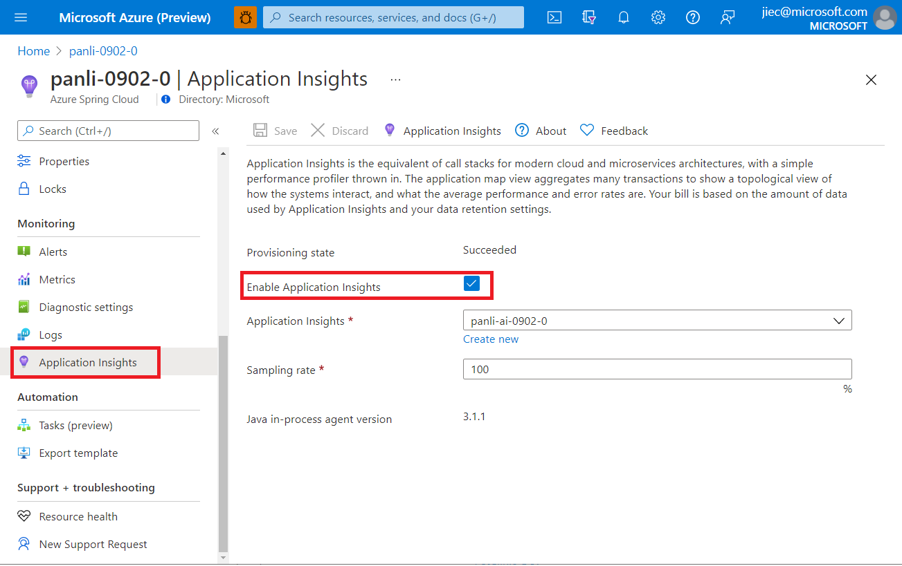
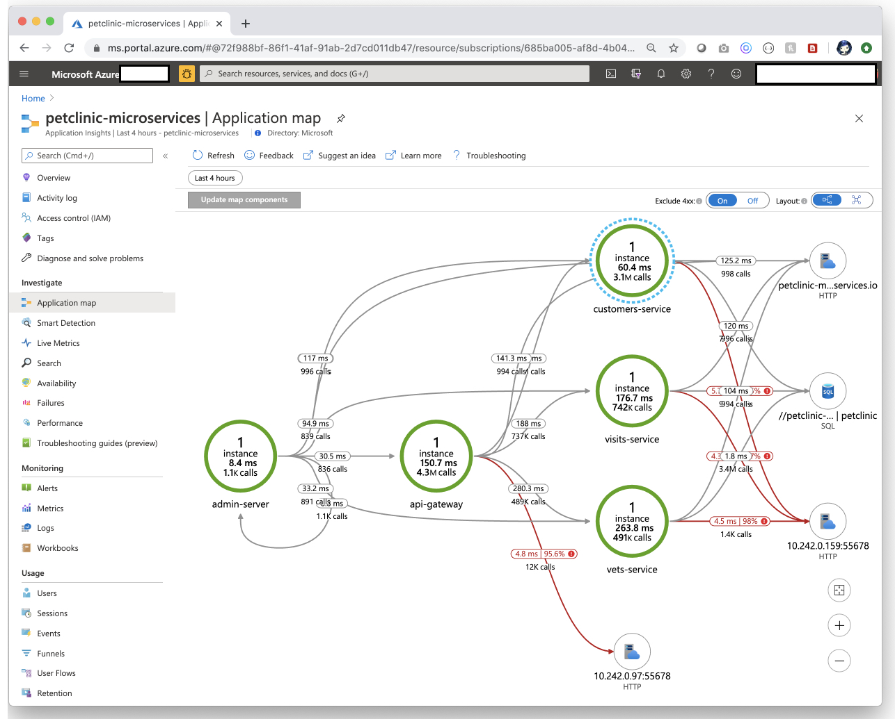
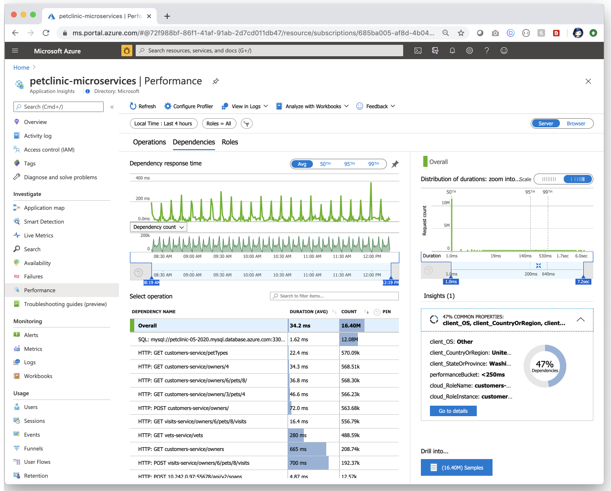
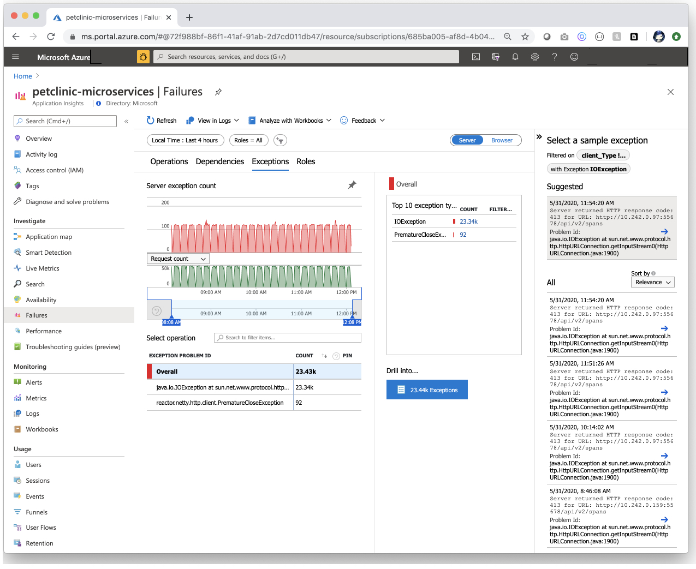
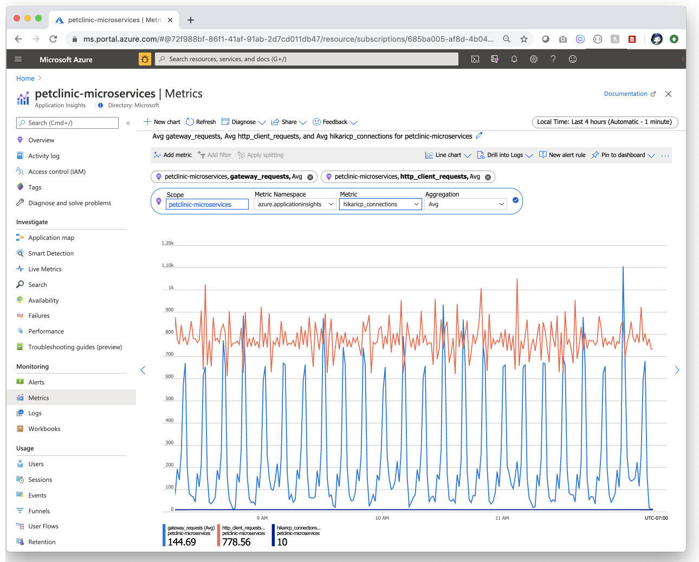
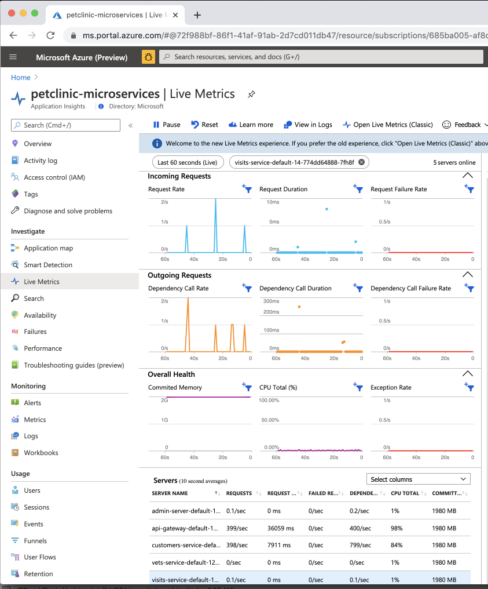
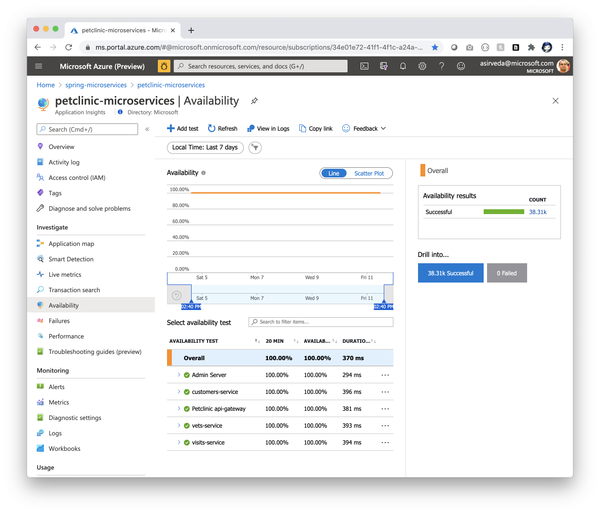

# Application Insights Java In-Process Agent in Azure Spring Cloud (Preview)

This article explains how to monitor apps and microservices by using the Application Insights Java agent in Azure Spring Cloud. 

With this feature you can:

* Search tracing data with different filters.
* View dependency map of microservices.
* Check request performance.
* Monitor real-time live metrics.
* Check request failures.
* Check application metrics.

Application Insights provide many observable perspectives, including:

* Application map
* Performance
* Failures
* Metrics
* Live Metrics
* Availability

## Enable Java In-Process Agent for Application Insights

Enable Java In-Process Agent preview feature using the following procedure.

1. Go to service overview page of your service instance.
2. Click **Application Insights** entry under monitoring blade.
3. Click **Enable Application Insights** button to enable **Application Insights** integration.
4. Select an existing instance of Application Insights or create a new one.
5. Chick **Enable Java in-process agent** to enable preview Java in-process agent feature. Here you can also customize sampling rate from 0 to 100.
6.  Click **Save** to save the change.

## Portal

1. Go to the **service | Overview** page and select **Application Insights** in the **Monitoring** section. 
2. Click **Enable Application Insights** to enable Application Insights in Azure Spring Cloud.
3. Click **Enable Java in-process agent** to enable Java IPA preview feature. When an IPA preview feature is enabled, you can configure one optional sampling rate (default 10.0%).

  [ ](media/spring-cloud-application-insights/insights-process-agent-0.png)

## Using the Application Insights feature

When the **Application Insights** feature is enabled, you can:

In the left navigation pane, click **Application Insights** to jump to the **Overview** page of Application Insights. 

* Click **Application Map** to see the status of calls between applications.

  [ ](media/spring-cloud-application-insights/insights-process-agent-2-map.png)

* Click the link between customers-service and `petclinic` to see more details such as a query from SQL.

* In the left navigation pane, click **Performance** to see the performance data of all applications' operations, as well as dependencies and roles.

  [ ](media/spring-cloud-application-insights/insights-process-agent-4-performance.png)

* In the left navigation pane, click **Failures** to see if something unexpected from your applications.

  [ ](media/spring-cloud-application-insights/insights-process-agent-6-failures.png)

* In the left navigation pane, click **Metrics** and select the namespace, you will see both Spring Boot metrics and custom metrics, if any.

  [ ](media/spring-cloud-application-insights/insights-process-agent-5-metrics.png)

* In the left navigation pane, click **Live Metrics** to see the real time metrics for different dimensions.

  [ ](media/spring-cloud-application-insights/petclinic-microservices-live-metrics.jpg)

* In the left navigation pane, click **Availability** to monitor the availability and responsiveness of Web apps by creating [Availability tests in Application Insights](../azure-monitor/app/monitor-web-app-availability.md).

  [ ](media/spring-cloud-application-insights/petclinic-microservices-availability.jpg)

## ARM Template

To use the Azure Resource Manager template, copy following content to `azuredeploy.json`.

```json
{
    "$schema": "https://schema.management.azure.com/schemas/2019-04-01/deploymentTemplate.json#",
    "contentVersion": "1.0.0.0",
    "resources": [
        {
            "type": "Microsoft.AppPlatform/Spring",
            "name": "customize this",
            "apiVersion": "2020-07-01",
            "location": "[resourceGroup().location]",
            "resources": [
                {
                    "type": "monitoringSettings",
                    "apiVersion": "2020-11-01-preview",
                    "name": "default",
                    "properties": {
                        "appInsightsInstrumentationKey": "00000000-0000-0000-0000-000000000000",
                        "appInsightsSamplingRate": 88.0
                    },
                    "dependsOn": [
                        "[resourceId('Microsoft.AppPlatform/Spring', 'customize this')]"
                    ]
                }
            ],
            "properties": {}
        }
    ]
}
```

## CLI

Apply ARM template with the CLI command:

* For an existing Azure Spring Cloud instance:

```azurecli
az spring-cloud app-insights update [--app-insights/--app-insights-key] "assignedName" [--sampling-rate] "samplingRate" –name "assignedName" –resource-group "resourceGroupName"
```
* For a newly created Azure Spring Cloud instance:

```azurecli
az spring-cloud create/update [--app-insights]/[--app-insights-key] "assignedName" --disable-app-insights false --enable-java-agent true --name "assignedName" –resource-group "resourceGroupName"
```
* To disable app-insight:

```azurecli
az spring-cloud app-insights update --disable –name "assignedName" –resource-group "resourceGroupName"

```

## See also
* [Use distributed tracing with Azure Spring Cloud](spring-cloud-howto-distributed-tracing.md)
* [Analyze logs and metrics](diagnostic-services.md)
* [Stream logs in real time](spring-cloud-howto-log-streaming.md)
