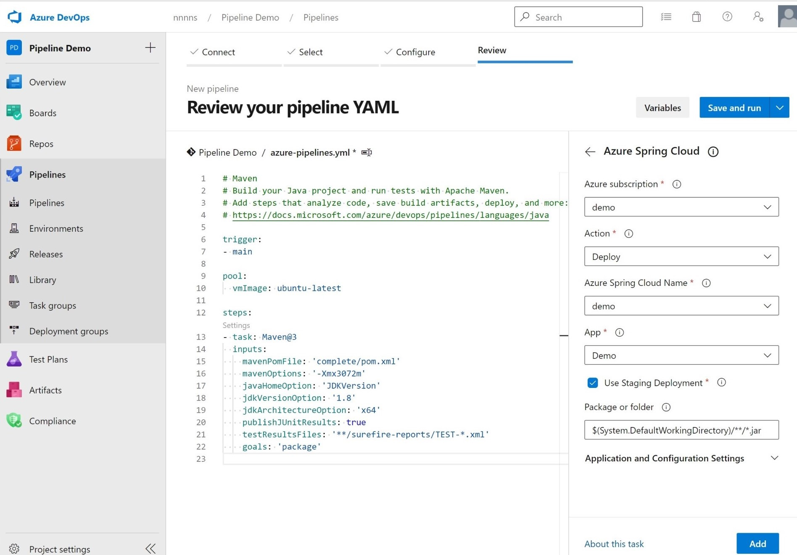
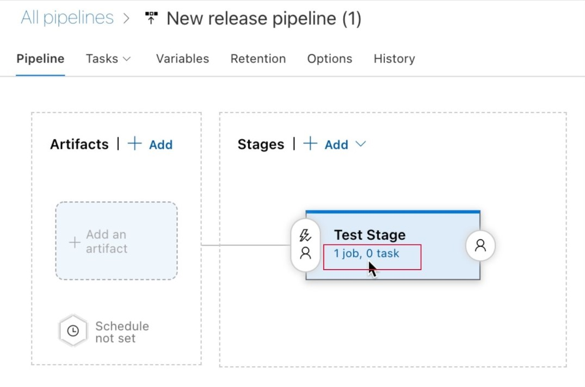
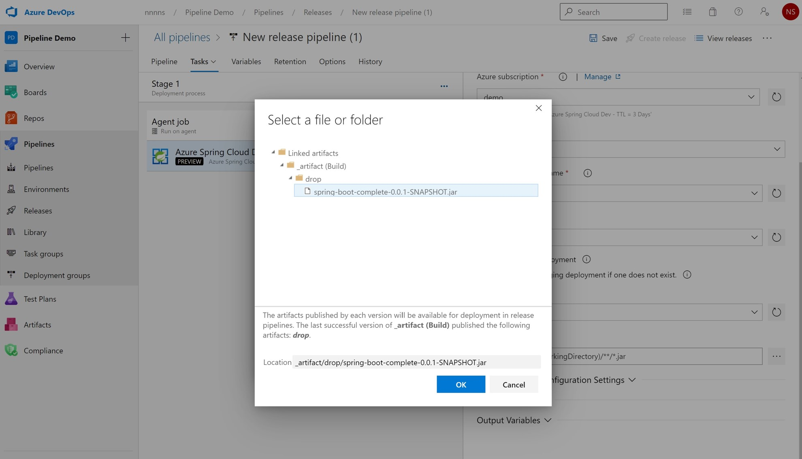
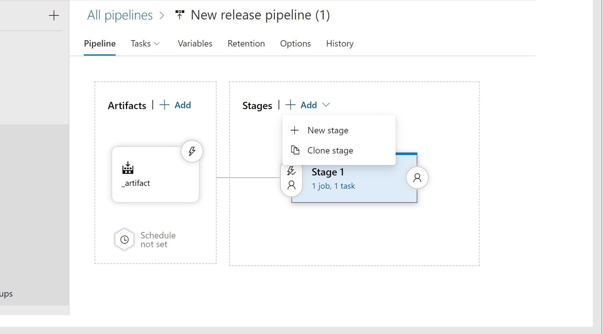

# Automate application deployments to Azure Spring Cloud

This article shows you how to use the [Azure Spring Cloud task for Azure Pipelines](/azure/devops/pipelines/tasks/deploy/azure-spring-cloud) to deploy applications.

Continuous integration and continuous delivery tools let you quickly deploy updates to existing applications with minimal effort and risk. Azure DevOps helps you organize and control these key jobs. 

The following video describes end-to-end automation using tools of your choice, including Azure Pipelines.

<br>

> [!VIDEO https://www.youtube.com/embed/D2cfXAbUwDc?list=PLPeZXlCR7ew8LlhnSH63KcM0XhMKxT1k_]

::: zone pivot="programming-language-csharp"

## Create an Azure Resource Manager service connection

To create an Azure Resource Manager service connection to your Azure DevOps project, see [Connect to Microsoft Azure](/azure/devops/pipelines/library/connect-to-azure). Be sure to select the same subscription you're using for your Azure Spring Cloud service instance.

## Build and deploy apps


### Deploy artifacts

You can build and deploy your projects using a series of tasks. This snippet defines variables, a .NET Core task to build the application, and an Azure Spring Cloud task to deploy the application.

```yaml
variables:
  workingDirectory: './steeltoe-sample'
  planetMainEntry: 'Microsoft.Azure.SpringCloud.Sample.PlanetWeatherProvider.dll'
  solarMainEntry: 'Microsoft.Azure.SpringCloud.Sample.SolarSystemWeather.dll'
  planetAppName: 'planet-weather-provider'
  solarAppName: 'solar-system-weather'
  serviceName: '<your service name>'


steps:
# Restore, build, publish and package the zipped planet app
- task: DotNetCoreCLI@2
  inputs:
    command: 'publish'
    publishWebProjects: false
    arguments: '--configuration Release'
    zipAfterPublish: false
    modifyOutputPath: false
    workingDirectory: $(workingDirectory)

# Deploy the planet app
- task: AzureSpringCloud@0
  inputs:
    azureSubscription: '<Service Connection Name>'
    Action: 'Deploy'
    AzureSpringCloud: $(serviceName)
    AppName: 'testapp'
    UseStagingDeployment: false
    DeploymentName: 'default'
    Package: $(workingDirectory)/src/$(planetAppName)/publish-deploy-planet.zip
    RuntimeVersion: 'NetCore_31'
    DotNetCoreMainEntryPath: $(planetMainEntry)

# Deploy the solar app
- task: AzureSpringCloud@0
  inputs:
    azureSubscription: '<Service Connection Name>'
    Action: 'Deploy'
    AzureSpringCloud: $(serviceName)
    AppName: 'testapp'
    UseStagingDeployment: false
    DeploymentName: 'default'
    Package: $(workingDirectory)/src/$(solarAppName)/publish-deploy-solar.zip
    RuntimeVersion: 'NetCore_31'
    DotNetCoreMainEntryPath: $(solarMainEntry)
```

::: zone-end
::: zone pivot="programming-language-java"

## Set up a Spring Cloud Instance and DevOps project
1.	Go to your Azure Spring Cloud instance and create a new app. 
2.	Go to the Azure DevOps website and create a new project under your chosen organization. If you don't have a DevOps organization, you can create one for free.
3.	Select **Repos** and import the [Spring Boot demo code](https://github.com/spring-guides/gs-spring-boot) to the repository.

## Create an Azure Resource Manager service connection
To create an Azure Resource Manager service connection to your Azure DevOps project, see [Connect to Microsoft Azure](/azure/devops/pipelines/library/connect-to-azure). Be sure to select the same subscription you're using for your Azure Spring Cloud service instance.

## Build and deploy apps
DevOps provides you with a convenient way to deploy your app following these steps.

### Deploy artifacts via a pipeline

1. Select **Pipelines** and create a new pipeline with a Maven template.
2. Edit the pipeline yml file:

 * Modify **mavenPomFile** under the Maven task to *complete/pom.xml*.
 * Select **Show assistant** on the right side and choose the **Azure Spring Cloud** template.
 * Choose the service connection you created for your Azure Subscription. Choose your Spring Cloud Instance and App Instance. 
 * Disable **Use Staging Deployment**.
 * Modify **Package or folder** to *complete/target/spring-boot-complete-0.0.1-SNAPSHOT.jar*.
 * **Add** this task to your pipeline.

  
Your pipeline settings should match the following image.
[ ](media/spring-cloud-how-to-cicd/pipeline-task-setting.jpg#lightbox)

You can also build and deploy your projects using following template. This snippet first defines a Maven task to build the application, followed by a second task that deploys the JAR file using the Azure Spring Cloud task for Azure Pipelines.

```yaml
steps:
- task: Maven@3
  inputs:
    mavenPomFile: 'complete/pom.xml'
- task: AzureSpringCloud@0
  inputs:
    azureSubscription: '<your service connection name>'
    Action: 'Deploy'
    AzureSpringCloud: <your Azure Spring Cloud service>
    AppName: <app-name>
    UseStagingDeployment: false
    DeploymentName: 'default'
    Package: ./target/your-result-jar.jar
```

3. Select **Save and run** button, and then wait for job to be done.

### Blue-green deployments

The deployment shown in the previous section immediately receives application traffic upon deployment. Sometimes, developers want to test their applications in the production environment before the application receives any customer traffic.

#### Edit the pipeline file
To build the application the same way as above and deploy it to a staging deployment, use the following snippet. In this example, the staging deployment must already exist. For an alternative approach, see [Blue-green deployment strategies](concepts-blue-green-deployment-strategies.md).

```yaml
steps:
- task: Maven@3
  inputs:
    mavenPomFile: 'pom.xml'
- task: AzureSpringCloud@0
  inputs:
    azureSubscription: '<your service connection name>'
    Action: 'Deploy'
    AzureSpringCloud: <your Azure Spring Cloud service>
    AppName: <app-name>
    UseStagingDeployment: true
    Package: ./target/your-result-jar.jar
- task: AzureSpringCloud@0
  inputs:
    azureSubscription: '<your service connection name>'
    Action: 'Set Production'
    AzureSpringCloud: <your Azure Spring Cloud service>
    AppName: <app-name>
    UseStagingDeployment: true
```

#### Use Release Section
The following steps demonstrate how to enable a blue-green deployment via the **Releases** section.

1.  Select **Pipelines** and create a new pipeline for your Maven build and publish artifact.
 *	Choose the **Maven** template and modify **mavenPomFile** to *complete/pom.xml*
 *	Select **Show assistant** on the right side and select the **Publish build artifacts** template
 *	Modify **Path to publish** to *complete/target/spring-boot-complete-0.0.1-SNAPSHOT.jar*
 *	Select the **Save and run** button

2.	Select **Releases**. Add a new pipeline, and select **Empty job** to edit the job.

3. Create a new job under **Tasks** and search for the *Azure Spring Cloud* template.
[ ](media/spring-cloud-how-to-cicd/Create-new-job.jpg#lightbox)

4. **Add** the *Azure Spring Cloud* task to the job.

5. Fill this task with your app's information. Disable **Use Staging Deployment**. Enable **Create a new staging deployment if one does not exist.** and enter a name in **Deployment**. Then **Save** this task.

6.  Select **Artifacts** and choose the pipeline that publish the artifact. Then, Navigate to the task in the stage 1, and then Modify "Package or folder" to the artifact address. Save changes.
[ ](media/spring-cloud-how-to-cicd/Change-artifact-path.jpg#lightbox)

7. Select **Clone stage** and modify its task. Change the action to **Set Production Deployment**. Fill in the blanks of this task.
[ ](media/spring-cloud-how-to-cicd/Clone-the-stage.jpg#lightbox)

5.	Select **Create release** and the deployment will automatically start. 

To verify your app's current release status, Select **View release**. After this task is done, visit your Azure portal and verify your app status.

### Deploy from source

It's possible to deploy directly to Azure without a separate build step.

```yaml
- task: AzureSpringCloud@0
  inputs:
    azureSubscription: '<your service connection name>'
    Action: 'Deploy'
    AzureSpringCloud: <your Azure Spring Cloud service>
    AppName: <app-name>
    UseStagingDeployment: false
    DeploymentName: 'default'
    Package: $(Build.SourcesDirectory)
```

::: zone-end

## Next steps

* [Quickstart: Deploy your first Azure Spring Cloud application](./quickstart.md)
