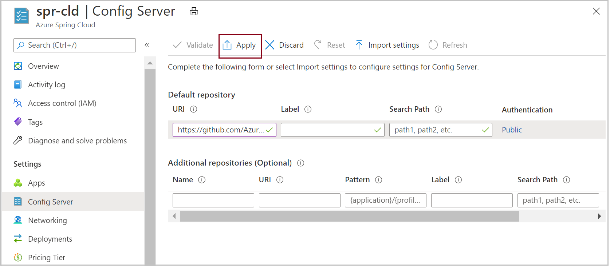
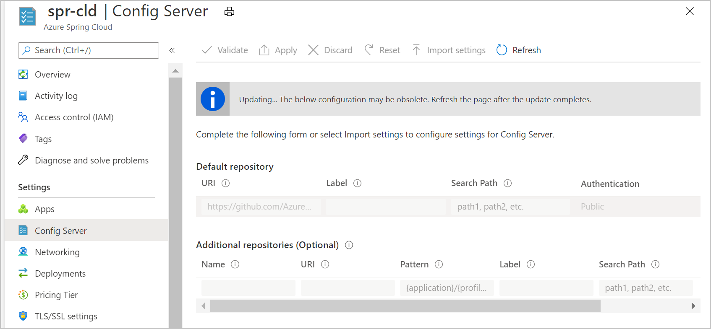
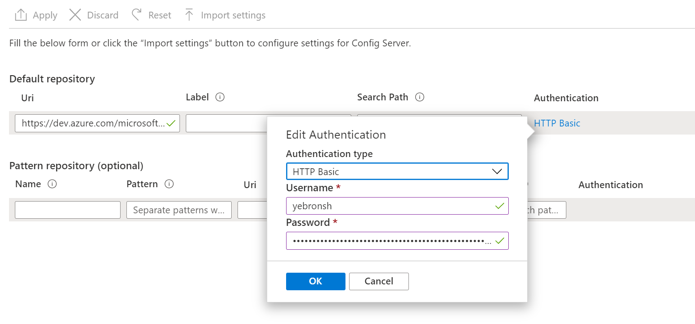

# Set up a Spring Cloud Config Server instance for your service

**This article applies to:** ✔️ Java ✔️ C#

This article shows you how to connect a Spring Cloud Config Server instance to your Azure Spring Cloud service.

Spring Cloud Config provides server and client-side support for an externalized configuration in a distributed system. With the Config Server instance, you've a central place to manage external properties for applications across all environments. For more information, see the [Spring Cloud Config Server reference](https://spring.io/projects/spring-cloud-config).

## Prerequisites

* An Azure subscription. If you don't have an Azure subscription, create a [free account](https://azure.microsoft.com/free/?WT.mc_id=A261C142F) before you begin.
* An already provisioned and running Azure Spring Cloud service. To set up and launch an Azure Spring Cloud service, see [Quickstart: Launch a Java Spring application by using the Azure CLI](./quickstart.md).

## Restriction

There are some restrictions when you use Config Server with a Git back end. Some properties are automatically injected into your application environment to access Config Server and Service Discovery. If you also configure those properties from your Config Server files, you might experience conflicts and unexpected behavior. The properties include:

```yaml
eureka.client.service-url.defaultZone
eureka.client.tls.keystore
eureka.instance.preferIpAddress
eureka.instance.instance-id
server.port
spring.cloud.config.tls.keystore
spring.application.name
spring.jmx.enabled
```

> [!CAUTION]
> We strongly recommend that you *do not* put the above properties in your Config Server application files.

## Create your Config Server files

Azure Spring Cloud supports Azure DevOps, GitHub, GitLab, and Bitbucket for storing your Config Server files. When you've your repository ready, create the configuration files with the following instructions and store them there.

Additionally, some configurable properties are available only for certain types. The following subsections list the properties for each repository type.

### Public repository

When you use a public repository, your configurable properties are more limited.

All configurable properties that are used to set up the public Git repository are listed in the following table:

> [!NOTE]
> Using a hyphen (-) to separate words is the only naming convention that's currently supported. For example, you can use *default-label*, but not *defaultLabel*.

| Property        | Required | Feature                                                      |
| :-------------- | -------- | ------------------------------------------------------------ |
| `uri`           | Yes    | The URI of the Git repository that's used as the Config Server back end begins with *http://*, *https://*, *git@*, or *ssh://*. |
| `default-label` | No     | The default label of the Git repository, should be the *branch name*, *tag name*, or *commit-id* of the repository. |
| `search-paths`  | No     | An array of strings that are used to search subdirectories of the Git repository. |

------

### Private repository with SSH authentication

All configurable properties used to set up private Git repository with SSH are listed in the following table:

> [!NOTE]
> Using a hyphen (-) to separate words is the only naming convention that's currently supported. For example, you can use *default-label*, but not *defaultLabel*.

| Property                   | Required | Feature                                                      |
| :------------------------- | -------- | ------------------------------------------------------------ |
| `uri`                      | Yes    | The URI of the Git repository used as the Config Server back end, should be started with *http://*, *https://*, *git@*, or *ssh://*. |
| `default-label`            | No     | The default label of the Git repository, should be the *branch name*, *tag name*, or *commit-id* of the repository. |
| `search-paths`             | No     | An array of strings used to search subdirectories of the Git repository. |
| `private-key`              | No     | The SSH private key to access the Git repository, _required_ when the URI starts with *git@* or *ssh://*. |
| `host-key`                 | No     | The host key of the Git repository server shouldn't include the algorithm prefix as covered by `host-key-algorithm`. |
| `host-key-algorithm`       | No     | The host key algorithm should be *ssh-dss*, *ssh-rsa*, *ecdsa-sha2-nistp256*, *ecdsa-sha2-nistp384*, or *ecdsa-sha2-nistp521*. *Required* only if `host-key` exists. |
| `strict-host-key-checking` | No     | Indicates whether the Config Server instance will fail to start when using the private `host-key`. Should be *true* (default value) or *false*. |

> [!NOTE]
> Config Server takes `master` (om Git itself) as default label if not specified. But GitHub has changed the default branch from `master` to `main` recently. To avoid Azure Spring Cloud Config Server failure, please pay attention for the default label when setting up Config Server with GitHub, especially for new created repositories.

-----

### Private repository with basic authentication

All configurable properties used to set up private Git repository with basic authentication are listed below.

> [!NOTE]
> Using a hyphen (-) to separate words is the only naming convention that's currently supported. For example, use *default-label*, not *defaultLabel*.

| Property        | Required | Feature                                                      |
| :-------------- | -------- | ------------------------------------------------------------ |
| `uri`           | Yes    | The URI of the Git repository that's used as the Config Server back end should be started with *http://*, *https://*, *git@*, or *ssh://*. |
| `default-label` | No     | The default label of the Git repository, should be the *branch name*, *tag name*, or *commit-id* of the repository. |
| `search-paths`  | No     | An array of strings used to search subdirectories of the Git repository. |
| `username`      | No     | The username that's used to access the Git repository server, _required_ when the Git repository server supports `Http Basic Authentication`. |
| `password`      | No     | The password or personal access token used to access the Git repository server, _required_ when the Git repository server supports `Http Basic Authentication`. |

> [!NOTE]
> Many `Git` repository servers support the use of tokens rather than passwords for HTTP Basic Authentication. Some repositories allow tokens to persist indefinitely. However, some Git repository servers, including Azure DevOps Server, force tokens to expire in a few hours. Repositories that cause tokens to expire shouldn't use token-based authentication with Azure Spring Cloud.
> GitHub has removed support for password authentication, so you'll need to use a personal access token instead of password authentication for GitHub. For more information, see [Token authentication](https://github.blog/2020-12-15-token-authentication-requirements-for-git-operations/).

### Other Git repositories

All configurable properties used to set up Git repositories with pattern are listed below.

> [!NOTE]
> Using a hyphen (-) to separate words is the only naming convention that's currently supported. For example, use *default-label*, not *defaultLabel*.

| Property                           | Required         | Feature                                                      |
| :--------------------------------- | ---------------- | ------------------------------------------------------------ |
| `repos`                            | No             | A map consisting of the settings for a Git repository with a given name. |
| `repos."uri"`                      | Yes on `repos` | The URI of the Git repository that's used as the Config Server back end should be started with *http://*, *https://*, *git@*, or *ssh://*. |
| `repos."name"`                     | Yes on `repos` | A name to identify on the Git repository, _required_ only if `repos` exists. For example, *team-A*, *team-B*. |
| `repos."pattern"`                  | No             | An array of strings used to match an application name. For each pattern, use the `{application}/{profile}` format with wildcards. |
| `repos."default-label"`            | No             | The default label of the Git repository should be the *branch name*, *tag name*, or *commit-id* of the repository. |
| `repos."search-paths`"             | No             | An array of strings used to search subdirectories of the Git repository. |
| `repos."username"`                 | No             | The username that's used to access the Git repository server, _required_ when the Git repository server supports `Http Basic Authentication`. |
| `repos."password"`                 | No             | The password or personal access token used to access the Git repository server, _required_ when the Git repository server supports `Http Basic Authentication`. |
| `repos."private-key"`              | No             | The SSH private key to access Git repository, _required_ when the URI starts with *git@* or *ssh://*. |
| `repos."host-key"`                 | No             | The host key of the Git repository server shouldn't include the algorithm prefix as covered by `host-key-algorithm`. |
| `repos."host-key-algorithm"`       | No             | The host key algorithm should be *ssh-dss*, *ssh-rsa*, *ecdsa-sha2-nistp256*, *ecdsa-sha2-nistp384*, or *ecdsa-sha2-nistp521*. *Required* only if `host-key` exists. |
| `repos."strict-host-key-checking"` | No             | Indicates whether the Config Server instance will fail to start when using the private `host-key`. Should be *true* (default value) or *false*. |

The following table shows some examples for the **Additional repositories** section. For more information, see [Pattern Matching and Multiple Repositories](https://cloud.spring.io/spring-cloud-config/reference/html/#_pattern_matching_and_multiple_repositories) in the Spring documentation.

| Patterns                        | Description |
| :------------------------------ | ------------------------------------------------------------------------------------------------------------------- |
| *test-config-server-app-0/\**   | The pattern and repository URI will match a Spring boot application named `test-config-server-app-0` with any profile.  |
| *test-config-server-app-1/dev*  | The pattern and repository URI will match a Spring boot application named `test-config-server-app-1` with dev profile.  |
| *test-config-server-app-2/prod* | The pattern and repository URI will match a Spring boot application named `test-config-server-app-2` with prod profile. |

:::image type="content" source="media/spring-cloud-tutorial-config-server/additional-repositories.png" lightbox="media/spring-cloud-tutorial-config-server/additional-repositories.png" alt-text="Azure portal screenshot showing the Config Server page with the Patterns column of the 'Additional repositories' table highlighted":::

## Attach your Config Server repository to Azure Spring Cloud

Now that your configuration files are saved in a repository, you need to connect Azure Spring Cloud to it.

1. Sign in to the [Azure portal](https://portal.azure.com).

2. Go to your Azure Spring Cloud **Overview** page.

3. Select **Config Server** in the left navigation pane.

4. In the **Default repository** section, set **URI** to "https://github.com/Azure-Samples/piggymetrics-config".

5. Select **Validate**.

    

6. When validation is complete, select **Apply** to save your changes.

    

7. Updating the configuration can take a few minutes.

    

8. You should get a notification when the configuration is complete.

### Enter repository information directly to the Azure portal

#### Default repository

* **Public repository**: In the **Default repository** section, in the **Uri** box, paste the repository URI.  Set the **Label** to **config**. Ensure that the **Authentication** setting is **Public**, and then select **Apply** to finish.

* **Private repository**: Azure Spring Cloud supports basic password/token-based authentication and SSH.

    * **Basic Authentication**: In the **Default repository** section, in the **Uri** box, paste the repository URI, and then select the **Authentication** ("pencil" icon) button. In the **Edit Authentication** pane, in the **Authentication type** drop-down list, select **HTTP Basic**, and then enter your username and password/token to grant access to Azure Spring Cloud. Select **OK**, and then select **Apply** to finish setting up your Config Server instance.

    

    > [!CAUTION]
    > Some Git repository servers use a *personal-token* or an *access-token*, such as a password, for **Basic Authentication**. You can use that kind of token as a password in Azure Spring Cloud, because it will never expire. But for other Git repository servers, such as Bitbucket and Azure DevOps Server, the *access-token* expires in one or two hours. This means that the option isn't viable when you use those repository servers with Azure Spring Cloud.
    > GitHub has removed support for password authentication, so you'll need to use a personal access token instead of password authentication for GitHub. For more information, see [Token authentication](https://github.blog/2020-12-15-token-authentication-requirements-for-git-operations/).

    * **SSH**: In the **Default repository** section, in the **Uri** box, paste the repository URI, and then select the **Authentication** ("pencil" icon) button. In the **Edit Authentication** pane, in the **Authentication type** drop-down list, select **SSH**, and then enter your **Private key**. Optionally, specify your **Host key** and **Host key algorithm**. Be sure to include your public key in your Config Server repository. Select **OK**, and then select **Apply** to finish setting up your Config Server instance.

    

#### Additional repositories

If you want to use an optional **Additional repositories** to configure your service, specify the **URI** and **Authentication** the same way as the **Default repository**. Be sure to include a **Name** for your pattern, and then select **Apply** to attach it to your instance.

### Enter repository information into a YAML file

If you've written a YAML file with your repository settings, you can import the file directly from your local machine to Azure Spring Cloud. A simple YAML file for a private repository with basic authentication would look like this:

```yaml
spring:
    cloud:
        config:
            server:
                git:
                    uri: https://github.com/azure-spring-cloud-samples/config-server-repository.git
                    username: <username>
                    password: <password/token>

```

Select the **Import settings** button, and then select the YAML file from your project directory. Select **Import**, and then an `async` operation from your **Notifications** will pop up. After 1-2 minutes, it should report success.


The information from your YAML file should be displayed in the Azure portal. Select **Apply** to finish.

## Using Azure Repos for Azure Spring Cloud Configuration

Azure Spring Cloud can access Git repositories that are public, secured by SSH, or secured using HTTP basic authentication. We'll use that last option, as its easier to create and manage with Azure Repos.

### Get repo url and credentials

1. In the Azure Repos portal for your project, select the **Clone** button:

    

1. Copy the clone URL from the textbox. This URL will typically be in the form:

    ```text
    https://<organization name>@dev.azure.com/<organization name>/<project name>/_git/<repository name>
    ```

    Remove everything after `https://` and before `dev.azure.com`, including the `@`. The resulting URL should be in the form:

    ```text
    https://dev.azure.com/<organization name>/<project name>/_git/<repository name>
    ```

    Save this URL for use in the next section.

1. Select **Generate Git Credentials**. A username and password will appear and should be saved for use in the next section.

### Configure Azure Spring Cloud to access the Git repository

1. Sign in to the [Azure portal](https://portal.azure.com).

1. Go to your Azure Spring Cloud **Overview** page.

1. Select the service to configure.

1. In the left pane of the service page, under **Settings**, select the **Config Server** tab. Configure the repository we previously created:

   - Add the repository URL that you've saved from the previous section.
   - Select **Authentication** and then select **HTTP Basic**.
   - The __username__ is the username saved from the previous section.
   - The __password__ is the password saved from the previous section.
   - Select **Apply** and then wait for the operation to succeed.

   

## Delete your configuration

You can select the **Reset** button that appears in the **Config Server** tab to erase your existing settings completely. Delete the config server settings if you want to connect your Config Server instance to another source, such as moving from GitHub to Azure DevOps.

## Config Server Refresh

When properties are changed, services consuming those properties need to be notified before changes can be made. The default solution for Spring Cloud Config is to manually trigger the [refresh event](https://spring.io/guides/gs/centralized-configuration/), which may not be feasible if there are lots of app instances. Instead, you can automatically refresh values from the config server by letting the config client poll for changes based on a refresh internal.

1. Register a scheduled task to refresh the context in a given interval.

    ```java
    @ConditionalOnBean({RefreshEndpoint.class})
    @Configuration
    @AutoConfigureAfter({RefreshAutoConfiguration.class, RefreshEndpointAutoConfiguration.class})
    @EnableScheduling
    public class ConfigClientAutoRefreshConfiguration implements SchedulingConfigurer {
  
        @Value("${spring.cloud.config.refresh-interval:60}")
        private long refreshInterval;
  
        @Value("${spring.cloud.config.auto-refresh:false}")
        private boolean autoRefresh;
  
        private RefreshEndpoint refreshEndpoint;
  
        public ConfigClientAutoRefreshConfiguration(RefreshEndpoint refreshEndpoint) {
            this.refreshEndpoint = refreshEndpoint;
        }
  
        @Override
        public void configureTasks(ScheduledTaskRegistrar scheduledTaskRegistrar) {
            if (autoRefresh) {
                // set minimal refresh interval to 5 seconds
                refreshInterval = Math.max(refreshInterval, 5);
                scheduledTaskRegistrar.addFixedRateTask(() -> refreshEndpoint.refresh(), refreshInterval * 1000);
            }
        }

    }
    ```

2. Enable auto-refresh and set the appropriate refresh interval in your application.yml. In this example, the client will poll for config changes every 60 seconds, which is the minimum value you can set for refresh interval.

   By default auto-refresh is set to false and the refresh-interval is set to 60 seconds.

   ```yaml
   spring:
       cloud:
            config:
             auto-refresh: true
             refresh-interval: 60
   management:
       endpoints:
            web:
             exposure:
               include:
                 - refresh
   ```

3. Add @RefreshScope in your code. In this example, the variable connectTimeout will be automatically refreshed every 60 seconds.

    ```java
    @RestController
    @RefreshScope
    public class HelloController {
        @Value("${timeout:4000}")
        private String connectTimeout;
    }
    ```

> [!TIP]
> For more information, see this [sample project](https://github.com/Azure-Samples/Azure-Spring-Cloud-Samples/tree/master/config-client-polling) for more information.

## Next steps

In this article, you learned how to enable and configure your Spring Cloud Config Server instance. To learn more about managing your application, see [Scale an application in Azure Spring Cloud](./how-to-scale-manual.md).
