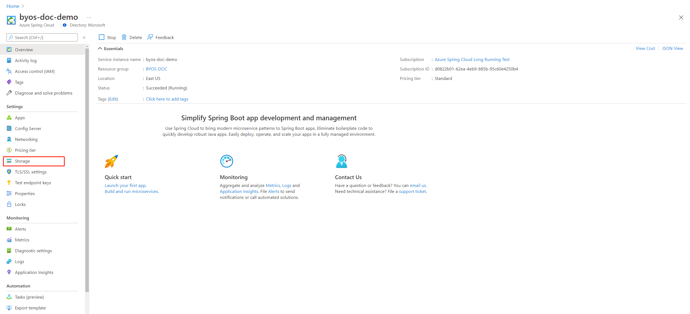
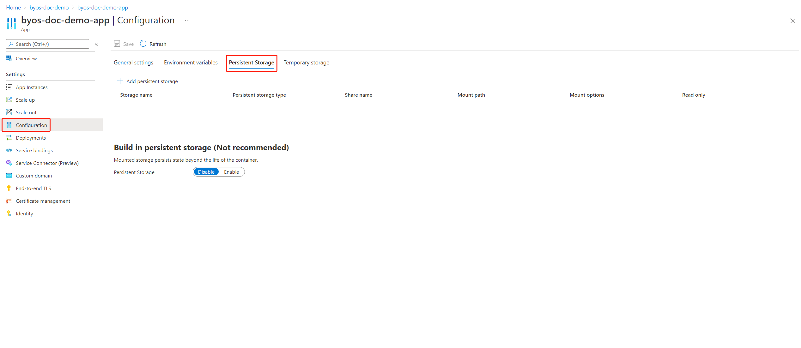

# How to enable your own persistent storage in Azure Spring Cloud

**This article applies to:** ✔️ Java ✔️ C#

This article shows you how to enable your own persistent storage in Azure Spring Cloud.

When you use the built-in persistent storage in Azure Spring Cloud, artifacts generated by your application are uploaded into Azure Storage Accounts. Microsoft controls the encryption-at-rest and lifetime management policies for those artifacts. 

With Bring Your Own Storage, these artifacts are uploaded into a storage account that you control. That means you control the encryption-at-rest policy, the lifetime management policy and network access. You will, however, be responsible for the costs associated with that storage account.

## Prerequisites

* An existing Azure Storage Account and a pre-created Azure File Share. If you need to create a storage account and file share in Azure, see [Create an Azure file share](../storage/files/storage-how-to-create-file-share.md).
* The [Azure Spring Cloud extension](/cli/azure/azure-cli-extensions-overview) for the Azure CLI

## Mount your own extra persistent storage to Applications

#### [Portal](#tab/Azure-portal)
The following procedures bind an Azure Storage account as a storage resource in your Azure Spring Cloud and create an app with your own persistent storage.

1. Go to the service Overview page and select Storage.

   

1. On the Storage page, select **Add storage**, fill out the form on the **Add storage** page and select **Apply**.

   

1. Go the **Apps** page and select an application to mount the persistent storage.
   

1. Select **Configuration** and then select **Persistent Storage**. 
   

1. Select **Add persistent storage** and enter or select this information:


    |Setting     |Value                                                                      |
    |------------|---------------------------------------------------------------------------|
    |Storage name       |Enter *\<storage-resource-name>*                                                            |
    |Persistent storage type        |Select **AzureFileVolume**                                                               |
    |Share name         |Enter *\<azure-file-share-name>*                                                                   |
    |Mount path    |Enter *\<unique-mount-path>*                                                            |
    |Mount options  |Optional property   |
    |Read only |Optional property   |
    Then select **Apply**.

   

1. Select **Save** to apply all the configuration changes.
   


#### [CLI](#tab/Azure-CLI)

You can enable your own storage with the Azure CLI by using the following steps.

1. Use the following command to bind your Azure Storage account as a storage resource in your Azure Spring Cloud instance:

    ```azurecli
   az spring-cloud storage add --storage-type StorageAccount --account-name <account-name> --account-key <account-key>  -g <resource-group-name> -s <spring-instance-name> -n <storage-resource-name>
    ```

1. Use the following command to create an app with your own persistent storage.

    ```azurecli
    az spring-cloud app create -n <app-name> -g <resource-group-name> -s <spring-instance-name> --persistent-storage <path-to-JSON-file>
    ```

    Here's a sample of the JSON file that is passed to the `--persistent-storage` parameter in the create command:

    ```json
    {
       "customPersistentDisks": [
          {
              "storageName": "<Storage-Resource-Name>",
              "customPersistentDiskProperties": {
                  "type": "AzureFileVolume",
                  "shareName": "<Azure-File-Share-Name>",
                  "mountPath": "<Unique-Mount-Path>",
                  "mountOptions": [
                      "uid=0",
                      "gid=0"
                   ],
                   "readOnly": false 
                }
          },
          {
              "storageName": "<Storage-Resource-Name>",
              "customPersistentDiskProperties": {
                  "type": "AzureFileVolume",
                  "shareName": "<Azure-File-Share-Name>",
                  "mountPath": "<Unique-Mount-Path e.g. /test/anotherPath>",
                  "readOnly": true
              }
          }
       ]
    }
    ```

1. Optionally, add extra persistent storage to an existing app using the following command:

    ```azurecli
    az spring-cloud app append-persistent-storage --persistent-storage-type AzureFileVolume --share-name <azure-file-share-name> --mount-path <unique-mount-path> --storage-name <storage-resource-name> -n <app-name> -g <resource-group-name> -s <spring-instance-name>
    ```

1. Optionally, list all existing persistent storage of a specific storage resource using the following command:

   ```azurecli
   az spring-cloud storage list-persistent-storage -g <resource-group-name> -s <spring-instance-name> -n <storage-resource-name>
   ```

## Use best practices

These are best practices to use when adding your own persistent storage to Azure Spring Cloud.

- To avoid potential latency issues, place the Azure Spring Cloud instance and the Azure Storage Account in the same Azure region.

- In the Azure Storage Account, avoid regenerating the account key that's being used. The storage account contains two different keys. Use a step-by-step approach to ensure that the your own persistent storage remains available to the applications during key regeneration. 

   For example, assuming that you used key1 to bind a storage account to Azure Spring Cloud, you would use the following steps:

   1. Regenerate key2.
   1. Update the account key of the storage resource to use the regenerated key2.
   1. Restart the applications that mount the persistent storage from this storage resource. (You can use ```az spring-cloud storage list-persistent-storage``` to list all related applications.)
   1. Regenerate key1.

- If you delete an Azure Storage Account or Azure File Share, remove the corresponding storage resource or persistent storage in the applications to avoid possible errors.

## FAQs

The following are frequently asked questions (FAQ) about using your own persistent storage with Azure Spring Cloud.

- If I have built-in persistent storage enabled, and then I enabled my own storage as extra persistent storage, will my data be migrated into my Storage Account?

   *No. But we're going to provide a document to help you do the migration yourself soon.*

- What are the reserved mount paths?

   *These mount paths are reserved by the Azure Spring Cloud service:*
   - */tmp*
   - */persistent*
   - */secrets*
   - */app-insights/agents*
   - */etc/azure-spring-cloud/certs*
   - */app-insights/agents/settings*
   - */app-lifecycle/settings*

- What are the available mount options?

   *We currently support the following mount options:*
   - `uid`
   - `gid`
   - `file_mode`
   - `dir_mode`
   
   *The `mountOptions` property is optional. The default values for above mount options are: ["uid=0", "gid=0", "file_mode=0777", "dir_mode=0777"]*

## Next steps

* Learn about [how to use Logback to write logs to your own persistent storage ](./how-to-write-log-to-custom-persistent-storage.md).
* Learn how to [manually scale your application](./how-to-scale-manual.md).