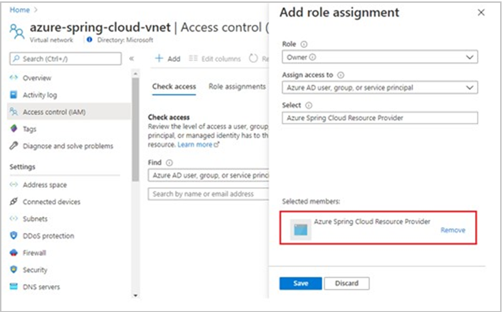
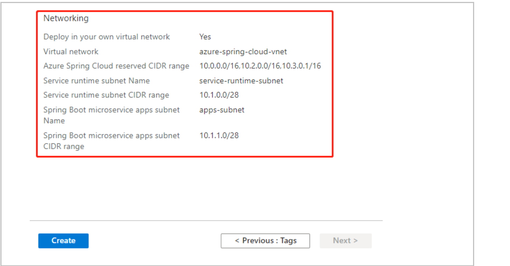

# Deploy Azure Spring Cloud in a virtual network

**This article applies to:** ✔️ Java ✔️ C#

This tutorial explains how to deploy an Azure Spring Cloud instance in your virtual network. This deployment is sometimes called VNet injection.

The deployment enables:

* Isolation of Azure Spring Cloud apps and service runtime from the internet on your corporate network.
* Azure Spring Cloud interaction with systems in on-premises data centers or Azure services in other virtual networks.
* Empowerment of customers to control inbound and outbound network communications for Azure Spring Cloud.

The following video describes how to secure Spring Boot applications using managed virtual networks.

<br>

> [!VIDEO https://www.youtube.com/embed/LbHD0jd8DTQ?list=PLPeZXlCR7ew8LlhnSH63KcM0XhMKxT1k_]

> [!Note]
> You can select your Azure virtual network only when you create a new Azure Spring Cloud service instance. You cannot change to use another virtual network after Azure Spring Cloud has been created.

## Prerequisites

Register the Azure Spring Cloud resource provider **Microsoft.AppPlatform** and **Microsoft.ContainerService** according to the instructions in [Register resource provider on Azure portal](../azure-resource-manager/management/resource-providers-and-types.md#azure-portal) or by running the following Azure CLI command:

```azurecli
az provider register --namespace Microsoft.AppPlatform
az provider register --namespace Microsoft.ContainerService
```

## Virtual network requirements

The virtual network to which you deploy your Azure Spring Cloud instance must meet the following requirements:

* **Location**: The virtual network must reside in the same location as the Azure Spring Cloud instance.
* **Subscription**: The virtual network must be in the same subscription as the Azure Spring Cloud instance.
* **Subnets**: The virtual network must include two subnets dedicated to an Azure Spring Cloud instance:

    * One for the service runtime.
    * One for your Spring Boot microservice applications.
    * There's a one-to-one relationship between these subnets and an Azure Spring Cloud instance. Use a new subnet for each service instance you deploy. Each subnet can only include a single service instance.
* **Address space**: CIDR blocks up to */28* for both the service runtime subnet and the Spring Boot microservice applications subnet.
* **Route table**: By default the subnets do not need existing route tables associated. You can [bring your own route table](#bring-your-own-route-table).

The following procedures describe setup of the virtual network to contain the instance of Azure Spring Cloud.

## Create a virtual network

If you already have a virtual network to host an Azure Spring Cloud instance, skip steps 1, 2, and 3. You can start from step 4 to prepare subnets for the virtual network.

1. On the Azure portal menu, select **Create a resource**. From Azure Marketplace, select **Networking** > **Virtual network**.

1. In the **Create virtual network** dialog box, enter or select the following information:

    |Setting          |Value                                             |
    |-----------------|--------------------------------------------------|
    |Subscription     |Select your subscription.                         |
    |Resource group   |Select your resource group, or create a new one.  |
    |Name             |Enter **azure-spring-cloud-vnet**.                 |
    |Location         |Select **East US**.                               |

1. Select **Next: IP Addresses**.

1. For the IPv4 address space, enter **10.1.0.0/16**.

1. Select **Add subnet**. Then enter **service-runtime-subnet** for **Subnet name** and enter **10.1.0.0/28** for **Subnet address range**. Then select **Add**.

1. Select **Add subnet** again, and then enter **Subnet name** and **Subnet address range**. For example, enter **apps-subnet** and **10.1.1.0/28**. Then select **Add**.

1. Select **Review + create**. Leave the rest as defaults, and select **Create**.

## Grant service permission to the virtual network
Azure Spring Cloud requires **Owner** permission to your virtual network, in order to grant a dedicated and dynamic service principal on the virtual network for further deployment and maintenance.

Select the virtual network **azure-spring-cloud-vnet** you previously created.

1. Select **Access control (IAM)**, and then select **Add** > **Add role assignment**.

    

1. Assign the *Owner* role to the **Azure Spring Cloud Resource Provider**. For detailed steps, see [Assign Azure roles using the Azure portal](../role-based-access-control/role-assignments-portal.md#step-2-open-the-add-role-assignment-pane).

    

    You can also do this step by running the following Azure CLI command:

    ```azurecli
        VIRTUAL_NETWORK_RESOURCE_ID=`az network vnet show \
        --name ${NAME_OF_VIRTUAL_NETWORK} \
        --resource-group ${RESOURCE_GROUP_OF_VIRTUAL_NETWORK} \
        --query "id" \
        --output tsv`

    az role assignment create \
        --role "Owner" \
        --scope ${VIRTUAL_NETWORK_RESOURCE_ID} \
        --assignee e8de9221-a19c-4c81-b814-fd37c6caf9d2
    ```

## Deploy an Azure Spring Cloud instance

To deploy an Azure Spring Cloud instance in the virtual network:

1. Open the [Azure portal](https://portal.azure.com).

1. In the top search box, search for **Azure Spring Cloud**. Select **Azure Spring Cloud** from the result.

1. On the **Azure Spring Cloud** page, select **+ Add**.

1. Fill out the form on the Azure Spring Cloud **Create** page.

1. Select the same resource group and region as the virtual network.

1. For **Name** under **Service Details**, select **azure-spring-cloud-vnet**.

1. Select the **Networking** tab, and select the following values:

    |Setting                                |Value                                             |
    |---------------------------------------|--------------------------------------------------|
    |Deploy in your own virtual network     |Select **Yes**.                                   |
    |Virtual network                        |Select **azure-spring-cloud-vnet**.               |
    |Service runtime subnet                 |Select **service-runtime-subnet**.                |
    |Spring Boot microservice apps subnet   |Select **apps-subnet**.                           |

    

1. Select **Review and create**.

1. Verify your specifications, and select **Create**.

    

After the deployment, two additional resource groups will be created in your subscription to host the network resources for the Azure Spring Cloud instance. Go to **Home**, and then select **Resource groups** from the top menu items to find the following new resource groups.

The resource group named as **ap-svc-rt_{service instance name}_{service instance region}** contains network resources for the service runtime of the service instance.

  

The resource group named as **ap-app_{service instance name}_{service instance region}** contains network resources for your Spring Boot microservice applications of the service instance.

  

Those network resources are connected to your virtual network created in the preceding image.

  

   > [!Important]
   > The resource groups are fully managed by the Azure Spring Cloud service. Do *not* manually delete or modify any resource inside.

## Using smaller subnet ranges

This table shows the maximum number of app instances Azure Spring Cloud supports using smaller subnet ranges.

| App subnet CIDR | Total IPs | Available IPs | Maximum app instances                                        |
| --------------- | --------- | ------------- | ------------------------------------------------------------ |
| /28             | 16        | 8             | <p> App with 1 core:  96 <br/> App with 2 cores: 48<br/>  App with 3 cores: 32 <br/> App with 4 cores: 24 </p> |
| /27             | 32        | 24            | <p> App with 1 core:  228<br/> App with 2 cores: 144<br/>  App with 3 cores: 96 <br/>  App with 4 cores: 72</p> |
| /26             | 64        | 56            | <p> App with 1 core:  500<br/> App with 2 cores: 336<br/>  App with 3 cores: 224<br/>  App with 4 cores: 168</p> |
| /25             | 128       | 120           | <p> App with 1 core:  500<br> App with 2 cores:  500<br>  App with 3 cores:  480<br>  App with 4 cores: 360</p> |
| /24             | 256       | 248           | <p> App with 1 core:  500<br/> App with 2 cores:  500<br/>  App with 3 cores: 500<br/>  App with 4 cores: 500</p> |

For subnets, five IP addresses are reserved by Azure, and at least three IP addresses are required by Azure Spring Cloud. At least eight IP addresses are required, so /29 and /30 are nonoperational.

For a service runtime subnet, the minimum size is /28. This size has no bearing on the number of app instances.

## Bring your own route table

Azure Spring Cloud supports using existing subnets and route tables.

If your custom subnets do not contain route tables, Azure Spring Cloud creates them for each of the subnets and adds rules to them throughout the instance lifecycle. If your custom subnets contain route tables, Azure Spring Cloud acknowledges the existing route tables during instance operations and adds/updates and/or rules accordingly for operations.

> [!Warning] 
> Custom rules can be added to the custom route tables and updated. However, rules are added by Azure Spring Cloud and these must not be updated or removed. Rules such as 0.0.0.0/0 must always exist on a given route table and map to the target of your internet gateway, such as an NVA or other egress gateway. Use caution when updating rules when only your custom rules are being modified.


### Route table requirements

The route tables to which your custom vnet is associated must meet the following requirements:

* You can associate your Azure route tables with your vnet only when you create a new Azure Spring Cloud service instance. You cannot change to use another route table after Azure Spring Cloud has been created.
* Both the microservice application subnet and the service runtime subnet must associate with different route tables or neither of them.
* Permissions must be assigned before instance creation. Be sure to grant **Azure Spring Cloud Resource Provider** the *Owner* permission to your route tables.
* The associated route table resource cannot be updated after cluster creation. While the route table resource cannot be updated, custom rules can be modified on the route table.
* You cannot reuse a route table with multiple instances due to potential conflicting routing rules.

## Next steps

[Deploy Application to Azure Spring Cloud in your VNet](https://github.com/microsoft/vnet-in-azure-spring-cloud/blob/master/02-deploy-application-to-azure-spring-cloud-in-your-vnet.md)

## See also

- [Troubleshooting Azure Spring Cloud in VNET](https://github.com/microsoft/vnet-in-azure-spring-cloud/blob/master/05-troubleshooting-azure-spring-cloud-in-vnet.md)
- [Customer Responsibilities for Running Azure Spring Cloud in VNET](https://github.com/microsoft/vnet-in-azure-spring-cloud/blob/master/06-customer-responsibilities-for-running-azure-spring-cloud-in-vnet.md)
