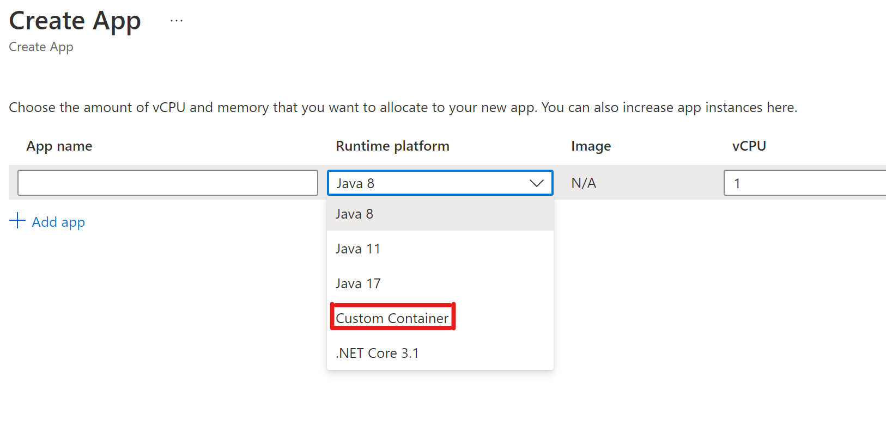
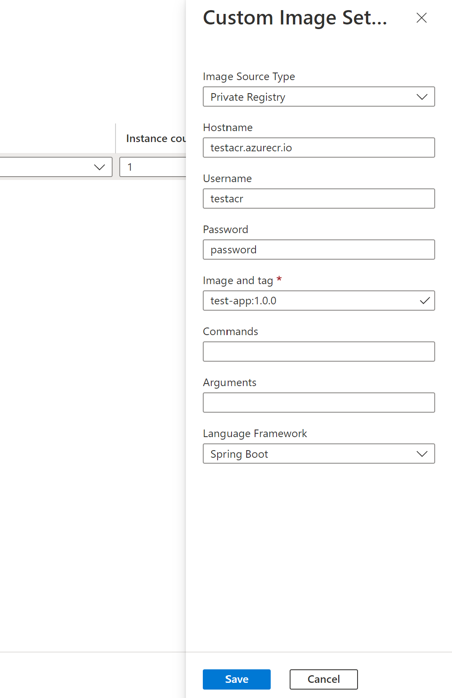

# Deploy with custom container image


## Intro
Customer can deploy Spring Boot applications with container image, and enjoy almost the same feature support as the JAR deployment.

Customer can also deploy other Java applications or non-Java (polyglot) applications with container image, to accompany the Spring Boot applications on ASC 

  
## Prerequisites 
* Built A container image containing the applicaiton
* Pushed the image to a image registry ([Azure Container Registry](https://docs.microsoft.com/en-us/azure/container-instances/container-instances-tutorial-prepare-acr) / Docker Hub)
  

## Limitations
The web application must listen to port 1025. The way of change the port depends on the framework of the application. For example, specify `SERVER_PORT=1025` for Spring Boot application or `ASPNETCORE_URLS=http://+:1025/` for ASP.Net Core application.


## Deploy your application 

### CLI
Deploy a container image on the public Docker Hub to an app.
```
az spring-cloud app deploy -n MyApp -s MyCluster -g MyResourceGroup --container-image
contoso/your-app:v1
```

Deploy a container image on a private registry to an app.
```
az spring-cloud app deploy -n MyApp -s MyCluster -g MyResourceGroup --container-image
contoso/your-app:v1 --container-registry myacr.azurecr.io --registry-username <username>
--registry-password <password>
```

If the entrypoint of the image needs to be overwrite, then the two arguments can be added:
```
--container-command "java" --container-args "-jar /app.jar -Dkey=value"
```


### Portal


  

## Feature Support matrix 

| Feature  | Spring Boot Apps - container deployment  | Polyglot Apps - container deployment  | Notes  |
|---|---|---|---|
| App lifecycle management                                        | Y | Y |   |
| Support for container registries                                | Y | Y |   | 
| Assign endpoint                                                 | Y | Y |   |
| Azure Monitor                                                   | Y | Y |   |
| APM integration                                                 | Y | Y | Supported by [manual installation](#how-to-install-an-apm-into-the-image-manually)  |
| Blue/green deployment                                           | Y | Y |   |
| Custom domain                                                   | Y | Y |   |
| Scaling - auto scaling                                          | Y | Y |   |
| Scaling - manual scaling (in/out, up/down)                      | Y | Y |   |
| Managed Identity                                                | Y | Y |   |
| Spring Cloud Eureka & Config Server                             | Y | N |   |
| API portal for VMware Tanzu®                                    | Y | Y |   |
| Spring Cloud Gateway for VMware Tanzu®                          | Y | Y |   |
| Application Configuration Service for VMware Tanzu®             | Y | N |   |
| VMware Tanzu® Service Registry                                  | Y | N |   |
| VNET                                                            | Y | Y |   |
| Outgoing IP Address                                             | Y | Y |   |
| E2E TLS                                                         | Y | Y | Trust a self-signed CA is supported by [manual installation](#how-to-trust-a-ca-in-the-image)  |
| Liveness and readiness settings                                 | Y | Y |   |
| Advanced troubleshooting - thread/heap/JFR dump                 | Y | N |   |
| Bring your own storage                                          | Y | Y |   |
| Integrate service binding with Resource Connector               | Y | N |   |
| Availability Zone                                               | Y | Y |   |
| App Lifecycle events                                            | Y | Y |   |
| Reduced app size - 0.5 vCPU and 512 MB                          | Y | Y |   |
| Automate app deployments with Terraform                         | Y | Y |   |
| Soft Deletion                                                   | Y | Y |   |
| Interactive diagnostic experience (AppLens-based)               | Y | Y |   |
| SLA                                                             | Y | Y |   |
  
Note: Polyglot includes non-Spring Boot Java apps and NodeJS, AngularJS, Python, .NET apps 


## Common Issues 

### How to trust a CA in the image?
Add the following lines into your `Dockerfile`:
```
# Debian / Ubuntu based image
ADD EnterpriseRootCA.crt /usr/local/share/ca-certificates/
RUN /usr/sbin/update-ca-certificates
``` 

For Java application, you also need to import it into the truststore:
```
RUN keytool -keystore /etc/ssl/certs/java/cacerts -storepass changeit -noprompt -trustcacerts -importcert -alias EnterpriseRootCA -file /usr/local/share/ca-certificates/EnterpriseRootCA.crt
```


### Don't push and overwrite a image without tag change
When your application is restarted or scaled out, the latest image will be always pulled. If the image has been changed during this period, the newly started application instances will use the new image while the old instances will use the old image, which may lead to unexpected application behavior.


### How to install an APM into the image manually?
The installation steps vary on different APM and languages. Take `AppDynamics` with Java application as the example, modify the `Dockerfile` with the following steps:
1. Download and install the agent file into the image: `ADD newrelic-agent.jar /opt/agents/newrelic/java/newrelic-agent.jar`
1. Add the environment variables required by the APM: 
    ```
    ENV NEW_RELIC_APP_NAME=appName
    ENV NEW_RELIC_LICENSE_KEY=newRelicLicenseKey
    ``` 
1. Modify the image entrypoint: `java -javaagent:/opt/agents/newrelic/java/newrelic-agent.jar`

For more infomation, please see the following docs:
* https://github.com/MicrosoftDocs/azure-docs/blob/main/articles/spring-cloud/how-to-new-relic-monitor.md#activate-the-new-relic-java-in-process-agent
* https://github.com/MicrosoftDocs/azure-docs/blob/main/articles/spring-cloud/how-to-appdynamics-java-agent-monitor.md
* https://github.com/MicrosoftDocs/azure-docs/blob/main/articles/spring-cloud/how-to-dynatrace-one-agent-monitor.md


### Troubleshooting the container logs
The check the console logs of your container application, the following CLI subcommand can be used:
```
az spring-cloud app logs -n <app name> -g <resource group> -s <service name> -i <app instance name>
```

Or if the application can't be started without any console logs, the container events logs can be searched from the Azure Monitor:

```
AppPlatformContainerEventLogs 
| where App == "hw-20220317-1b"
```


### Advanced troubleshooting (thread dump, heap dump, etc., Spring Boot only) by CLI 
It's same with the normal applications and can be referenced here: https://docs.microsoft.com/en-us/azure/spring-cloud/how-to-capture-dumps


### Scan the vulnerabilities of the images
We recommend use Microsoft Defender for Cloud with ACR to keep your images from various vunerabilities. More details please see: https://docs.microsoft.com/en-us/azure/defender-for-cloud/defender-for-containers-introduction?tabs=defender-for-container-arch-aks#scanning-images-in-acr-registries


### How to switch from JAR deployment to container deployment or vice versa? 
The deployment type can be switched by `az spring-cloud app deploy` directly. The application is also supported to create multiple deployment types by `az spring-cloud app deployment create`.
