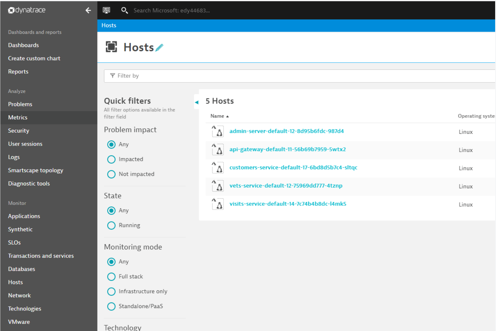
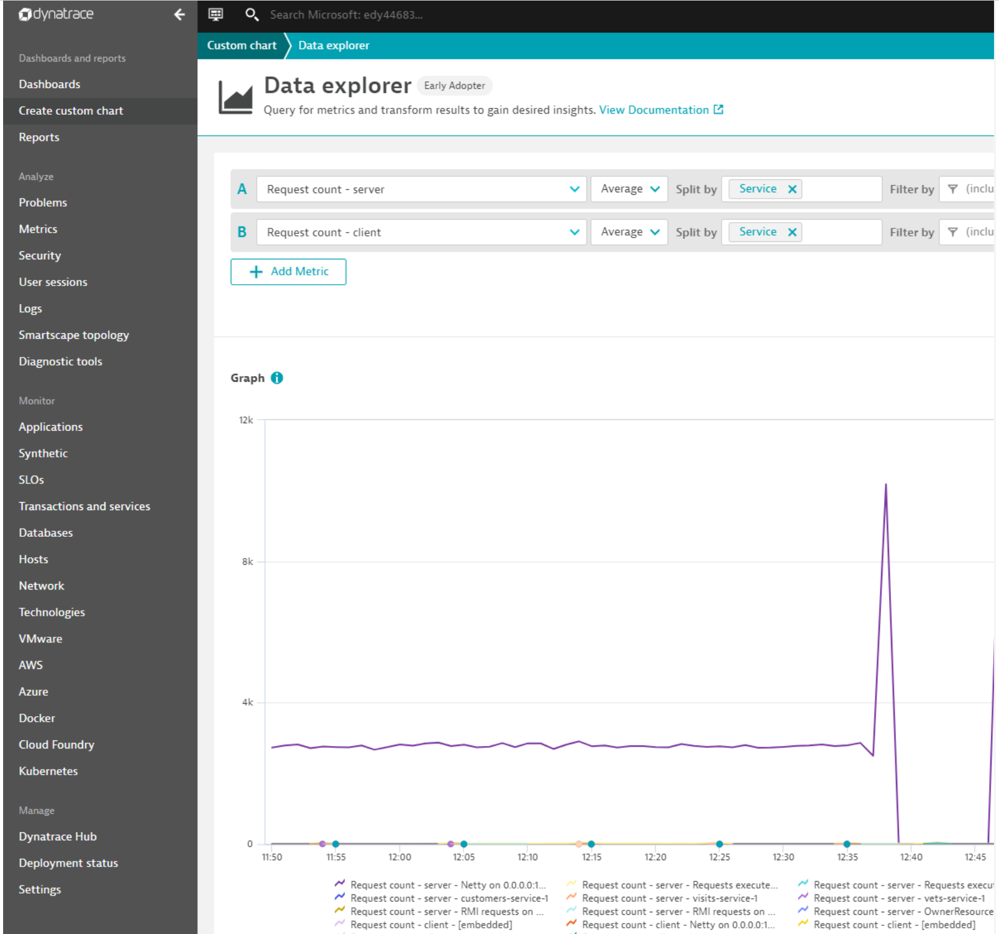

# Use Dynatrace Java OneAgent (Preview)

Ths document explains how to use **Dynatrace OneAgent** to monitor Azure Spring Cloud applications.  You can:

* Consume the **Dynatrace OneAgent**.
* Configure the **Dynatrace OneAgent** by **Environment Variables**.
* Check all monitoring data from **Dynatrace** dashboard.

## Prerequisite
You will need the following to use these features:
* **Dynatrace** account.
* [Azure CLI](https://docs.microsoft.com/en-us/cli/azure/install-azure-cli).

## Leverage Dynatrace OneAgent
To set up **Dynatrace OneAgent**, create an application using an instance of Azure Spring Cloud. 

  ```shell
  az spring-cloud app create --name "appName" --is-public true \
      -s "resourceName" -g "resourceGroupName"
  ```

Create a deployment with the **Dynatrace** agent and configure **Environment Variables**.

  ```shell
  az spring-cloud app deploy --name "appName" --jar-path app.jar \
     -s "resourceName" -g "resourceGroupName" \
     --env DT_TENANT=dynatraceTenant DT_TENANTTOKEN=dynatraceTenantToken \
           DT_CONNECTION_POINT=DynatraceConnectionPoint
  ```

  Azure Spring Cloud pre-installs the **Dynatrace OneAgent** to contain the base image. Customers can leverage environment variables like `DT_TENANT`, `DT_TENANTTOKEN` and `DT_CONNECTION_POINT` to configure **OneAgent** from applications.  For more details see [Dynatrace OneAgent environment variables](https://www.dynatrace.com/support/help/technology-support/cloud-platforms/kubernetes/other-deployments-and-configurations/deploy-oneagent-on-kubernetes-for-application-only-monitoring/#expand-container-build-time-injection-3578).


## Portal

* You can also configure **OneAgent** from the Azure portal with existing applications.

  

* Click an applications to jump to the **Overview** page of the application.

  

* Click **Configurations** to add/update/delete the **Environment Variables** of the application.

  

* View the **Hosts** page from the **Dynatrace** dashboard.

  

* View application **Host** details from the **Dynatrace** dashboard.

  

* View the **Metrics** page of the application from the **Dynatrace** dashboard.

  

## Dynatrace OneAgent Logging

By default, Azure Spring Cloud will print the **info** level logs of the **Dynatrace OneAgent** to `STDOUT`. The logs will be mixed with the application logs. You can find the explicit agent version from the application logs.

You can also get the logs of **Dynatrace** agent from:

* Azure Spring Cloud Logs.
* Azure Spring Cloud Application Insights.
* Azure Spring Cloud LogStream.

You can leverage some environment variables provided by **Dynatrace** to configure logging of the **Dynatrace OneAgent**. For example, `DT_LOGLEVELCON` controls the level of logs. You can find more details from [Dynatrace Environment Variables](https://docs.newrelic.com/docs/agents/java-agent/configuration/java-agent-configuration-config-file/#Environment_Variables).

> [!CAUTION]
>
> We strongly recommend that you _do not_ override the logging default behavior provided by Azure Spring Cloud for Dynatrace. If you do, the logging scenarios above will be blocked, and the log file(s) may be lost. For example, you should not output the following environment variable to you applications.
>
> * DT_LOGLEVELFILE

## Dynatrace OneAgent Update/Upgrade

The **Dynatrace OneAgent** will update/upgrade regularly with JDK (quarterly). Agent update/upgrade may impact the following scenarios.

* Existing applications using **Dynatrace OneAgent** before update/upgrade will be unchanged.
* Existing applications that use **Dynatrace OneAgent** before update/upgrade require restart or redeploy to engage new version of **Dynatrace OneAgent**.
* Applications created after update/upgrade will use the new version of **Dynatrace OneAgent**.

## Vnet Injection Instance Outbound Traffic Configuration

For vnet injection instances of Azure Spring Cloud, you need to make sure the outbound traffic is configured correctly for **Dynatrace OneAgent**. For details see [Communication Endpoints of Dynatrace](https://www.dynatrace.com/support/help/dynatrace-api/environment-api/deployment/oneagent/get-connectivity-info/?response-parameters%3C-%3Ejson-model=json-model).

## See also
* [Use distributed tracing with Azure Spring Cloud](how-to-distributed-tracing.md)