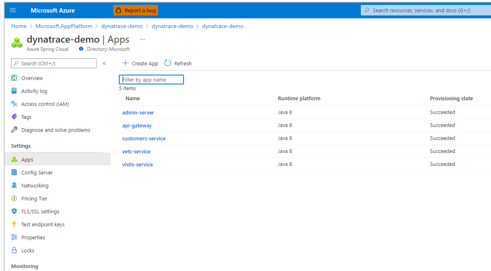
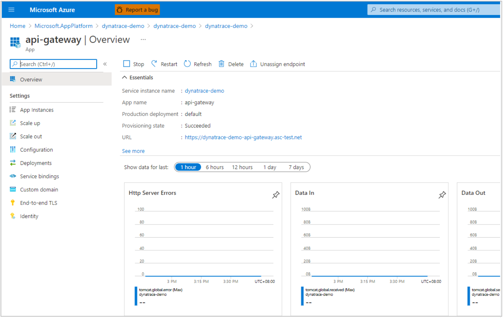
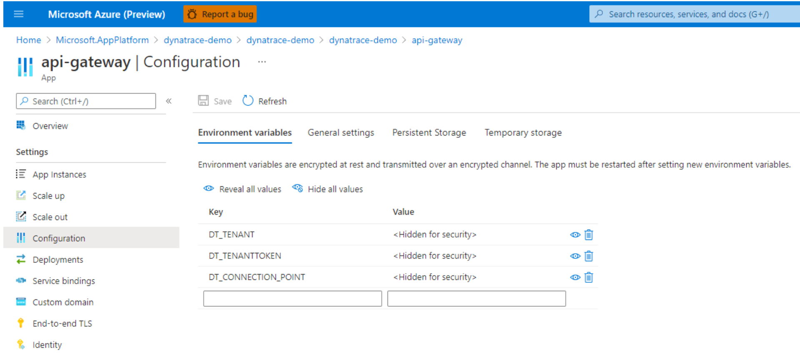
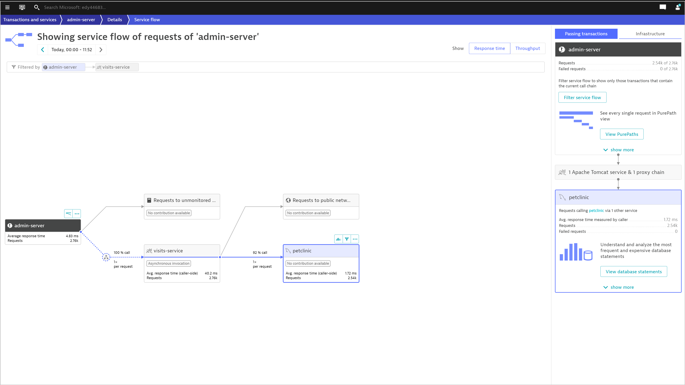
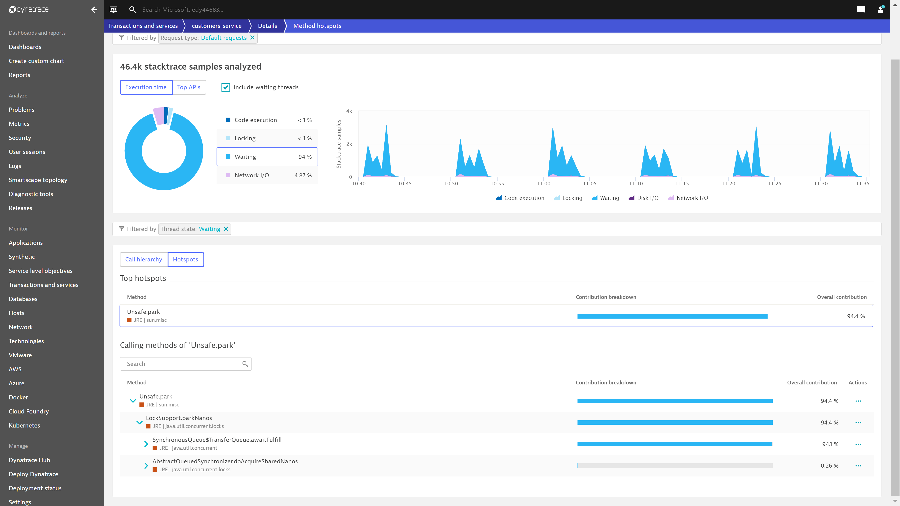
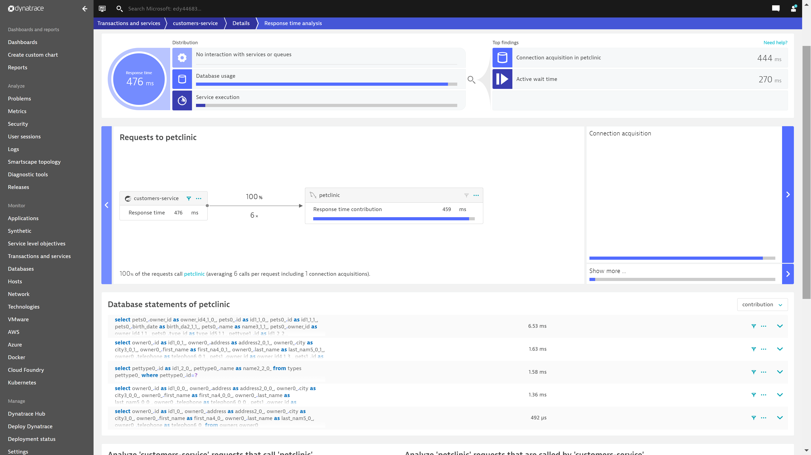
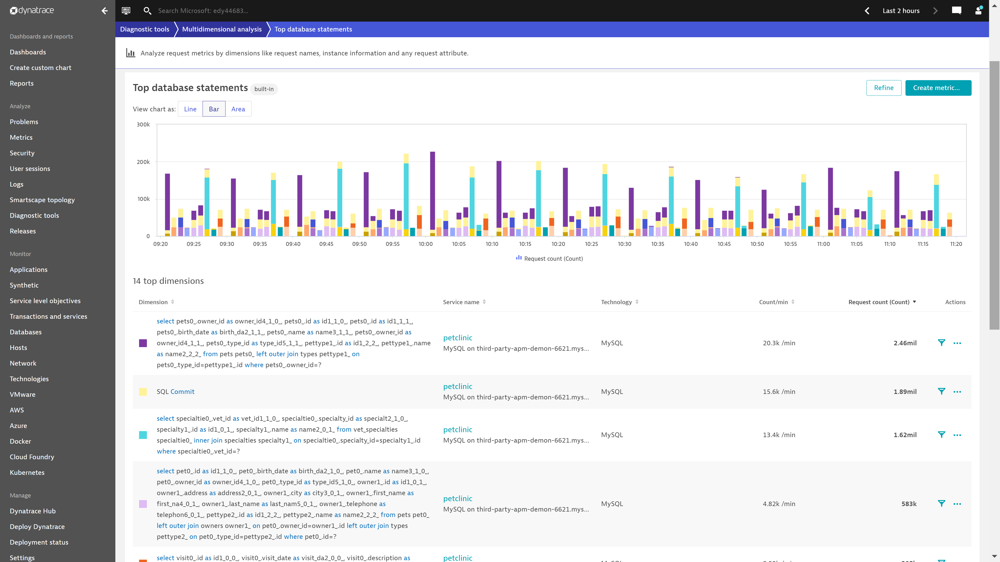
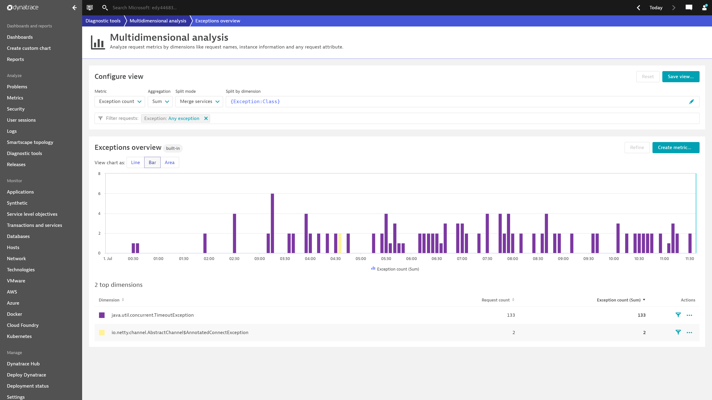
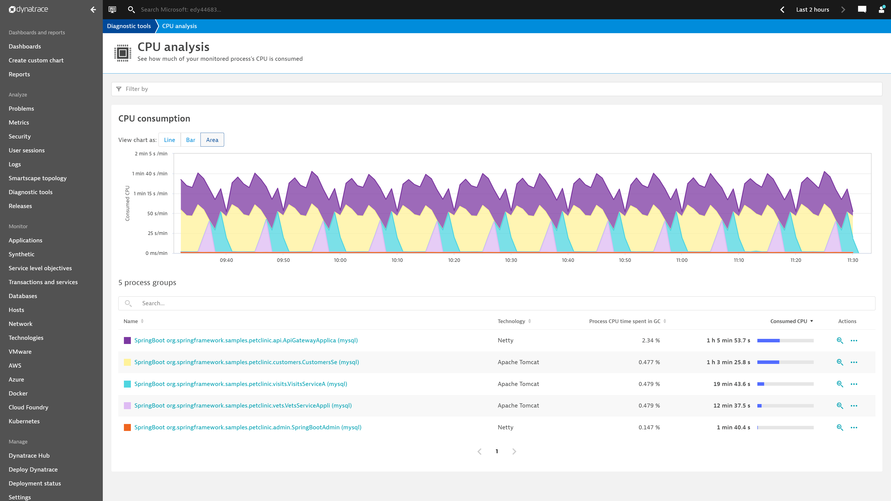
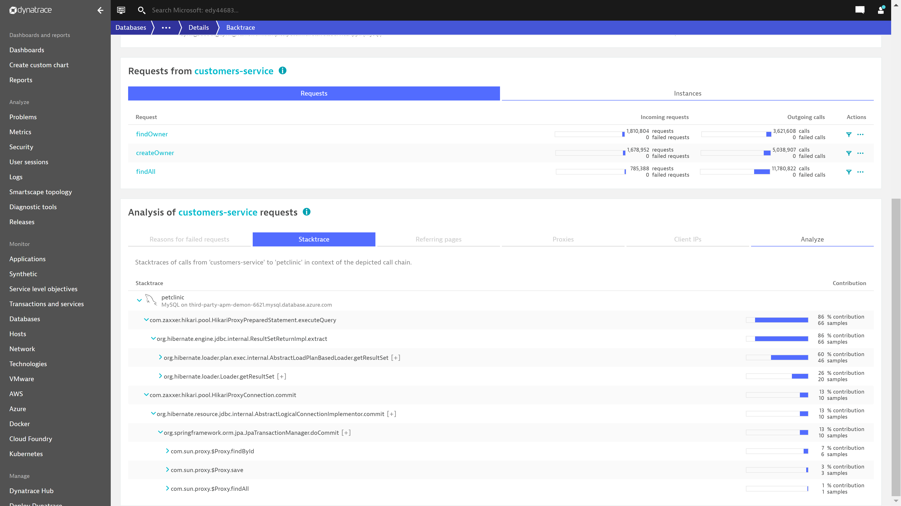

# Dynatrace Spring Cloud OneAgent (Preview)

> [!Note]
> This document is in progress and will undergo further editorial review.

This article explains how to use Dynatrace OneAgent to monitor Azure Spring Cloud applications.

With the Dynatrace OneAgent you can:

* Monitor apps with the Dynatrace OneAgent.
* Configure the Dynatrace OneAgent by using environment variables.
* Check all monitoring data from Dynatrace dashboard.

## Prerequisites

* A Dynatrace account
* [Install Azure CLI](/cli/azure/install-azure-cli)
* Create a [PaaS token](https://www.dynatrace.com/support/help/reference/dynatrace-concepts/access-tokens/)

## Set up integration 

To set up integration, use the instructions in the following sections.

### Prepare your environment using the Azure portal

1. In the Azure portal, create an instance of Azure Spring Cloud.
1. In the new Azure Spring Cloud instance, create a resource group where Dynatrace will be deployed.
1.  In the new resource group, create an application that you want to report to Dynatrace by running the following command. Replace the placeholders *\<...>* with your own values.

   ```azurecli
   az spring-cloud app create --name <your-application-name> --is-public true -s <your-resource-name> -g <your-resource-group-name>
   ```

### Determine the values for the required environment variables

To set up OneAgent integration on your Azure Spring Cloud instance, you need to configure three environment variables: `DT_TENANT`, `DT_TENANTTOKEN`, and `DT_CONNECTION_POINT`. Please refer to [Integrate AppDynamics OneAgent with Azure Spring Cloud](https://docs.microsoft.com) (Note: **The link is pending on Dynatrace Side now**)

### Add the environment variables to your application

When you have the values for the environment variables required for OneAgent integration, you can add the respective key/value pairs to your application using either the Azure portal or the Azure CLI. The following sections provide instructions for each of these options.

#### Azure CLI

To add the key/value pairs using the Azure CLI, run the following command, replacing the placeholders *\<...>* with the values determined in the previous steps.

```azurecli
az spring-cloud app deploy --name <your-application-name> --jar-path app.jar \
    -s <your-resource-name> -g <your-resource-group-name> --env DT_TENANT=<your-environment-ID> \
    DT_TENANTTOKEN=<your-tenant-token> DT_CONNECTION_POINT=<your-communication-endpoint>
```

#### Portal

To add the key/value pairs using the Azure portal, use the following steps:

1. Navigate to the list of your existing applications.

   

1. Select an application to navigate to the **Overview** page of the application.

   

1. Select **Configurations** to add, update, or delete values int he the **Environment variables** section for the application.

   

## View reports in Dynatrace

>Note: Since the Dynatrace menu will evolve its layout gradually, so the dashboard may be moved to other sections in Dynatrace website.

After you add the environment variables to your application, Dynatrace starts collecting data. To view reports, use the [Dynatrace menu](https://www.dynatrace.com/support/help/get-started/navigation/), go to **Services**, and then select your application.

* You can find the **Service flow** from **yourAppName/Details/Service flow**:
   

* You can find the **Method hotspots** from **yourAppName/Details/Method hotspots**:
   

* You can find the **Database statements** from **yourAppName/Details/Response time analysis**:
   

You can go to **Multidimensional analysis** section

* You can find the **Top database statements** from **Multidimensional analysis/Top database statements**:

  

* You can find the **Exceptions overview** from **Multidimensional analysis/Exceptions overview**:

  

You can go to **Profiling and optimization** section

* You can find the **CPU analysis** from the following blade:

  

You can go to **Database** section

* You can find **Backtrace** from the following blade:

  

## Dynatrace OneAgent Logging

By default, Azure Spring Cloud will print the **info** level logs of the Dynatrace OneAgent to `STDOUT`. The logs will be mixed with the application logs. You can find the explicit agent version from the application logs.

You can also get the logs of the Dynatrace agent from the following locations:

* Azure Spring Cloud Logs.
* Azure Spring Cloud Application Insights.
* Azure Spring Cloud LogStream.

You can leverage some environment variables provided by Dynatrace to configure logging for the Dynatrace OneAgent. For example, `DT_LOGLEVELCON` controls the level of logs. For more information, see [Dynatrace Environment Variables](https://docs.newrelic.com/docs/agents/java-agent/configuration/java-agent-configuration-config-file/#Environment_Variables).

> [!CAUTION]
>
> We strongly recommend that you do not override the default logging behavior provided by Azure Spring Cloud for Dynatrace. If you do, the logging scenarios above will be blocked, and the log file(s) may be lost. For example, you should not output the `DT_LOGLEVELFILE` environment variable to your applications.

## Dynatrace OneAgent update or upgrade

The Dynatrace OneAgent will update or upgrade quarterly with the JDK. Agent update or upgrade may impact the following scenarios:

* Existing applications using Dynatrace OneAgent before update or upgrade will be unchanged.
* Existing applications that use Dynatrace OneAgent before update or upgrade require restart or redeploy to engage the new version of Dynatrace OneAgent.
* Applications created after update or upgrade will use the new version of Dynatrace OneAgent.

## VNet injection instance outbound traffic configuration

For VNet injection instances of Azure Spring Cloud, you need to make sure the outbound traffic is configured correctly for Dynatrace OneAgent. For details, see [Communication Endpoints of Dynatrace](https://www.dynatrace.com/support/help/dynatrace-api/environment-api/deployment/oneagent/get-connectivity-info/?response-parameters%3C-%3Ejson-model=json-model).

## Dynatrace Support Model
Refer to [Dynatrace OneAgent platform and capability support matrix](https://www.dynatrace.com/support/help/technology-support/oneagent-platform-and-capability-support-matrix/#cloud-application-platforms)

## Next steps

* [Use distributed tracing with Azure Spring Cloud](how-to-distributed-tracing.md)
