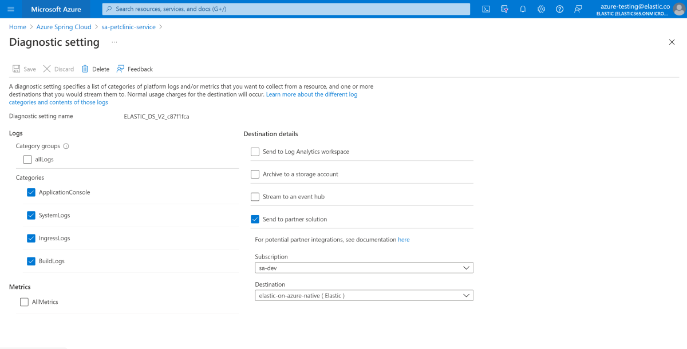
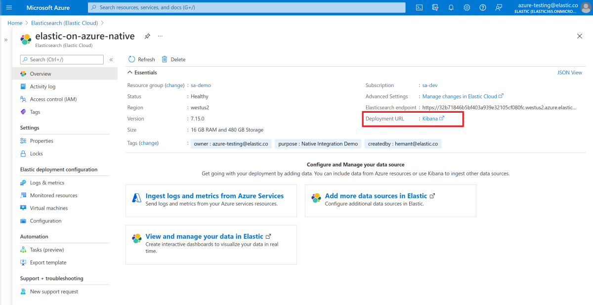
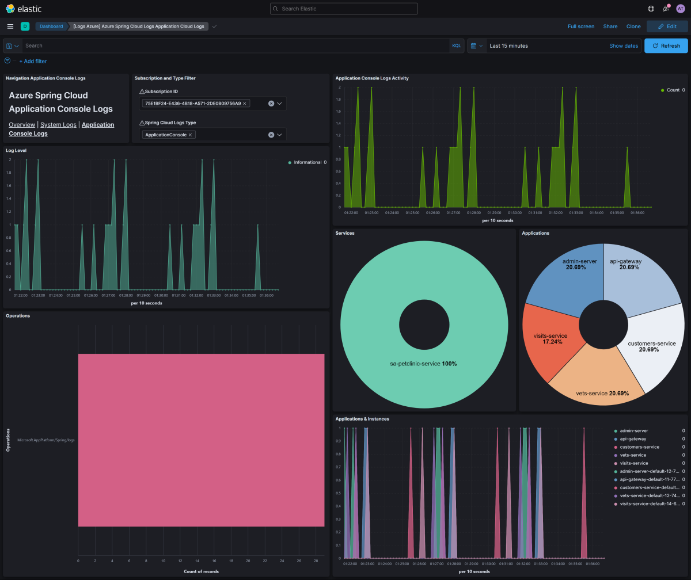
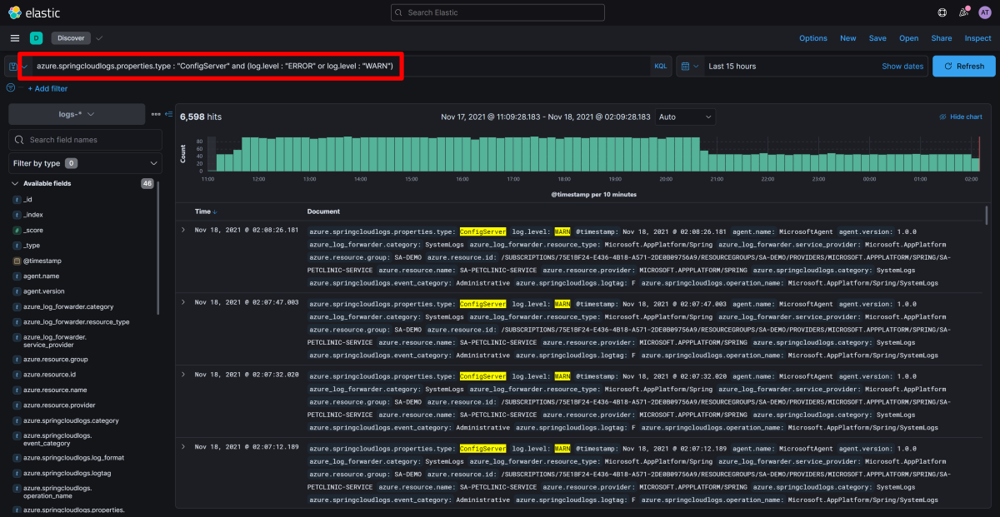
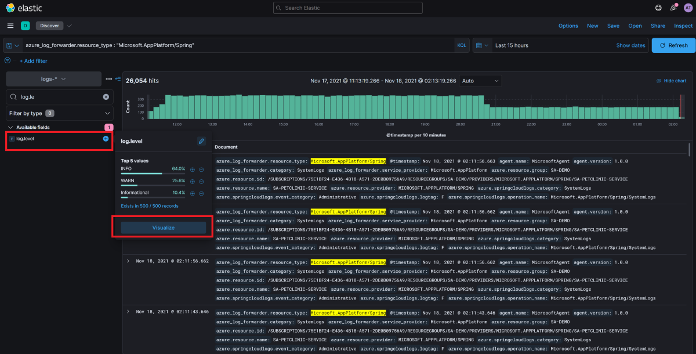

# Analyze logs with Elastic (ELK) using diagnostics settings

**This article applies to:** ✔️ Java ✔️ C#

Using the diagnostics functionality of Azure Spring Cloud, you can analyze logs with Elastic (ELK).

## Configure diagnostics settings

1. In the Azure portal, go to your Azure Spring Cloud instance.
1. Select **diagnostics settings** option, and then select **Add diagnostics setting**.
1. Enter a name for the setting, and then choose **Send to partner solution** , select **Elastic** and an Elastic deployment where you want to send the logs.
1. Select **Save**.

   

> [!NOTE]
> There might be a gap of up to 15 minutes between when logs are emitted and when they appear in your Elastic deployment.
> If the Azure Spring Cloud instance is deleted or moved, the operation will not cascade to the **diagnostics settings** resources. The **diagnostics settings** resources have to be deleted manually before the operation against its parent, the Azure Spring Cloud instance. Otherwise, if a new Azure Spring Cloud instance is provisioned with the same resource ID as the deleted one, or if the Azure Spring Cloud instance is moved back, the previous **diagnostics settings** resources continue extending it.

## Analyze the logs with Elastic

To learn more about deploying Elastic on Azure, see [How to deploy and manage Elastic on Microsoft Azure](https://www.elastic.co/blog/getting-started-with-the-azure-integration-enhancement).

1. From the Elastic deployment overview page in the Azure portal, open **Kibana**.

   

1. In Kibana in the Search bar at top type **Spring Cloud type:dashboard**

   

1. Select **[Logs Azure] Azure Spring Cloud logs Overview** from the results.

   

1. You can search on out of the box Azure Spring Cloud dashboards by using the queries such as the following:

   ```query
   azure.springcloudlogs.properties.app_name : "visits-service"
   ```

## Analyze the logs with Kibana Query Language in Discover

Application logs provide critical information and verbose logs about your application's health, performance, and more. In the next sections are some simple queries to help you understand your application's current and past states.

1. In Kibana in the Search bar at top type **Discover**, and click on the result

   

2. In **Discover** app select **logs-** index pattern if it's not already selected.

   

To learn more about different queries , see [Guide to Kibana Query Language](https://www.elastic.co/guide/en/kibana/current/kuery-query.html).

### Show all logs from Azure Spring Cloud

To review a list of application logs from Azure Spring Cloud, sorted by time with the most recent logs shown first, run the following query in the **Search** box:

```query
azure_log_forwarder.resource_type : "Microsoft.AppPlatform/Spring"
```


### Show specific Log types from Azure Spring Cloud

To review a list of application logs from Azure Spring Cloud, sorted by time with the most recent logs shown first, run the following query in the **Search** box:

```query
azure.springcloudlogs.category : "ApplicationConsole"
```


### Show logs entries containing errors or exceptions

To review unsorted log entries that mention an error or exception, run the following query:

```query
azure_log_forwarder.resource_type : "Microsoft.AppPlatform/Spring" and (log.level : "ERROR" or log.level : "EXCEPTION")
```


You would notice as you start typing in that Kibana Query Language helps users form queries with autocomplete and suggestions to make it easy for users to gain insights from the logs.
Use this query to find errors, or modify the query terms to find specific error codes or exceptions.

### Show log entries from a specific service

To review log entries that are generated by a specific service, run the following query:

```query
azure.springcloudlogs.properties.service_name : "sa-petclinic-service"
```


### Show Config Server Logs containing warnings or errors

To review logs from Config Server, run the following query:

```query
azure.springcloudlogs.properties.type : "ConfigServer" and (log.level : "ERROR" or log.level : "WARN")
```



### Show Service Registry Logs

To review logs from Service Registry, run the following query:

```query
azure.springcloudlogs.properties.type : "ServiceRegistry"
```


## Visualizing logs from Azure Spring Cloud with Elastic

### Show the various log levels in your logs to assess overall health of the services

Kibana allows you to visualize data with Dashboards and a rich ecosystem of visualizations. To learn more go to [Dashboard and Visualization](https://www.elastic.co/guide/en/kibana/current/dashboard.html)

1. From the available fields list on left in **Discover**, search for log.level in the search box under **logs-** index pattern

1. Select the **log.level** field. From the floating informational panel about **log.level**, click on **Visualize**

   

1. From here you can choose to add more data from the left pane, or choose from multiple suggestions how you would like to visualize your data

   

## Next steps

* [Quickstart: Deploy your first Spring Boot app in Azure Spring Cloud](quickstart.md)
* [Deploy Elastic on Azure](https://www.elastic.co/blog/getting-started-with-the-azure-integration-enhancement)
