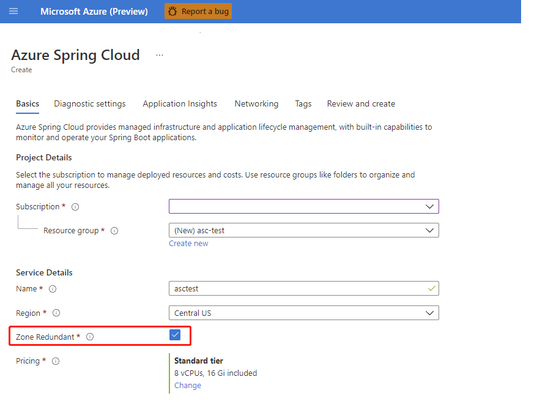

# Create Azure Spring Apps instance with availability zone enabled

> [!NOTE]
> Azure Spring Apps is the new name for the Azure Spring Cloud service. Although the service has a new name, you'll see the old name in some places for a while as we work to update assets such as screenshots, videos, and diagrams.


**This article applies to:** ✔️ Standard tier ✔️ Enterprise tier

> [!NOTE]
> This feature is not available in Basic tier.

This article explains availability zones in Azure Spring Apps, and how to enable them.

In Microsoft Azure, [Availability Zones (AZ)](../availability-zones/az-overview.md) are unique physical locations within an Azure region. Each zone is made up of one or more data centers that are equipped with independent power, cooling, and networking. Availability zones protect your applications and data from data center failures.

When a service in Azure Spring Apps has availability zone enabled, Azure automatically spreads the application's deployment instance across all three zones in the selected region. If the application's deployment instance count is larger than three and is divisible by three, the instances will be spread evenly. Otherwise, the extra instance counts are spread across the remaining zones.

## How to create an instance in Azure Spring Apps with availability zone enabled

>[!NOTE]
> You can only enable availability zone when creating your instance. You can't enable or disable availability zone after creation of the service instance.

You can enable availability zone in Azure Spring Apps using the [Azure CLI](/cli/azure/install-azure-cli) or [Azure portal](https://portal.azure.com).

# [Azure CLI](#tab/azure-cli)

To create a service in Azure Spring Apps with availability zone enabled using the Azure CLI, include the `--zone-redundant` parameter when you create your service in Azure Spring Apps.

```azurecli
az spring create \
    --resource-group <your-resource-group-name> \
    --name <your-Azure-Spring-Cloud-instance-name> \
    --location <location> \
    --zone-redundant true
```

# [Azure portal](#tab/portal)

To create a service in Azure Spring Apps with availability zone enabled using the Azure portal, enable the Zone Redundant option when creating the instance.



---

## Region availability

Azure Spring Apps currently supports availability zones in the following regions:
- Central US
- West US 2
- East US
- Australia East
- North Europe
- East US 2
- West Europe
- South Central US
- UK South
- Brazil South
- France Central

## Pricing

There's no extra cost for enabling the availability zone.

## Next steps

* [Plan for disaster recovery](disaster-recovery.md)