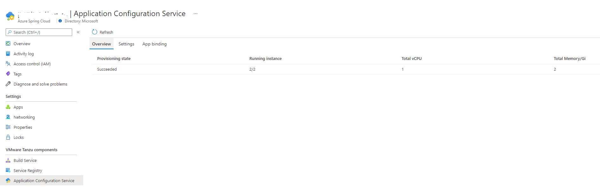
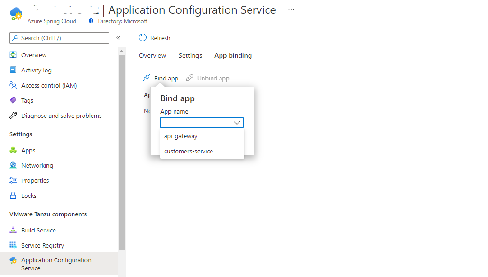
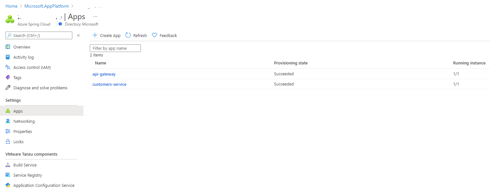

# Application Configuration Service

This article describes the use of Application Configuration Service with Azure Spring Cloud Enterprise Tier.

[Application Configuration Service](https://docs.pivotal.io/tcs-k8s/0-1/) is one of the proprietary VMware Tanzu components. It enables the management of Kubernetes-native ConfigMap resources that are populated from properties defined in one or more Git repositories.

With Application Configuration Service, you have a central place to manage external properties for applications across all environments.

## Prerequisites

- An already provisioned Azure Spring Cloud Enterprise tier service instance with Application Configuration Service enabled. For more information, see [Get started with Enterprise Tier](./get-started-enterprise.md)

   

## Manage Application Configuration Service settings

Application Configuration Service supports Azure DevOps, GitHub, GitLab, and Bitbucket for storing you config file.

To manage the service settings, open the **Settings** section and add a new entry in the **Repositories** section.


The properties for each entry are described in the following table.

| Property | Required? | Explanation |
| - | - | - |
| Name | Yes | A unique name to label each Git repository. |
| Patterns | Yes | Patterns to search in Git repositories. For each pattern, use a format like *{application}* or *{application}/{profile}* instead of *{application}-{profile}.yml*, and separate the patterns with commas. For more information, see the following [Pattern](./how-to-enterprise-application-configuration-service.md#pattern) section. |
| URI | Yes | A Git URI (for example, `https://github.com/Azure-Samples/piggymetrics-config` or `git@github.com:Azure-Samples/piggymetrics-config`) |
| Label | Yes | The branch name to search in the Git repository. |
| Search path | No | Optional search paths, separated by commas, for searching subdirectories of the Git repository. |

### Pattern

Configuration will be pulled from Git backends using what is defined in a pattern, which is combination of *{application}/{profile}* as described in the following list.

- {application} - The name of an application for which the configuration is being retrieved. The value `application` is considered the default application and includes configuration shared across multiple applications. Any other value specifies a specific application and will include properties for both the specified application and shared properties for the default application.
- {profile} - Optional. The name of a profile for which properties may be retrieved. An empty value, or the value `default`, includes properties that are shared across any and all profiles. Non-default values include properties for the specified profile and properties for the default profile.

### Authentication

Application Configuration Service supports three repository types. The following list provides more details.


- Public repository

   You don't need extra Authentication configuration when using a public repository. Just select **Public** in the **Authentication** form.

- Private repository with basic authentication

   The following table shows all the configurable properties used to set up a private Git repository with basic authentication.

   | Property | Required? | Explanation |
   | - | - | - |
   | username | Yes | The username used to access the repository. |
   | password | Yes | The password used to access the repository. |

- Private repository with SSH authentication

   The following table shows all configurable properties used to set up a private Git repository with SSH.

   | Property | Required? | Explanation |
   | - | - | - |
   | Private key | Yes | The private key that identifies the Git user. Passphrase-encrypted private keys are not supported. |
   | Host key | No | The host key of the Git server. If you've connected to the server via Git on the command line, the host key is in your *.ssh/known_hosts* file. Do not include the algorithm prefix as this is specified in `Host key algorithm`. |
   | Host key algorithm | No | The algorithm for `hostKey`: one of `ssh-dss`, `ssh-rsa`, `ecdsa-sha2-nistp256`, `ecdsa-sha2-nistp384`, and `ecdsa-sha2-nistp521`. (Required if supplying `Host key`). |
   | Strict host key checking | No | Optional value that indicates whether the backend should be ignored if it encounters an error when using the provided `Host key`. Valid values are `true` and `false`. The default value is `true`. |

To validate access to the target URI, select **Validate**. After validation is completed successfully, select **Apply** to update the configuration settings.


## Restriction on using Application Configuration Service with apps

There are some restrictions when you use Application Configuration Service with a Git back end.

> [!WARNING]
> To avoid deployment errors, you must not include `spring-cloud-starter-config` in the app's *pom.xml* file.
> <s>
> ```xml
> <dependency>
> <groupId>org.springframework.cloud</groupId>
> <artifactId>spring-cloud-starter-config</artifactId>
> </dependency>
> ```
> </s>

To claim that the app will use the centralized configurations, you must bind the app to Application Configuration Service. After that, you'll need to configure which pattern to be used by the app. Use the following steps to accomplish these tasks:

1. Open the **App binding** tab.

1. Select **Bind app** and choose one app in the dropdown. Select **Apply** to bind.

   

   > [!NOTE]
   > When you change the bind/unbind status, you must restart or redeploy the app to for the binding to take effect.

1. Go to the **Apps** section and choose the [pattern(s)](./how-to-enterprise-application-configuration-service.md#pattern) to be used by the apps.

   a. Open the **Apps** section to list all the apps.

      

   b. Select the target app to configure patterns.

   c. Open the **Configuration** section and find the **General settings** tab. Under the **Config file patterns** property, choose one or more patterns from the dropdown list. Select **Save** to save the changes.

      
