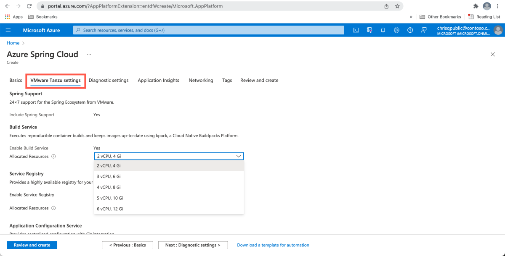
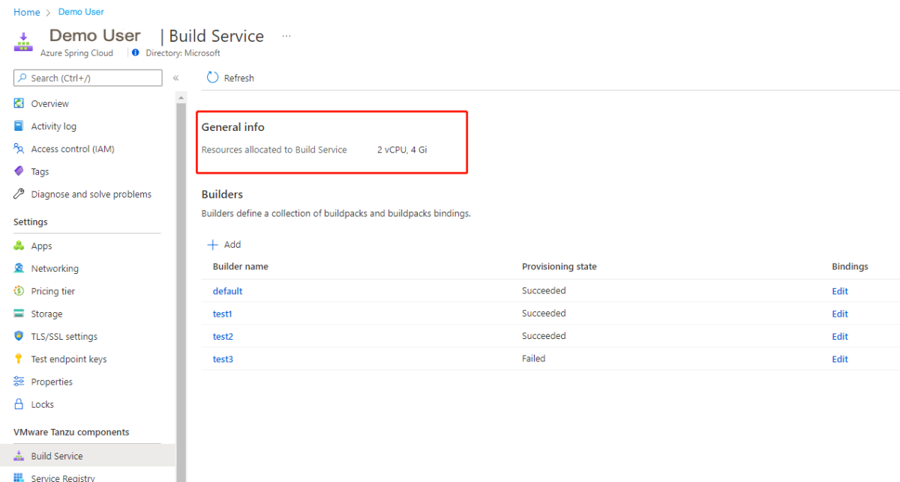
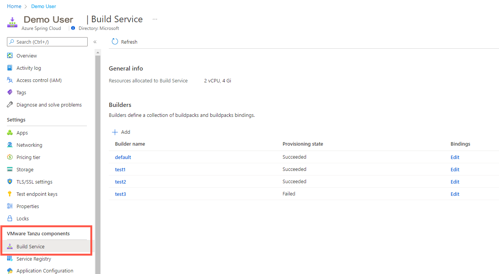
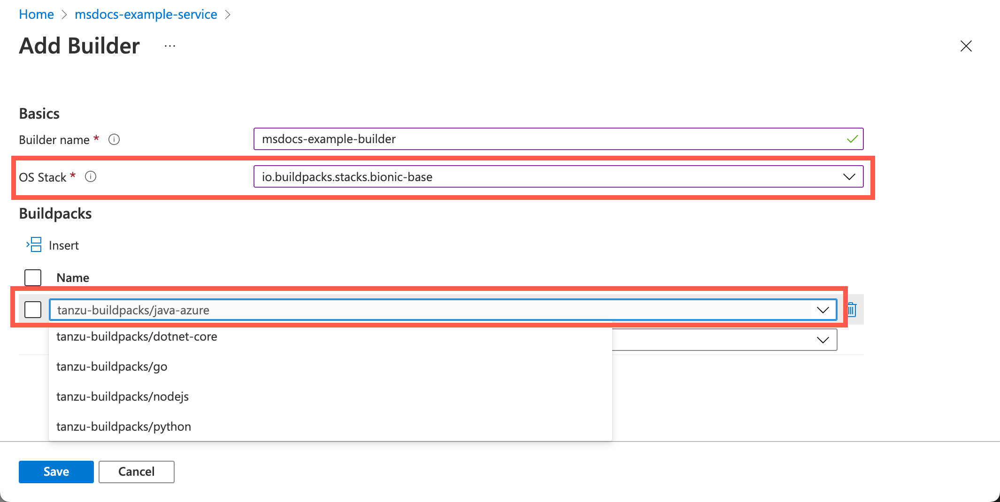
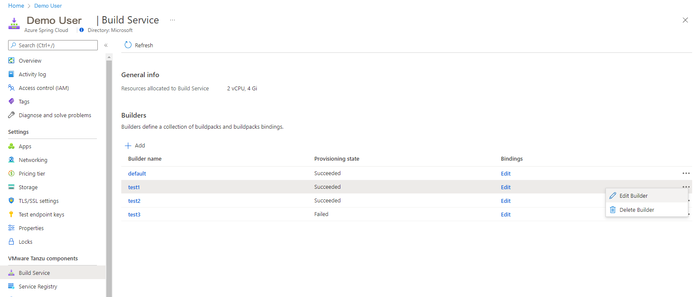

# Use Build Service

This article describes the extra configuration and functionality included in Build Service with Azure Spring Cloud Enterprise Tier.

In Azure Spring Cloud, the existing Standard tier already supports compiling user source code into [OCI images](https://opencontainers.org/) through [Kpack](https://github.com/pivotal/kpack). Kpack is a Kubernetes (K8s) implementation of [Cloud Native Buildpacks (CNB)](https://buildpacks.io/) provided by VMware. This article provides details of the extra configurations and functionality exposed in the Azure Spring Cloud Enterprise tier.

## Build Agent Pool

Build Service in the Enterprise tier is the entry point to containerize user applications from both source code and artifacts. There's a dedicated build agent pool that reserves compute resources for a given number of concurrent build tasks. The build agent pool prevents resource contention with your running apps. You can configure the number of resources given to the build agent pool during or after provisioning a new service instance of Azure Spring Cloud using the **VMware Tanzu settings**.



The Build Agent Pool scale set sizes available are:

   | Scale Set | CPU/Gi        |
   |-----------|---------------|
   | S1        | 2 vCPU, 4 Gi  |
   | S2        | 3 vCPU, 6 Gi  |
   | S3        | 4 vCPU, 8 Gi  |
   | S4        | 5 vCPU, 10 Gi |
   | S5        | 6 vCPU, 12 Gi |

The image below shows the resources allocated to the Build Service Agent Pool after the service instance is provisioned successfully.



## Default Builder and Tanzu Buildpacks

In the Enterprise Tier, a default builder is provided within Build Service with a list of proprietary Tanzu Buildpacks.

Tanzu Buildpacks make it easier to integrate with other software like New Relic. They're configured as optional and will only run with proper configuration. For more information, see the [Buildpack bindings](#buildpack-bindings) section.

The following list shows the Tanzu Buildpacks available in Azure Spring Cloud Enterprise edition:

- tanzu-buildpacks/java-azure
- tanzu-buildpacks/dotnet-core
- tanzu-buildpacks/go
- tanzu-buildpacks/nodejs
- tanzu-buildpacks/python

For details about buildpacks, see [Using the Tanzu Partner Buildpacks](https://docs.pivotal.io/tanzu-buildpacks/partner-integrations/partner-integration-buildpacks.html).

## Create a Customized Builder to build apps

Besides the `default` builder, you can also create custom builders with the provided buildpacks.

All the builders configured in a Spring Cloud Service instance are listed in the **Build Service** section under **VMware Tanzu components**.



Select **Add** to create a new builder. The image below shows the resources used to create the customized builder.



A custom builder can also be edited. You can update the buildpacks or the [OS Stack](https://docs.pivotal.io/tanzu-buildpacks/stacks.html), but the builder name is read only.



You can delete any custom builder, but the `default` builder is read only.

When you deploy an app, you can build the app by specifying a specific builder in the command:

```azurecli
az spring-cloud app deploy \
    --name <app-name> \
    --builder <builder-name> \
    --artifact-path <path-to-your-JAR-file>
```

If the builder isn't specified, the `default` builder will be used.

## Real time build logs

A build task will be triggered when an app is deployed from an Azure CLI command. Build logs are streamed in real-time as part of the CLI command output. See [Analyze logs and metrics with diagnostics settings](./diagnostic-services.md) to diagnose build logs.

## Buildpack bindings

You can configure Kpack Images with Service Bindings as described in the [Cloud Native Buildpacks Bindings specification](https://github.com/buildpacks/spec/blob/adbc70f5672e474e984b77921c708e1475e163c1/extensions/bindings.md). Azure Spring Cloud Enterprise tier uses Service Bindings to integrate with [Tanzu Partner Buildpacks](https://docs.pivotal.io/tanzu-buildpacks/partner-integrations/partner-integration-buildpacks.html). For example, we use Binding to integrate [Azure Application Insights](../azure-monitor/app/app-insights-overview.md) using the [Paketo Azure Application Insights Buildpack](https://github.com/paketo-buildpacks/azure-application-insights).

Currently, buildpack binding only supports binding the buildpacks listed below. Follow the documentation links listed under each type to configure the properties and secrets for buildpack binding.

1. ApplicationInsights

   - [Monitor Apps with Application Insights](./how-to-application-insights.md).

1. NewRelic

   - [New Relic Partner Buildpack](https://docs.pivotal.io/tanzu-buildpacks/partner-integrations/partner-integration-buildpacks.html#new-relic).
   - [New Relic Environment Variables](https://docs.newrelic.com/docs/apm/agents/java-agent/configuration/java-agent-configuration-config-file/#Environment_Variables).

1. Dynatrace

   - [Dynatrace Partner Buildpack](https://docs.pivotal.io/tanzu-buildpacks/partner-integrations/partner-integration-buildpacks.html#dynatrace).
   - [Determine the values for the required environment variables](https://www.dynatrace.com/support/help/shortlink/azure-spring#envvar).

1. AppDynamics

   - [AppDynamic Partner Buildpack](https://docs.pivotal.io/tanzu-buildpacks/partner-integrations/partner-integration-buildpacks.html#appdynamics).
   - [Configure Using the Environment Variables](https://docs.appdynamics.com/21.11/en/application-monitoring/install-app-server-agents/java-agent/monitor-azure-spring-cloud-with-java-agent#MonitorAzureSpringCloudwithJavaAgent-ConfigureUsingtheEnvironmentVariablesorSystemProperties).

1. ElasticAPM

   - [ElasticAPM Partner Buildpack](https://docs.pivotal.io/tanzu-buildpacks/partner-integrations/partner-integration-buildpacks.html#elastic-apm).
   - [Elastic Configuration](https://www.elastic.co/guide/en/apm/agent/java/master/configuration.html).

## Manage buildpack bindings

Buildpack bindings can be managed with the Azure portal, or the Azure CLI.

# [Portal](#tab/azure-portal)

## View buildpack bindings using the Azure portal

Follow these steps to view the current buildpack bindings:

1. Open the [Azure portal](https://ms.portal.azure.com/?AppPlatformExtension=entdf#home).
1. Select **Build Service**.
1. Select **Edit** under the *Bindings* column to view the bindings configured under a builder.

## Unbind a buildpack binding

There are two ways to unbind a buildpack binding. You can either select the **Bound** hyperlink, then **Unbind binding**, or select **Edit Binding** and then select **Unbind**.

If you unbind a binding, the bind status will change from *Bound* to *Unbound*.

# [Azure CLI](#tab/azure-cli)

## View buildpack bindings using the Azure CLI

View the current buildpack bindings using the following command:

```azurecli
az spring-cloud build-service builder buildpack-binding list \
    --resource-group <your-resource-group-name> \
    --service <your-service-instance-name> \
    --builder-name <your-builder-name>
```

## Create a binding

Use this command to change the binding from *Unbound* to *Bound* status:

```azurecli
az spring-cloud build-service builder buildpack-binding create \
    --resource-group <your-resource-group-name> \
    --service <your-service-instance-name> \
    --name <your-buildpack-binding-name> \
    --builder-name <your-builder-name> \
    --type <your-binding-type> \
    --properties a=b c=d \
    --secrets e=f g=h
```

For more information, see the [Buildpack bindings](#buildpack-bindings) section for information on the `properties` and `secrets` parameters for your buildpack.

## Show the details for a specific binding

The details of a specific binding can be viewed using the following command:

```azurecli
az spring-cloud build-service builder buildpack-binding show \
    --resource-group <your-resource-group-name> \
    --service <your-service-instance-name> \
    --name <your-buildpack-binding-name> \
    --builder-name <your-builder-name>
```

## Edit the properties of a binding

A binding's properties can be changed using the following command:

```azurecli
az spring-cloud build-service builder buildpack-binding set \
    --resource-group <your-resource-group-name> \
    --service <your-service-instance-name> \
    --name <your-buildpack-binding-name> \
    --builder-name <your-builder-name> \
    --type <your-binding-type> \
    --properties a=b c=d \
    --secrets e=f2 g=h
```

For more information on the `properties` and `secrets` parameters for your buildpack, see the [Buildpack bindings](#buildpack-bindings) section.

#### Delete a binding

Use the following command to change the binding status from *Bound* to *Unbound*.

```azurecli
az spring-cloud build-service builder buildpack-binding delete \
    --resource-group <your-resource-group-name> \
    --service <your-service-instance-name> \
    --name <your-buildpack-binding-name> \
    --builder-name <your-builder-name>
```

---

## Next steps

* [Azure Spring Cloud](.)
