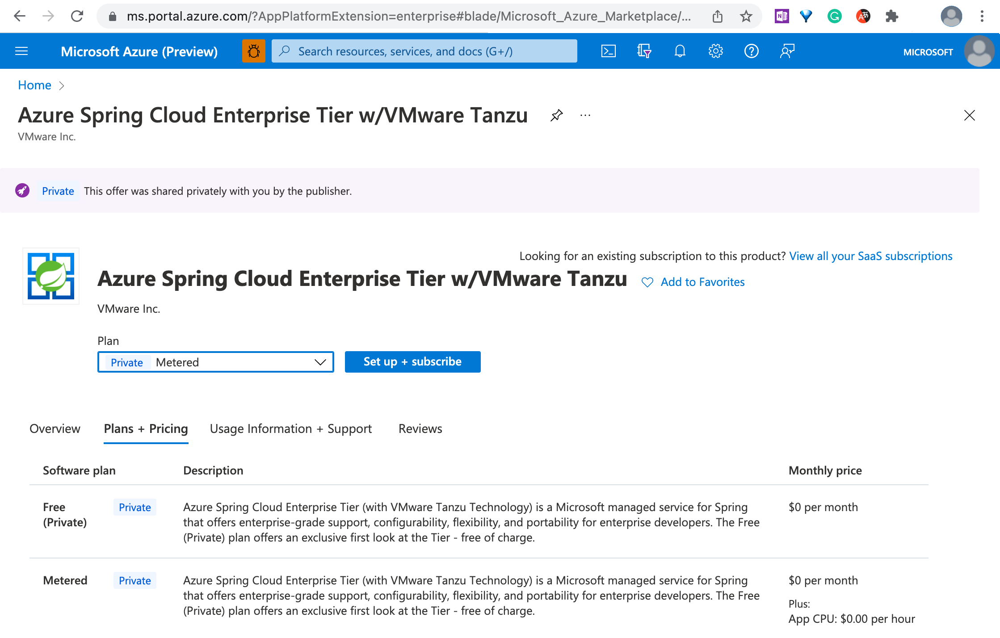

# View Azure Spring Cloud Enterprise Tier Offer in Azure Marketplace

This article shows you how to view the Azure Spring Cloud Enterprise Tier with VMware Tanzu offer through Azure Marketplace and how to redirect to the Azure Spring Cloud Enterprise tier creation page from Azure Marketplace.

Azure Spring Cloud Enterprise Tier is optimized for the needs of enterprise Spring developers through advanced configurability, flexibility, portability, and enterprise-ready VMware Spring Runtime 24x7 support. Developers also benefit from proprietary Tanzu components, such as Tanzu Build Service, Tanzu Application Configuration Service, and Tanzu Service Registry, and access to Spring experts.

Customers obtain and pay for a license to Tanzu components through an [Azure Marketplace offer](https://aka.ms/ascmpoffer). Azure Spring Cloud manages the license acquisition so you won't have to do it yourself. 

## Prerequisites

To purchase in the Azure Marketplace, you must meet the following prerequisites:

- Your Azure subscription is registered to the `Microsoft.SaaS` resource provider. See how to [register a resource provider](../azure-resource-manager/management/resource-providers-and-types.md#register-resource-provider).
- Your Azure subscription has an [associated payment method](/marketplace/azure-marketplace-overview.md#purchasing-requirements). Azure credits or free MSDN subscriptions aren't supported.
- Your Azure subscription belongs to a billing account in a [Marketplace supported geographic location](../marketplace/marketplace-geo-availability-currencies.md#supported-geographic-locations).
- Your organization allows [Azure Marketplace purchases](../cost-management-billing/manage/ea-azure-marketplace.md#enabling-azure-marketplace-purchases).
- Your organization allows acquiring any Azure Marketplace software application listed in [Purchase policy management](/marketplace/azure-purchasing-invoicing.md#purchase-policy-management).

## View Azure Spring Cloud Enterprise Tier with VMware Tanzu offer from Azure Marketplace

To see the offer and read a detailed description, see [Azure Spring Cloud Enterprise Tier w/VMware Tanzu](https://aka.ms/ascmpoffer).

To see the supported plans in your market, select **Plans + Pricing**.

> [!NOTE]
> If you see "No plans are available for market '\<Location>'", that means none of your Azure subscriptions can purchase the SaaS offer. For more information, see [No plans are available for market '\<Location>'](./faq.md#no-plans-are-available-for-market-location) in the [FAQ](./faq.md).

To see the Enterprise Tier creation page, select **Set up + subscribe**

## Next Steps
