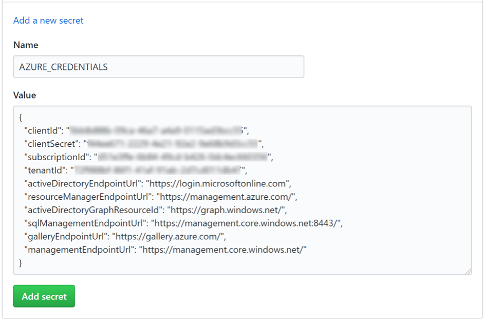
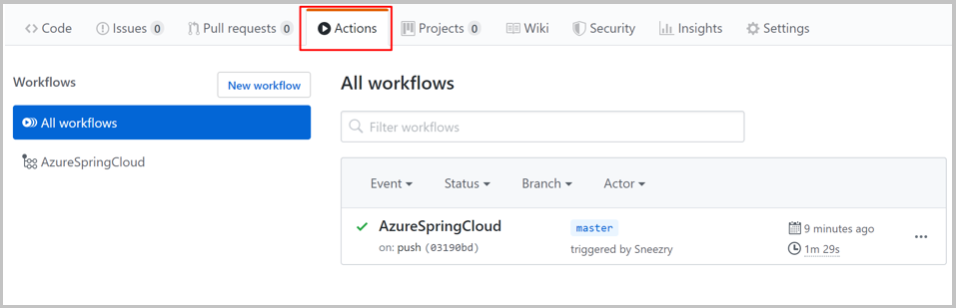
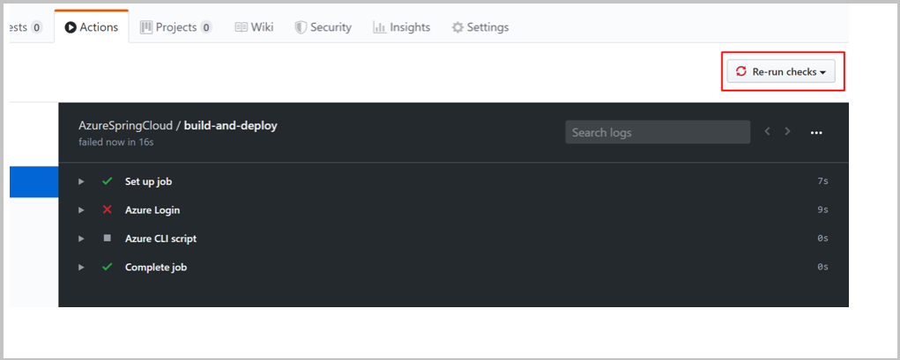

# Azure Spring Cloud CI/CD with GitHub Actions

GitHub Actions support an automated software development lifecycle workflow. With GitHub Actions for Azure Spring Cloud you can create workflows in your repository to build, test, package, release, and deploy to Azure. 

## Prerequisites
This example requires the [Azure CLI](/cli/azure/install-azure-cli).

::: zone pivot="programming-language-csharp"
## Set up GitHub repository and authenticate
You need an Azure service principal credential to authorize Azure login action. To get an Azure credential, execute the following commands on your local machine:

```
az login
az ad sp create-for-rbac --role contributor --scopes /subscriptions/<SUBSCRIPTION_ID> --sdk-auth 
```

To access to a specific resource group, you can reduce the scope:

```
az ad sp create-for-rbac --role contributor --scopes /subscriptions/<SUBSCRIPTION_ID>/resourceGroups/<RESOURCE_GROUP> --sdk-auth
```

The command should output a JSON object:

```JSON
{
    "clientId": "<GUID>",
    "clientSecret": "<GUID>",
    "subscriptionId": "<GUID>",
    "tenantId": "<GUID>",
    ...
}
```

This example uses the [steeltoe sample on GitHub](https://github.com/Azure-Samples/Azure-Spring-Cloud-Samples/tree/master/steeltoe-sample).  Fork the repository, open the GitHub repository page for the fork, and select the **Settings** tab. Open the **Secrets** menu, and select **New secret**:

 

Set the secret name to `AZURE_CREDENTIALS` and its value to the JSON string that you found under the heading *Set up your GitHub repository and authenticate*.

 

You can also get the Azure login credential from Key Vault in GitHub actions as explained in [Authenticate Azure Spring with Key Vault in GitHub Actions](./spring-cloud-github-actions-key-vault.md).

## Provision service instance
To provision your Azure Spring Cloud service instance, run the following commands using the Azure CLI.

```azurecli
az extension add --name spring-cloud
az group create --location eastus --name <resource group name>
az spring-cloud create -n <service instance name> -g <resource group name>
az spring-cloud config-server git set -n <service instance name> --uri https://github.com/xxx/Azure-Spring-Cloud-Samples --label main --search-paths steeltoe-sample/config
```

## Build the workflow
The workflow is defined using the following options.

### Prepare for deployment with Azure CLI

The command `az spring-cloud app create` is currently not idempotent. After you run it once, you'll get an error if you run the same command again. We recommend this workflow on existing Azure Spring Cloud apps and instances.

Use the following Azure CLI commands for preparation:
```
az configure --defaults group=<service group name>
az configure --defaults spring-cloud=<service instance name>
az spring-cloud app create --name planet-weather-provider
az spring-cloud app create --name solar-system-weather
```

### Deploy with Azure CLI directly

Create the `.github/workflows/main.yml` file in the repository with the following content. Replace `<your resource group name>` and `<your service name>` with the correct values.

```yaml
name: Steeltoe-CD

# Controls when the action will run. Triggers the workflow on push or pull request
# events but only for the main branch
on:
  push:
    branches: [ main]

# A workflow run is made up of one or more jobs that can run sequentially or in parallel
jobs:
  # This workflow contains a single job called "build"
  build:
    # The type of runner that the job will run on
    runs-on: ubuntu-latest
    env:
      working-directory: ./steeltoe-sample
      resource-group-name: <your resource group name>
      service-name: <your service name>
    
    # Supported .NET Core version matrix.
    strategy:
      matrix:
        dotnet: [ '3.1.x' ]

    # Steps represent a sequence of tasks that will be executed as part of the job
    steps:
      # Checks-out your repository under $GITHUB_WORKSPACE, so your job can access it
      - uses: actions/checkout@v2

      # Set up .NET Core 3.1 SDK
      - uses: actions/setup-dotnet@v1
        with:
          dotnet-version: ${{ matrix.dotnet }}
          
      # Set credential for az login
      - uses: azure/login@v1.1
        with:
          creds: ${{ secrets.AZURE_CREDENTIALS }}

      - name: install Azure CLI extension
        run: |
          az extension add --name spring-cloud --yes
      
      - name: Build and package planet-weather-provider app
        working-directory: ${{env.working-directory}}/src/planet-weather-provider
        run: |
          dotnet publish
          az spring-cloud app deploy -n planet-weather-provider --runtime-version NetCore_31 --main-entry Microsoft.Azure.SpringCloud.Sample.PlanetWeatherProvider.dll --artifact-path ./publish-deploy-planet.zip -s ${{ env.service-name }} -g ${{ env.resource-group-name }}
      - name: Build solar-system-weather app
        working-directory: ${{env.working-directory}}/src/solar-system-weather
        run: |
          dotnet publish
          az spring-cloud app deploy -n solar-system-weather --runtime-version NetCore_31 --main-entry Microsoft.Azure.SpringCloud.Sample.SolarSystemWeather.dll --artifact-path ./publish-deploy-solar.zip -s ${{ env.service-name }} -g ${{ env.resource-group-name }}
```
::: zone-end

::: zone pivot="programming-language-java"
## Set up GitHub repository and authenticate
You need an Azure service principal credential to authorize Azure login action. To get an Azure credential, execute the following commands on your local machine:
```
az login
az ad sp create-for-rbac --role contributor --scopes /subscriptions/<SUBSCRIPTION_ID> --sdk-auth 
```
To access to a specific resource group, you can reduce the scope:
```
az ad sp create-for-rbac --role contributor --scopes /subscriptions/<SUBSCRIPTION_ID>/resourceGroups/<RESOURCE_GROUP> --sdk-auth
```
The command should output a JSON object:
```JSON
{
    "clientId": "<GUID>",
    "clientSecret": "<GUID>",
    "subscriptionId": "<GUID>",
    "tenantId": "<GUID>",
    ...
}
```

This example uses the [PiggyMetrics](https://github.com/Azure-Samples/piggymetrics) sample on GitHub.  Fork the sample, open GitHub repository page, and click **Settings** tab. Open **Secrets** menu, and click **Add a new secret**:

 

Set the secret name to `AZURE_CREDENTIALS` and its value to the JSON string that you found under the heading *Set up your GitHub repository and authenticate*.

 

You can also get the Azure login credential from Key Vault in GitHub actions as explained in [Authenticate Azure Spring with Key Vault in GitHub Actions](./spring-cloud-github-actions-key-vault.md).

## Provision service instance
To provision your Azure Spring Cloud service instance, run the following commands using the Azure CLI.
```
az extension add --name spring-cloud
az group create --location eastus --name <resource group name>
az spring-cloud create -n <service instance name> -g <resource group name>
az spring-cloud config-server git set -n <service instance name> --uri https://github.com/xxx/piggymetrics --label config
```
## Build the workflow
The workflow is defined using the following options.

### Prepare for deployment with Azure CLI
The command `az spring-cloud app create` is currently not idempotent.  We recommend this workflow on existing Azure Spring Cloud apps and instances.

Use the following Azure CLI commands for preparation:
```
az configure --defaults group=<service group name>
az configure --defaults spring-cloud=<service instance name>
az spring-cloud app create --name gateway
az spring-cloud app create --name auth-service
az spring-cloud app create --name account-service
```

### Deploy with Azure CLI directly
Create the `.github/workflow/main.yml` file in the repository:

```
name: AzureSpringCloud
on: push

env:
  GROUP: <resource group name>
  SERVICE_NAME: <service instance name>

jobs:
  build-and-deploy:
    runs-on: ubuntu-latest
    steps:
    
    - uses: actions/checkout@main
    
    - name: Set up JDK 1.8
      uses: actions/setup-java@v1
      with:
        java-version: 1.8
    
    - name: maven build, clean
      run: |
        mvn clean package -DskipTests
    
    - name: Azure Login
      uses: azure/login@v1
      with:
        creds: ${{ secrets.AZURE_CREDENTIALS }}
      
    - name: Install ASC AZ extension
      run: az extension add --name spring-cloud
   
    - name: Deploy with AZ CLI commands
      run: |
        az configure --defaults group=$GROUP
        az configure --defaults spring-cloud=$SERVICE_NAME
        az spring-cloud app deploy -n gateway --jar-path ${{ github.workspace }}/gateway/target/gateway.jar
        az spring-cloud app deploy -n account-service --jar-path ${{ github.workspace }}/account-service/target/account-service.jar
        az spring-cloud app deploy -n auth-service --jar-path ${{ github.workspace }}/auth-service/target/auth-service.jar
```
### Deploy with Azure CLI action
The az `run` command will use the latest version of Azure CLI. If there are breaking changes, you can also use a specific version of Azure CLI with azure/CLI `action`. 

> [!Note] 
> This command will run in a new container, so `env` will not work, and cross action file access may have extra restrictions.

Create the .github/workflow/main.yml file in the repository:
```
name: AzureSpringCloud
on: push

jobs:
  build-and-deploy:
    runs-on: ubuntu-latest
    steps:
    
    - uses: actions/checkout@main
    
    - name: Set up JDK 1.8
      uses: actions/setup-java@v1
      with:
        java-version: 1.8
    
    - name: maven build, clean
      run: |
        mvn clean package -DskipTests
        
    - name: Azure Login
      uses: azure/login@v1
      with:
        creds: ${{ secrets.AZURE_CREDENTIALS }}
              
    - name: Azure CLI script
      uses: azure/CLI@v1
      with:
        azcliversion: 2.0.75
        inlineScript: |
          az extension add --name spring-cloud
          az configure --defaults group=<service group name>
          az configure --defaults spring-cloud=<service instance name>
          az spring-cloud app deploy -n gateway --jar-path $GITHUB_WORKSPACE/gateway/target/gateway.jar
          az spring-cloud app deploy -n account-service --jar-path $GITHUB_WORKSPACE/account-service/target/account-service.jar
          az spring-cloud app deploy -n auth-service --jar-path $GITHUB_WORKSPACE/auth-service/target/auth-service.jar
```

## Deploy with Maven Plugin
Another option is to use the [Maven Plugin](./spring-cloud-quickstart.md) for deploying the Jar and updating App settings. The command `mvn azure-spring-cloud:deploy` is idempotent and will automatically create Apps if needed. You don't need to create corresponding apps in advance.

```
name: AzureSpringCloud
on: push

jobs:
  build-and-deploy:
    runs-on: ubuntu-latest
    steps:
    
    - uses: actions/checkout@main
    
    - name: Set up JDK 1.8
      uses: actions/setup-java@v1
      with:
        java-version: 1.8
    
    - name: maven build, clean
      run: |
        mvn clean package -DskipTests
        
    # Maven plugin can cosume this authentication method automatically
    - name: Azure Login
      uses: azure/login@v1
      with:
        creds: ${{ secrets.AZURE_CREDENTIALS }}
    
    # Maven deploy, make sure you have correct configurations in your pom.xml
    - name: deploy to Azure Spring Cloud using Maven
      run: |
        mvn azure-spring-cloud:deploy
```

::: zone-end

## Run the workflow

GitHub **Actions** should be enabled automatically after you push `.github/workflow/main.yml` to GitHub. The action will be triggered when you push a new commit. If you create this file in the browser, your action should have already run.

To verify that the action has been enabled, click **Actions** tab on the GitHub repository page:



If your action runs in error, for example, if you haven't set the Azure credential, you can rerun checks after fixing the error. On the GitHub repository page, click **Actions**, select the specific workflow task, and then click the **Rerun checks** button to rerun checks:



## Next steps

* [Key Vault for Spring Cloud GitHub actions](./spring-cloud-github-actions-key-vault.md)
* [Azure Active Directory service principals](/cli/azure/ad/sp#az_ad_sp_create_for_rbac)
* [GitHub Actions for Azure](https://github.com/Azure/actions/)
