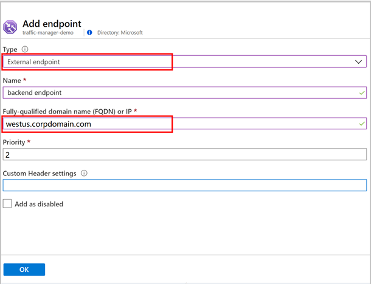
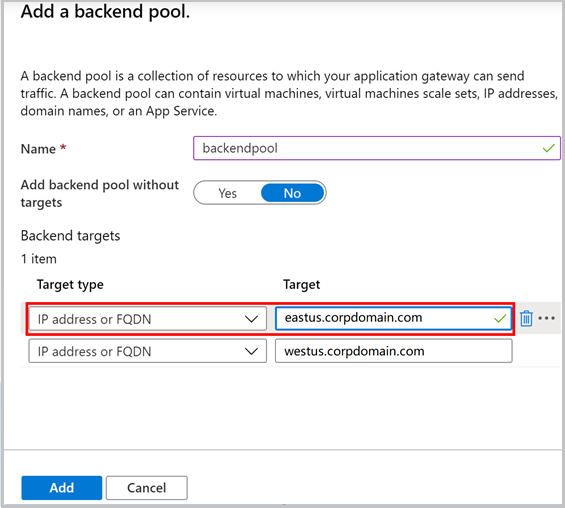
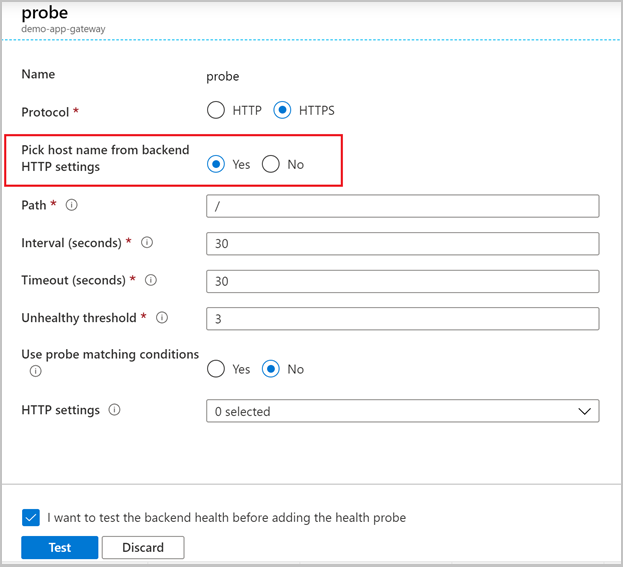
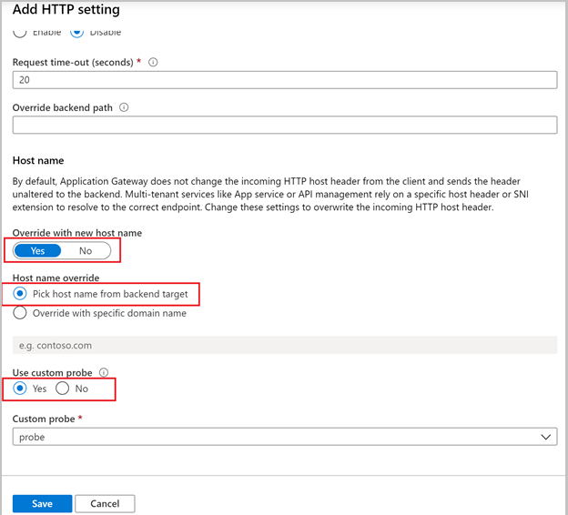
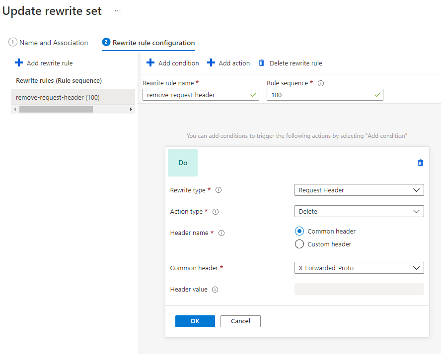
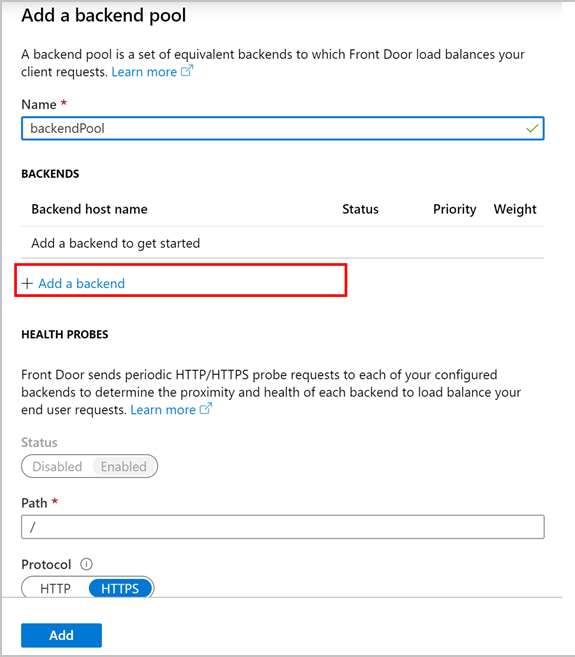

# Integrate Azure Spring Cloud with Azure Load Balance Solutions

**This article applies to:** ✔️ Java ✔️ C#

Azure Spring Cloud supports microservices on Azure.  Increasing business can require multiple data centers with management of multiple instances of Azure Spring Cloud.

Azure already provides different load-balance solutions. There are three options to integrate Azure Spring Cloud with Azure load-balance solutions:

1. Integrate Azure Spring Cloud with Azure Traffic Manager
2. Integrate Azure Spring Cloud with Azure App Gateway
3. Integrate Azure Spring Cloud with Azure Front Door

## Prerequisites

* Azure Spring Cloud: [How to create an Azure spring cloud service](./quickstart.md)
* Azure Traffic Manager: [How to create a traffic manager](../traffic-manager/quickstart-create-traffic-manager-profile.md)
* Azure App Gateway: [How to create an application gateway](../application-gateway/quick-create-portal.md)
* Azure Front Door: [How to create a front door](../frontdoor/quickstart-create-front-door.md)

## Integrate Azure Spring Cloud with Azure Traffic Manager

To integrate Azure spring cloud with Traffic Manager, add its public endpoints as traffic manager’s endpoints and then configure custom domain for both traffic manager and Azure spring cloud.

### Add Endpoint in Traffic Manager

Add endpoints in traffic manager:

1. Specify **Type** to be *External endpoint*.
1. Input fully qualified domain name (FQDN) of each Azure spring cloud public endpoint.
1. Select **OK**.

    
    

### Configure Custom Domain

To finish the configuration:

1. Sign in to the website of your domain provider, and create a CNAME record mapping from your custom domain to traffic manager’s Azure default domain name.
1. Follow instructions [How to add custom domain to Azure Spring Cloud](./tutorial-custom-domain.md).
1. Add above custom domain binding to traffic manager to Azure spring cloud corresponding app service and upload SSL certificate there.

    

## Integrate Azure Spring Cloud with Azure App Gateway

To integrate with Azure Spring Cloud service, complete the following configurations:

### Configure Backend Pool

1. Specify **Target type** as *IP address* or *FQDN*.
1. Enter your Azure spring cloud public endpoints.

    

### Add Custom Probe

1. Select **Health Probes** then **Add** to open custom **Probe** dialog.
1. The key point is to select *Yes* for **Pick host name from backend HTTP settings** option.

    

### Configure Http Setting

1. Select **Http Settings** then **Add** to add an HTTP setting.
1. **Override with new host name:** select *Yes*.
1. **Host name override**: select **Pick host name from backend target**.
1. **Use custom probe**: select *Yes* and pick the custom probe created above.

    

### Configure Rewrite Set

1. Select **Rewrites** then **Rewrite set** to add a rewrite set.
1. Select the routing rules that route requests to Azure Spring Cloud public endpoints.
1. On **Rewrite rule configuration** tab, select **Add rewrite rule**.
1. **Rewrite type**: select **Request Header**
1. **Action type**: select **Delete**
1. **Header name**: select **Common header**
1. **Common Header**: select **X-Forwarded-Proto**

    

## Integrate Azure Spring Cloud with Azure Front Door

To integrate with Azure Spring Cloud service and configure backend pool, use the following steps:

1. **Add backend pool**.
1. Specify the backend endpoint by adding host.

    

1. Specify **backend host type** as *custom host*.
1. Input FQDN of your Azure Spring Cloud public endpoints in **backend host name**.
1. Accept the **backend host header** default, which is the same as **backend host name**.

    

## Next steps

* [How to create a traffic manager](../traffic-manager/quickstart-create-traffic-manager-profile.md)
* [How to create an application gateway](../application-gateway/quick-create-portal.md)
* [How to create a front door](../frontdoor/quickstart-create-front-door.md)
