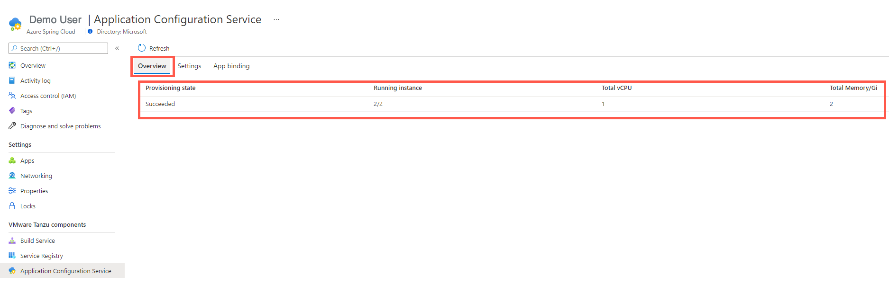
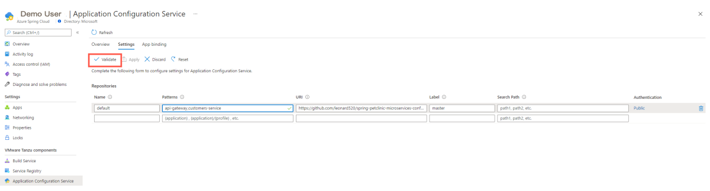
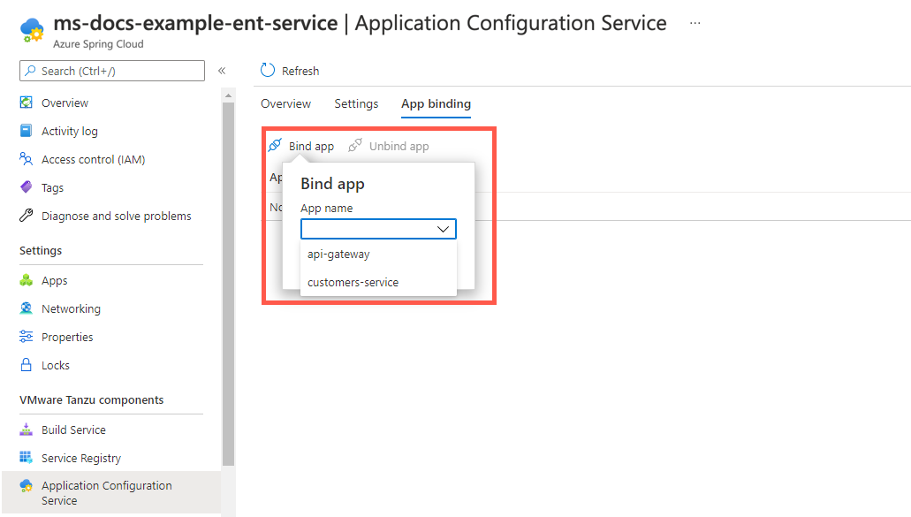
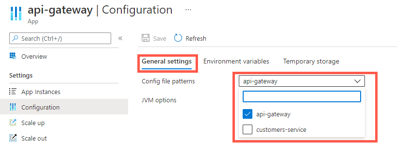
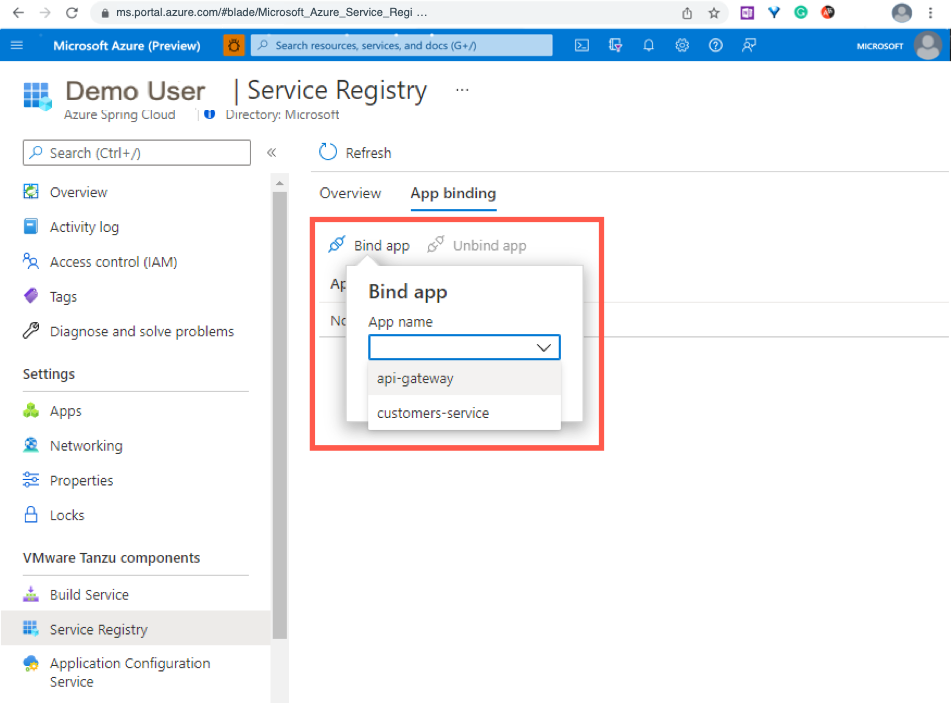
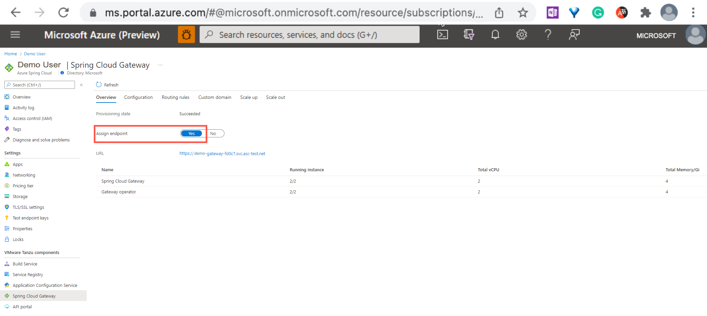
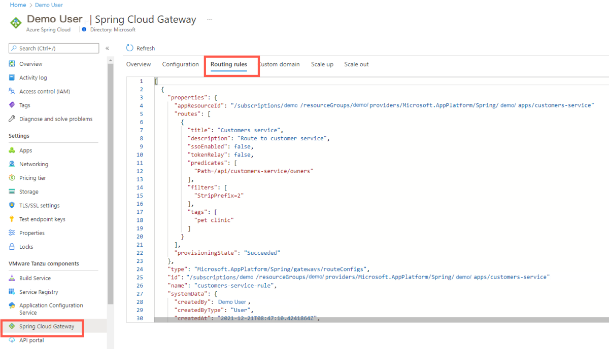

# Migrate an Azure Spring Cloud Basic or Standard tier instance to Enterprise Tier

**This article applies to:** ✔️ Basic/Standard tier ✔️ Enterprise tier

This article tells you how to migrate an existing application in Basic or Standard tier to Enterprise tier.

Pre-migration
If you already have an Azure Spring Cloud Basic or Standard tier instance and want to migrate it to Enterprise tier, you need to [provision a new Enterprise Tier instance](./quickstart-provision-service-instance-enterprise.md). However, you don't have to change any code in your applications.

VMware Tanzu components will replace the OSS Spring Cloud components in Enterprise tier to provide more feature support.

## How to migrate app to use Application Configuration Service for Tanzu

In Enterprise tier, Application Configuration Service is provided to support externalized configuration for your apps. Managed Spring Cloud Config Server is not available in Enterprise tier and only available in Basic and Standard tiers of Azure Spring Cloud. 

You can follow the below steps to use Application Configuration Service for Tanzu as centralized configuration service.

## Configure Application Configuration Service for Tanzu settings using the portal

You can configure Application Configuration Service for Tanzu using the portal by following these steps:

1. Select **Application Configuration Service**.
1. Select **Overview** to view the running state and resources allocated to Application Configuration Service for Tanzu.

   

1. Select **Settings** and add a new entry in the **Repositories** section with the Git backend information.

1. Select **Validate** to validate access to the target URI. After validation completes successfully, select **Apply** to update the configuration settings.

   

## Configure Application Configuration Service for Tanzu settings using the CLI

You can configure Application Configuration Service for Tanzu using the CLI, by following these steps:

```azurecli
az spring-cloud application-configuration-service git repo add \
    --name <entry-name> \
    --patterns <patterns> \
    --uri <git-backend-uri> \
    --label <git-branch-name>
```

## Use Application Configuration Service for Tanzu with applications using the portal

When you use Application Configuration Service for Tanzu with a Git back end, keep the following items in mind.

To use the centralized configurations, you must bind the app to Application Configuration Service for Tanzu. After binding the app, you'll need to configure which pattern to be used by the app by following these steps:

1. Open the **App binding** tab.

1. Select **Bind app** and choose one app in the dropdown. Select **Apply** to bind.

   

   > [!NOTE]
   > When you change the bind/unbind status, you must restart or redeploy the app to for the binding to take effect.

1. Select **Apps**, then select the [pattern(s)](./how-to-enterprise-application-configuration-service.md#pattern) to be used by the apps.

   a. In the left navigation menu, select **Apps** to view the list all the apps.

   b. Select the target app to configure patterns for from the `name` column.

   c. In the left navigation pane, select **Configuration**, then select **General settings**.

   d. In the **Config file patterns** dropdown, choose one or more patterns from the list.

      

   e. Select **Save**

## Use Application Configuration Service for Tanzu with applications using the CLI

You can use Application Configuration Service for Tanzu with applications, by using this command:

```azurecli
az spring-cloud application-configuration-service bind --app <app-name>
az spring-cloud app deploy \
    --name <app-name> \
    --artifact-path <path-to-your-JAR-file> \
    --config-file-pattern <config-file-pattern>
```

Please refer to [Use Application Configuration Service for Tanzu](./how-to-enterprise-application-configuration-service.md) for more information.

## Service Registry for Tanzu

[Service Registry](https://docs.pivotal.io/spring-cloud-services/2-1/common/service-registry/index.html) is one of the proprietary VMware Tanzu components. It provides your apps with an implementation of the Service Discovery pattern, one of the key tenets of a microservice-based architecture. 

Use the following steps to bind an application to Tanzu Service Registry.

1. Open the **App binding** tab.

1. Select **Bind app** and choose one app in the dropdown, then select **Apply** to bind.

   

   > [!NOTE]
   > When you change the bind/unbind status, you must restart or redeploy the app to make the change take effect.

Please refer to [Use Tanzu Service Registry](./how-to-enterprise-service-registry.md) for more information.

## Spring Cloud Gateway for Tanzu

[Spring Cloud Gateway for Tanzu](https://docs.vmware.com/en/VMware-Spring-Cloud-Gateway-for-Kubernetes/index.html) is one of the commercial VMware Tanzu components. It's based on the open-source Spring Cloud Gateway project. Spring Cloud Gateway for Tanzu handles cross-cutting concerns for API development teams, such as Single Sign-On (SSO), access control, rate-limiting, resiliency, security, and more. 

Use the following steps to create an example application using Spring Cloud Gateway for Tanzu.

1. To create an app in Azure Spring Cloud which the Spring Cloud Gateway for Tanzu would route traffic to, follow the instructions in [Quickstart: Build and deploy apps to Azure Spring Cloud using the Enterprise tier](quickstart-deploy-apps-enterprise.md). Select `customers-service` for this example.

1. Assign a public endpoint to the gateway to access it.

   Select the **Spring Cloud Gateway** section, then select **Overview** to view the running state and resources given to Spring Cloud Gateway and its operator.

   Select **Yes** next to *Assign endpoint* to assign a public endpoint. You'll get a URL in a few minutes. Save the URL to use later.

   

   You can also use CLI to do it, as shown in the following command:

   ```azurecli
   az spring-cloud gateway update --assign-endpoint
   ```

1. Use the following command to configure Spring Cloud Gateway for Tanzu properties:

   ```azurecli
   az spring-cloud gateway update \
       --api-description "<api-description>" \
       --api-title "<api-title>" \
       --api-version "v0.1" \
       --server-url "<endpoint-in-the-previous-step>" \
       --allowed-origins "*"
   ```

   You can also view those properties in the portal.

   

1. Configure routing rules to apps.

   Create rules to access apps deployed in the above step through Spring Cloud Gateway for Tanzu.

   Save the following content to the *customers-service.json* file.

   ```json
   [
      {
         "title": "Customers service",
         "description": "Route to customer service",
         "predicates": [
            "Path=/api/customers-service/owners"
         ],
         "filters": [
            "StripPrefix=2"
         ],
         "tags": [
            "pet clinic"
         ]
      }
   ]
   ```

   Use the following command to apply the rule to the app `customers-service`:

   ```azurecli
   az spring-cloud gateway route-config create \
       --name customers-service-rule \
       --app-name customers-service \
       --routes-file customers-service.json
   ```

   You can also view the routes in the portal.

   

1. Use the following command to access the `customers service` and `owners` APIs through the gateway endpoint:

   ```bash
   curl https://<endpoint-url>/api/customers-service/owners
   ```

1. Use the following command to query the routing rules:

   ```azurecli
   az configure --defaults group=<resource group name> spring-cloud=<service name>
   az spring-cloud gateway route-config show \
       --name customers-service-rule \
       --query '{appResourceId:properties.appResourceId, routes:properties.routes}'
   az spring-cloud gateway route-config list \
       --query '[].{name:name, appResourceId:properties.appResourceId, routes:properties.routes}'
   ```

Please refer to [Use Spring Cloud Gateway for Tanzu](./how-to-use-enterprise-spring-cloud-gateway.md) for more information.

## Next steps

- [Azure Spring Cloud](index.yml)
