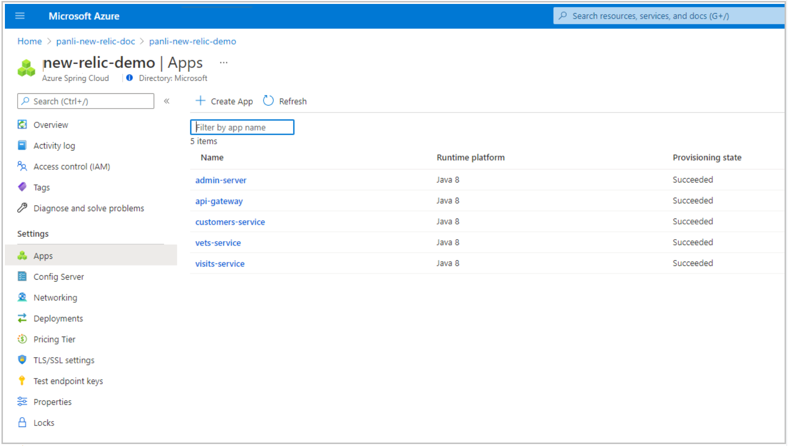
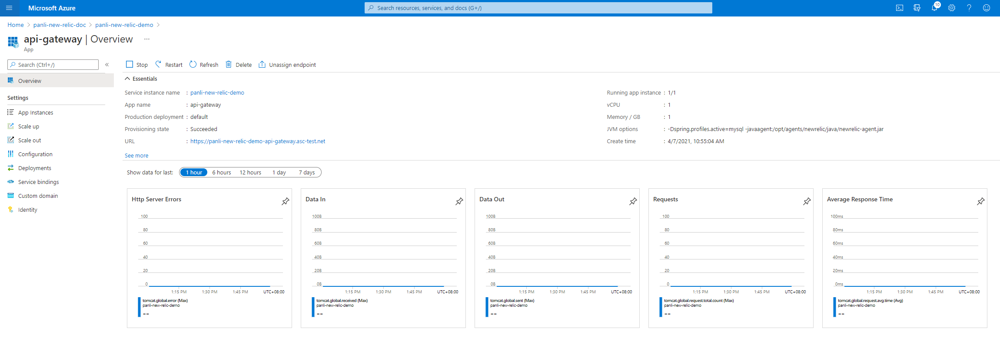
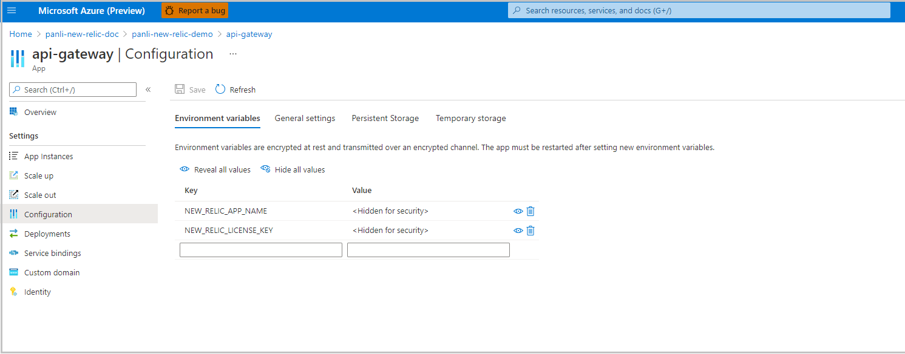
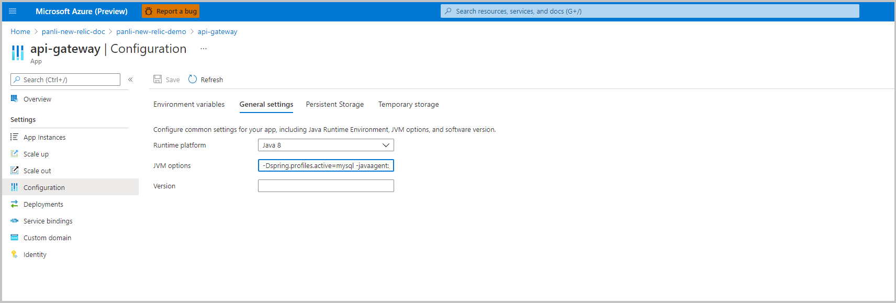
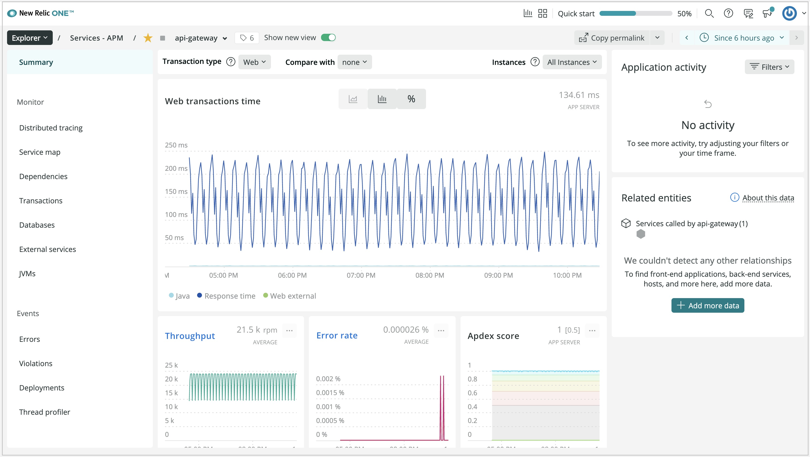
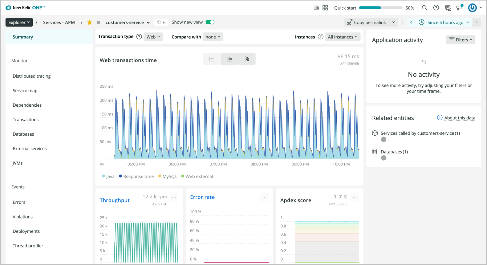
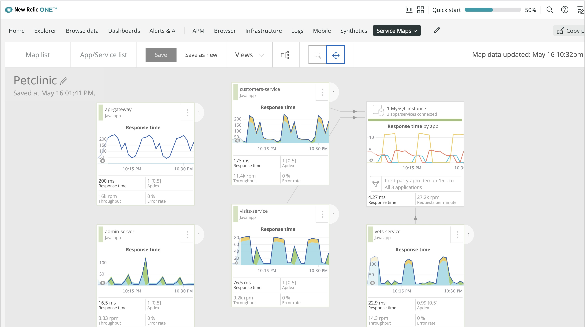
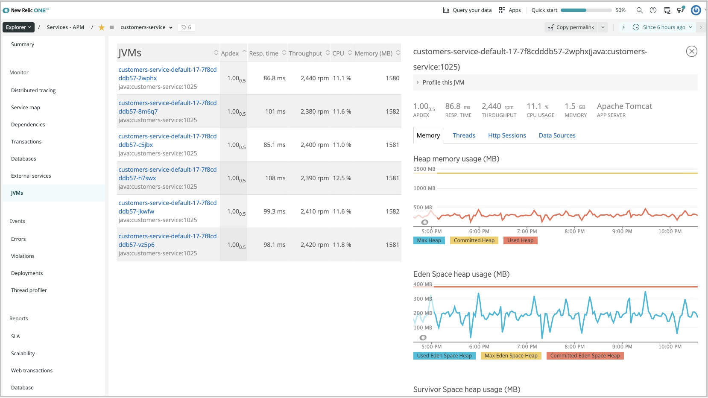
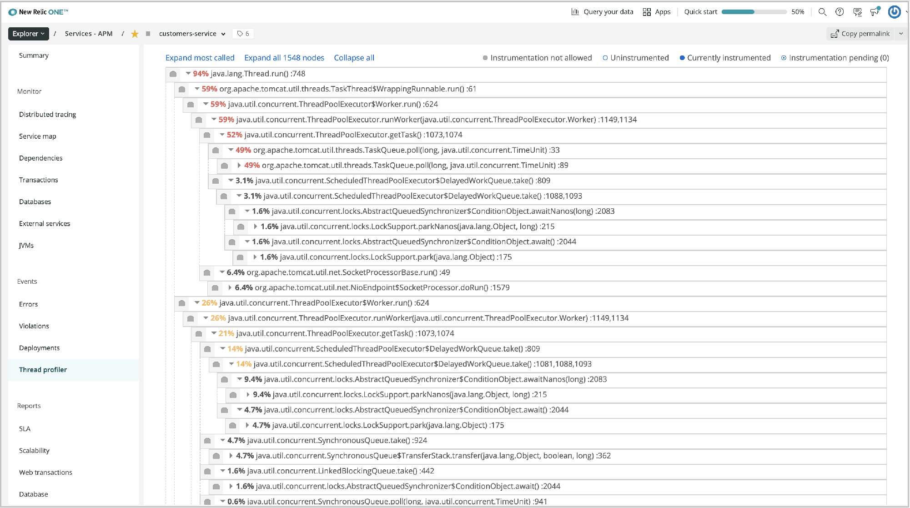

# How to monitor with New Relic Java agent (Preview)

This feature enables monitoring of Azure Spring Cloud apps with the **New Relic** Java agent.

With the **New Relic** Java agent, you can:
* Consume the **New Relic** Java agent.
* Configure the **New Relic** Java agent using **Environment Variables**.
* Check all monitoring data from the **New Relic** dashboard.

## Prerequisites

* A **New Relic** account.
* The [Azure CLI version, 2.0.67 or later](/cli/azure/install-azure-cli).

## Leverage the New Relic Java in process agent

Use the following procedure to access the agent:

1. Create an instance of Azure Spring Cloud.

2. Create an application.

    ```shell
      az spring-cloud app create --name "appName" --is-public true \
      -s "resourceName" -g "resourceGroupName"
    ```

3. Create a deployment with the **New Relic** agent and **Environment Variables**.

    ```shell
    az spring-cloud app deploy --name "appName" --jar-path app.jar \
       -s "resourceName" -g "resourceGroupName" \
       --jvm-options="-javaagent:/opt/agents/newrelic/java/newrelic-agent.jar" \
       --env NEW_RELIC_APP_NAME=appName NEW_RELIC_LICENSE_KEY=newRelicLicenseKey
    ```

  Azure Spring Cloud pre-installs the **New Relic** Java agent to the following path. Customers can leverage the agent from applications' **Jvm Options**, as well as configure the agent using the [New Relic Java agent environment variables](https://docs.newrelic.com/docs/agents/java-agent/configuration/java-agent-configuration-config-file/#Environment_Variables).

  ```shell
  /opt/agents/newrelic/java/newrelic-agent.jar
  ```

## Portal

You can also leverage this agent from portal with the following procedure.

1. Find the app from **Settings**/**Apps** in the navigation pane.

   [  ](media/new-relic-monitoring/find-app.png)

2. Click the application to jump to the **Overview** page.

   [  ](media/new-relic-monitoring/overview-page.png)

3. Click **Configuration** in the left navigation pane to add/update/delete the **Environment Variables** of the application.

   [  ](media/new-relic-monitoring/configurations-update-environment.png)

4. Click **General settings** to add/update/delete the **Jvm Option** of the application.

   [  ](media/new-relic-monitoring/update-jvm-option.png)

5. View the application api/gateway **Summary** page from the **New Relic** dashboard.

   [  ](media/new-relic-monitoring/app-summary-page.png)

6. View the application customers-service **Summary** page from **New Relic** dashboard.

   [  ](media/new-relic-monitoring/customers-service.png)

7. View the **Service Map** page from **New Relic** dashboard.

   [  ](media/new-relic-monitoring/service-map.png)

8. View **JVMs** of the application from **New Relic** dashboard.

   [  ](media/new-relic-monitoring/jvm-page.png)

9. View the application profile from **New Relic** dashboard.

   [  ](media/new-relic-monitoring/profile-app.png)

## New Relic Java Agent Logging

By default, Azure Spring Cloud will print the logs of the **New Relic** Java agent to `STDOUT`. It will be combined with the application logs. You can get the explicit agent version from the application logs.

You can also get the logs of the **New Relic** agent from:

* Azure Spring Cloud Logs.
* Azure Spring Cloud Application Insights.
* Azure Spring Cloud LogStream.

You can leverage some environment variables provided by **New Relic** to configure the logging of the **New Agent**, such as, `NEW_RELIC_LOG_LEVEL` to control the level of logs. For more information, see [New Relic Environment Variables](https://docs.newrelic.com/docs/agents/java-agent/configuration/java-agent-configuration-config-file/#Environment_Variables).

> [!CAUTION]
> We strongly recommend that you *do not* override the logging default behavior provided by Azure Spring Cloud for New Relic. If you do, the logging scenarios in above scenarios will be blocked, and the log file(s) may be lost. For example, you should not pass the following environment variables to your applications. Log file(s) may be lost after restart or redeployment of application(s).
>
> * NEW_RELIC_LOG
> * NEW_RELIC_LOG_FILE_PATH

## New Relic Java Agent update/upgrade

The **New Relic** Java agent will update/upgrade the JDK regularly. The agent update/upgrade may impact following scenarios.

* Existing applications that use the **New Relic** Java agent before update/upgrade will be unchanged.
* Existing applications that use the **New Relic** Java agent before update/upgrade require restart or redeploy to engage the new version of the **New Relic** Java agent.
* New applications created after update/upgrade will use the new version of the **New Relic** Java agent.

## Vnet Injection Instance Outbound Traffic Configuration

For a vnet injection instance of Azure Spring Cloud, you need to make sure the outbound traffic is configured correctly for the **New Relic** Java agent. For more information, see [Networks of New Relic](https://docs.newrelic.com/docs/using-new-relic/cross-product-functions/install-configure/networks/#agents).

## Next steps
*  [Distributed tracing and App Insights](how-to-distributed-tracing.md)