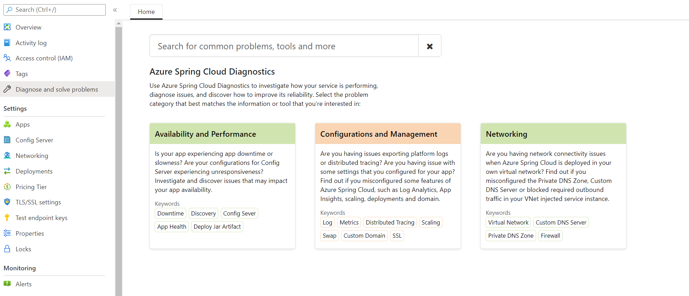
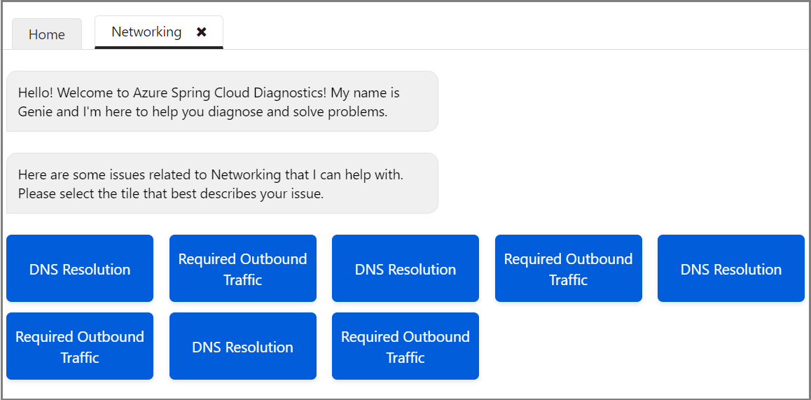
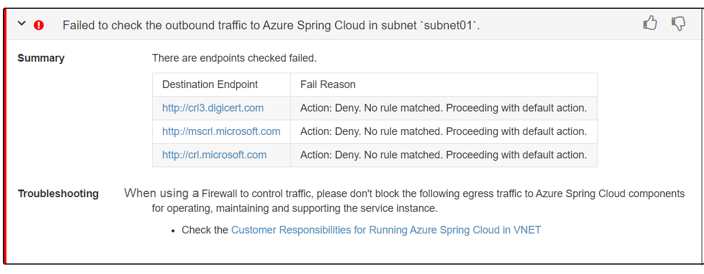

# Self-diagnose running Azure Spring Cloud in VNET
Azure Spring Cloud diagnostics supports interactive troubleshooting apps running in virtual networks without configuration. Azure Spring Cloud diagnostics identifies problems and guides you to information that helps troubleshoot and resolve them.

## Navigate to the diagnostics page
The following procedure starts diagnostics for networked applications.
1. Sign in to the Azure portal.
1. Go to your Azure Spring Cloud Overview page.
1. Select **Diagnose and solve problems** in the menu on the left navigation pane.
1. Select the third category, **Networking**.

   

## View a diagnostic report

After you select the **Networking** category, you can view two issues related to Networking specific to your VNet injected Azure Spring Cloud: **DNS Resolution** and **Required Outbound Traffic**.

   

Select your target issue to view the diagnostic report. A summary of diagnostics will be displayed, such as:

* *Resource has been removed.*
* *Resource is not deployed in your own virtual network*.

Some results contain related documentation. Different subnets will display the results separately.

## DNS resolution

If you select **DNS Resolution**, results will indicate whether there are DNS issues with applications.  Healthy apps are listed as follows:

* *DNS issues resolved with no issues in subnet 'subnet01'*.
* *DNS issues resolved with no issues in subnet 'subnet02'*.

The following diagnostic report example indicates that the health of the application is unknown. The reporting time frame does not include the time when the health status was reported.  Assume that the context end time is *2021-03-03T04:20:00Z*. The latest TIMESTAMP in the **DNS Resolution Table Renderings** is *2021-03-03T03:39:00Z*, the previous day. The health check log may not have been sent out because of a blocked network.

The unknown health status results contain related documentation.  You can select the left angle bracket to see the drop-down display.

If you misconfigured your Private DNS Zone record set, you will get a critical result such as: `Failed to resolve the Private DNS in subnet xxx`.

In the drop-down **DNS Resolution Table Renderings** you will find the detail message info from which you can check your config.

## Required Outbound Traffic

If you select **Required Outbound Traffic**, results will indicate whether there are outbound traffic issues with applications.  Healthy apps are listed as follows:

* *Required outbound traffic resolved with no issues in subnet 'subnet01'.
* *Required outbound traffic resolved with no issues in subnet 'subnet02'.

If any subnet is blocked by NSG or firewall rules, and if you have not blocked the log, you will find the following failures. You can check whether you overlooked any [Customer Responsibilities](./vnet-customer-responsibilities.md).

If there is no data in the `Required Outbound Traffic Table Renderings` within 30 minutes, the result will be `health status unknown`.
Maybe your network is blocked or the log service is down.

## See also

* [How to self diagnose Azure Spring Cloud](./how-to-self-diagnose-solve.md)
