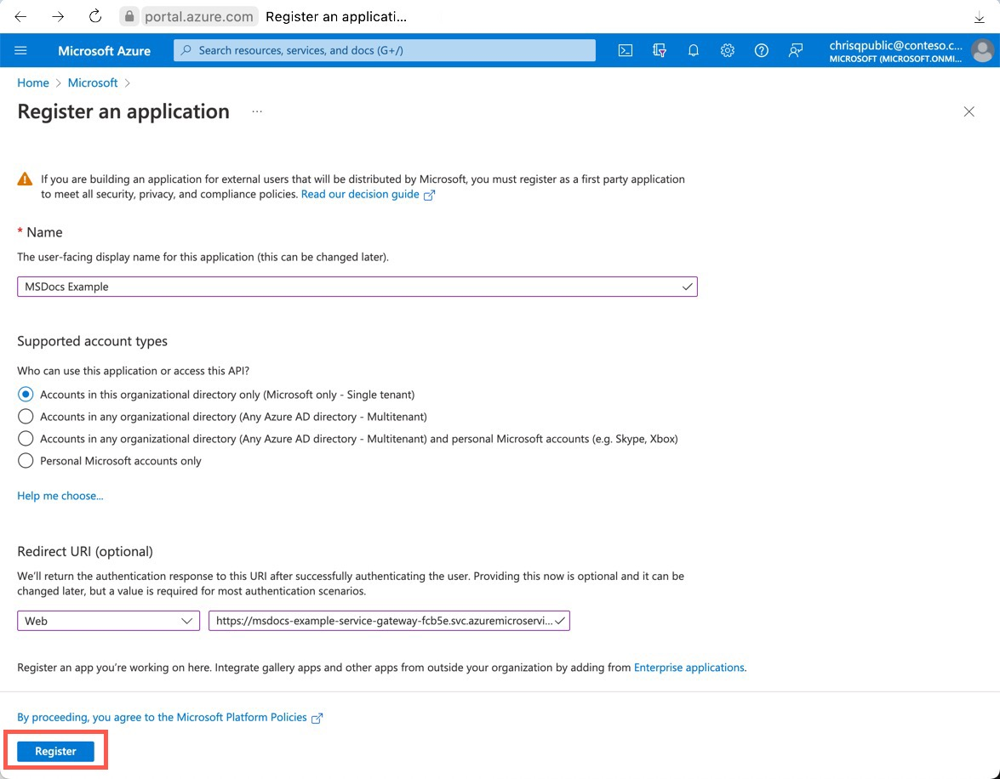
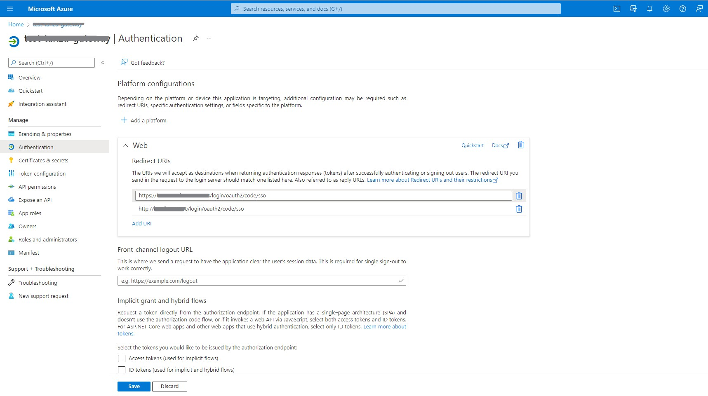
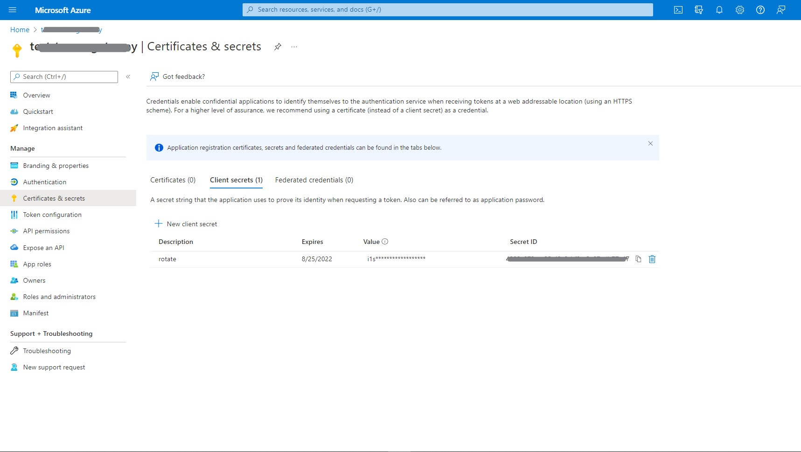
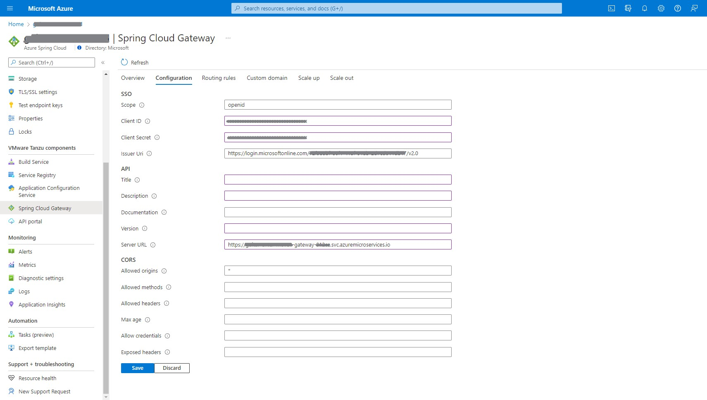

# Set up Single Sign-On using Azure Active Directory for Spring Cloud Gateway or API Portal

**This article applies to:** ❌ Basic/Standard tier ✔️ Enterprise tier

This documentation guides you how to configure Single Sign-On (SSO) for Spring Cloud Gateway or API Portal using the Azure Active Directory (Azure AD) as OpenID identify provider.

To enable SSO either for Spring Cloud Gateway or API Portal, you should provide four properties `scope`, `clientId`, `clientSecret` and `issuerUri`. You should configure them on Azure AD according to the following steps.
| Property of SSO | Configuration in Azure AD |
| - | - |
| clientId | See [Register App](#create-an-azure-ad-application-registration) |
| clientSecret | See [Create Client Secret](#add-a-client-secret) |
| scope | See [Configure Scope](#configure-scope) |
| issuerUri | See [Generate Issuer URI](#configure-issuer-uri) |

## Prerequisites
To enable SSO, you need:
- A provisioned instance of Azure Spring App Enterprise tier, which has enabled Spring Cloud Gateway or API portal. Refer to [Quickstart: Provision an Azure Spring Cloud service instance using the Enterprise tier](quickstart-provision-service-instance-enterprise.md).
- Sufficient permissions to manage Azure AD applications.

## Assign endpoint for Spring Cloud Gateway or API Portal
The first step is to get endpoint of Spring Cloud Gateway and API portal. The endpoint can be the assigned public endpoint.

1. Open your Enterprise tier service in Azure Portal.
2. Under **VMware Tanzu components** > **Spring Cloud Gateway**/**API portal** > **Overview**, click `yes` for **Assign endpoint**.
3. The assigned public endpoint is shown in **URI**.

## Create an Azure AD application registration
Registering your application establishes a trust relationship between your app and the Microsoft identity platform.

Follow these steps to create the app registration:
1. Open **Azure Active Directory** under your tenant in Azure Portal.
1. Under **Manage**, select **App Registrations** > **New registrations**, enter the display name of your application and select the account type to register. 
1. The redirect URI is the location where Azure AD redirect a user's client and sends security tokens after authentication. Choose the platform **Web** and enter the URI `https://<endpoint>/login/oauth2/code/sso` in the **Redirect URI**. Replace the `<endpoint>` with the exposed endpoint assigned in the previous section, it can be the assigned public endpoint or your configured custom domain.
1. Click **Register** to complete the application registration.

When registration finishes, you can see the **Application (client) ID** in the **Overview** pane of Azure AD application.

You can also add redirect URIs after app registration by the following steps:
1. Under **Manage** of your application, select **Authentication** > **Web** > **Redirect URIs**, add the redirect URI like `https://<endpoint>/login/oauth2/code/`.
1. Click `Save` to complete.

More detailed instructions on Application Registrations can be found [here](../active-directory/develop/quickstart-register-app.md#quickstart-register-an-application-with-the-microsoft-identity-platform).

## Add a Client Secret
Client secret is used for the application to authenticate as itself in SSO workflow, which can be created by the following steps:
1. Under **Manage**, select **Certificates & secrets** > **Client secrets** > **New client secret**.
1. Enter the description about the secret and set the expiration date.
1. Click **Add** to complete adding client secret.

Remember to save the client secret because you can't retrieve it after you left this page. The client secret should be provided with client ID when sign in as the application.

## Configure Scope
The `scope` property of SSO should be a list of scopes to be included in JWT identity tokens. They're often referred to permissions. Identity platform supports several [OpenID Connect scopes](../active-directory/develop/v2-permissions-and-consent.md#openid-connect-scopes), such as `openid`, `email` and `profile`.

## Configure Issuer URI
The URI that is asserted as its Issuer Identifier. For example, if the issuer-uri provided is `https://example.com`, then an OpenID Provider Configuration Request will be made to `https://example.com/.well-known/openid-configuration`.

The issuer URI of Azure AD is like `<authentication-endpoint>/<Your-TenantID>/v2.0`. Please replace `<authentication-endpoint>` with the authentication endpoint for your cloud environment (for example, `https://login.microsoftonline.com` for global Azure), also replacing `<Your-TenantID>` with the Directory (tenant) ID in which the application was registered.

## Save SSO Configuration
After configuring your Azure AD application, you can set up the SSO properties of Spring Cloud Gateway or API Portal.
1. Open the Enterprise tier instance in Azure Portal
2. Under **VMware Tanzu components** > **Spring Cloud Gateway**/**API portal** > **Configuration**, enter `Scope`, `Client Id`, `Client Secret` and `Issuer URI`. Multiple scopes should be separated by comma.
2. Click **Save** to enable SSO configuration.

> [!NOTE]
> After configuring SSO properties, remember to enable SSO for the Spring Cloud Gateway routes by setting `ssoEnabled=true`. Refer to [route configuration](./how-to-use-enterprise-spring-cloud-gateway.md#configure-routes).