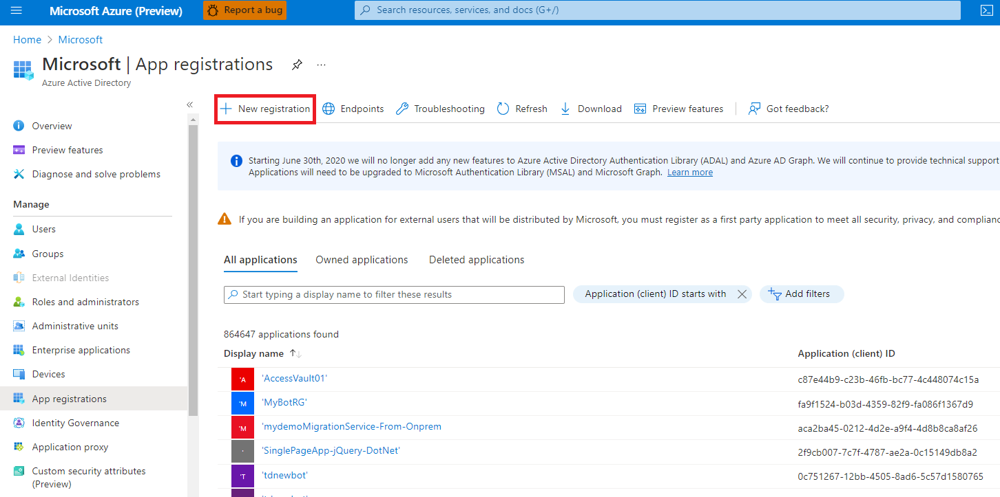
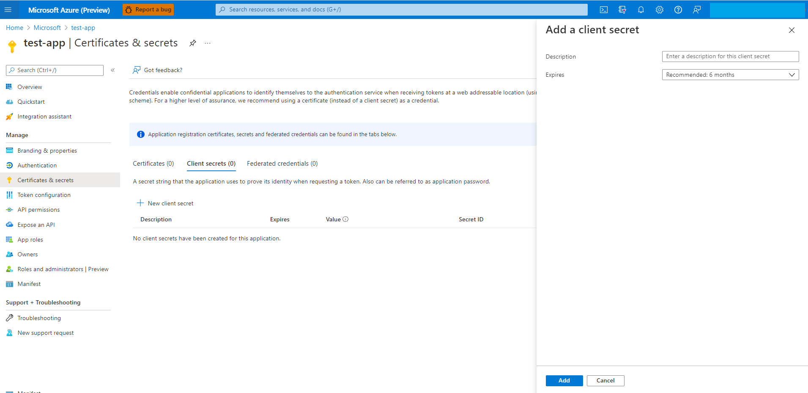
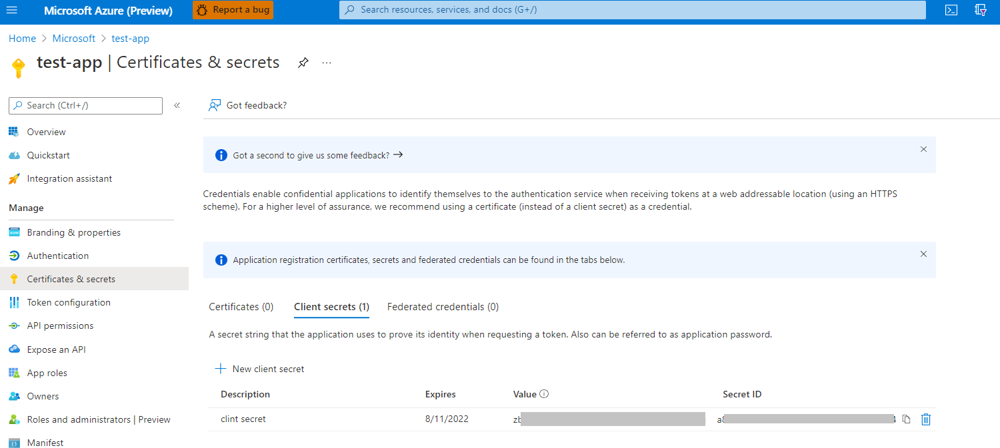
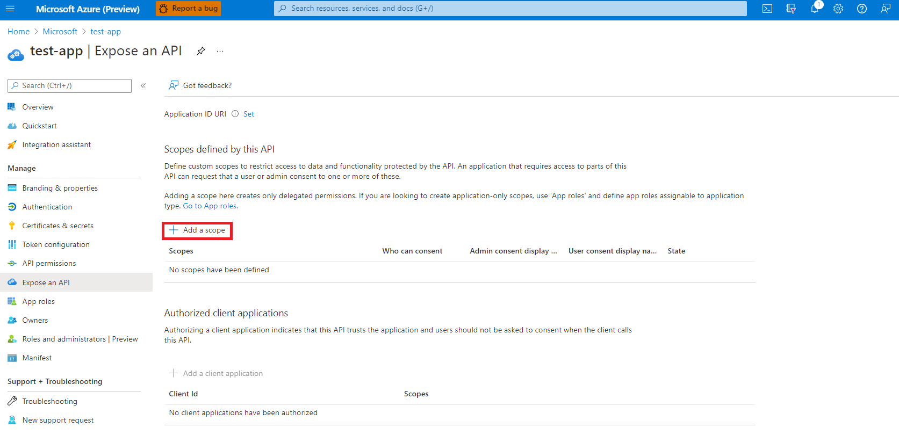
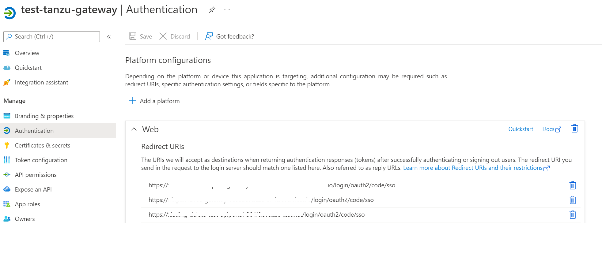

# Setup Single Sign-On using Azure AD

**This article applies to:** ❌ Basic/Standard tier ✔️ Enterprise tier

Spring Cloud Gateway and API portal support authentication and authorization using Single Sign-On (SSO) with an OpenID identity provider (IdP) which supports OpenID Connect Discovery protocol. This article takes [Azure Active Directory](https://docs.microsoft.com/en-us/azure/active-directory/external-identities/azure-ad-account) identity provider as an example to show how to configure SSO.

## Create an Azure Active Directory application registration
1. Open **Azure Active Directory**
1. Select **App Registrations** and Add **New registrations**
1. Input the name of the application and select the account type to register.
> [!NOTE]
> you should have sufficient permissions to do that.

## Add client secret
1. Open newly created app, select **Certificataes & secrets** and add new client secret

2. Copy and store the value of client secret because you cannot retrieve the key later. The key should be provided with application ID when sign in as the application. The secret will be the value of client-secret of SSO configuration.

## Add scope
1. Select **Expose and API** in application and click **Add a scope**

2. Add custom scopes

## Azure Active Directory Issuer Uri
Use "\<authentication-endpoint\>/\<tenant-id\>/v2.0" as issuer-uri of SSO configuration, and replace <authentication-endpoint> with the authentication endpoint for your cloud environment (e.g., "https://login.microsoftonline.com" for global Azure), also replacing <tenant-id> with the Directory (tenant) ID in which the app registration was created. For applications that use Azure AD v1, omit /v2.0 in the URL.

## Setup Redirect Uri
1. Select **Authentication** in application and Add Redirect Uri

2. Add "https://\<external-url\>/login/oauth2/code/sso" to the list of allowed redirect URIs. 
The external-url is the endpoint of Spring Cloud Gateway or API portal which wants to enable SSO. The endpoint can be the public endpoint or custom domain.