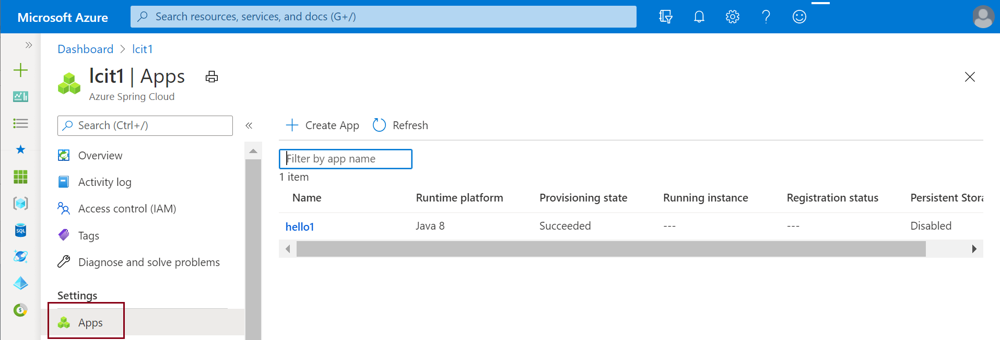
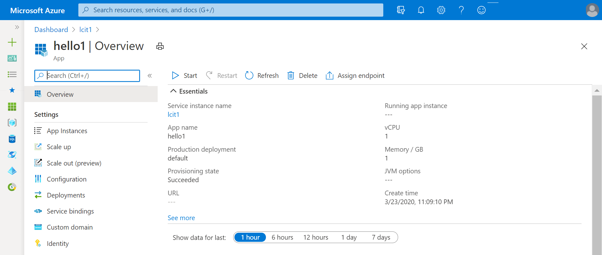
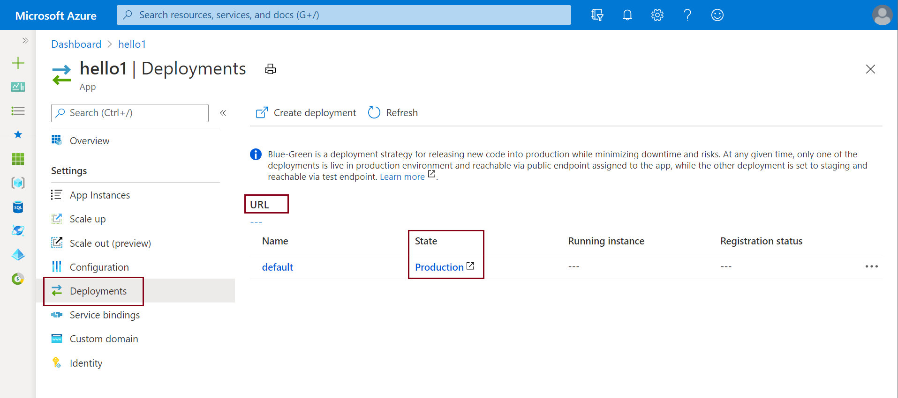
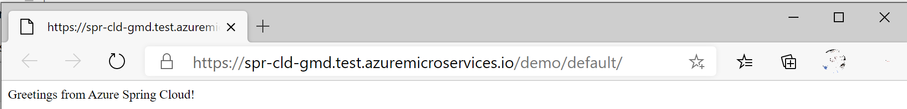
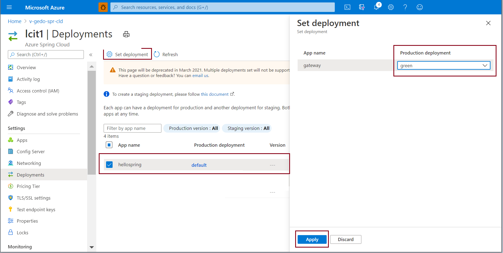

# Set up a staging environment in Azure Spring Cloud

**This article applies to:** ✔️ Java

This article explains how to set up a staging deployment by using the blue-green deployment pattern in Azure Spring Cloud. Blue-green deployment is an Azure DevOps continuous delivery pattern that relies on keeping an existing (blue) version live while a new (green) one is deployed. This article shows you how to put that staging deployment into production without changing the production deployment.

## Prerequisites

* Azure Spring Cloud instance on a Standard pricing tier
* [Azure Spring Cloud extension](/cli/azure/azure-cli-extensions-overview) for the Azure CLI

This article uses an application built from Spring Initializr. If you want to use a different application for this example, you'll need to make a simple change in a public-facing portion of the application to differentiate your staging deployment from production.

>[!TIP]
> [Azure Cloud Shell](https://shell.azure.com) is a free interactive shell that you can use to run the instructions in this article.  It has common, preinstalled Azure tools, including the latest versions of Git, JDK, Maven, and the Azure CLI. If you're signed in to your Azure subscription, start your Cloud Shell instance. To learn more, see [Overview of Azure Cloud Shell](../cloud-shell/overview.md).

To set up blue-green deployment in Azure Spring Cloud, follow the instructions in the next sections.

## Install the Azure CLI extension

Install the Azure Spring Cloud extension for the Azure CLI by using the following command:

```azurecli
az extension add --name spring-cloud
```
## Prepare the app and deployments
To build the application, follow these steps:

1. Generate the code for the sample app by using Spring Initializr with [this configuration](https://start.spring.io/#!type=maven-project&language=java&platformVersion=2.3.4.RELEASE&packaging=jar&jvmVersion=1.8&groupId=com.example&artifactId=hellospring&name=hellospring&description=Demo%20project%20for%20Spring%20Boot&packageName=com.example.hellospring&dependencies=web,cloud-eureka,actuator,cloud-starter-sleuth,cloud-starter-zipkin,cloud-config-client).

2. Download the code.
3. Add the following HelloController.java source file to the folder `\src\main\java\com\example\hellospring\`:

   ```java
   package com.example.hellospring; 
   import org.springframework.web.bind.annotation.RestController; 
   import org.springframework.web.bind.annotation.RequestMapping; 

   @RestController 

   public class HelloController { 

   @RequestMapping("/") 

     public String index() { 

         return "Greetings from Azure Spring Cloud!"; 
     } 

   } 
   ```
4. Build the .jar file:

   ```azurecli
   mvn clean packge -DskipTests
   ```
5. Create the app in your Azure Spring Cloud instance:

   ```azurecli
   az spring-cloud app create -n demo -g <resourceGroup> -s <Azure Spring Cloud instance> --assign-endpoint
   ```
6. Deploy the app to Azure Spring Cloud:

   ```azurecli
   az spring-cloud app deploy -n demo -g <resourceGroup> -s <Azure Spring Cloud instance> --jar-path target\hellospring-0.0.1-SNAPSHOT.jar
   ```
7. Modify the code for your staging deployment:

   ```java
   package com.example.hellospring; 
   import org.springframework.web.bind.annotation.RestController; 
   import org.springframework.web.bind.annotation.RequestMapping; 

   @RestController 

   public class HelloController { 

   @RequestMapping("/") 

     public String index() { 

         return "Greetings from Azure Spring Cloud! THIS IS THE GREEN DEPLOYMENT"; 
     } 

   } 
   ```
8. Rebuild the .jar file:

   ```azurecli
   mvn clean packge -DskipTests
   ```
9. Create the green deployment: 

   ```azurecli
   az spring-cloud app deployment create -n green --app demo -g <resourceGroup> -s <Azure Spring Cloud instance> --jar-path target\hellospring-0.0.1-SNAPSHOT.jar 
   ```

## View apps and deployments

View deployed apps by using the following procedure:

1. Go to your Azure Spring Cloud instance in the Azure portal.

1. From the left pane, open the **Apps** pane to view apps for your service instance.

   

1. You can select an app and view details.

   

1. Open **Deployments** to see all deployments of the app. The grid shows both production and staging deployments.

   

1. Select the URL to open the currently deployed application.
    
   

1. Select **Production** in the **State** column to see the default app.
    
   

1. Select **Staging** in the **State** column to see the staging app.
    
   

>[!TIP]
> * Confirm that your test endpoint ends with a slash (/) to ensure that the CSS file is loaded correctly.  
> * If your browser requires you to enter login credentials to view the page, use [URL decode](https://www.urldecoder.org/) to decode your test endpoint. URL decode returns a URL in the format *https://\<username>:\<password>@\<cluster-name>.test.azureapps.io/gateway/green*. Use this format to access your endpoint.

>[!NOTE]    
> Configuration server settings apply to both your staging environment and your production environment. For example, if you set the context path (*server.servlet.context-path*) for your app gateway in the configuration server as *somepath*, the path to your green deployment changes to *https://\<username>:\<password>@\<cluster-name>.test.azureapps.io/gateway/green/somepath/...*.
 
If you visit your public-facing app gateway at this point, you should see the old page without your new change.

## Set the green deployment as the production environment

1. After you've verified your change in your staging environment, you can push it to production. On the **Apps** > **Deployments** page, select the application currently in **Production**.

1. Select the ellipsis after **Registration status** of the green deployment, and then select **Set as production**. 

   

1. Confirm that the URL of the app displays your changes.

   

>[!NOTE]
> After you've set the green deployment as the production environment, the previous deployment becomes the staging deployment.

## Modify the staging deployment

If you're not satisfied with your change, you can modify your application code, build a new .jar package, and upload it to your green deployment by using the Azure CLI:

```azurecli
az spring-cloud app deploy  -g <resource-group-name> -s <service-instance-name> -n gateway -d green --jar-path gateway.jar
```

## Delete the staging deployment

To delete your staging deployment from the Azure portal, go to the page for your staging deployment and select the **Delete** button.

Alternatively, delete your staging deployment from the Azure CLI by running the following command:

```azurecli
az spring-cloud app deployment delete -n <staging-deployment-name> -g <resource-group-name> -s <service-instance-name> --app gateway
```

## Next steps

* [CI/CD for Azure Spring Cloud](./spring-cloud-howto-cicd.md?pivots=programming-language-java)