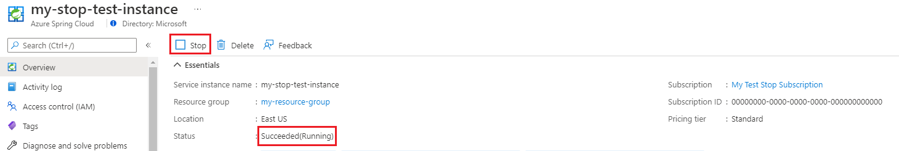
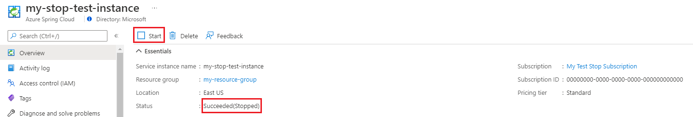

# Start or stop your service in Azure Spring Cloud
This article shows you how to start or stop your service in Azure Spring Cloud.

## Overview
Your Spring Cloud workloads may not need to run continuously, for example a service instance for development that is used only during business hours. This leads to times where your Azure Spring Cloud might be idle, running no more than the system components. You can reduce the footprint and eliminate overage charges by reducing app instances and ensure compute resources do not exceed what’s included in the base price. To optimize your costs further during these periods, you can completely stop your Azure Spring Cloud service instance. This action will stop all user apps and system components, allowing you to save on all the compute costs, while maintaining all your objects and network settings for when you start it again. You can then pick up right where you left off when you are ready to resume development.

## Limitations
When using the cluster start/stop feature, the following restrictions apply:
- The state of a stopped Azure Spring Cloud service instance is preserved for up to 90 days during preview. If your cluster is stopped for more than 90 days, the cluster state cannot be recovered. 
- You can only view, start or delete a stopped Azure Spring Cloud service instance. To perform any update operation like create or scale an app, start your service instance first.


> [!NOTE]
> Stop and start is currently under preview, after which, the maximum stop time may or may not change.


## Prerequisites
- You already have an existing service instance in Azure Spring Cloud
- Or see [Quickstart: Deploy your first application in Azure Spring Cloud](./quickstart.md) to create a new service instance.

#### [CLI](#tab/Azure-CLI)

## Stop and start with CLI
## Stop a running instance
Use `az spring-cloud stop` to stop a running Azure Spring Cloud instance:
```azurecli-interactive
az spring-cloud stop --name <service instance name> --resource-group <resource group name> [--no-wait]
```

After stopped successfully, use `az spring-cloud show` to check the power state is stopped.
```json
{
    "properties": {
        "provisioningState": "Succeeded",
        ...
        "powerState": "Stopped"
    },
    ...
}
```

## Start a stopped instance
Use `az spring-cloud start` to start a stopped Azure Spring Cloud instance:
```azurecli-interactive
az spring-cloud start --name <service instance name> --resource-group <resource group name> [--no-wait]
```

After started successfully, use `az spring-cloud show` to check the power state is running.
```json
{
    "properties": {
        "provisioningState": "Succeeded",
        ...
        "powerState": "Running"
    },
    ...
}
```

#### [Portal](#tab/Azure-Portal)
## Stop and start with portal
Portal can also be used to start and stop Azure Spring Cloud instances.

## Stop a running instance
1. Go to Azure Spring Cloud service overview page
2. Click the `Stop` button to stop a running instance.

    

3. After stopped successfully, the status will show `Succeeded(Stopped)`.

## Start a stopped instance
1. Go to Azure Spring Cloud service overview page
2. Click the `Start` button to start a stopped instance.

    

3. After started successfully, the status will show `Succeeded(Running)`.
---
## Next Steps