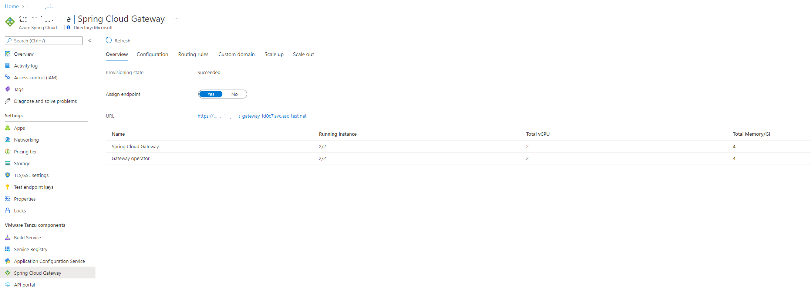
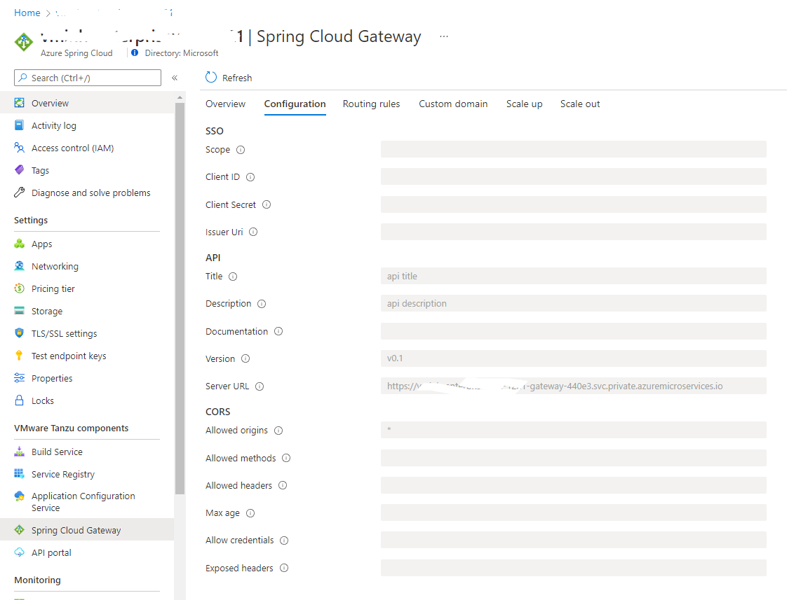
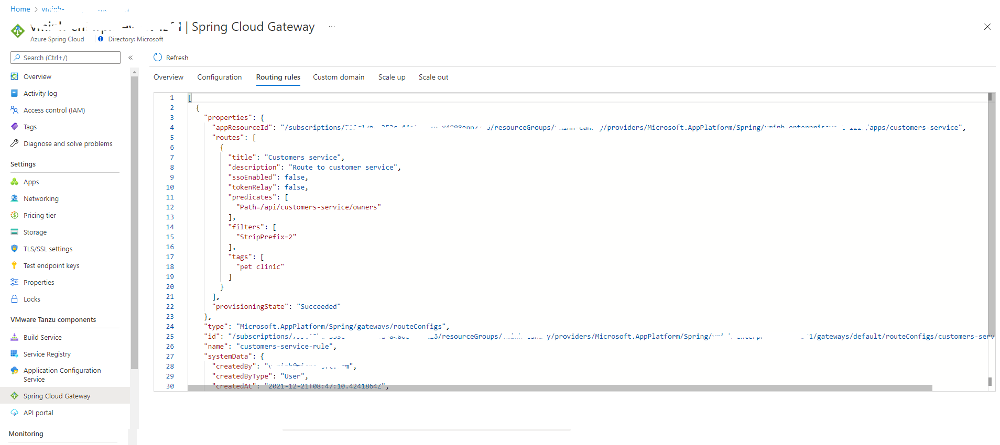

# Spring Cloud Gateway

This article describes how to use Spring Cloud Gateway with Azure Spring Cloud Enterprise Tier.

[Spring Cloud Gateway](https://docs.vmware.com/en/VMware-Spring-Cloud-Gateway-for-Kubernetes/index.html) is one of the proprietary VMware Tanzu components. It's based on the open-source Spring Cloud Gateway project. Spring Cloud Gateway handles cross-cutting concerns for API development teams, such as: Single Sign-On (SSO), access control, rate-limiting, resiliency, security, and more. Accelerate API delivery using modern cloud native patterns, and any programming language you choose for API development.

Spring Cloud Gateway also has other commercial API route filters for transporting authorized JSON Web Token (JWT) claims to application services, client certificate authorization, rate-limiting approaches, circuit breaker configuration, and support for accessing application services via HTTP Basic Authentication credentials. 

To integrate with [API portal](./how-to-use-enterprise-api-portal.md), Spring Cloud Gateway automatically generates OpenAPI version 3 documentation once the routes configuration gets changed.

## How Spring Cloud Gateway works

Spring Cloud Gateway has two components: Spring Cloud Gateway operator and Spring Cloud Gateway instance.
The operator is responsible for the lifecycle of Spring Cloud Gateway instances and routing rules. It's transparent to the developer and Azure Spring Cloud will manage it.

Spring Cloud Gateway instance routes traffic according to rules. It supports rich features and can be customized using the sections below. Both scale in/out and up/down are supported to meet dynamic traffic load.

Default resource usage
| Component name | Instance count | vCPU per instance | Memory per instance |
| - | - | - | - |
| Spring Cloud Gateway | 2 | 1 core | 2Gi |
| Spring Cloud Gateway operator | 2 | 1 core | 2Gi |

## Prerequisites
- An already provisioned Azure Spring Cloud Enterprise tier service instance with Spring Cloud Gateway enabled. For more information, see [Get started with Enterprise Tier](./get-started-enterprise.md)

   

## Configure Spring Cloud Gateway

Spring Cloud Gateway is configured using the following sections and steps.

### Configure Spring Cloud Gateway metadata

Spring Cloud Gateway metadata is used to automatically generate OpenAPI version 3 documentation so that the [API portal](./how-to-use-enterprise-api-portal.md) can gather information to show the route groups.

| Property | Description |
| - | - |
| title | Title describing the context of the APIs available on the Gateway instance (default: `Spring Cloud Gateway for K8S`) |
| description | Detailed description of the APIs available on the Gateway instance (default: `Generated OpenAPI 3 document that describes the API routes configured for '[Gateway instance name]' Spring Cloud Gateway instance deployed under '[namespace]' namespace.`) |
| documentation | Location of more documentation for the APIs available on the Gateway instance |
| version | Version of APIs available on this Gateway instance (default: `unspecified`) |
| serverUrl | Base URL that API consumers will use to access APIs on the Gateway instance |

> Note: `serverUrl` is mandatory if you want to integrate with [API portal](./how-to-use-enterprise-api-portal.md)

### Configure Cross-origin resource sharing (CORS)

Cross-origin resource sharing (CORS) allows restricted resources on a web page to be requested from another domain outside the domain from which the first resource was served.

| Property | Description |
| - | - |
| allowedOrigins | Allowed origins to make cross-site requests |
| allowedMethods | Allowed HTTP methods on cross-site requests |
| allowedHeaders |  Allowed headers in cross-site request |
| maxAge | How long, in seconds, the response from a pre-flight request can be cached by clients |
| allowCredentials | Whether user credentials are supported on cross-site requests |
| exposedHeaders | HTTP response headers to expose for cross-site requests |

> Note: Be sure you have the correct CORS configuration if you want to integrated with the [API portal](./how-to-use-enterprise-api-portal.md). See [Get started](./get-started-enterprise.md) for an example.

### Configure Single Sign-On (SSO)

Spring Cloud Gateway supports authentication and authorization using Single Sign-On (SSO) with an OpenID identity provider (IdP) which supports OpenID Connect Discovery protocol.

| Property | Required? | Description |
| - | - | - |
| issuerUri | Yes | The URI that is asserted as its Issuer Identifier. For example, if the issuer-uri provided is "https://example.com", then an OpenID Provider Configuration Request will be made to "https://example.com/.well-known/openid-configuration". The result is expected to be an OpenID Provider Configuration Response. |
| clientId | Yes | The OpenID Connect client ID provided by your IdP |
| clientSecret | Yes | The OpenID Connect client secret provided by your IdP |
| scope | Yes | A list of scopes to include in JWT identity tokens. This list should be based on the scopes allowed by your identity provider |

> Note that only authorization servers supporting OpenID Connect Discovery protocol are supported.
Also configure the external authorization server to allow redirects back to the gateway. Refer to your authorization server's documentation and add `https://<gateway-external-url>/login/oauth2/code/sso` to the list of allowed redirect URIs.

> Note: If you configure the wrong SSO property, such as the wrong password, you should remove the entire SSO property and re-add the correct configuration. 

### Requested resource

Customization of the resource usage for Spring Cloud Gateway instances is supported, including vCpu, memory, and instance count.

> Note: For high available consideration, single replica is not recommended.

## Configure routes

This section describes how to add, update, and manage API routes for apps that use Spring Cloud Gateway.

### Define route config

The route definition includes the following parts:
- appResourceId: The full app resource id to route traffic to
- routes: A list of route rules about how the traffic goes to one app

Below is the route definitions. All the properties are optional.

| Property | Description |
| - | - |
| title | A title, will be applied to methods in the generated OpenAPI documentation |
| description | A description, will be applied to methods in the generated OpenAPI documentation  |
| uri | Full uri, will override `appResourceId` |
| ssoEnabled | Enable SSO validation. See "Using Single Sign-On" |
| tokenRelay | Pass currently authenticated user's identity token to application service |
| predicates | A list of predicates. See [Available Predicates](https://docs.vmware.com/en/VMware-Spring-Cloud-Gateway-for-Kubernetes/1.0/scg-k8s/GUID-configuring-routes.html#available-predicates) and [Commercial Route Filters](https://docs.vmware.com/en/VMware-Spring-Cloud-Gateway-for-Kubernetes/1.0/scg-k8s/GUID-route-predicates.html)|
| filters | A list of filters. See [Available Filters](https://docs.vmware.com/en/VMware-Spring-Cloud-Gateway-for-Kubernetes/1.0/scg-k8s/GUID-configuring-routes.html#available-filters) and [Commercial Route Filters](https://docs.vmware.com/en/VMware-Spring-Cloud-Gateway-for-Kubernetes/1.0/scg-k8s/GUID-route-filters.html)|
| order | Route processing order, same as Spring Cloud Gateway |
| tags | Classification tags, will be applied to methods in the generated OpenAPI documentation |

Not all the filters/predicates are supported in Azure Spring Cloud because of security/compatible reasons. The following are not supported:
- BasicAuth
- JWTKey  

## A quick start example

1. See [Create and configure apps](get-started-enterprise.md#create-and-configure-apps) to create an app in Azure Spring Cloud which the Spring Cloud Gateway would route traffic to. Select `customers-service` in this example.
    
1. See [Deploy apps](get-started-enterprise.md#deploy-apps) to deploy the `customers-service` app. The app has an API `owners` to which routing rule will be created.

1. Assign a public endpoint to the gateway to access it.

   Open the **Spring Cloud Gateway** section and find the **Overview** tab, which shows the running state and resources given to Spring Cloud Gateway and its operator.

   Click on the **Assign endpoint** toggle button to assign public endpoint. You'll get a URL in a few minutes. Save the URL to use later.

   

   You can also use CLI to do it.

   ```azurecli
   az spring-cloud gateway update --assign-endpoint
   ```

1. Configure Spring Cloud Gateway properties.

   ```azurecli
   az spring-cloud gateway update --api-description "api description" --api-title "api title" --api-version "v0.1" --server-url "<endpoint-in-the-previous-step>" --allowed-origins "*"
   ```

   > You can find complete command options [here](../../cli/azure/spring-cloud?view=azure-cli-latest) 

   You can also view those properties in portal.

   

1. Configure routing rules to apps.

   Create rules to access apps deployed in the above step through Spring Cloud Gateway.

  Save the following content to the file `customers-service.json`.
   ```json
      [
            {
               "title": "Customers service",
               "description": "Route to customer service",
               "predicates": [
                  "Path=/api/customers-service/owners"
               ],
               "filters": [
                  "StripPrefix=2"
               ],
               "tags": [
                  "pet clinic"
               ]
            }
      ]
   ```

   Use the below command to apply the rule to the app `customers-service`

   ```azurecli
   az spring-cloud gateway route-config create -n customers-service-rule --app-name customers-service --routes-file customers-service.json
   ```

   You can also view the routes in the portal.

   

1. Access to app `customers service` and `owners` APIs through gateway endpoint.
   ```
   curl https://<endpoint-url>/api/customers-service/owners
   ```
   
1. Query routing rules from CLI.
   ```azurecli
   az configure --defaults group=<resource group name> spring-cloud=<service name>
   az spring-cloud gateway route-config show -n customers-service-rule --query '{appResourceId:properties.appResourceId, routes:properties.routes}'
   az spring-cloud gateway route-config list --query '[].{name:name, appResourceId:properties.appResourceId, routes:properties.routes}'
   ```

## Next Steps
