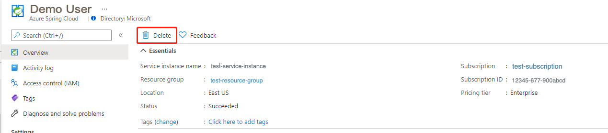

# Quickstart: Build and deploy apps to Azure Spring Cloud using the Enterprise tier

**This article applies to:** ❌ Basic/Standard tier ✔️ Enterprise tier

This quickstart shows you how to build and deploy applications to Azure Spring Cloud using the Enterprise tier.

## Prerequisites

- An Azure account with an active subscription. [Create an account for free](https://azure.microsoft.com/free/?WT.mc_id=A261C142F).
- An already provisioned Azure Spring Cloud Enterprise tier instance. For more information, see [Quickstart: Provision an Azure Spring Cloud service using the Enterprise tier](quickstart-provision-service-instance-enterprise.md).
- [Apache Maven](https://maven.apache.org/download.cgi)
- [The Azure CLI version 2.0.67 or higher](/cli/azure/install-azure-cli).
- [!INCLUDE [install-enterprise-extension](includes/install-enterprise-extension.md)]

## Create and configure apps

To create apps on Azure Spring Cloud, follow these steps:

1. To set the CLI defaults, use the following commands. Be sure to replace the placeholders with your own values.

   ```azurecli
   az account set --subscription=<subscription-id>
   az configure --defaults group=<resource-group-name> spring-cloud=<service-name>
   ```

1. To create the two core applications for PetClinic, `api-gateway` and `customers-service`, use the following commands:

   ```azurecli
   az spring-cloud app create --name api-gateway --instance-count 1 --memory 2Gi --assign-endpoint
   az spring-cloud app create --name customers-service --instance-count 1 --memory 2Gi
   ```

## Build and deploy applications

The following sections show how to build and deploy applications.

### Build the applications locally

To build locally, use the following steps:

1. Clone the sample app repository to your Azure Cloud account, change the directory, and build the project using the following commands:

   ```bash
   git clone -b enterprise https://github.com/azure-samples/spring-petclinic-microservices
   cd spring-petclinic-microservices
   mvn clean package -DskipTests
   ```

   Compiling the project can take several minutes. Once compilation is complete, you'll have individual JAR files for each service in its respective folder.

1. Deploy the JAR files built in the previous step using the following commands:

   ```azurecli
   az spring-cloud app deploy \
       --name api-gateway \
       --artifact-path spring-petclinic-api-gateway/target/spring-petclinic-api-gateway-2.3.6.jar \
       --config-file-patterns api-gateway
   az spring-cloud app deploy \
       --name customers-service \
       --artifact-path spring-petclinic-customers-service/target/spring-petclinic-customers-service-2.3.6.jar \
       --config-file-patterns customers-service
   ```

1. Query the application status after deployment by using the following command:

   ```azurecli
   az spring-cloud app list --output table
   ```

   This command produces output similar to the following example:

   ```output
   Name                  Location    ResourceGroup       Public Url                                                 Production Deployment    Provisioning State    CPU    Memory    Running Instance    Registered Instance    Persistent Storage    Bind Service Registry    Bind Application Configuration Service
   --------------------  ----------  ---------------  ---------------------------------------------------------  -----------------------  --------------------  -----  --------  ------------------  ---------------------  --------------------  -----------------------  ----------------------------------------
   api-gateway           eastus      <resource group>   https://<service_name>-api-gateway.asc-test.net                    default                  Succeeded             1      2Gi       1/1                1/1                    -                     True                     True
   customers-service     eastus      <resource group>                                                                      default                  Succeeded             1      2Gi       1/1                1/1                    -                     True                     True
   ```

### Verify the applications

Access the `api gateway` and `customers service` applications from the browser using the `Public Url` shown above. The Public Url has the format `https://<service_name>-api-gateway.azuremicroservices.io`.


## Clean up resources

1. Open the [Azure portal](https://ms.portal.azure.com/?AppPlatformExtension=entdf#home), then delete the service instance as in the following screenshot.

   

1. Run the following command to remove the preview version of the Azure CLI extension.

   ```azurecli
   az extension remove --name spring-cloud
   ```

## Next steps

> [!div class="nextstepaction"]
> [Quickstart: Set up Application Configuration Service](quickstart-setup-application-configuration-service-enterprise.md)
