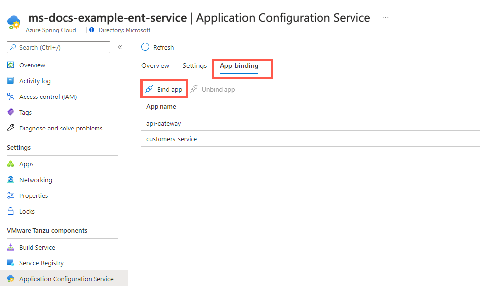
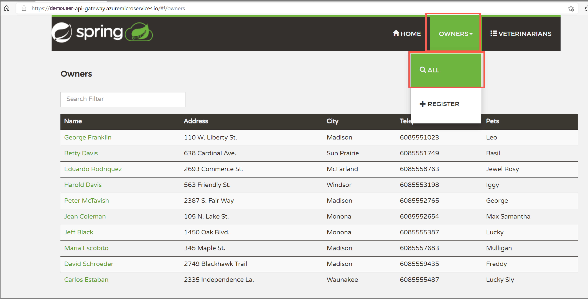

# Quickstart: Build and deploy apps to Azure Spring Cloud using the Enterprise tier

**This article applies to:** ❌ Basic/Standard tier ✔️ Enterprise tier

This quickstart shows you how to build and deploy applications to Azure Spring Cloud using the Enterprise tier.

## Prerequisites

- An Azure account with an active subscription. [Create an account for free](https://azure.microsoft.com/free/?WT.mc_id=A261C142F).
- An already provisioned Azure Spring Cloud Enterprise tier instance. For more information, see [Quickstart: Provision an Azure Spring Cloud service using the Enterprise tier](quickstart-provision-service-instance-enterprise.md).
- [Apache Maven](https://maven.apache.org/download.cgi)
- [The Azure CLI version 2.0.67 or higher](/cli/azure/install-azure-cli).
- [!INCLUDE [install-enterprise-extension](includes/install-enterprise-extension.md)]

## Create and configure apps

To create apps on Azure Spring Cloud, follow these steps:

1. To set the CLI defaults, use the following commands. Be sure to replace the placeholders with your own values.

   ```azurecli
   az account set --subscription=<subscription-id>
   az configure --defaults group=<resource-group-name> spring-cloud=<service-name>
   ```

1. To create the two core applications for PetClinic, `api-gateway` and `customers-service`, use the following commands:

   ```azurecli
   az spring-cloud app create --name api-gateway --instance-count 1 --memory 2Gi --assign-endpoint
   az spring-cloud app create --name customers-service --instance-count 1 --memory 2Gi
   ```

## Bind apps to Application Configuration Service for Tanzu and Tanzu Service Registry

### [Portal](#tab/azure-portal)

To bind apps to Application Configuration Service for VMware Tanzu®, follow these steps.

1. In the Azure portal, select **Application Configuration Service**.
1. Select **App binding**, then select **Bind app**.
1. Choose one app in the dropdown and select **Apply** to bind the application to Application Configuration Service for Tanzu.

   

A list under **App name** shows the apps bound with Application Configuration Service for Tanzu, as shown in the following screenshot:



To bind apps to VMware Tanzu® Service Registry, follow these steps.

1. Select **Service Registry**.
1. Select **App binding**, then select **Bind app**.
1. Choose one app in the dropdown, and then select **Apply** to bind the application to Tanzu Service Registry.

   :::image type="content" source="media/enterprise/getting-started-enterprise/service-reg-app-bind-dropdown.png" alt-text="Screenshot of Azure portal Azure Spring Cloud with Service Registry page and 'Bind app' dialog showing.":::

A list under **App name** shows the apps bound with Tanzu Service Registry, as shown in the following screenshot:

:::image type="content" source="media/enterprise/getting-started-enterprise/service-reg-app-bind.png" alt-text="Screenshot of Azure portal Azure Spring Cloud with Service Registry page and 'App binding' section showing.":::

### [Azure CLI](#tab/azure-cli)

To bind apps to Application Configuration Service for VMware Tanzu® and VMware Tanzu® Service Registry, use the following commands.

```azurecli
az spring-cloud application-configuration-service bind --app api-gateway
az spring-cloud application-configuration-service bind --app customers-service
az spring-cloud service-registry bind --app api-gateway
az spring-cloud service-registry bind --app customers-service
```

---

## Build and deploy applications

The following sections show how to build and deploy applications.

### Build the applications locally

To build locally, use the following steps:

1. Clone the sample app repository to your Azure Cloud account, change the directory, and build the project using the following commands:

   ```bash
   git clone -b enterprise https://github.com/azure-samples/spring-petclinic-microservices
   cd spring-petclinic-microservices
   mvn clean package -DskipTests
   ```

   Compiling the project can take several minutes. Once compilation is complete, you'll have individual JAR files for each service in its respective folder.

1. Deploy the JAR files built in the previous step using the following commands:

   ```azurecli
   az spring-cloud app deploy \
       --name api-gateway \
       --artifact-path spring-petclinic-api-gateway/target/spring-petclinic-api-gateway-2.3.6.jar \
       --config-file-patterns api-gateway
   az spring-cloud app deploy \
       --name customers-service \
       --artifact-path spring-petclinic-customers-service/target/spring-petclinic-customers-service-2.3.6.jar \
       --config-file-patterns customers-service
   ```

1. Query the application status after deployment by using the following command:

   ```azurecli
   az spring-cloud app list --output table
   ```

   This command produces output similar to the following example:

   ```output
   Name                  Location    ResourceGroup       Public Url                                                 Production Deployment    Provisioning State    CPU    Memory    Running Instance    Registered Instance    Persistent Storage    Bind Service Registry    Bind Application Configuration Service
   --------------------  ----------  ---------------  ---------------------------------------------------------  -----------------------  --------------------  -----  --------  ------------------  ---------------------  --------------------  -----------------------  ----------------------------------------
   api-gateway           eastus      <resource group>   https://<service_name>-api-gateway.asc-test.net                    default                  Succeeded             1      2Gi       1/1                1/1                    -                     True                     True
   customers-service     eastus      <resource group>                                                                      default                  Succeeded             1      2Gi       1/1                1/1                    -                     True                     True
   ```

### Verify the applications

Access the `api gateway` and `customers service` applications from the browser using the `Public Url` shown above. The Public Url has the format `https://<service_name>-api-gateway.azuremicroservices.io`.



## Clean up resources

If you plan to continue working with subsequent quickstarts and tutorials, you might want to leave these resources in place. When no longer needed, delete the resource group, which deletes the resources in the resource group. To delete the resource group by using Azure CLI, use the following commands:

```azurecli
echo "Enter the Resource Group name:" &&
read resourceGroupName &&
az group delete --name $resourceGroupName &&
echo "Press [ENTER] to continue ..."
```

## Next steps

> [!div class="nextstepaction"]
> [Quickstart: Set up a Log Analytics workspace](quickstart-setup-log-analytics.md)
